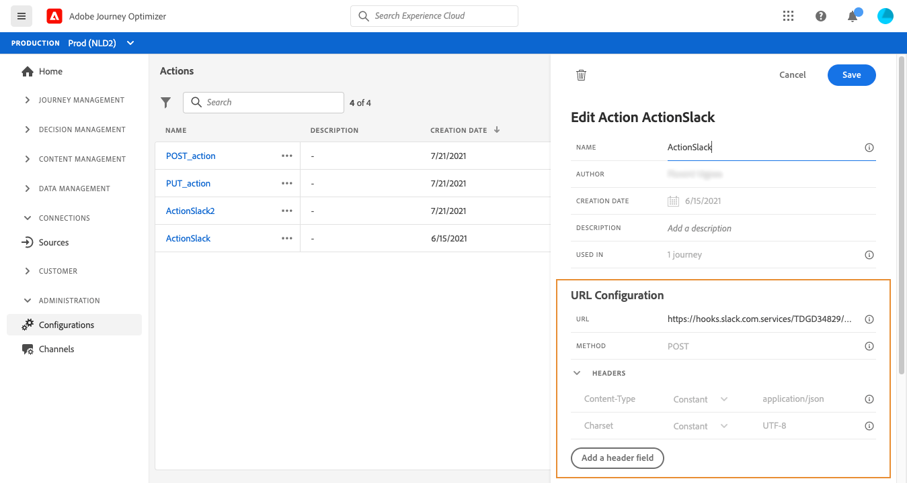

# 設定動作 {#configure-an-action}

如果您使用協力廠商系統來傳送訊息，或您想要歷程將API呼叫傳送至協力廠商系統，您可以在此設定其與歷程的連線。 接著，技術使用者定義的自訂動作便可在您歷程的左側浮動視窗中取得，位於&#x200B;**[!UICONTROL Action]**&#x200B;類別中（請參閱[此頁面](../building-journeys/about-journey-activities.md#action-activities)）。 以下是一些您可透過自訂動作連線至的系統範例：Epsilon、Facebook、Adobe.io、Firebase等
[此頁面](../building-journeys/limitations.md)列出限制。

以下是設定自訂動作所需的主要步驟：

1. 在「管理」菜單部分，選擇&#x200B;**[!UICONTROL Configurations]**。 在&#x200B;**[!UICONTROL Actions]**&#x200B;區段中，按一下&#x200B;**[!UICONTROL Manage]**。 按一下&#x200B;**[!UICONTROL Create Action]**&#x200B;以建立新動作。 動作設定窗格會在畫面右側開啟。

   

1. 輸入動作的名稱。

   >[!NOTE]
   >
   >請勿使用空格或特殊字元。請勿使用超過 30 個字元。

1. 為動作新增說明。 此步驟為選填。
1. 使用此動作的歷程次數會顯示在&#x200B;**[!UICONTROL Used in]**&#x200B;欄位中。 您可以按一下&#x200B;**[!UICONTROL View journeys]**&#x200B;按鈕，以顯示使用此動作的歷程清單。
1. 定義不同的&#x200B;**[!UICONTROL URL Configuration]**&#x200B;參數。 請參閱[此頁面](../action/about-custom-action-configuration.md#url-configuration)。
1. 配置&#x200B;**[!UICONTROL Authentication]**&#x200B;部分。 此設定與資料來源的設定相同。  請參閱[本節](../datasource/external-data-sources.md#section_wjp_nl5_nhb)。
1. 定義&#x200B;**[!UICONTROL Action parameters]**。 請參閱[此頁面](../action/about-custom-action-configuration.md#define-the-message-parameters)。
1. 按一下「**[!UICONTROL Save]**」。

   自訂動作現在已設定完畢，且已準備好用於您的歷程。 請參閱[此頁面](../building-journeys/about-journey-activities.md#action-activities)。

   >[!NOTE]
   >
   >在歷程中使用自訂動作時，大部分參數為唯讀。 您只能修改&#x200B;**[!UICONTROL Name]**、**[!UICONTROL Description]**、**[!UICONTROL URL]**&#x200B;欄位和&#x200B;**[!UICONTROL Authentication]**&#x200B;區段。

## URL 組態 {#url-configuration}

設定自訂動作時，您需要定義下列&#x200B;**[!UICONTROL URL Configuration]**&#x200B;參數：

1. 新增外部服務的&#x200B;**[!UICONTROL URL]**。

   >[!NOTE]
   >
   >基於安全考量，我們強烈建議您使用 HTTPS。不允許使用非公用的Adobe位址和IP位址。

1. 選擇呼叫&#x200B;**[!UICONTROL Method]**:可以是&#x200B;**[!UICONTROL POST]**&#x200B;或&#x200B;**[!UICONTROL PUT]**。
1. 在&#x200B;**[!UICONTROL Headers]**&#x200B;區段中，按一下&#x200B;**[!UICONTROL Add a header field]**&#x200B;以定義新索引鍵/值組。 它們對應至對外部服務發出之請求的HTTP標題。 若要刪除索引鍵/值配對，請將游標置於標題欄位上，然後按一下&#x200B;**[!UICONTROL Delete]**&#x200B;圖示。

   **[!UICONTROL Content-Type]** 和 **[!UICONTROL Charset]** 預設設定，且無法刪除或覆寫。

   >[!NOTE]
   >
   >標頭根據以下[解析規則](https://tools.ietf.org/html/rfc7230#section-3.2.4)進行驗證。

## 定義動作參數 {#define-the-message-parameters}

在&#x200B;**[!UICONTROL Action parameters]**&#x200B;區段中，貼上要傳送至外部服務的JSON裝載範例。

>[!NOTE]
>
>裝載中的欄位名稱不能包含「。」 字元.

您將能定義參數類型(例如：字串、整數等)。

您也可以選擇指定參數為常數或變數：

* 常數表示參數的值是由技術人員在動作設定窗格中定義。 歷程中的值一律相同。 此值不會有所不同，且行銷人員在歷程中使用自訂動作時不會看到。 例如可能是協力廠商系統預期的ID。 在此情況下，切換常數/變數右側的欄位即為傳遞的值。
* 變數表示參數的值會有所不同。 在歷程中使用此自訂動作的行銷人員將可自由傳遞所需值，或指定要擷取此參數值的位置(例如從事件、從Adobe Experience Platform等)。 在此情況下，切換常數/變數右側的欄位，即為行銷人員在歷程中看到的用以命名此參數的標籤。

