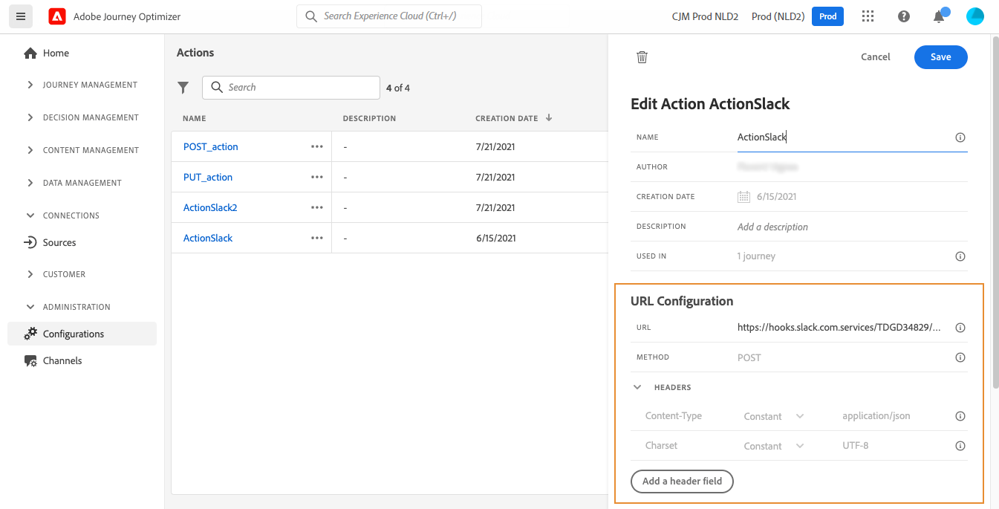

# 設定自訂動作 {#configure-an-action}

>[!CONTEXTUALHELP]
>id="ajo_journey_action_custom_configuration"
>title="自訂動作"
>abstract="如果您使用協力廠商系統來傳送訊息，或想要歷程將API呼叫傳送至協力廠商系統，請使用自訂動作來設定其與歷程的連線。 例如，您可以使用自訂動作連線至下列系統：ε,Slack, [Adobe Developer](https://developer.adobe.com)、Firebase等"

如果您使用協力廠商系統來傳送訊息，或想要歷程將API呼叫傳送至協力廠商系統，請使用自訂動作來設定其與歷程的連線。 例如，您可以使用自訂動作連線至下列系統：ε,Slack, [Adobe Developer](https://developer.adobe.com){target=&quot;_blank&quot;}、Firebase等

自訂動作是技術使用者定義的其他動作，可供行銷人員使用。 設定後，它們會顯示在歷程的左側浮動視窗中，位於 **[!UICONTROL 動作]** 類別。 在[本頁](../building-journeys/about-journey-activities.md#action-activities)中瞭解更多。

## 限制{#custom-actions-limitations}

自訂動作具有下列幾項限制： [本頁](../start/guardrails.md).

在自訂動作參數中，您可以傳遞簡單集合以及物件集合。 進一步了解 [本頁](../building-journeys/collections.md#limitations).

另請注意，自訂動作參數具有預期的格式(範例：字串、小數等)。 您必須小心遵守這些預期的格式。 了解更多資訊 [使用案例](../building-journeys/collections.md).

## 同意與資料控管 {#privacy}

在Journey Optimizer中，您可以將資料控管和同意政策套用至您的自訂動作，以防止特定欄位匯出至協力廠商系統，或排除未同意接收電子郵件、推播或簡訊通訊的客戶。 如需詳細資訊，請參閱下列頁面：

* [資料控管](../action/action.md).
* [同意](../action/action.md).

## 設定步驟 {#configuration-steps}

以下是設定自訂動作所需的主要步驟：

1. 在「管理」(ADMINISTRATION)菜單部分中，選擇 **[!UICONTROL 配置]**. 在  **[!UICONTROL 動作]** ，按一下 **[!UICONTROL 管理]**. 按一下 **[!UICONTROL 建立動作]** 來建立新動作。 動作設定窗格會在畫面右側開啟。

   

1. 輸入動作的名稱。

   >[!NOTE]
   >
   >請勿使用空格或特殊字元。請勿使用超過 30 個字元。

1. 為動作新增說明。 此步驟為選填。
1. 使用此動作的歷程次數會顯示在 **[!UICONTROL 用於]** 欄位。 您可以按一下 **[!UICONTROL 檢視歷程]** 按鈕，以顯示使用此動作的歷程清單。
1. 定義不同的 **[!UICONTROL URL設定]** 參數。 請參閱[此頁面](../action/about-custom-action-configuration.md#url-configuration)。
1. 設定 **[!UICONTROL 驗證]** 區段。 此設定與資料來源的設定相同。  請參閱[本節](../datasource/external-data-sources.md#custom-authentication-mode)。
1. 定義 **[!UICONTROL 動作參數]**. 請參閱[此頁面](../action/about-custom-action-configuration.md#define-the-message-parameters)。
1. 按一下「**[!UICONTROL 儲存]**」。

   自訂動作現在已設定完畢，且已準備好用於您的歷程。 請參閱[此頁面](../building-journeys/about-journey-activities.md#action-activities)。

   >[!NOTE]
   >
   >在歷程中使用自訂動作時，大部分參數為唯讀。 您只能修改 **[!UICONTROL 名稱]**, **[!UICONTROL 說明]**, **[!UICONTROL URL]** 欄位和 **[!UICONTROL 驗證]** 區段。

## URL 組態 {#url-configuration}

設定自訂動作時，您需要定義下列項目 **[!UICONTROL URL設定]** 參數：

1. 在 **[!UICONTROL URL]** 欄位，指定外部服務的URL:

   * 如果URL為靜態，請在此欄位中輸入URL。

   * 如果URL包含動態路徑，則僅輸入URL的靜態部分，即配置、主機、埠，以及路徑的靜態部分（可選）。

      範例：`https://xxx.yyy.com/somethingstatic/`

      將自訂動作新增至歷程時，您會指定URL的動態路徑。 [了解更多](../building-journeys/using-custom-actions.md)。
   >[!NOTE]
   >
   >基於安全考量，強烈建議您為URL使用HTTPS配置。 不允許使用非公用的Adobe位址和IP位址。
   >
   >定義自訂動作時，僅允許預設埠：80（適用於http）和443（適用於https）。

1. 選取呼叫 **[!UICONTROL 方法]**:它可以是 **[!UICONTROL POST]** 或 **[!UICONTROL PUT]**.

   >[!NOTE]
   >
   > 此 **DELETE** 方法不受支援。 如果您需要更新現有資源，請選取 **PUT** 方法。

1. 在 **[!UICONTROL 標題]** 一節，定義要傳送至外部服務的要求訊息的HTTP標題：
   1. 若要新增標題欄位，請按一下 **[!UICONTROL 新增標題欄位]**.
   1. 輸入標題欄位的鍵。
   1. 若要設定機碼值組的動態值，請選取 **[!UICONTROL 變數]**. 否則，請選取 **[!UICONTROL 常數]**.

      例如，對於時間戳記，您可以設定動態值。

   1. 如果您已選取 **[!UICONTROL 常數]**，然後輸入常數值。

      如果您已選取 **[!UICONTROL 變數]**，則會在將自訂動作新增至歷程時指定此變數。 [了解更多](../building-journeys/using-custom-actions.md)。

      

   1. 若要刪除標題欄位，請指向標題欄位，然後按一下 **[!UICONTROL 刪除]** 表徵圖。
   此 **[!UICONTROL 內容類型]** 和 **[!UICONTROL Charset]** 預設會設定標題欄位。 您無法修改或刪除這些欄位。

   將自訂動作新增至歷程後，如果歷程處於草稿狀態，您仍可新增標題欄位。 如果您不希望歷程受到設定變更的影響，請複製自訂動作，並將標題欄位新增至新的自訂動作。

   >[!NOTE]
   >
   >標題會根據欄位剖析規則進行驗證。 深入了解 [本檔案](https://tools.ietf.org/html/rfc7230#section-3.2.4){_blank}。

## 定義動作參數 {#define-the-message-parameters}

在 **[!UICONTROL 動作參數]** 區段中，貼上要傳送至外部服務的JSON裝載範例。

>[!NOTE]
>
>裝載示例不能包含空值。 裝載中的欄位名稱不能包含「。」 字元. 開頭不能為「$」字元。

您將能定義參數類型(例如：字串、整數等)。

您也可以選擇指定參數為常數或變數：

* 常數表示參數的值是由技術人員在動作設定窗格中定義。 歷程中的值一律相同。 此值不會有所不同，且行銷人員在歷程中使用自訂動作時不會看到。 例如可能是協力廠商系統預期的ID。 在此情況下，切換常數/變數右側的欄位即為傳遞的值。
* 變數表示參數的值會有所不同。 行銷人員在歷程中使用此自訂動作時，可以免費傳遞想要的值，或指定要擷取此參數值的位置(例如從事件、從Adobe Experience Platform等)。 在此情況下，切換常數/變數右側的欄位，就是行銷人員在歷程中看到的為此參數命名的標籤。

