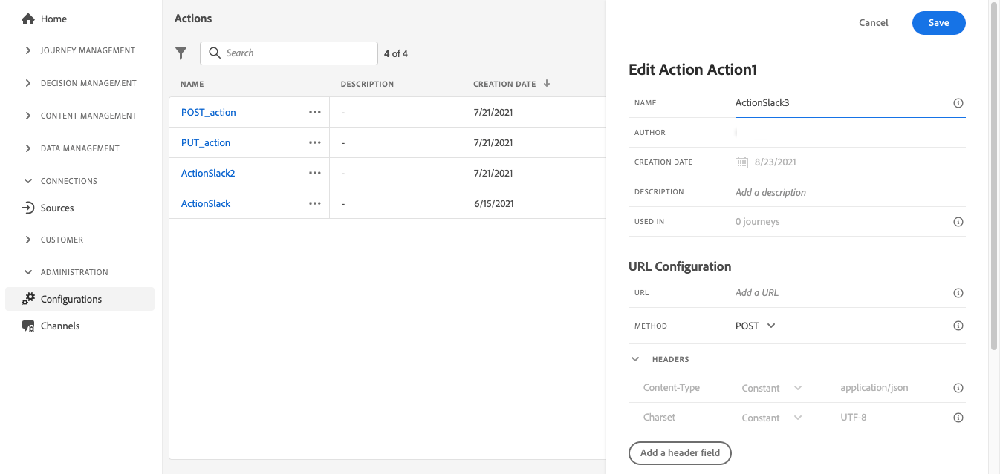
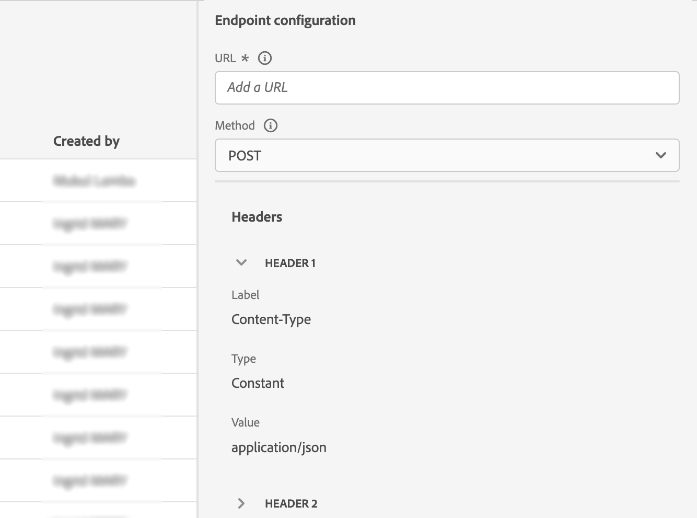
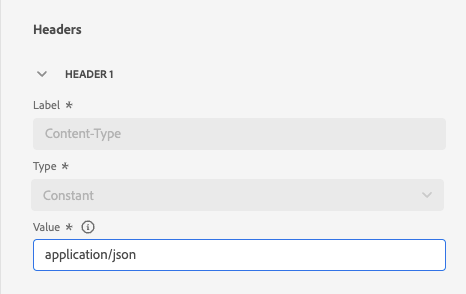
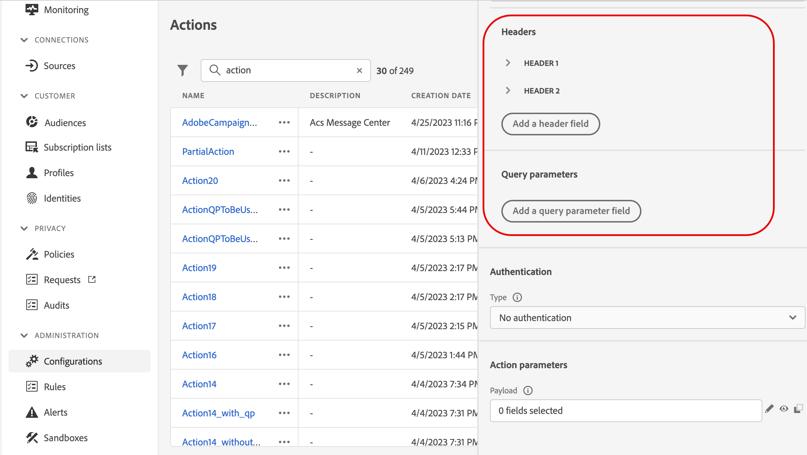
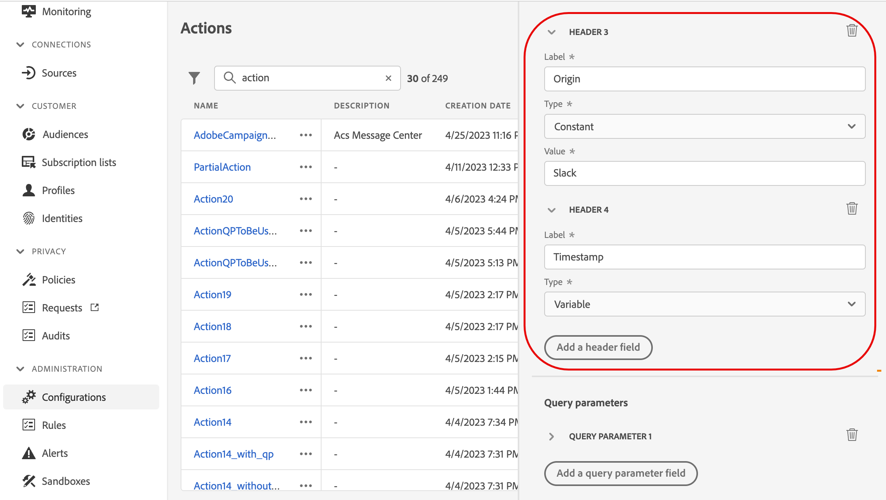
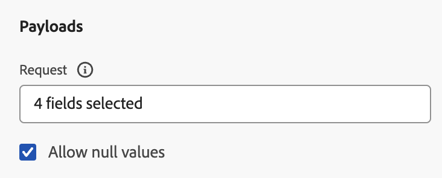
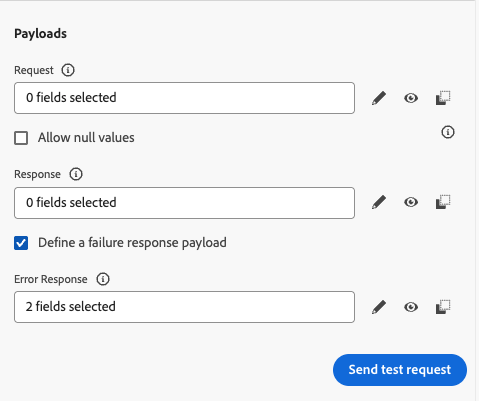
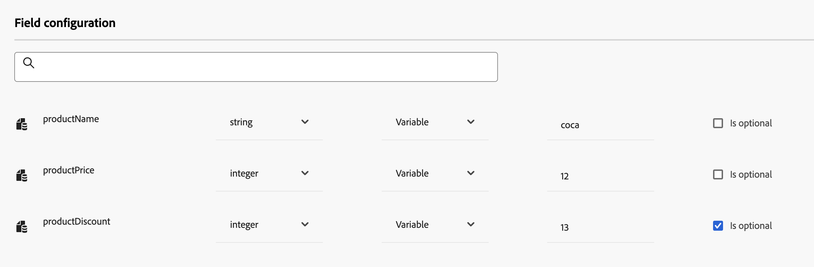

# 設定自訂動作 {#configure-a-custom-action}

>[!CONTEXTUALHELP]
>id="ajo_journey_action_custom_configuration"
>title="自訂動作"
>abstract="如果您使用第三方系統來傳送訊息，或想要歷程傳送 API 呼叫至第三方系統，請使用自訂動作來設定第三方系統與歷程的連線。"

如果您使用第三方系統來傳送訊息，或想要歷程傳送 API 呼叫至協力廠商系統，請使用自訂動作來設定系統至您歷程的連線。例如，您可使用自訂動作連線至下列系統：Epsilon、Slack、[Adobe Developer](https://developer.adobe.com){target="_blank"}、Firebase 等等。

自訂動作是技術使用者定義的其他動作，可供行銷人員使用。 設定之後，它們會顯示在您歷程的左側浮動視窗，位於&#x200B;**[!UICONTROL 動作]**&#x200B;類別中。 請在[此頁面](../building-journeys/about-journey-activities.md#action-activities)了解更多。


## 設定步驟 {#configuration-steps}

以下是設定自訂動作所需的主要步驟：

1. 在「管理」功能表區段中，選取&#x200B;**[!UICONTROL 組態]**。 在&#x200B;**[!UICONTROL 動作]**&#x200B;區段中，按一下&#x200B;**[!UICONTROL 管理]**。 按一下&#x200B;**[!UICONTROL 建立動作]**&#x200B;以建立新動作。 動作設定窗格會在畫面右側開啟。

   

1. 輸入動作的名稱。

   >[!NOTE]
   >
   >只允許使用英數字元和底線。 長度上限為30個字元。

1. 新增說明至您的動作。 此步驟為選填。
1. 使用此動作的歷程次數會顯示在&#x200B;**[!UICONTROL 用於]**&#x200B;欄位中。 您可以按一下&#x200B;**[!UICONTROL 檢視歷程]**&#x200B;按鈕，以顯示使用此動作的歷程清單。
1. 定義不同的&#x200B;**[!UICONTROL URL組態]**&#x200B;引數。 請參閱[此頁面](../action/about-custom-action-configuration.md#url-configuration)。
1. 設定&#x200B;**[!UICONTROL 驗證]**&#x200B;區段。 此設定與資料來源的設定相同。  請參閱[本節](../datasource/external-data-sources.md#custom-authentication-mode)。
1. 定義&#x200B;**[!UICONTROL 動作引數]**。 請參閱[此頁面](../action/about-custom-action-configuration.md#define-the-message-parameters)。
1. 按一下&#x200B;**[!UICONTROL 儲存]**。

   自訂動作現已設定完畢，且可供您在歷程中使用。 請參閱[此頁面](../building-journeys/about-journey-activities.md#action-activities)。

   >[!NOTE]
   >
   >當歷程中使用自訂動作時，大部分引數均為唯讀。 您只能修改&#x200B;**[!UICONTROL 名稱]**、**[!UICONTROL 描述]**、**[!UICONTROL URL]**&#x200B;欄位和&#x200B;**[!UICONTROL 驗證]**&#x200B;區段。

## 限制{#custom-actions-limitations}

自訂動作在[此頁面](../start/guardrails.md)上列出一些限制。

在自訂動作引數中，您可以傳遞簡單集合以及物件集合。 深入瞭解[此頁面](../building-journeys/collections.md#limitations)上的集合限制。

另請注意，自訂動作引數採用預期格式（例如：字串、小數等）。 您必須注意遵守這些預期的格式。 在此[使用案例](../building-journeys/collections.md)中瞭解更多。

自訂動作只有在使用[要求](../action/about-custom-action-configuration.md#define-the-message-parameters)或[回應承載](../action/action-response.md)時才支援JSON格式。

>[!NOTE]
>
>當端點的回應時間超過0.75秒時，其自訂動作呼叫會透過專用的慢速[自訂動作服務](../configuration/external-systems.md#response-time)而不是預設服務進行路由。


## 最佳做法{#custom-action-enhancements-best-practices}

使用自訂動作選擇要作為目標的端點時，請確定：

* 此端點可使用來自[節流 API](../configuration/throttling.md) 或[設定 API 上限](../configuration/capping.md)的設定來支援歷程的輸送量，藉此加以限制。 請留意，節流設定不可低於 200 TPS。任何目標端點至少需要支援200個TPS。 在[本節](../building-journeys/entry-management.md#journey-processing-rate)中深入了解歷程處理速率。
* 此端點的回應時間必須儘可能縮短。 根據預期輸送量，高回應時間可能會影響實際輸送量。

所有自訂動作皆已定義1分鐘上300,000次呼叫的上限。 此外，預設上限會針對每個主機和每個沙箱執行。 例如，在沙箱上，如果您有兩個具有相同主機的端點（例如，`https://www.adobe.com/endpoint1`和`https://www.adobe.com/endpoint2`），上限將套用至adobe.com主機下的所有端點。 「endpoint1」和「endpoint2」會共用相同的上限設定，而且讓一個端點達到限制會影響到另一個端點。

>[!NOTE]
>
>每分鐘300,000次呼叫的上限被強製為每個沙箱的&#x200B;**滑動視窗**，以及回應時間少於0.75秒的端點的每個端點。 滑動視窗可在任何毫秒開始，這表示即使速率在對齊時鐘分鐘時低於300k/分鐘，也可能發生上限錯誤。 對於回應時間超過 0.75 秒的端點，適用另外的每 30 秒 150,000 次呼叫的限制 (也是滑動視窗)。在[此頁面](../configuration/external-systems.md#response-time)上進一步瞭解慢速端點。

預設每分鐘300,000次呼叫限制會套用至網域層級(即example.com)。 如果您需要更高的限制，請向Adobe支援查詢使用證據，並確認您端點的輸送量。 若要請求提高上限，請提供您預期呼叫數量和端點容量的詳細資料。 如果容量測試顯示端點可以處理更高的輸送量，Adobe可能會自訂上限。 如需最佳實務，請考慮重新調整歷程或實作等待活動，以錯開傳出呼叫並避免錯誤上限。

此限制是根據客戶使用情況設定的，以保護自訂動作所定位的外部端點。 如有需要，您可以透過上限/節流 API 定義較高的上限或節流限制來覆寫此設定。 請參閱[此頁面](../configuration/external-systems.md)。

基於以下各種原因，您不應使用自訂動作來鎖定公用端點：

* 如果沒有適當的上限或節流，可能會傳送過多呼叫至可能不支援此磁碟區的公用端點。
* 設定檔資料可透過自訂動作傳送，因此定位公用端點可能會導致無意間在外部共用個人資訊。
* 您無法控制公用端點傳回的資料。 如果端點變更其API或開始傳送不正確的資訊，這些資訊將可在傳送的通訊中使用，並可能產生負面影響。

## 同意與資料控管 {#privacy}

在Journey Optimizer中，您可以將資料控管和同意原則套用至自訂動作，以防止特定欄位匯出至協力廠商系統，或排除尚未同意接收電子郵件、推播或簡訊通訊的客戶。 如需詳細資訊，請參閱下列頁面：

* [資料控管](../action/action-privacy.md)。
* [同意](../action/action-privacy.md)。


## 端點設定 {#url-configuration}

設定自訂動作時，您必須定義下列&#x200B;**[!UICONTROL 端點設定]**&#x200B;引數：

{width="70%" align="left"}

1. 在&#x200B;**[!UICONTROL URL]**&#x200B;欄位中，指定外部服務的URL：

   * 如果URL是靜態的，請在此欄位中輸入URL。

   * 如果URL包含動態路徑，請只輸入URL的靜態部分，也就是配置、主機、連線埠，以及（選擇性）路徑的靜態部分。

     範例：`https://xxx.yyy.com/somethingstatic/`

     將自訂動作新增至歷程時，您將指定URL的動態路徑。 [了解更多](../building-journeys/using-custom-actions.md)。

   >[!NOTE]
   >
   >基於安全考量，我們強烈建議您針對URL使用HTTPS配置。 我們不允許使用非公開的Adobe位址和IP位址。
   >
   >定義自訂動作時只允許預設連線埠：80用於http，443用於https。

1. 選取呼叫&#x200B;**[!UICONTROL 方法]**：它可以是&#x200B;**[!UICONTROL POST]**、**[!UICONTROL GET]**&#x200B;或&#x200B;**[!UICONTROL PUT]**。

   >[!NOTE]
   >
   > 不支援&#x200B;**DELETE**&#x200B;方法。 如果您需要更新現有的資源，請選取&#x200B;**PUT**&#x200B;方法。

1. 處理可能的重新導向（302個回應）。 **自訂動作**&#x200B;會根據每個請求自動遵循HTTP 302重新導向。

1. 定義標頭和查詢引數：

   * 在&#x200B;**[!UICONTROL 標頭]**&#x200B;區段中，按一下&#x200B;**[!UICONTROL 新增標頭欄位]**&#x200B;以定義要傳送給外部服務的要求訊息的HTTP標頭。 預設會設定&#x200B;**[!UICONTROL Content-Type]**&#x200B;和&#x200B;**[!UICONTROL Charset]**&#x200B;標頭欄位。 您無法刪除這些欄位。 只有&#x200B;**[!UICONTROL Content-Type]**&#x200B;標頭可以修改。 其值應符合JSON格式。 以下是預設值：

   

   * 在&#x200B;**[!UICONTROL 查詢引數]**&#x200B;區段中，按一下&#x200B;**[!UICONTROL 新增查詢引數欄位]**&#x200B;以定義您要新增到URL中的引數。

   

1. 輸入欄位的標籤或名稱。

1. 選取型別： **[!UICONTROL 常數]**&#x200B;或&#x200B;**[!UICONTROL 變數]**。 如果您已選取&#x200B;**[!UICONTROL 常數]**，請在&#x200B;**[!UICONTROL 值]**&#x200B;欄位中輸入常數值。 如果您已選取&#x200B;**[!UICONTROL 變數]**，則您將在新增自訂動作至歷程時指定此變數。 [了解更多](../building-journeys/using-custom-actions.md)。

   

   >[!NOTE]
   >
   >將自訂動作新增至歷程後，如果歷程處於草稿狀態，您仍可新增標題或查詢引數欄位至歷程。 如果您不希望歷程受設定變更影響，請複製自訂動作，並將欄位新增到新的自訂動作。
   >
   >標頭會根據欄位剖析規則進行驗證。 深入瞭解[此檔案](https://tools.ietf.org/html/rfc7230#section-3.2.4){_blank}。

## 傳輸安全層 {#tls}

### TLS通訊協定支援 {#tls-protocol-support}

Adobe Journey Optimizer預設對自訂動作支援TLS 1.3。 如果使用者端也支援TLS 1.3，則會透過TLS 1.3進行通訊。否則，TLS交涉程式可能會回復到TLS 1.2。

### mTLS通訊協定支援 {#mtls-protocol-support}

您可以使用相互傳輸層安全性(mTLS)來確保對Adobe Journey Optimizer自訂動作的輸出連線具有增強的安全性。 mTLS是一種用於相互驗證的端對端安全性方法，可確保共用資訊的雙方在共用資料之前，都是聲稱的身分。 mTLS包括相較於TLS的額外步驟，其中伺服器也會要求使用者端的憑證並在其末端驗證它。

自訂動作支援雙向TLS (mTLS)驗證。 自訂動作或歷程中不需要額外設定即可啟用 mTLS；當偵測到啟用 mTLS 的端點時，它會自動發生。 [了解更多](https://experienceleague.adobe.com/en/docs/experience-platform/landing/governance-privacy-security/encryption#mtls-protocol-support)。

## 定義裝載引數 {#define-the-message-parameters}

您可以定義裝載引數，如下所示：

1. 在&#x200B;**[!UICONTROL Request]**&#x200B;區段中，貼上要傳送至外部服務的JSON裝載範例。 此欄位是選用欄位，僅適用於POST和PUT呼叫方法。

   啟用&#x200B;**[!UICONTROL 允許NULL值]**&#x200B;選項，以便在外部呼叫中保留Null值。 請注意，傳送int、字串等陣列。 不完全支援內有Null值的功能。 例如，即使已核取此選項，下列整數陣列`[1, null, 2, 3]`也會以`[1, 2, 3]`傳送。 除此之外，如果這類陣列為Null，則會以空白陣列傳送。

   {width="70%" align="left"}

1. 在&#x200B;**[!UICONTROL 回應]**&#x200B;區段中，貼上呼叫成功時傳回之裝載的範例。 此欄位是選用欄位，可用於所有呼叫方法。 如需如何在自訂動作中運用API呼叫回應的詳細資訊，請參閱[此頁面](../action/action-response.md)。

   {width="70%" align="left"}

1. （選擇性）選取&#x200B;**[!UICONTROL 定義失敗回應承載]**&#x200B;以啟用錯誤回應承載欄位。 啟用後，請使用&#x200B;**[!UICONTROL 錯誤回應]**&#x200B;區段貼上呼叫失敗時傳回之裝載的範例。 與回應裝載（欄位型別和格式）的需求相同。 在[此處](../action/action-response.md)瞭解如何在歷程中運用失敗回應裝載。

   {width="70%" align="left"}

>[!NOTE]
>
>承載中的欄位名稱不能包含點`.`字元，也不能以`$`字元開頭。
>



在這些欄位設定中，您必須：

* 選取引數型別，例如：字串、整數等。

* 定義常數或變數引數：

   * **常數**&#x200B;表示引數值是由技術角色在動作設定窗格中定義。 值在歷程中一律相同。 這不會改變，且行銷人員在歷程中使用自訂動作時看不到。 例如，它可能是協力廠商系統期望的ID。 在這種情況下，常數值會設定為切換常數/變數右側的欄位。

   * **變數**&#x200B;表示引數的值可以不同。 在歷程中使用此自訂動作的行銷人員可自由傳遞所需值，或指定從何處擷取此引數的值(例如從事件、Adobe Experience Platform等)。 在這種情況下，切換常數/變數右側的欄位是行銷人員將在歷程中看到的標籤，以命名此引數。

  若為選用引數，請啟用行尾的&#x200B;**[!UICONTROL 是選用的]**&#x200B;選項。 核取此選項後，您就會將引數標示為非強制引數，並讓歷程參與者在歷程中編寫該自訂動作時，選擇是否填入引數。

>[!NOTE]
>
>如果您在允許Null值時設定選用引數，則歷程從業人員未填入的引數會傳送為Null。
>

<!--
## Comprehensive JSON examples {#json-examples}

This section provides complete JSON examples demonstrating all supported parameter types and configurations for custom actions.

### Example 1: Basic parameter types

This example shows how to use different data types in your custom action payload:

```json
{
  "requestData": {
    "userId": "@{profile.person.name.firstName}",
    "accountId": "ABC123",
    "age": "@{profile.person.age}",
    "isActive": true,
    "loyaltyScore": "@{profile.customField.score}"
  }
}
```

In the action configuration:
* `userId` - Variable parameter (String) - Maps to profile firstName
* `accountId` - Constant parameter (String) - Always sends "ABC123"
* `age` - Variable parameter (Integer) - Maps to profile age
* `isActive` - Constant parameter (Boolean) - Always sends true
* `loyaltyScore` - Variable parameter (Decimal) - Maps to custom profile field

### Example 2: Using system constants and journey context

You can reference journey-specific information and system values:

```json
{
  "metadata": {
    "sandboxName": "prod",
    "executionTimestamp": "@{journey.startTime}",
    "journeyId": "@{journey.id}",
    "journeyName": "@{journey.name}",
    "journeyVersion": "@{journey.version}",
    "stepId": "@{journey.stepId}",
    "profileId": "@{profile.identityMap.ECID[0].id}"
  }
}
```

**Available journey context variables:**

>[!NOTE]
>
>Journey context variables syntax is being verified with Product team. The actual field names may be: journeyUID, journeyVersionName, journeyVersion, currentNodeId, currentNodeName based on Journey Properties documentation.

* `@{journey.id}` - Unique identifier of the journey
* `@{journey.name}` - Name of the journey
* `@{journey.version}` - Version number of the journey
* `@{journey.startTime}` - Timestamp when the journey started for this profile (verification needed)
* `@{journey.stepId}` - Current step identifier
* `@{journey.stepName}` - Name of the current step

### Example 3: Optional and required parameters

Configure parameters that journey practitioners can optionally fill:

```json
{
  "customer": {
    "email": "@{profile.personalEmail.address}",
    "mobilePhone": "@{profile.mobilePhone.number}",
    "preferredLanguage": "@{profile.preferredLanguage}"
  }
}
```

In the action configuration UI:
* Set `email` as **required** (do not check "Is optional")
* Set `mobilePhone` as **optional** (check "Is optional")
* Set `preferredLanguage` as **optional** with default value

>[!TIP]
>
>When a parameter is marked as optional and not filled by the journey practitioner, it will either be omitted from the payload or sent as null (if "Allow NULL values" is enabled).

### Example 4: Working with arrays and collections

Pass collections of data to your custom actions:

```json
{
  "products": [
    {
      "id": "@{product1.id}",
      "name": "@{product1.name}",
      "price": "@{product1.price}"
    },
    {
      "id": "@{product2.id}",
      "name": "@{product2.name}",
      "price": "@{product2.price}"
    }
  ],
  "tags": ["premium", "loyalty", "vip"],
  "categoryIds": ["CAT001", "CAT002"]
}
```

>[!NOTE]
>
>Learn more about passing collections in custom actions on [this page](../building-journeys/collections.md).

### Example 5: Nested objects and complex structures

Build hierarchical data structures:

```json
{
  "customer": {
    "personalInfo": {
      "firstName": "@{profile.person.name.firstName}",
      "lastName": "@{profile.person.name.lastName}",
      "email": "@{profile.personalEmail.address}"
    },
    "address": {
      "street": "@{profile.homeAddress.street1}",
      "city": "@{profile.homeAddress.city}",
      "postalCode": "@{profile.homeAddress.postalCode}",
      "country": "@{profile.homeAddress.country}"
    },
    "preferences": {
      "language": "@{profile.preferredLanguage}",
      "timezone": "@{profile.timeZone}",
      "emailOptIn": "@{profile.consents.marketing.email.val}"
    }
  },
  "context": {
    "channel": "email",
    "campaignId": "CAMPAIGN_2025_Q1",
    "segment": "@{segmentMembership.status}"
  }
}
```

### Example 6: Complete real-world custom action

A comprehensive example integrating multiple concepts:

```json
{
  "event": {
    "eventType": "journey.action.triggered",
    "eventId": "@{journey.stepId}",
    "timestamp": "@{journey.stepTimestamp}",
    "eventSource": "Adobe Journey Optimizer"
  },
  "profile": {
    "id": "@{profile.identityMap.ECID[0].id}",
    "email": "@{profile.personalEmail.address}",
    "firstName": "@{profile.person.name.firstName}",
    "lastName": "@{profile.person.name.lastName}",
    "loyaltyTier": "@{profile.loyaltyTier}",
    "lifetimeValue": "@{profile.lifetimeValue}"
  },
  "journey": {
    "id": "@{journey.id}",
    "name": "@{journey.name}",
    "version": "@{journey.version}",
    "step": "@{journey.stepName}"
  },
  "customData": {
    "offerName": "@{decisioning.offerName}",
    "offerPlacement": "@{decisioning.placementName}",
    "specialPromotion": "WINTER2025"
  },
  "system": {
    "sandbox": "prod",
    "dataStreamId": "YOUR_DATASTREAM_ID",
    "imsOrgId": "@{imsOrgId}"
  }
}
```

**Configuration tips for this example:**
* Mix of constant values (`eventSource`, `specialPromotion`, `sandbox`) and variable parameters
* Uses journey context for tracking and debugging
* Includes profile data for personalization in the third-party system
* Adds decisioning context when using offers
* System metadata for routing and organization-level tracking

### Tips for configuring constants

**Sandbox name:** Use a constant parameter set to your environment name (e.g., "prod", "dev", "stage")

**Execution timestamp:** Use `@{journey.startTime}` or create a variable parameter that journey practitioners can map to `#{nowWithDelta()}` function

**API version:** Use a constant for API version numbers to ensure consistency across journeys

**Authentication tokens:** Never put authentication tokens in the payload - use the Authentication section of the custom action configuration instead

>[!CAUTION]
>
>Field names in the payload cannot contain a dot `.` character, nor start with a `$` character. Ensure your JSON structure follows these naming conventions.
-->

* [自訂動作疑難排解](../action/troubleshoot-custom-action.md) — 瞭解如何疑難排解自訂動作


## 其他資源

瀏覽以下章節，進一步瞭解設定、使用及疑難排解自訂動作的相關資訊：

* [開始使用自訂動作](../action/action.md) — 瞭解什麼是自訂動作，以及它們如何協助您連線至您的協力廠商系統
* [使用自訂動作](../building-journeys/using-custom-actions.md) — 瞭解如何在歷程中使用自訂動作
* [自訂動作疑難排解](../action/troubleshoot-custom-action.md) — 瞭解如何疑難排解自訂動作
* [將集合傳遞至自訂動作引數](../building-journeys/collections.md) — 瞭解如何在執行階段動態填入的自訂動作引數中傳遞集合

