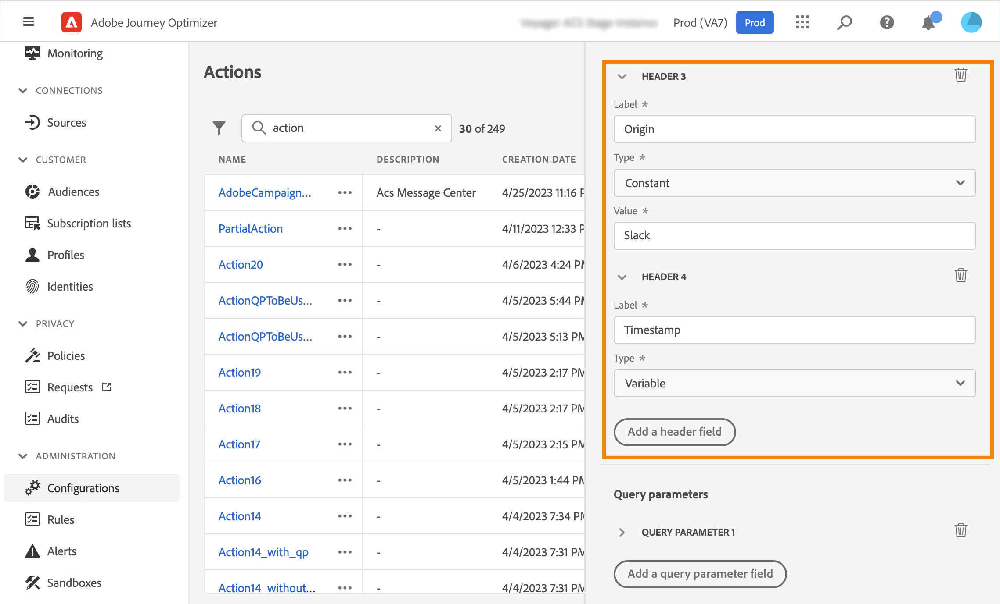

# 配置自定義操作 {#configure-an-action}

>[!CONTEXTUALHELP]
>id="ajo_journey_action_custom_configuration"
>title="自訂動作"
>abstract="如果您使用第三方系統發送消息，或者如果希望行程將API調用發送到第三方系統，請使用自定義操作配置其到行程的連接。 例如，可以使用自定義操作連接到以下系統：ε,Slack, [Adobe開發人員](https://developer.adobe.com)、Firebase等"

如果您使用第三方系統發送消息，或者如果希望行程將API調用發送到第三方系統，請使用自定義操作配置其到行程的連接。 例如，可以使用自定義操作連接到以下系統：ε,Slack, [Adobe開發人員](https://developer.adobe.com){target=&quot;_blank&quot;}、Firebase等。

自定義操作是由技術用戶定義並可供營銷人員使用的附加操作。 配置後，它們會出現在您旅程的左側調色板中， **[!UICONTROL Action]** 的子菜單。 在[本頁](../building-journeys/about-journey-activities.md#action-activities)中瞭解更多。

## 限制{#custom-actions-limitations}

自定義操作附帶了中列出的一些限制 [此頁](../start/limitations.md)。

在自定義操作參數中，可以傳遞簡單集合以及對象集合。 瞭解有關中的收集限制的詳細資訊 [此頁](../building-journeys/collections.md#limitations)。

另請注意，自定義操作參數具有預期格式(例如：字串、小數等)。 您必須小心遵守這些預期格式。 瞭解更多資訊 [用例](../building-journeys/collections.md)。

## 設定步驟 {#configuration-steps}

以下是配置自定義操作所需的主要步驟：

1. 在「管理」(ADMINISTRATION)菜單部分，選擇 **[!UICONTROL Configurations]**。 在  **[!UICONTROL Actions]** ，按一下 **[!UICONTROL Manage]**。 按一下 **[!UICONTROL Create Action]** 的子菜單。 操作配置窗格在螢幕右側開啟。

   

1. 輸入操作的名稱。

   >[!NOTE]
   >
   >請勿使用空格或特殊字元。請勿使用超過 30 個字元。

1. 向操作添加說明。 此步驟為選填。
1. 使用此操作的行程數顯示在 **[!UICONTROL Used in]** 的子菜單。 您可以按一下 **[!UICONTROL View journeys]** 按鈕來顯示使用此操作的行程清單。
1. 選擇與此自定義操作相關的通道： **電子郵件**。 **簡訊**&#x200B;或 **推送通知**。 它將用所選渠道的預設市場營銷操作預填所需的市場營銷操作欄位。 如果選擇 **其他**，將不定義市場營銷操作。
1. 如果要將此自定義操作應用同意規則，請選擇相應的 **必需的市場營銷操作**。 請參閱[本節](../action/about-custom-action-configuration.md#consent-management)。
1. 定義不同 **[!UICONTROL URL Configuration]** 參數。 請參閱[本節](../action/about-custom-action-configuration.md#url-configuration)。
1. 配置 **[!UICONTROL Authentication]** 的子菜單。 此配置與資料源相同。  請參閱[本節](../datasource/external-data-sources.md#custom-authentication-mode)。
1. 定義 **[!UICONTROL Action parameters]**。 請參閱[本節](../action/about-custom-action-configuration.md#define-the-message-parameters)。
1. 
1. 按一下「**[!UICONTROL Save]**」。

   現在已配置自定義操作，並準備在您的旅途中使用。 請參閱[此頁面](../building-journeys/about-journey-activities.md#action-activities)。

   >[!NOTE]
   >
   >在行程中使用自定義操作時，大多數參數都是只讀的。 您只能修改 **[!UICONTROL Name]**。 **[!UICONTROL Description]**。 **[!UICONTROL URL]** 和 **[!UICONTROL Authentication]** 的子菜單。

## URL 組態 {#url-configuration}

配置自定義操作時，需要定義以下 **[!UICONTROL URL Configuration]** 參數：

1. 在 **[!UICONTROL URL]** 欄位，指定外部服務的URL:

   * 如果URL是靜態的，請在此欄位中輸入URL。

   * 如果URL包含動態路徑，則只輸入該URL的靜態部分，即方案、主機、埠以及（可選）路徑的靜態部分。

      範例: `https://xxx.yyy.com/somethingstatic/`

      將自定義操作添加到行程時，將指定URL的動態路徑。 [了解更多](../building-journeys/using-custom-actions.md)。
   >[!NOTE]
   >
   >出於安全原因，強烈建議您將HTTPS方案用於URL。 我們不允許使用非公有的Adobe地址和IP地址。
   >
   >定義自定義操作時僅允許預設埠：80表示http,443表示https。

1. 選擇呼叫 **[!UICONTROL Method]**:它可以 **[!UICONTROL POST]** 或 **[!UICONTROL PUT]**。

   >[!NOTE]
   >
   > 的 **DELETE** 方法不受支援。 如果需要更新現有資源，請選擇 **PUT** 的雙曲餘切值。

1. 在 **[!UICONTROL Headers]** 定義要發送到外部服務的請求消息的HTTP標頭：
   1. 要添加標題欄位，請按一下 **[!UICONTROL Add a header field]**。
   1. 輸入標題欄位的鍵。
   1. 要為鍵值對設定動態值，請選擇 **[!UICONTROL Variable]**。 否則，選擇 **[!UICONTROL Constant]**。

      例如，對於時間戳，可以設定動態值。

   1. 如果已選擇 **[!UICONTROL Constant]**，然後輸入常數值。

      如果已選擇 **[!UICONTROL Variable]**，則在將自定義操作添加到行程時將指定此變數。 [了解更多](../building-journeys/using-custom-actions.md)。

      

   1. 要刪除標題欄位，請指向標題欄位，然後按一下 **[!UICONTROL Delete]** 表徵圖
   的 **[!UICONTROL Content-Type]** 和 **[!UICONTROL Charset]** 預設情況下設定標題欄位。 不能修改或刪除這些欄位。

   在將自定義操作添加到行程後，如果行程處於草稿狀態，則仍可將題頭欄位添加到行程。 如果不希望行程受配置更改的影響，請複製自定義操作，並將標題欄位添加到新的自定義操作。

   >[!NOTE]
   >
   >根據欄位分析規則驗證標頭。 瞭解詳情 [本文檔](https://tools.ietf.org/html/rfc7230#section-3.2.4){_blank}。

## 定義操作參數 {#define-the-message-parameters}

在 **[!UICONTROL Action parameters]** 部分，貼上要發送到外部服務的JSON負載示例。

>[!NOTE]
>
>負載中的欄位名稱不能包含「。」 字元. 它們不能以「$」字元開頭。

您將能夠定義參數類型(例如：字串、整數等)。

還可以選擇指定參數是常數還是變數：

* 常數表示參數的值在操作配置窗格中由技術角色定義。 不同旅程的價值始終相同。 它不會變化，營銷人員在旅途中使用自定義操作時不會看到它。 例如，可能是第三方系統需要的ID。 在這種情況下，切換常數/變數右側的欄位是傳遞的值。
* 變數表示參數的值將發生變化。 在行程中使用此自定義操作的營銷人員可以免費傳遞他們想要的值，或指定在何處檢索此參數的值(例如從事件、從Adobe Experience Platform等)。 在這種情況下，切換常數/變數右側的欄位是標籤商在命名此參數的旅程中將看到的標籤。

## 同意管理 {#consent-management}

客戶現在可以定義與隱私相關的同意策略，以在執行操作期間控制傳出資料。 同意策略用作配置檔案屬性的表達式，設定規則以定義是否可以對給定配置檔案執行操作。

Conxent在Content的Conter Content中提供了一種Tel類型的通信利用，即donnée champs dans profile qu vont nicte Concence，包含AEP nuvelles regles de type policies auj gouvernance。 Par例行了Restric電子郵件目標。 關聯標籤(C4/C5)是市場營銷活動。 確定目標，鍵入市場營銷活動。 前SFTP在出口方面的價值，在銷售方面的價值。 在定制行動、電子郵件/簡訊/推送式營銷行動中，市場行動的&quot;egelement&quot;概念。 您自定義。

標籤：quand tu def data set(où stocker tes données)、onglet data gouvernance、pr chaque attribut tu peux definir le type de label associate a cet a a atttribut。 國家代碼標籤C3/C4。 標籤ootb、tu peux en def d&#39;autres en fonction besoin。

 — 吉拉評論 — 

將「附加營銷活動」描述為從業人員解釋自定義活動「意圖」的一種方式，例如：我的定製活動是鍛鍊溝通、通訊、健身溝通等。

描述第一次發佈的同意範圍：

- 在自定義操作中個性化中使用的市場營銷操作和屬性都會考慮在內
- 對於段觸發的行程（以讀取段開始），該段中用作條件的屬性會被考慮
- 行程中使用的所有活動（讀取段或自定義操作除外）均未被考慮
- 不考慮段資格，即使用於開始行程

描述在自定義操作中由同意策略排除的配置檔案仍將繼續完成該過程(iso with Message and suppression list)

描述預期延遲的提醒：https://wiki.corp.adobe.com/display/DMSArchitecture/Consent+Latency
+ 正確AJO延遲從1h到6h

我們應記錄的兩種延遲類型：

- 用戶延遲，在Carolina Infante上，我不確定我們能說什麼，看這個：

是否需要「UPS投影/導出」，以在配置檔案級別更新「contentTo」欄位（知道我們在運行時使用的內容），我們可以確認嗎？ 因為如果是這種情況，我想我們應該說需要48小時，但如果不是，我們只談到「攝入延遲+收集延遲」（因此，如果攝入中出現高峰或中斷，和/或客戶需要很長時間才能從用戶收集更新，則最壞情況是幾秒到幾小時）。

- 同意政策延遲，我會說「最多6小時」，因為即時旅行將每隔6小時取消同意政策。 Carolina Infante ，您知道我們是否受到篩選延遲的影響嗎？
