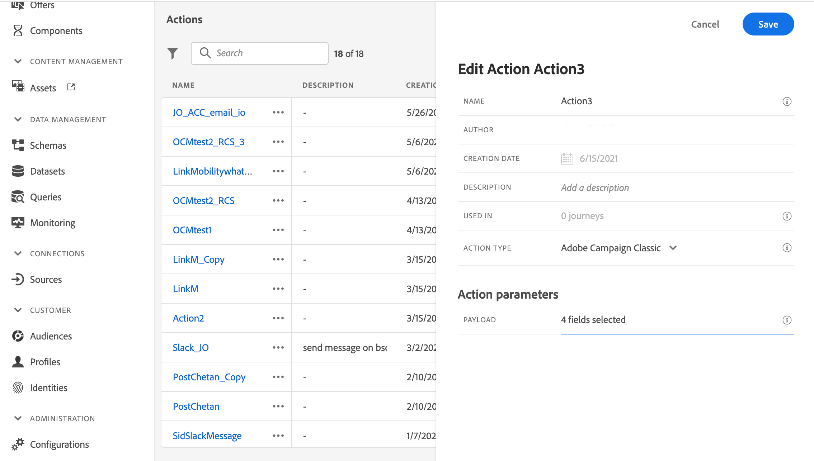

# 與 Adobe Campaign v7/v8 整合 {#integrating-with-adobe-campaign-v7-v8}

>[!CONTEXTUALHELP]
>id="ajo_journey_action_acc"
>title="Adobe Campaign v7/v8 動作"
>abstract="此整合適用於 Adobe Campaign v7 和 v8。這可讓您使用 Adobe Campaign 交易型訊息功能來傳送電子郵件、推播通知及簡訊。Journey Optimizer 和 Campaign 執行個體之間的連線在佈建時由 Adobe 設定。"

如果您有Adobe Campaign Classic v7或Campaign v8，則可在您的歷程中使用特定的自訂動作，以整合Adobe Journey Optimizer和Adobe Campaign。 此整合可讓您使用Adobe Campaign異動訊息功能來傳送電子郵件、推播通知和SMS。 在此[端對端使用案例](../building-journeys/ajo-ac.md)中瞭解更多。

對於設定的每個動作，歷程設計工具浮動視窗中都會提供[促銷活動動作活動](../building-journeys/using-adobe-campaign-v7-v8.md)。

## 啟用 {#access}

提出要求時，Adobe會在布建時設定Journey Optimizer與Adobe Campaign環境之間的連線。 如果您在布建時尚未要求連線，請聯絡Adobe Journey Optimizer支援以要求啟用。 您必須提供下列詳細資料：

>[!BEGINTABS]

>適用於Adobe Journey Optimizer[!TAB 的]

* 組織ID (Adobe OrgID)
* 沙箱名稱

>適用於Adobe Campaign[!TAB 的]

* 行銷活動伺服器URL
* 即時伺服器URL
* 您的Adobe Campaign版本

>[!ENDTABS]


## 護欄與限制 {#important-notes}

* 沒有訊息限制。 系統會根據目前的Campaign SLA，將每5分鐘可傳送的訊息數上限設為4,000則以上。 因此，Journey Optimizer應僅用於單一使用案例（個別事件，而非對象）。

* 您必須針對要使用的每個範本，在畫布上設定一個動作。 您需要在Journey Optimizer中，為您要從Adobe Campaign使用的每個範本設定一個動作。

* 建議您針對這項整合使用專用的訊息中心託管或Managed Services執行個體，以免影響您可能進行的任何其他行銷活動作業。 行銷伺服器可以是託管或內部部署。<!--The build required is 21.1 Release Candidate or greater. -->

* 沒有驗證裝載或行銷活動訊息是否正確。

* 行銷活動動作無法與對象資格事件搭配使用。

## 先決條件 {#prerequisites}

在Adobe Campaign中，您必須建立並發佈交易式訊息及其相關事件。 請參閱[Adobe Campaign檔案](https://experienceleague.adobe.com/en/docs/campaign/campaign-v8/send/real-time/transactional){target="_blank"}。

您可以依照以下模式，建置與每則訊息相對應的JSON裝載。 之後，當您在Journey Optimizer中設定動作時，就會貼上此裝載（請參閱下文）。

+++ 範例

```json
{
    "channel": "email",
    "eventType": "welcome",
    "email": "Email address",
    "ctx": {
        "firstName": "First name"
    }
}
```

* **頻道**：為您的Campaign交易範本定義的頻道
* **eventType**：您的行銷活動事件的內部名稱
* **ctx**：變數，根據您訊息中的個人化設定而定

+++

## 設定動作 {#configure-action}

在Journey Optimizer中，您必須為每個異動訊息設定一個動作。

若要建立Campaign動作，請遵循下列步驟：

1. 建立新動作。 [瞭解如何建立自訂動作](../action/action.md)。
1. 輸入名稱和說明。
1. 在&#x200B;**[!UICONTROL 動作型別]**&#x200B;欄位中，選取&#x200B;**[!UICONTROL Adobe Campaign Classic]**。
   
1. 按一下&#x200B;**[!UICONTROL 裝載]**&#x200B;欄位，然後貼上與Campaign訊息相對應的JSON裝載範例。 聯絡Adobe以取得此裝載。
1. 根據您想要每個欄位在歷程畫布上對應，將其設定為靜態或變數。 例如，電子郵件通道引數和個人化欄位(`ctx`)等欄位通常應設定為變數，以便能夠在歷程中動態調整。
1. 按一下&#x200B;**[!UICONTROL 儲存]**。

## 更新現有動作 {#update-action}

如果您需要更新現有的Campaign v7/v8自訂動作，例如在初始設定後即時(RT)端點變更時，請遵循下列步驟：

1. 從&#x200B;**[!UICONTROL 管理]**&#x200B;功能表，選取&#x200B;**[!UICONTROL 組態]**，然後移至&#x200B;**[!UICONTROL 動作]**。
1. 找出並選取您要從動作清單更新的Campaign動作。
1. 按一下&#x200B;**[!UICONTROL 編輯]**&#x200B;以開啟動作設定。
1. 使用新的RT端點URL更新&#x200B;**[!UICONTROL URL]**&#x200B;欄位。 請確認端點格式正確且可連線。
1. 如有需要，請更新&#x200B;**[!UICONTROL 裝載]**&#x200B;設定，以符合Campaign交易式訊息結構中的任何變更。
1. 按一下&#x200B;**[!UICONTROL 測試]**&#x200B;以驗證與新端點的連線。 在繼續之前，請確認測試傳回成功的回應。
1. 驗證後，按一下[儲存] **[!UICONTROL 以套用您的變更。]**

>[!NOTE]
>
>任何使用此動作的歷程都會自動使用更新的設定。 如果您有使用此動作的即時歷程，請在更新端點後密切監視它們，以確保正確傳送訊息。

