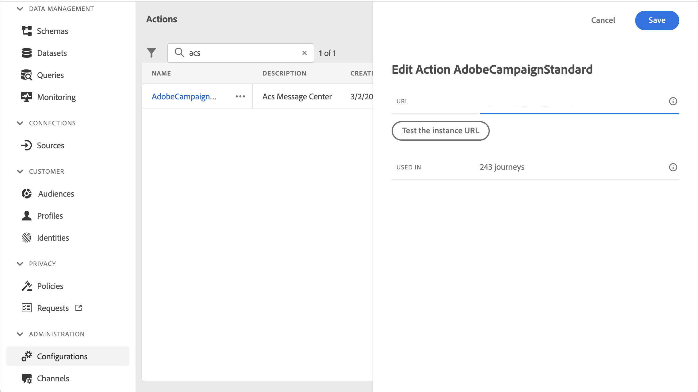
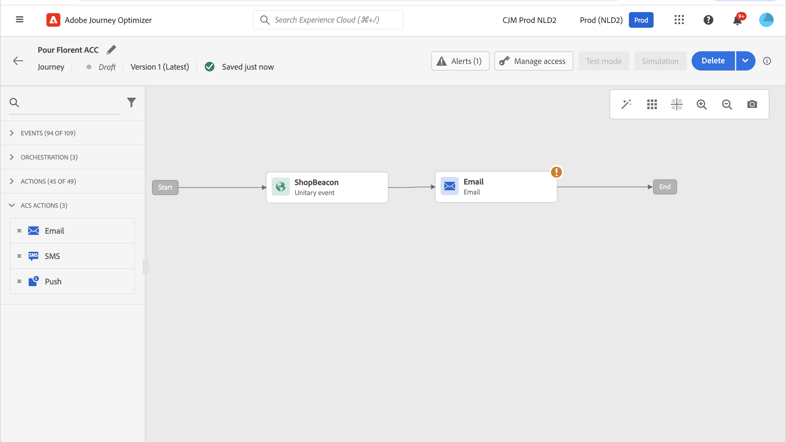

# 與 Adobe Campaign Standard 整合 {#using_adobe_campaign_standard}

如果您有Adobe Campaign Standard，則可使用內建動作來允許連線至Adobe Campaign Standard。 您可以使用Adobe Campaign Standard的「交易訊息」功能來傳送電子郵件、推播通知和簡訊。

必須發佈Campaign Standard交易式訊息及其相關事件，才能在Journey Optimizer中使用。 如果事件已發佈，但訊息尚未發佈，將無法在Journey Optimizer介面中看見。 如果訊息已發佈，但其關聯事件尚未發佈，則會顯示在Journey Optimizer介面中，但將無法使用。

## 護欄與限制 {#important-notes}

* 系統會自動為Adobe Campaign Standard動作定義每5分鐘4,000次呼叫的上限規則。 在[Adobe Campaign Standard產品說明](https://helpx.adobe.com/tw/legal/product-descriptions/campaign-standard.html){target="_blank"}中進一步瞭解異動訊息SLA。

* Adobe Campaign Standard整合是透過動作清單中的專屬內建動作來設定。 必須針對每個沙箱進行此設定。

* Campaign Standard動作無法與對象資格或讀取對象活動搭配使用。

* 歷程不能同時使用[內建頻道動作](../building-journeys/journeys-message.md)和[Campaign Standard動作](../building-journeys/using-adobe-campaign-standard.md)。

## 設定動作 {#configure-action}

在Journey Optimizer中，您必須為每個異動訊息設定一個動作。

若要設定Campaign Standard動作，請遵循下列步驟：

1. 在[管理]功能表區段中選取&#x200B;**[!UICONTROL 組態]**。

1. 在&#x200B;**[!UICONTROL 動作]**&#x200B;區段中，按一下&#x200B;**[!UICONTROL 管理]**。 畫面隨即顯示動作清單。

1. 選取內建&#x200B;**[!UICONTROL AdobeCampaignStandard]**&#x200B;動作。 動作設定窗格會在畫面右側開啟。

   

1. 複製您的Adobe Campaign Standard執行個體URL，並將其貼到&#x200B;**[!UICONTROL URL]**&#x200B;欄位中。

1. 按一下&#x200B;**[!UICONTROL 測試執行個體URL]**&#x200B;以測試執行個體的有效性。

   >[!NOTE]
   >
   >此測試會驗證：
   >
   >* 主機為「.campaign.adobe.com」、「.campaign-sandbox.adobe.com」、「.campaign-demo.adobe.com」、「.ats.adobe.com」或「.adls.adobe.com」
   >
   >* URL以https開頭
   >
   >* 與此Adobe Campaign Standard例項相關聯的組織與Journey Optimizer組織相同

完成此設定後，在設計歷程時，**[!UICONTROL 動作]**&#x200B;類別中有三個動作可用： **[!UICONTROL 電子郵件]**、**[!UICONTROL 推播]**、**[!UICONTROL 簡訊]**。 [瞭解如何使用它們](../building-journeys/using-adobe-campaign-standard.md)。

使用&#x200B;**回應**&#x200B;事件來回應與相同歷程中傳送之Campaign Standard訊息相關的追蹤資料：

* 對於推播通知，歷程可對點選、傳送或失敗的訊息做出反應。

* 對於SMS訊息，歷程可對已傳送或失敗的訊息做出反應。

* 對於電子郵件，歷程可對點按、傳送、開啟或失敗的訊息做出反應。 [進一步瞭解回應事件](../building-journeys/reaction-events.md)。

使用協力廠商系統傳送訊息時，您必須新增並設定自訂動作。 [進一步瞭解自訂動作組態](../action/about-custom-action-configuration.md)。