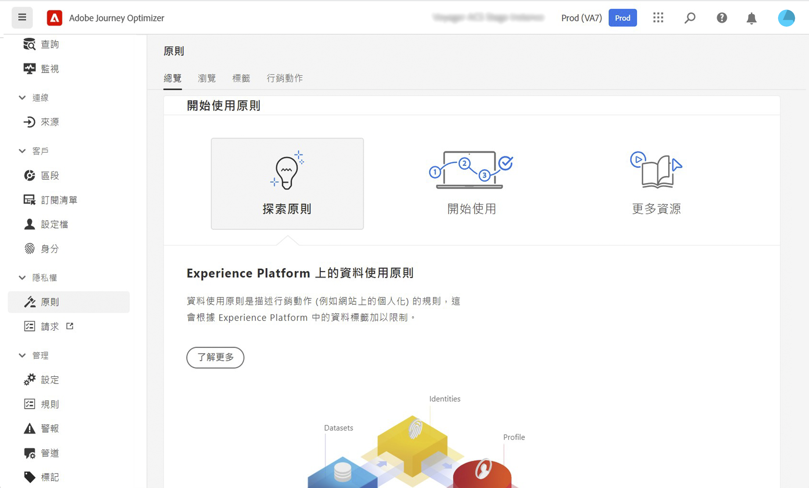
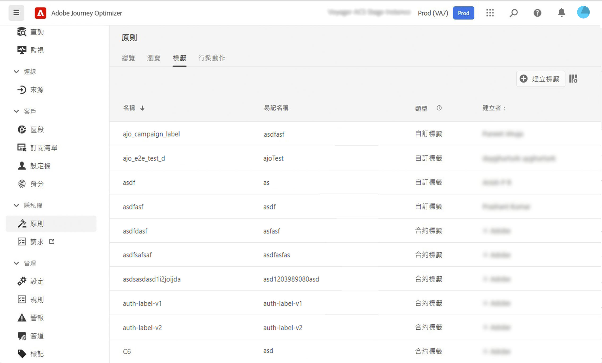
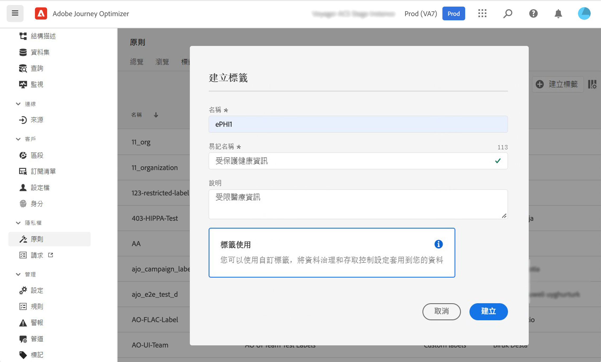

# 資料治理 {#restrict-fields}

>[!IMPORTANT]
>
>資料使用標籤和實作(DULE)的使用目前僅限選定客戶使用，並將在未來版本中部署至所有環境。

透過其資料使用標籤與實作(DULE)控管架構，Journey Optimizer現在可以運用Adobe Experience Platform控管政策，防止敏感欄位透過自訂動作匯出至協力廠商系統。 如果系統在自訂動作參數中識別限制欄位，系統會顯示錯誤，使您無法發佈歷程。

Adobe Experience Platform可讓您標示欄位，並建立每個管道的行銷動作。 然後，您會定義連結至標籤和行銷動作的控管政策。

在Journey Optimizer中，您可以將這些原則套用至自訂動作，以防止特定欄位匯出至協力廠商系統。

## 重要備註 {#important-notes}

* 資料控管僅適用於歷程中的自訂動作。 不支援Campaign Classic和Campaign Standard動作。
* 只有在自訂動作層級設定行銷動作（必要或其他）時，才適用控管原則。
* 不支援使用現成可用聯合架構的欄位群組所屬的屬性。 這些屬性將從介面中隱藏。 您需要使用不同架構建立其他欄位群組。

## 定義治理政策 {#governance-policies}

您可以使用現有的標籤、行銷動作和原則。 以下是建立新設定的主要步驟：

* 新增標籤，並將標籤套用至您不想匯出至協力廠商系統的特定欄位，例如人員的血液類型。
* 為您歷程中使用的每個第三方自訂動作定義行銷動作。
* 建立控管原則，並將其與標籤和行銷動作建立關聯。

有關如何管理策略的詳細資訊，請參閱 [檔案](https://experienceleague.adobe.com/docs/experience-platform/data-governance/policies/user-guide.html?lang=en#consent-policy)

讓我們以您需要標示為敏感並限制匯出至協力廠商的血液類型欄位為例。 以下是不同的步驟：

1. 在左側功能表的下方 **隱私權**，按一下 **原則**.
   
1. 選取 **標籤** 按一下 **建立標籤**.
   
1. 定義此標籤的名稱和易記名稱。 例如， _ePHI1_.
   
1. 在左側功能表的下方 **資料管理**，按一下 **結構**，然後按一下 **套用存取權和資料控管標籤** 按鈕。 選取您的結構和欄位（血液類型），然後選取先前建立的標籤， _ePHI1_ 例如。
   
1. 返回 **原則** ，選擇 **行銷動作** 按一下 **建立行銷動作**. 建議您針對歷程中使用的每個第三方自訂動作建立一個行銷動作。 例如，建立 _Slack行銷動作_ 將用於您的Slack自訂動作。
   
1. 選取 **瀏覽** 按一下 **建立原則** 選取 **資料控管原則**. 選取您的標籤(_ePHI1_)和行銷動作(_Slack行銷動作_)。
   

當您將在歷程中使用您的Slack自訂動作時，會使用 _Slack行銷動作_，相關政策將被運用。

## 設定自訂動作 {#consent-custom-action}

在左側功能表的下方 **管理**，按一下 **配置** 選取 **動作**. 開啟Slack自訂動作。 設定自訂動作時，可使用兩個欄位來控管資料。

* 此 **管道** 欄位可讓您選取與此自訂動作相關的通道： **電子郵件**, **簡訊**，或 **推播通知**. 它會預先填入 **必要的行銷動作** 欄位中填入所選管道的預設行銷動作。 如果您選取 **其他**，預設不會定義任何行銷動作。 在範例中，我們選取管道 **其他**.

* 此 **必要的行銷動作** 可讓您定義與自訂動作相關的行銷動作。 例如，如果您使用該自訂動作使用第三方傳送電子郵件，則可選取 **電子郵件目標定位**. 在範例中，我們選取 _Slack行銷動作_. 系統會擷取並運用與該行銷動作相關聯的管理政策。

設定自訂動作的其他步驟於 [本節](../action/about-custom-action-configuration.md#consent-management).

## 建立歷程 {#consent-journey}

在左側功能表的下方 **歷程管理**，按一下 **歷程**. 建立您的歷程並新增自訂動作。  在歷程中新增自訂動作時，有數個選項可讓您管理資料控管。 按一下 **顯示唯讀欄位** 以顯示所有參數。

此 **管道** 和 **必要的行銷動作**，在設定自訂動作時定義的，會顯示在畫面頂端。 您無法修改這些欄位。

您可以定義 **其他行銷動作** 來設定自訂動作類型。 這可讓您定義此歷程中自訂動作的用途。 除了必要的行銷動作（通常是管道專用的）之外，您還可以定義其他行銷動作，這將是特定歷程中的自訂動作專用。 例如：鍛鍊通訊、通訊、健身通訊等。 所需的行銷動作和其他行銷動作皆適用。

在我們的範例中，我們不使用其他行銷動作。

如果其中一個欄位標示為 _ePHI1_ （我們範例中的血液類型欄位）會在動作參數中偵測，並顯示錯誤，使您無法發佈歷程。

在歷程中設定自訂動作的其他步驟於 [本節](../building-journeys/using-custom-actions.md).
