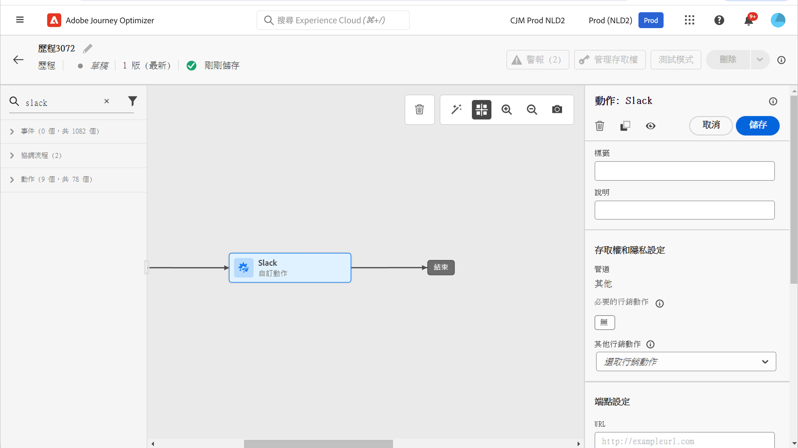

# 資料治理 {#restrict-fields}

>[!CONTEXTUALHELP]
>id="ajo_data_governance_policy_violation"
>title="資料治理原則違規"
>abstract="如果系統在歷程或行銷活動中，或是自訂動作中曾有識別出限制欄位，就會顯示錯誤，讓您無法發佈歷程。使用此對話框中的資料譜系圖表，即可了解在您啟動歷程或行銷活動之前，還必須進行哪些其他設定變更。"

## 開始使用資料治理原則 {#gs}

透過其[資料使用標籤和實作 (DULE) 治理](https://experienceleague.adobe.com/docs/experience-platform/data-governance/home.html?lang=zh-Hant){target="_blank"}架構，Adobe Experience Platform 可讓您透過&#x200B;**為欄位加上標籤**&#x200B;並為每個頻道建立&#x200B;**行銷動作**，跨頻道管理和強制執行資料治理原則。

定義標籤與行銷動作後，您可以建立連結這兩個元素的&#x200B;**資料治理原則**。例如，您可以設定將「ePHI」標籤與「電子郵件目標定位」行銷動作建立關聯的原則，確保標記為「ePHI」的欄位不會用於個人化電子郵件訊息。[了解如何建立資料治理原則](#policy)

建立治理原則後，您可以將行銷動作套用至歷程/行銷活動以及歷程自訂動作。
[了解如何在 Journey Optimizer 套用行銷動作](#apply-marketing-actions)

建置歷程或行銷活動時，在選取管道設定或新增自訂動作後，系統會驗證訊息管道設定中的行銷動作或自訂動作，是否屬於資料治理原則的一部分。若是如此，系統會檢查目標對象或訊息個人化中的任何欄位，是否加上標籤且受原則限制。如果偵測到這類標籤，則會封鎖發佈歷程或行銷活動作業。[了解如何偵測資料治理原則違規](#violation)

## 建立標籤與行銷動作{#labels-marketing-actions}

強制執行資料治理原則的第一步是建立標籤，然後其附加至要限制其使用的欄位，以及每個管道的行銷動作。

1. 在左側選單中的&#x200B;**隱私權**&#x200B;下方，按一下 **政策**。

1. 選取&#x200B;**標籤**，按一下&#x200B;**建立標籤**。

1. 定義標籤的名稱與易記名稱。例如，_ePHI1_。

1. 在左側選單中的&#x200B;**資料管理**&#x200B;下方，按一下&#x200B;**結構描述**，然後按一下&#x200B;**套用存取權和資料治理標籤**&#x200B;按鈕。 選取您的結構描述與欄位 (例如「血液類型」)，然後選取先前建立的標籤，例如範例中的 _ePHI1_。

   

1. 返回&#x200B;**政策**&#x200B;選單，選取&#x200B;**行銷動作**&#x200B;標籤，按一下&#x200B;**建立行銷動作**。建議您針對每個管道，以及歷程中所使用的每個第三方自訂動作，建立一個行銷動作。例如，建立 _Slack 行銷動作_，其將用於您的 Slack 自訂動作。

   

## 建立資料治理原則 {#policy}

現已建立標籤與行銷動作，您可以將其一起連結至資料治理原則。若要執行此操作，請選取&#x200B;**瀏覽**&#x200B;標籤，按一下&#x200B;**建立原則**，然後選取&#x200B;**資料治理原則**。選取您的標籤 (_ePHI1_) 和行銷動作 (_Slack 行銷動作_)。

當您要在歷程中以 _Slack 行銷動作_&#x200B;使用您的 Slack 自訂動作時，會運用到相關政策。

## 在 Journey Optimizer 套用行銷動作{#apply-marketing-actions}

為了在 Journey Optimizer 中強制執行資料治理原則，您需要將行銷動作套用至歷程、行銷活動或自訂動作。

### 將行銷動作套用至歷程與行銷活動{#journeys-campaigns}

建立治理原則之後，您必須將相關的行銷動作套用至您的Journey Optimizer **管道設定**。 要執行此操作，請依照下列步驟執行：

1. 存取&#x200B;**[!UICONTROL 管道]** > **[!UICONTROL 一般設定]** > **[!UICONTROL 管道設定]**&#x200B;功能表。

1. 開啟現有的管道設定，或建立新的管道設定。

1. 在&#x200B;**[!UICONTROL 行銷動作]**&#x200B;欄位中，選取行銷動作以與使用此設定的歷程/行銷活動建立關聯。系統會運用與行銷動作相關的所有同意和資料治理原則，以顧及客戶的偏好設定和為敏感欄位設定的限制。[了解更多](../action/consent.md#surface-marketing-actions)

   

1. 完成管道設定的設定，然後加以儲存。[了解如何設定管道設定](../configuration/channel-surfaces.md)。

1. 在歷程或行銷活動中建立訊息時，請選取相關的管道設定。完成歷程或行銷活動的設定，然後加以儲存。

在啟用歷程或行銷活動之前，系統會驗證所選取管道設定中的行銷動作，是否屬於資料治理原則的一部分。若是如此，系統會檢查目標對象或訊息個人化中的任何欄位，是否加上標籤且受原則限制。

如果系統發現受限制的欄位，就會顯示錯誤，讓您無法發佈歷程或行銷活動。[了解如何偵測治理原則違規](#violation)

{zoomable="yes"}

*歷程與行銷活動的原則違規分析步驟*

### 將行銷動作套用至自訂動作 {#custom-actions}

>[!NOTE]
>
>不支援 Campaign v7/v8 與 Campaign Standard 歷程動作。

以血液類型欄位為例，您需要限制其不可使用自訂動作匯出至第三方。若要執行此操作，您必須將行銷動作套用至自訂動作，然後建置歷程並在其中新增自訂動作。

1. 在左側功能表中的&#x200B;**管理**&#x200B;下方，按一下&#x200B;**設定**，然後選取&#x200B;**動作**。

1. 開啟 Slack 自訂動作。 設定自訂動作時，可使用兩個欄位進行資料治理。

   

   * **管道**&#x200B;欄位可讓您選取與此自訂動作相關的管道。它會以所選頻道的預設行銷動作，預先填入&#x200B;**必要的行銷動作**&#x200B;欄位。如果您選取&#x200B;**其他**，預設情況下不會定義任何行銷動作。 在範例中，我們選取&#x200B;**其他**&#x200B;頻道。

   * 此&#x200B;**必要的行銷動作**&#x200B;可讓您定義與自訂動作相關的行銷動作。 例如，如果您使用該自訂動作傳送使用第三方的電子郵件，則可選取&#x200B;**電子郵件目標定位**。在範例中，我們選取 _Slack 行銷動作_。系統會擷取並運用與該行銷動作相關聯的治理政策。

   [本節](../action/about-custom-action-configuration.md#consent-management)詳細介紹了設定自訂動作的其他步驟。

1. 在左側功能表中的&#x200B;**歷程管理**&#x200B;下方，按一下&#x200B;**歷程**。

1. 建立歷程，然後新增自訂動作。在歷程中新增自訂動作時，有數個選項可讓您管理資料治理。按一下&#x200B;**顯示唯讀欄位**&#x200B;以顯示所有參數。

   

   * 此&#x200B;**頻道**&#x200B;與在設定自訂動作時定義的&#x200B;**必要的行銷動作**，會顯示在畫面頂端。 您無法修改這些欄位。

   * 您可以定義&#x200B;**其他行銷動作**&#x200B;來設定自訂動作類型。 這可讓您定義此歷程中自訂動作的用途。 除了必要的行銷動作 (通常是頻道專用的) 之外，您還可以定義其他行銷動作，這些動作為此特定歷程中的自訂動作專用。 例如：運動訓練通訊、電子報、健身通訊等。 所需的行銷動作與其他行銷動作皆適用。在我們的範例中，我們不使用其他行銷動作。

如果在動作參數中偵測到其中一個標記為 _ePHI1_ (範例中的血液類型欄位) 的欄位，就會顯示錯誤，讓您無法發佈歷程。[了解如何偵測治理原則違規](#violation)

{zoomable="yes"}

*歷程自訂動作的原則違規分析步驟*

## 偵測原則違規 {#violation}

如果系統在歷程/行銷活動中或在自訂動作中發現限制欄位，就會顯示錯誤，讓您無法予以發佈。

**[!UICONTROL 警示]**&#x200B;按鈕顯示出現錯誤。選取錯誤，即可顯示所發生資料治理原則違規的詳細資訊。

此對話框指出目前的歷程/行銷活動設定違反現有的資料治理原則。使用資料譜系圖表，即可了解在啟用歷程或行銷活動之前，還必須進行哪些其他設定變更。

如需詳細資訊，請參閱[資料使用原則違規文件](https://experienceleague.adobe.com/zh-hant/docs/experience-platform/data-governance/enforcement/auto-enforcement#data-usage-violation){_blank}。
