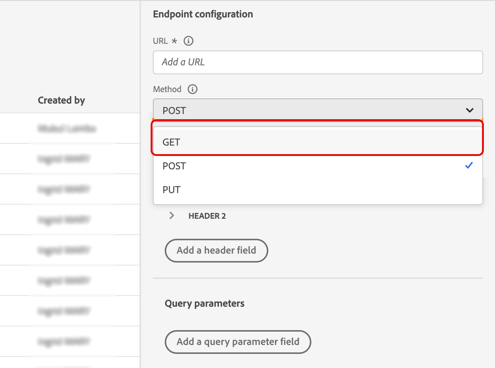
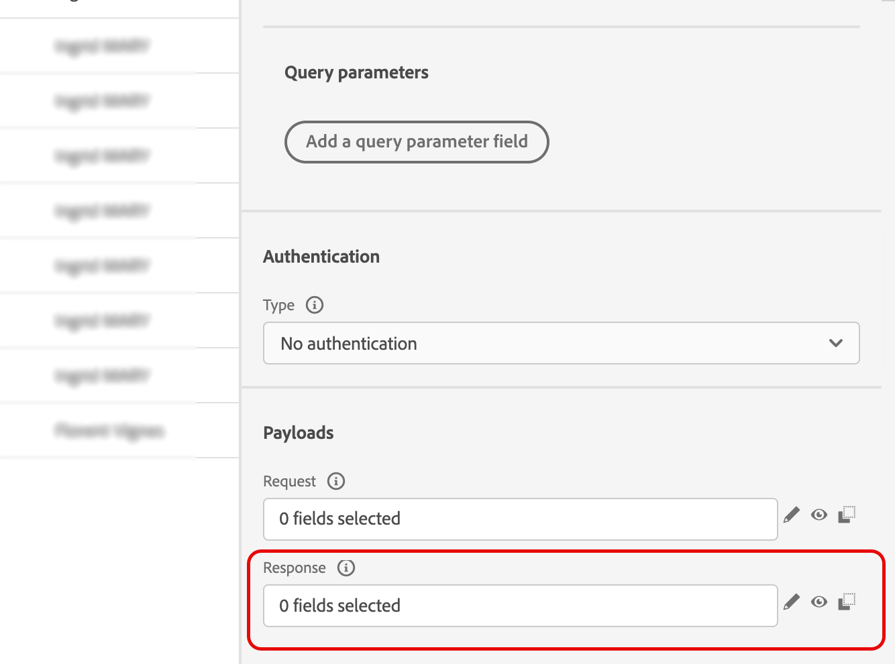
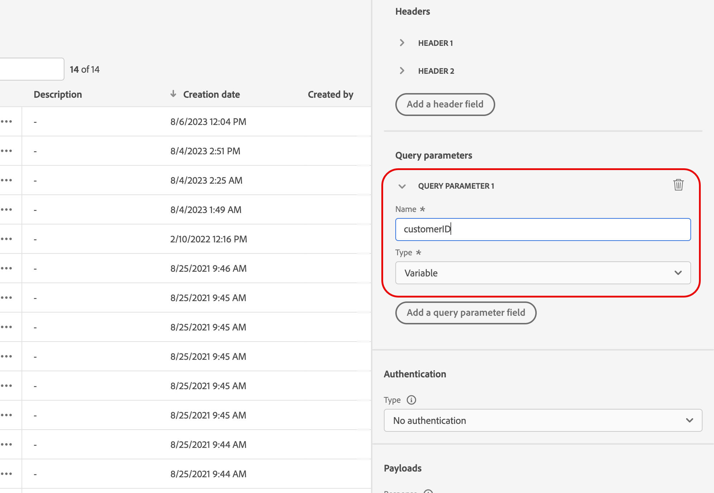
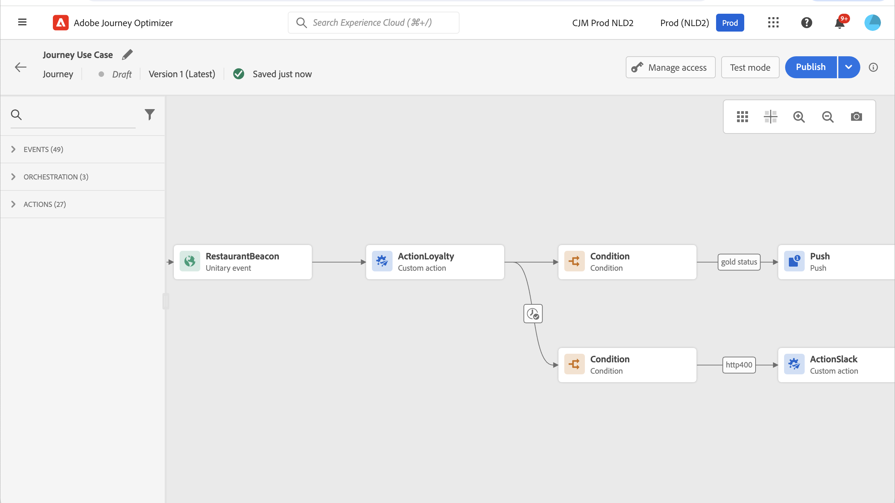
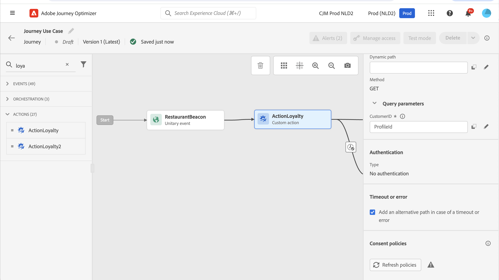
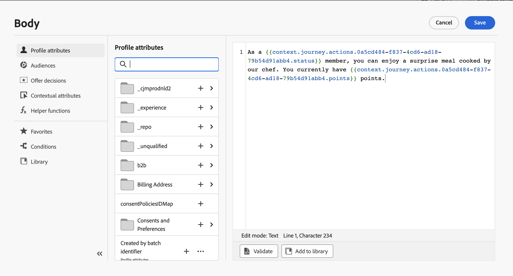
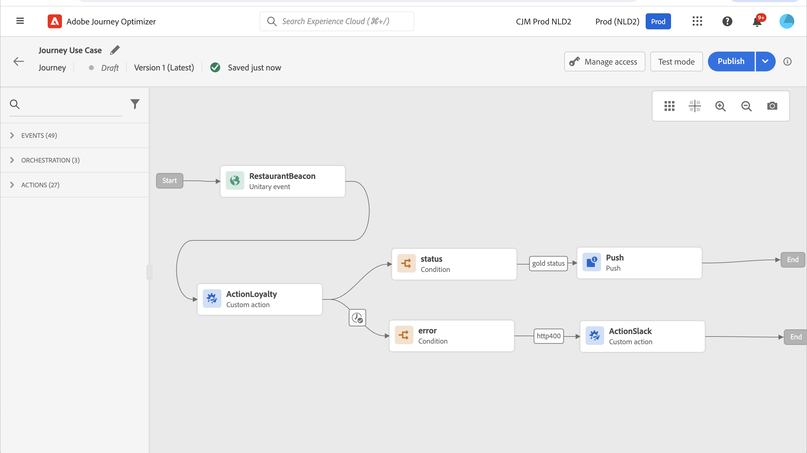

# 在自訂動作中使用 API 呼叫回應 {#custom-action-enhancements}

您可以在自訂動作中運用API呼叫回應，並根據這些回應協調您的歷程。

<!--
You can now leverage API call responses in custom actions and orchestrate your journeys based on these responses.

This capability was previously only available when using data sources. You can now use it with custom actions. 
-->

## 重要備註{#custom-action-enhancements-notes}

<!--
* Custom actions should only be used with private or internal endpoints, and used with an appropriate capping or throttling limit. See [this page](../configuration/external-systems.md). 
-->

* 回應承載支援純量陣列：

  ```
  "dummyScalarArray": [
  "val1",
  "val2"
  ]
  ```

* 回應承載中不支援異質陣列：

  ```
  "dummyRandomArray": [
  20,
  "aafw",
  false
  ]
  ```

<!--
## Best practices{#custom-action-enhancements-best-practices}

A capping limit of 5000 calls/s is defined for all custom actions. This limit has been set based on customers usage, to protect external endpoints targeted by custom actions. You need to take this into account in your audience-based journeys by defining an appropriate reading rate (5000 profiles/s when custom actions are used). If needed, you can override this setting by defining a greater capping or throttling limit through our Capping/Throttling APIs. See [this page](../configuration/external-systems.md).

You should not target public endpoints with custom actions for various reasons:

* Without proper capping or throttling, there is a risk of sending too many calls to a public endpoint that may not support such volume.
* Profile data can be sent through custom actions, so targeting a public endpoint could lead to inadvertently sharing personal information externally.
* You have no control on the data being returned by public endpoints. If an endpoint changes its API or starts sending incorrect information, those will be made available in communications sent, with potential negative impacts.
-->

<!--
## Define the custom action {#define-custom-action}

When defining the custom action, two enhancements have been made available: the addition of the GET method and the new payload response field. The other options and parameters are unchanged. See [this page](../action/about-custom-action-configuration.md).

### Endpoint configuration {#endpoint-configuration}

The **URL configuration** section has been renamed **Endpoint configuration**.

In the **Method** drop-down, you can now select **GET**.

{width="70%" align="left"}

### Payloads {#payloads-new}

The **Action parameters** section has been renamed **Payloads**. Two fields are available:

* The **Request** field: this field is only available for POST and PUT calling methods.
* The **Response** field: this is the new capability. This field as available for all calling methods.

>[!NOTE]
> 
>Both these fields are optional.

{width="70%" align="left"}
-->

## 設定自訂動作 {#config-response}

1. 建立自訂動作。 請參見[此頁面](../action/about-custom-action-configuration.md)。

1. 在&#x200B;**回應**&#x200B;欄位內按一下。

   {width="80%" align="left"}

1. 貼上呼叫傳回之裝載的範例。 驗證欄位型別是否正確（字串、整數等）。 以下是呼叫期間擷取的回應裝載範例。 我們的本機端點會傳送熟客點數和設定檔的狀態。

   ```
   {
   "customerID" : "xY12hye",    
   "status":"gold",
   "points": 1290 }
   ```

   {width="80%" align="left"}

   每次呼叫API時，系統都會擷取裝載範例中包含的所有欄位。

1. 我們也將customerID新增為查詢引數。

   {width="80%" align="left"}

1. 按一下&#x200B;**儲存**。

## 在歷程中善用回應 {#response-in-journey}

只需將自訂動作新增至歷程即可。 然後，您可以在條件、其他動作和訊息個人化中運用回應裝載欄位。

例如，您可以新增條件以檢查熟客點數。 當人員進入餐廳時，您的本機端點會傳送包含設定檔忠誠度資訊的呼叫。 如果設定檔為黃金客戶，則可傳送推播。 如果在呼叫中偵測到錯誤，請傳送自訂動作以通知您的系統管理員。



1. 新增您的事件和先前建立的熟客方案自訂動作。

1. 在忠誠度自訂動作中，將客戶ID查詢引數對應至設定檔ID。 核取選項&#x200B;**在逾時或錯誤的情況下新增替代路徑**。

   

1. 在第一個分支中，新增條件並使用進階編輯器在&#x200B;**Context**&#x200B;節點下運用動作回應欄位。

   

1. 然後新增推播，並使用回應欄位個人化您的訊息。 在範例中，我們使用忠誠度點數和客戶狀態來個人化內容。 動作回應欄位位於&#x200B;**內容屬性** > **Journey Orchestration** > **動作**&#x200B;下。

   

   >[!NOTE]
   >
   >每個輸入自訂動作的設定檔都會觸發呼叫。 即使回應一律相同，歷程仍會為每個設定檔執行一個呼叫。

1. 在逾時和錯誤分支中，新增條件並利用內建的&#x200B;**jo_status_code**欄位。 在我們的範例中，我們使用
   **http_400**&#x200B;錯誤型別。 請參閱[本節](#error-status)。

   ```
   @action{ActionLoyalty.jo_status_code} == "http_400"
   ```

   

1. 新增將傳送給您的組織的自訂動作。

   

## 測試模式記錄 {#test-mode-logs}

您可以透過測試模式存取與自訂動作回應相關的狀態記錄。 如果您已在歷程中定義具有回應的自訂動作，您將會在這些記錄上看到&#x200B;**actionsHistory**&#x200B;區段，其中顯示外部端點傳回的裝載（作為該自訂動作的回應）。 這在偵錯方面可能非常有用。


## 錯誤狀態 {#error-status}

**jo_status_code**&#x200B;欄位一律可用，即使未定義任何回應裝載。

以下是此欄位可能的值：

* http狀態代碼： http_`<HTTP API call returned code>`，適用於執行個體http_200或http_400
* 逾時錯誤： **逾時**
* 上限設定錯誤： **上限**
* 內部錯誤： **內部錯誤**

當傳回的http程式碼大於2xx或發生錯誤時，會將動作呼叫視為錯誤。 在這種情況下，歷程會流向專用逾時或錯誤分支。

>[!WARNING]
>
>只有新建立的自訂動作才會包含立即可用的&#x200B;**jo_status_code**&#x200B;欄位。 如果您想要將其用於現有的自訂動作，則需要更新動作。 例如，您可以更新說明並儲存。

## 運算式語法 {#exp-syntax}

語法如下：

```json
#@action{myAction.myField} 
```

以下是一些範例：

```json
 // action response field
 @action{<action name>.<path to the field>}
 @action{ActionLoyalty.status}
```

```json
 // action response field
 @action{<action name>.<path to the field>, defaultValue: <default value expression>}
 @action{ActionLoyalty.points, defaultValue: 0}
 @action{ActionLoyalty.points, defaultValue: @event{myEvent.newPoints}}
```

在自訂動作回應中操控集合時，您可以仰賴`currentActionField`存取目前專案：

```json
count(
@action{MyAction.MyCollection.all(
currentActionField.description == "abc"
)}
)
```

### 在原生管道中使用自訂動作回應 {#response-in-channels}

自訂動作的回應裝載欄位可用於原生通道（電子郵件、推播、簡訊）以進行訊息個人化。 這包括重複處理外部API傳回的陣列和巢狀資料結構的能力。

<!--For detailed examples and syntax for iterating over custom action response data in messages, refer to [Iterate over contextual data with Handlebars](../personalization/iterate-contextual-data.md#custom-action-responses).-->

## 其他資源

如需詳細資訊，請參閱以下頁面：

* [欄位參考](../building-journeys/expression/field-references.md)。
* [集合管理功能](../building-journeys/expression/collection-management-functions.md)
