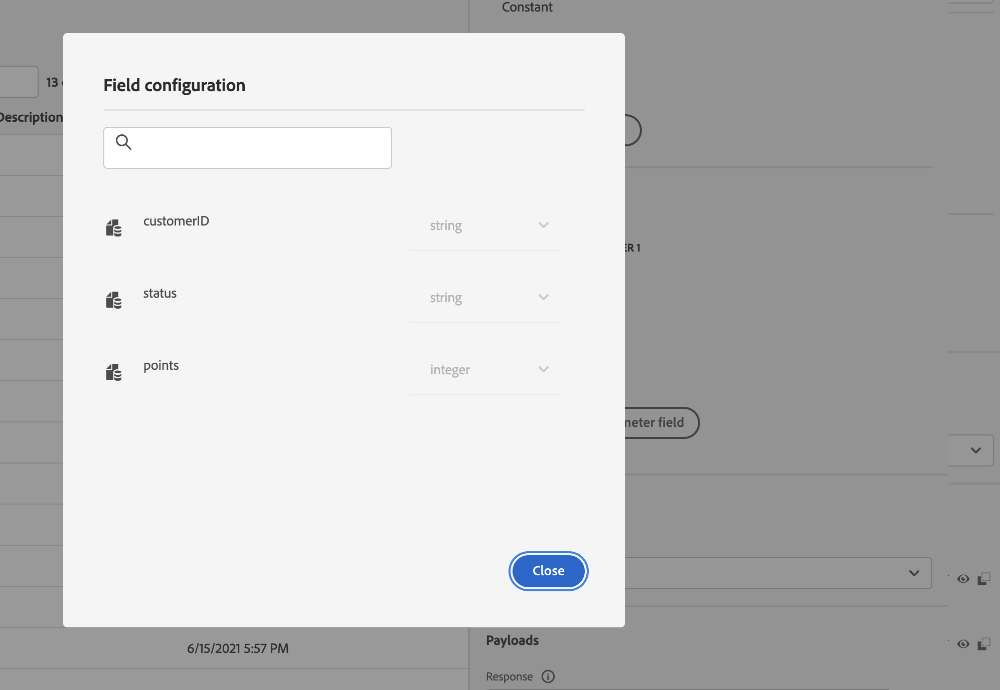

# 自訂動作增強功能 {#configure-an-action}

您現在可以在自訂動作中運用 API 呼叫回應，並根據這些回應精心安排您的歷程。

此功能僅適用於使用資料來源時。 您現在可以將其用於自訂動作。

> [!AVAILABILITY]
>
> 此功能目前以私人測試版的形式提供。

## 定義自訂動作

定義自訂動作時，已提供兩個增強功能：新增GET方法和新的裝載回應欄位。 其他選項和引數則保持不變。 請參閱[此頁面](../action/about-custom-action-configuration.md)。

### 端點設定 {#url-configuration}

此 **URL設定** 區段已重新命名 **端點設定**.

在 **方法** 下拉式清單，您現在可以選取 **GET**.

{width="70%" align="left"}

### 裝載 {#url-configuration}

此 **動作引數** 區段已重新命名 **裝載**. 有兩個欄位可供使用：

* 此 **請求** 欄位：此欄位僅適用於POST和PUT呼叫方法。
* 此 **回應** 欄位：這是新功能。 此欄位適用於所有呼叫方法。

> [!NOTE]
> 
> 這兩個欄位都是選擇性的。

{width="70%" align="left"}

1. 按一下 **回應** 欄位。

   {width="70%" align="left"}

1. 貼上呼叫傳回之裝載的範例。 驗證欄位型別是否正確（字串、整數等）。

   {width="70%" align="left"}

1. 按一下&#x200B;**儲存**。

每次呼叫 API 時，系統都會擷取有效負載範例中包含的所有欄位。請注意，您可以按一下 **貼上新裝載** 如果您想要變更目前已傳遞的裝載。

以下是在呼叫氣象API服務期間擷取的回應裝載範例：

```
{
    "coord": {
        "lon": 2.3488,
        "lat": 48.8534
    },
    "weather": [
        {
            "id": 800,
            "main": "Clear",
            "description": "clear sky",
            "icon": "01d"
        }
    ],
    "base": "stations",
    "main": {
        "temp": 29.78,
        "feels_like": 29.78,
        "temp_min": 29.92,
        "temp_max": 30.43,
        "pressure": 1016,
        "humidity": 31
    },
    "visibility": 10000,
    "wind": {
        "speed": 5.66,
        "deg": 70
    },
    "clouds": {
        "all": 0
    },
    "dt": 1686066467,
    "sys": {
        "type": 1,
        "id": 6550,
        "country": "FR",
        "sunrise": 1686023350,
        "sunset": 1686080973
    },
    "timezone": 7200,
    "id": 2988507,
    "name": "Paris",
    "cod": 200
}
```

## 在歷程中運用回應

只需將自訂動作新增至歷程即可。 然後，您可以在條件、其他動作和訊息個人化中運用回應裝載欄位。

### 條件和動作

例如，您可以新增條件來檢查風速。 當人員進入衝浪店時，如果天氣太風，您可以傳送推播。

{width="70%" align="left"}

在條件中，您需要使用進階編輯器以運用 **內容** 節點。

{width="70%" align="left"}

您也可以善用 **jo_status** 程式碼，用於在發生錯誤時建立新路徑。

{width="70%" align="left"}

> [!WARNING]
>
> 只有新建立的自訂動作才會立即包含此欄位。 如果您想要將其用於現有的自訂動作，則需要更新動作。 例如，您可以更新說明並儲存。

以下是此欄位可能的值：

* http狀態代碼：適用於執行個體 **http_200** 或 **http_400**
* 逾時錯誤： **逾時**
* 上限設定錯誤： **上限**
* 內部錯誤： **internalError**

### 訊息個人化

您可以使用回應欄位來個人化您的訊息。 在我們的範例中，在推播通知中，我們使用速度值來個人化內容。

{width="70%" align="left"}

> [!NOTE]
>
> 在指定歷程中，每個設定檔只會執行一次呼叫。 多則訊息不會觸發新呼叫。

## 運算式語法

語法如下：

```json
#@action{myAction.myField} 
```

以下是一些範例：

```json
// action response field
@action{<action name>.<path to the field>}
@action{OpenWeatherMap.main.temp}
```

```json
// action response field
@action{<action name>.<path to the field>, defaultValue: <default value expression>}
@action{OpenWeatherMap.main.temp, defaultValue: 273.15}
@action{OpenWeatherMap.main.temp, defaultValue: @{myEvent.temperature}} 
```


