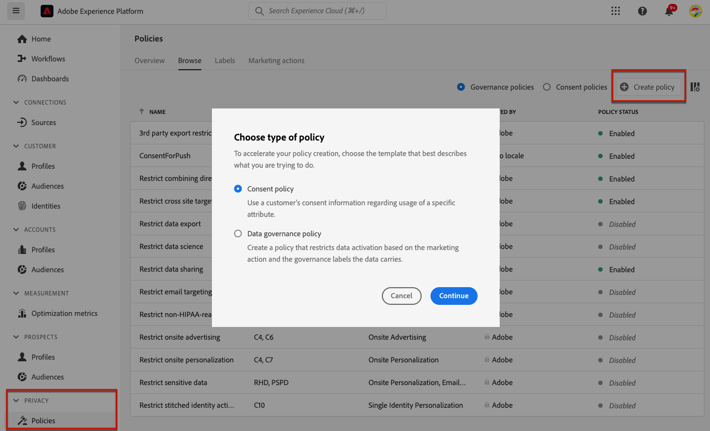
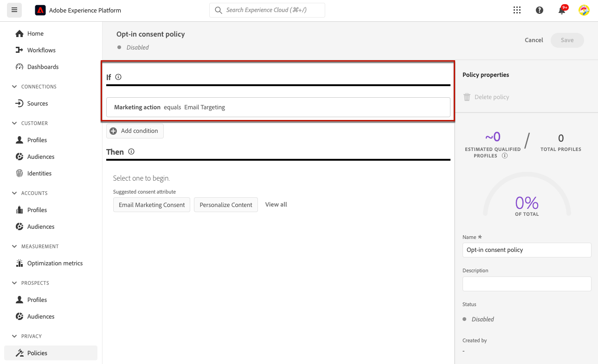
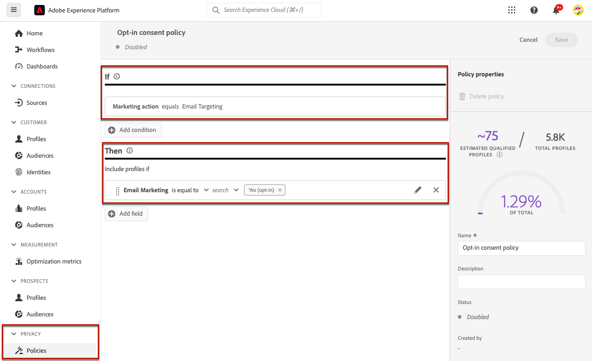
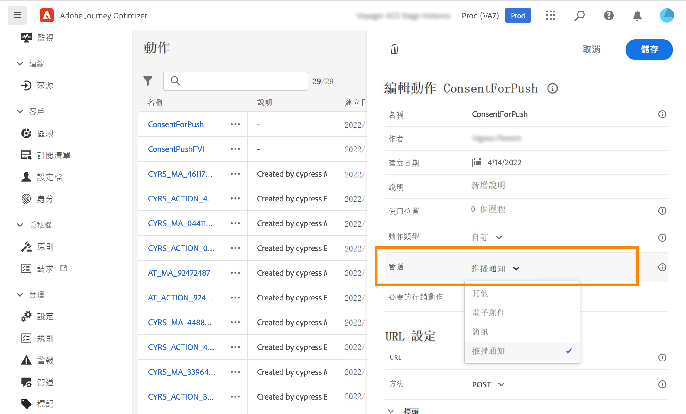
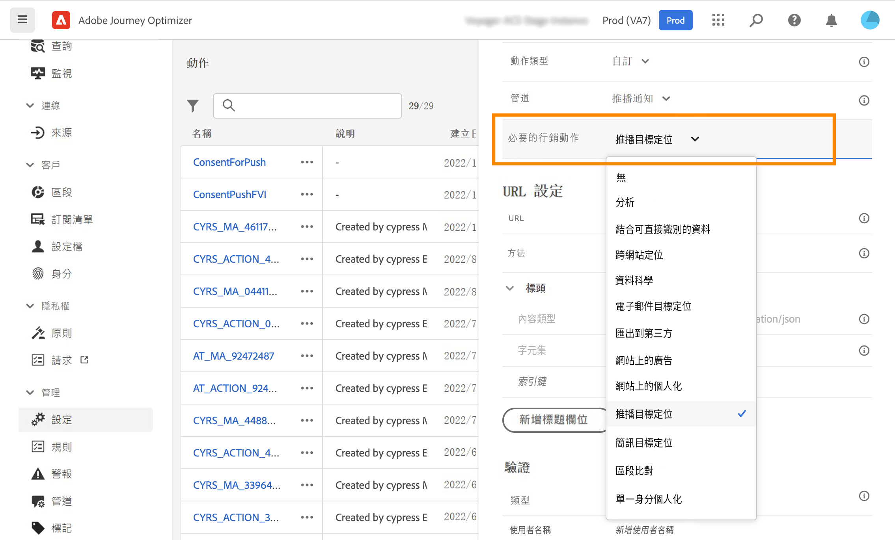
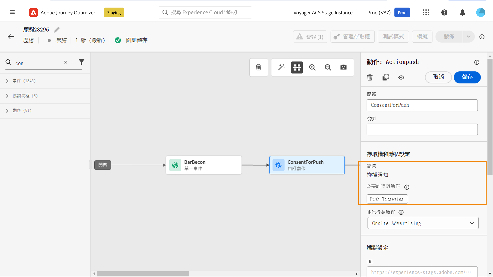
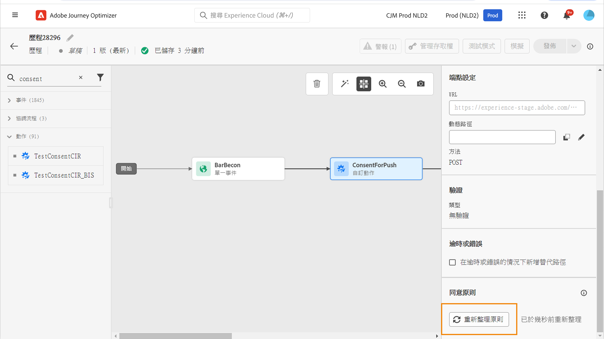

# 使用同意原則 {#consent-management}

您的資料可能受貴組織或法律法規所定義的使用限制所約束。 因此，請務必確保您在Journey Optimizer中的資料作業符合[資料使用原則](https://experienceleague.adobe.com/docs/experience-platform/data-governance/policies/overview.html?lang=zh-Hant){target="_blank"}。 這些原則是 Adobe Experience Platform 規則，定義您可以對資料執行哪些行銷動作。

預設情況下，如果輪廓選擇不接收您的通訊，則相應的輪廓將被排除在後續傳送之外。您可以建立覆寫此預設邏輯的&#x200B;**同意原則**。 例如，您可以在Experience Platform中建立同意原則，以排除尚未同意接收特定頻道通訊的客戶。 如果沒有自訂原則，則套用預設原則。

>[!IMPORTANT]
>
>同意原則目前僅適用已購買 Adobe **Healthcare Shield** 與&#x200B;**隱私權與安全性防護**&#x200B;附加產品的組織。

套用同意原則的主要步驟如下：

1. 在 Adobe Experience Platform 中，建立同意原則與相關聯的行銷動作。[瞭解如何建立同意原則](https://experienceleague.adobe.com/docs/experience-platform/data-governance/policies/user-guide.html?lang=zh-Hant#consent-policy){target="_blank"}

2. 使用管道設定或歷程自訂動作，在Adobe Journey Optimizer中套用同意原則。

   * 建立管道設定與相關聯的行銷動作。使用管道設定建立通訊時，它會繼承已建立關聯的行銷動作，並套用 Adobe Experience Platform 中定義的對應同意原則。[了解如何透過管道設定運用同意原則](#surface-marketing-actions)

   * 在歷程層級，您可以：

      * 在設定自訂動作時，將管道與行銷動作與自訂動作建立關聯。[了解如何在設定自訂動作時運用同意原則](#consent-custom-action)
      * 在歷程中新增自訂動作時，定義其他行銷動作。[了解如何在歷程中新增自訂動作時運用同意原則](#consent-journey)

## 透過管道設定運用同意原則 {#surface-marketing-actions}

請在 [!DNL Journey Optimizer] 中，同意交由體驗平台 [ 同意結構描述 ](https://experienceleague.adobe.com/docs/experience-platform/xdm/field-groups/profile/consents.html?lang=zh-Hant){target="_blank"} 處理。預設情況下，如「同意」欄位值為空，則視為同意接受通訊。 您可以在上線時修改此預設值，成為[這裡](https://experienceleague.adobe.com/docs/experience-platform/xdm/data-types/consents.html?lang=zh-Hant#choice-values){target="_blank"}可能列出的一個值。

若要修改同意欄位值，您可以建立自訂同意原則，在其中定義行銷動作以及執行該動作的條件。[進一步瞭解行銷動作](https://experienceleague.adobe.com/docs/experience-platform/data-governance/policies/overview.html?lang=zh-Hant#marketing-actions){target="_blank"}

例如，如果您想要建立同意原則以僅針對同意接收電子郵件通訊的輪廓，請依照下列步驟操作。

1. 確保您的組織已購買 Adobe **Healthcare Shield** 或者 **Privacy and Security Shield** 附加產品。[了解更多](https://experienceleague.adobe.com/docs/events/customer-data-management-voices-recordings/governance/healthcare-shield.html?lang=zh-Hant){target="_blank"}

1. 在 Adobe Experience Platform 中，建立自訂原則 (從&#x200B;**[!UICONTROL 隱私]**>**[!UICONTROL 政策]**&#x200B;選單)。 [了解作法](https://experienceleague.adobe.com/docs/experience-platform/data-governance/policies/user-guide.html?lang=de#create-policy){target="_blank"}

   <!---->

1. 選擇&#x200B;**[!UICONTROL 同意原則]**&#x200B;按如下所示輸入並設定條件。 [瞭解如何設定同意政策](https://experienceleague.adobe.com/docs/experience-platform/data-governance/policies/user-guide.html?lang=zh-Hant#consent-policy){target="_blank"}

   1. 在&#x200B;**[!UICONTROL 如果]**&#x200B;部分下，選擇&#x200B;**[!UICONTROL 電子郵件目標定位]**&#x200B;預設行銷動作。

      <!---->

      >[!NOTE]
      >
      >Adobe提供的現成核心行銷動作列於[此表格](https://experienceleague.adobe.com/docs/experience-platform/data-governance/policies/overview.html?lang=zh-Hant#core-actions){target="_blank"}。 建立自訂行銷動作的步驟列於[本節](https://experienceleague.adobe.com/docs/experience-platform/data-governance/policies/user-guide.html?lang=zh-Hant#create-marketing-action){target="_blank"}。

   1. 選擇套用的行銷動作時會發生的情況。 在此範例中，選擇&#x200B;**[!UICONTROL 電子郵件行銷同意書]**。

   

1. 儲存並[啟用](https://experienceleague.adobe.com/docs/experience-platform/data-governance/policies/user-guide.html?lang=zh-Hant#enable){target="_blank"}此原則。

1. 在Journey Optimizer中，建立電子郵件通道設定。 [了解作法](../configuration/channel-surfaces.md#create-channel-surface)

1. 在電子郵件設定詳細資料中，選擇&#x200B;**[!UICONTROL 電子郵件目標定位]**&#x200B;行銷動作。

   

該行銷動作相關的所有同意原則都會自動利用，以尊重客戶的偏好設定。

因此，在此範例中，任何[電子郵件](../email/create-email.md)在活動或歷程中使用該設定，只會傳送給同意接收您電子郵件的輪廓。不同意接收電子郵件通訊的輪廓被排除在外。

## 透過自訂動作運用同意政策 {#journey-custom-actions}

### 重要備註 {#important-notes}

在 Journey Optimizer，同意也可在自訂動作中發揮作用。 如果您想將其與內建訊息功能搭配使用，您需使用條件活動來篩選歷程客戶。

同意管理會分析兩種歷程活動：

* 讀取客群：擷取的客群會納入考量。
* 自訂動作：同意管理會考量所使用的屬性 ([動作參數](../action/about-custom-action-configuration.md#define-the-message-parameters))，以及已定義的行銷動作 (必要的行銷動作與其他行銷動作)。
* 不支援使用現成可用聯集結構的欄位群組所屬的屬性。 這些屬性將從介面中隱藏。 您需要使用不同結構描述建立其他欄位群組。
* 僅在自訂動作層級設定行銷動作 (必要或其他) 時，才適用同意原則。

歷程使用的所有其他活動都不會納入考量。 如果您以客群資格篩選開始歷程，則不會將客群納入考量。

在歷程中，如果自訂動作的同意原則排除輪廓，則不會傳送訊息給他，但他會繼續歷程。 當使用條件時，輪廓不會前往逾時與錯誤路徑。

在重新整理位於歷程自訂動作的原則之前，請確定您的歷程無誤。

<!--
There are two types of latency regarding the use of consent policies:

* **User latency**: the delay from the time a profile changes a consent settings to the moment it is applied in Experience Platform. This can take up to 48h. 
* **Consent policy latency**: the delay from the time a consent policy is created or updated to the moment it is applied. This can take up to 6 hours
-->

### 設定自訂動作時運用同意原則{#consent-custom-action}

在設定自訂動作時，可利用兩個欄位進行同意管理。

**管道**&#x200B;欄位可讓您選取與此自訂動作相關的管道。它會以所選頻道的預設行銷動作，預先填入&#x200B;**必要的行銷動作**&#x200B;欄位。如果您選取&#x200B;**其他**，預設情況下不會定義任何行銷動作。 

此&#x200B;**必要的行銷動作**&#x200B;可讓您定義與自訂動作相關的行銷動作。 例如，如果您利用該自訂動作傳送電子郵件，則可選取&#x200B;**電子郵件目標定位**。當使用於歷程時，會擷取並運用與該行銷動作相關聯的所有同意原則。已選取預設行銷動作，但您可按一下向下箭頭，從清單選取任何可用的行銷動作。

對於特定類型的重要通訊 (例如傳送異動訊息以重設用戶端密碼)，您可能不需要套用同意原則。 那麼，您可在&#x200B;**必要行銷動作**&#x200B;欄位選取&#x200B;**無**。

[本節](../action/about-custom-action-configuration.md#consent-management)詳細介紹了設定自訂動作的其他步驟。

### 在歷程中新增自訂動作時運用同意原則 {#consent-journey}

當新增自訂動作至歷程時，您可利用數個選項管理同意。按一下&#x200B;**顯示唯讀欄位**&#x200B;以顯示所有參數。

此&#x200B;**頻道**&#x200B;與在設定自訂動作時定義的&#x200B;**必要的行銷動作**，會顯示在畫面頂端。 您無法修改這些欄位。

您可以定義&#x200B;**其他行銷動作**&#x200B;來設定自訂動作類型。 這可讓您定義此歷程中自訂動作的用途。 除了必要的行銷動作 (通常是頻道專用的) 之外，您還可以定義其他行銷動作，這些動作為此特定歷程中的自訂動作專用。 例如：運動訓練通訊、電子報、健身通訊等。 所需的行銷動作和其他行銷動作皆適用。

按一下畫面下方的&#x200B;**重新整理原則**&#x200B;按鈕，以更新並檢查此自訂動作納入考慮的原則清單。 這僅作為建立歷程時的資訊用途。 在即時歷程，每 6 小時會自動擷取並更新同意原則。

<!--
The following data is taken into account for consent:

* marketing actions and additional marketing actions defined in the custom action
* action parameters defined in the custom action, see this [section](../action/about-custom-action-configuration.md#define-the-message-parameters) 
* attributes used as criteria in a segment when the journey starts with a Read segment, see this [section](../building-journeys/read-audience.md) 

>[!NOTE]
>
>Please note that there can be a latency when updating the list of policies applied, refer to this [this section](../action/consent.md#important-notes).
-->

[本節](../building-journeys/using-custom-actions.md)詳細介紹了在歷程中設定自訂動作的其他步驟。
