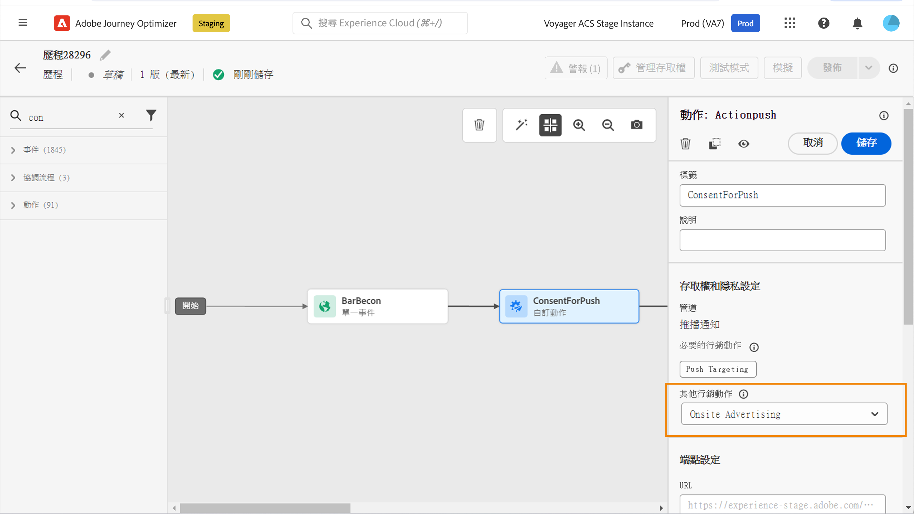

# 使用同意原則 {#consent-management}

您的資料可能受貴組織或法律法規所定義的使用限制所約束。 因此，請務必確保您在 Journey Optimizer 的資料操作符合[資料使用原則](https://experienceleague.adobe.com/docs/experience-platform/data-governance/policies/overview.html?lang=zh-Hant){target="_blank"}. These policies are Adobe Experience Platform rules defining which [marketing actions](https://experienceleague.adobe.com/docs/experience-platform/data-governance/policies/overview.html?lang=zh-Hant#marketing-actions){target="_blank"}，且您可對資料執行操作。

可用的一種資料使用原則類型為&#x200B;**同意原則**。 其可讓您輕鬆採用及強制執行行銷原則，以尊重客戶的同意偏好設定。 [了解更多原則執行](https://experienceleague.adobe.com/docs/experience-platform/data-governance/enforcement/auto-enforcement.html?lang=zh-Hant){target="_blank"}

>[!IMPORTANT]
>
>同意原則目前僅適用已購買 Adobe **Healthcare Shield** 與&#x200B;**隱私權與安全性防護**&#x200B;附加產品的組織。

例如，您可在 Experience Platform [建立同意原則](https://experienceleague.adobe.com/docs/experience-platform/data-governance/policies/user-guide.html?lang=zh-Hant#consent-policy){target="_blank"}，以排除尚未同意接收電子郵件、推播或簡訊通訊的客戶。

<!--* For the native outbound channels (Email, Push, SMS, Direct mail), the logic is as follows:

    * By default, if a profile has opted out from receiving communications from you, the corresponding profile is excluded from subsequent deliveries.

    * If you have the Adobe **Healthcare Shield** or **Privacy and Security Shield**, you can create a custom consent policy that overrides the default logic. For example, you can define a policy to only send email messages to all individuals who have opted in. In the absence of a custom policy, the default policy applies.
    
    To apply a custom policy, you need to define a marketing action in that policy and associate it to a channel surface. [Learn more](#marketing-actions)-->

在 Journey Optimizer 中，您可以將這些同意原則套用至自訂動作。 

* 當您&#x200B;**設定自訂動作**&#x200B;時，您可定義管道與行銷動作。 [了解更多](#consent-custom-action)
* 當您新增&#x200B;**自訂動作至歷程**，您可定義其他行銷動作。 [了解更多](#consent-journey)

<!--

## Leverage consent policies through channel surfaces {#marketing-actions}

In [!DNL Journey Optimizer], consent is handled by the Experience Platform [Consent schema](https://experienceleague.adobe.com/docs/experience-platform/xdm/field-groups/profile/consents.html){target="_blank"}. By default, the value for the consent field is empty and treated as consent to receive your communications. You can modify this default value while onboarding to one of the possible values listed [here](https://experienceleague.adobe.com/docs/experience-platform/xdm/data-types/consents.html#choice-values){target="_blank"}.

To modify the consent field value, you can create a custom consent policy in which you define a marketing action and the conditions under which that action is performed. [Learn more on marketing actions](https://experienceleague.adobe.com/docs/experience-platform/data-governance/policies/overview.html#marketing-actions){target="_blank"}

For example, if you want to create a consent policy to target only profiles who have consented to receive email communications, follow the steps below.

1. Make sure your organization has purchased the Adobe **Healthcare Shield** or **Privacy and Security Shield** add-on offerings. [Learn more](https://experienceleague.adobe.com/docs/events/customer-data-management-voices-recordings/governance/healthcare-shield.html){target="_blank"}

1. In Adobe Experience Platform, create a custom policy (from the **[!UICONTROL Privacy]** > **[!UICONTROL Policies]** menu). [Learn how](https://experienceleague.adobe.com/docs/experience-platform/data-governance/policies/user-guide.html#create-policy){target="_blank"}

    

1. Choose the **[!UICONTROL Consent policy]** type and configure a condition as follows. [Learn how to configure consent policies](https://experienceleague-review.corp.adobe.com/docs/experience-platform/data-governance/policies/user-guide.html#consent-policy){target="_blank"}

    1. Under the **[!UICONTROL If]** section, select the **[!UICONTROL Email Targeting]** default marketing action.

        

        >[!NOTE]
        >
        >The core marketing actions provided out-of-the-box by Adobe are listed in [this table](https://experienceleague.adobe.com/docs/experience-platform/data-governance/policies/overview.html?lang=en#core-actions){target="_blank"}. The steps to create a custom marketing action are listed in [this section](https://experienceleague.adobe.com/docs/experience-platform/data-governance/policies/user-guide.html#create-marketing-action){target="_blank"}.

    1. Select what happens when the marketing action applies. In this example, select **[!UICONTROL Email Marketing Consent]**.

    

1. Save and [enable](https://experienceleague.adobe.com/docs/experience-platform/data-governance/policies/user-guide.html#enable){target="_blank"} this policy.

1. In Journey Optimizer, create an email surface. [Learn how](../configuration/channel-surfaces.md#create-channel-surface)

1. In the email surface details, select the **[!UICONTROL Email Targeting]** marketing action.

    

All consent policies associated with that marketing action are automatically leveraged in order to respect the preferences of your customers.

Therefore, in this example, any [email](../email/create-email.md) using that surface in a campaign or a journey is only sent to the profiles who have consented to receive emails from you. Profiles who have not consented to receive email communications are excluded.-->

## 透過自訂動作運用同意政策 {#journey-custom-actions}

### 重要備註 {#important-notes}

在 Journey Optimizer，您<!--also -->可在自訂動作利用同意。 如果您想將其與內建訊息功能搭配使用，您需使用條件活動來篩選歷程客戶。

同意管理會分析兩種歷程活動：

* 讀取對象：擷取的對象會納入考量。
* 自訂動作：同意管理會考量所使用的屬性 ([動作參數](../action/about-custom-action-configuration.md#define-the-message-parameters))，以及已定義的行銷動作 (必要的行銷動作與其他行銷動作)。
* 不支援使用現成可用聯集結構的欄位群組所屬的屬性。 這些屬性將從介面中隱藏。 您需要使用不同方案建立其他欄位群組。
* 僅在自訂動作層級設定行銷動作 (必要或其他) 時，才適用同意原則。

歷程使用的所有其他活動都不會納入考量。 如果您以對象資格開始歷程，則不會將對象納入考量。

在歷程中，如果自訂動作的同意原則排除設定檔，則不會傳送訊息給他，但他會繼續歷程。 當使用條件時，設定檔不會前往逾時與錯誤路徑。

在重新整理位於歷程自訂動作的原則之前，請確定您的歷程無誤。

<!--
There are two types of latency regarding the use of consent policies:

* **User latency**: the delay from the time a profile changes a consent settings to the moment it is applied in Experience Platform. This can take up to 48h. 
* **Consent policy latency**: the delay from the time a consent policy is created or updated to the moment it is applied. This can take up to 6 hours
-->

### 設定自訂動作 {#consent-custom-action}

>[!CONTEXTUALHELP]
>id="ajo_consent_required_marketing_action"
>title="定義必要的行銷動作"
>abstract="此必要的行銷動作可讓您定義與自訂動作相關的行銷動作。 例如，如果您利用該自訂動作傳送電子郵件，則可選取電子郵件目標定位。當使用於歷程時，會擷取並運用與該行銷動作相關聯的所有同意原則。 無法在畫布修改。"

在設定自訂動作時，可利用兩個欄位進行同意管理。

此&#x200B;**頻道**&#x200B;欄位可讓您選取與此自訂動作相關的頻道：**電子郵件**、**簡訊**&#x200B;或&#x200B;**推播通知**。它會以所選頻道的預設行銷動作，預先填入&#x200B;**必要的行銷動作**&#x200B;欄位。 如果您選取&#x200B;**其他**，預設情況下不會定義任何行銷動作。 

此&#x200B;**必要的行銷動作**&#x200B;可讓您定義與自訂動作相關的行銷動作。 例如，如果您利用該自訂動作傳送電子郵件，則可選取&#x200B;**電子郵件目標定位**。當使用於歷程時，會擷取並運用與該行銷動作相關聯的所有同意原則。已選取預設行銷動作，但您可按一下向下箭頭，從清單選取任何可用的行銷動作。

對於特定類型的重要通訊 (例如傳送異動訊息以重設用戶端密碼)，您可能不需要套用同意原則。 那麼，您可在&#x200B;**必要行銷動作**&#x200B;欄位選取&#x200B;**無**。

[本節](../action/about-custom-action-configuration.md#consent-management)詳細介紹了設定自訂動作的其他步驟。

### 建立歷程 {#consent-journey}

>[!CONTEXTUALHELP]
>id="ajo_consent_required_marketing_action_canvas"
>title="必要行銷動作"
>abstract="在建立自訂動作時會定義必要行銷動作。 無法從動作移除或修改此必要行銷動作。"

>[!CONTEXTUALHELP]
>id="ajo_consent_additional_marketing_action_canvas"
>title="其他行銷動作"
>abstract="除必要行銷動作外，新增其他行銷動作。 將強制執行與這兩個行銷動作相關的同意原則。"

>[!CONTEXTUALHELP]
>id="ajo_consent_refresh_policies_canvas"
>title="視覺化呈現要在執行階段套用的同意原則"
>abstract="行銷動作會引入同意原則，該原則會結合動作參數與個別設定檔同意值，以篩選使用者。 按一下按鈕重新整理，以取得這些原則的最新定義。"

當新增自訂動作至歷程時，您可利用數個選項管理同意。按一下&#x200B;**顯示唯讀欄位**&#x200B;以顯示所有參數。

此&#x200B;**頻道**&#x200B;與在設定自訂動作時定義的&#x200B;**必要的行銷動作**，會顯示在畫面頂端。 您無法修改這些欄位。

您可以定義&#x200B;**其他行銷動作**&#x200B;來設定自訂動作類型。 這可讓您定義此歷程中自訂動作的用途。 除了必要的行銷動作 (通常是頻道專用的) 之外，您還可以定義其他行銷動作，這些動作為此特定歷程中的自訂動作專用。 例如：運動訓練通訊、電子報、健身通訊等。 所需的行銷動作和其他行銷動作皆適用。

按一下畫面下方的&#x200B;**重新整理原則**&#x200B;按鈕，以更新並檢查此自訂動作納入考慮的原則清單。 這僅作為建立歷程時的資訊用途。 在即時歷程，每 6 小時會自動擷取並更新同意原則。

<!--
The following data is taken into account for consent:

* marketing actions and additional marketing actions defined in the custom action
* action parameters defined in the custom action, see this [section](../action/about-custom-action-configuration.md#define-the-message-parameters) 
* attributes used as criteria in a segment when the journey starts with a Read segment, see this [section](../building-journeys/read-audience.md) 

>[!NOTE]
>
>Please note that there can be a latency when updating the list of policies applied, refer to this [this section](../action/consent.md#important-notes).
-->

[本節](../building-journeys/using-custom-actions.md)詳細介紹了在歷程中設定自訂動作的其他步驟。
