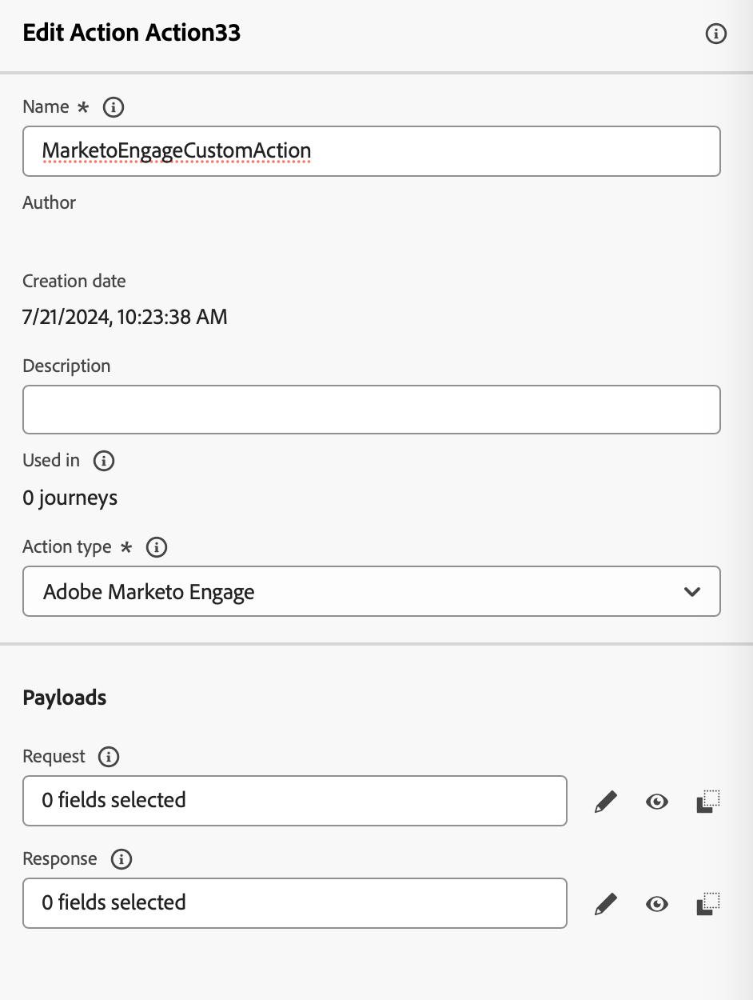
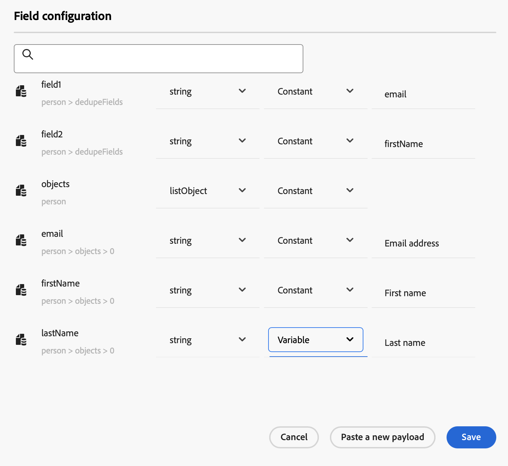
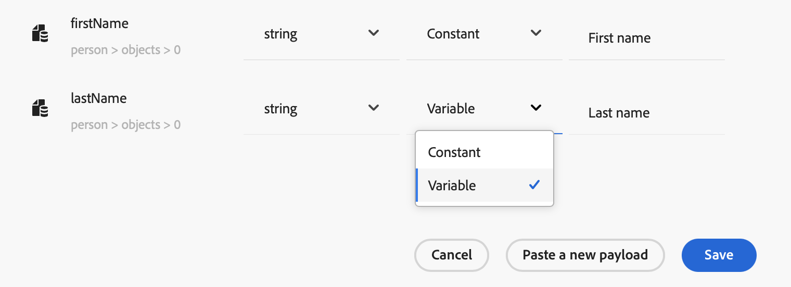
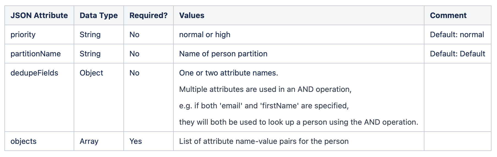
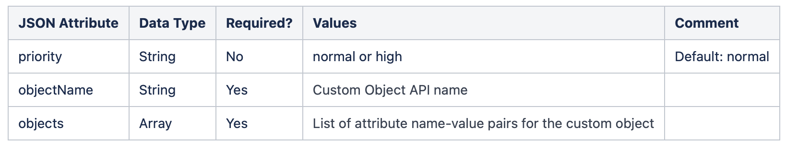
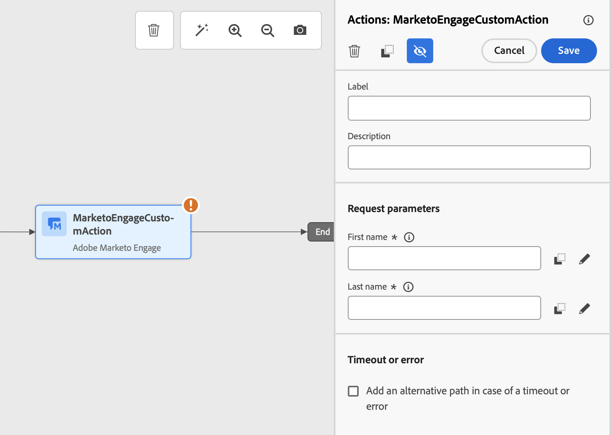

# 與 Marketo Engage 整合 {#integrating-with-marketo-engage}

開始與Marketo Engage無縫資料整合的歷程。 您可在整合Adobe Journey Optimizer和Marketo Engage的歷程中使用特定的自訂動作。 此自訂動作支援擷取兩種關鍵資料型別：

* **人員** （設定檔）： Marketo會將設定檔轉換為可操作的深入分析。
* **自訂物件**：使用自訂物件（例如產品）量身打造您的資料，以提供個人化的行銷方式。

## 先決條件 {#prerequisites}

下列先決條件適用於此整合：

* Marketo Engage的客戶例項必須啟用IMS
* Marketo Engage執行個體和Adobe Experience Platform/Journey Optimizer執行個體必須位於相同組織
* 客戶必須布建&#x200B;**MktoSync：內嵌服務存取**

## 設定動作 {#configure-marketo-action}


在Journey Optimizer中，您必須為Marketo Engage設定自訂動作。 請依照下列步驟操作：

1. 在[管理]功能表區段中選取&#x200B;**[!UICONTROL 組態]**。
1. 在&#x200B;**[!UICONTROL 動作]**&#x200B;區段中，按一下&#x200B;**[!UICONTROL 建立動作]**。 動作設定窗格會在畫面右側開啟。
1. 輸入名稱、說明，然後選取&#x200B;**Adobe Marketo Engage**&#x200B;做為&#x200B;**動作型別**

{width="40%" align="left"}

1. 按一下您的&#x200B;**要求**&#x200B;和&#x200B;**回應**&#x200B;裝載的&#x200B;**編輯裝載**&#x200B;圖示。
1. 針對這兩者，撰寫您的裝載並貼到專用的快顯視窗中。

{width="70%" align="left"}

1. 檢查並設定裝載值

注意：若要以動態方式傳遞值，請針對每個欄位變更&#x200B;**常數**&#x200B;至&#x200B;**變數**。

{width="70%" align="left"}

1. 在[欄位]設定畫面中按一下[儲存]。****，然後按一下[儲存]。****&#x200B;您的自訂動作。

您現在可以在歷程畫布上使用自訂動作。

## 裝載語法 {#payload-syntax}

### 人員



### CustomObject




人員&#x200B;**的**&#x200B;裝載範例

```json
{
   "munchkinID": "388-KKG-245",  
   "person": {
    "priority": "normal",
    "partitionName": "XYZ",
    "dedupeFields": {
      "field1": "email",
      "field2": "firstName"
    },
    "objects": [
      {
        "email": "Email address",
        "firstName": "First name",
        "lastName": "Last name"
      }
    ]
  }
}
```

自訂物件的&#x200B;**裝載範例**

```json
{
  "munchkinID": "388-KKG-245", 
  "customObject": {
    "priority": "normal",
    "objectName": "products",
    "objects": [
      {
        "email": "Email Address",
        "productName": "Product Name",
        "productQty": "Product Quantity",
        "priceTotal": "Price Total"
      }
    ]
  }
}
```


## 使用動作 {#engage-using}

對於已設定的每個動作，歷程設計器浮動視窗中都會提供Marketo Engage動作活動。

若要使用，請依照下列步驟進行：

1. 將自訂動作拖曳至歷程畫布。

1. 輸入此動作的標籤和說明。

1. 在&#x200B;**要求引數**&#x200B;區段中，按一下每個引數的&#x200B;**編輯**&#x200B;圖示，並選取您在裝載中設定的動態值。

{width="70%" align="left"}
