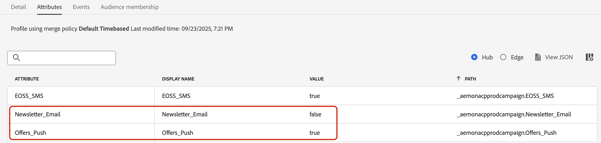

# 管理客戶的偏好設定 {#preference-center}

>[!AVAILABILITY]
>
>此功能目前僅適用於已購買Adobe **Healthcare Shield**&#x200B;或&#x200B;**Privacy and Security Shield**&#x200B;附加產品的組織。

在現代行銷自動化生態系統中，品牌與各個接觸點的客戶互動，面對不相關或過度通訊、導致脫離、垃圾郵件投訴和合規風險的風險。 這就是為什麼他們需要管理客戶的偏好設定，以便獲得對受眾的即時見解，並提供個人化、尊重的溝通。

透過[!DNL Adobe Journey Optimizer]，使用[同意原則](consent.md)，您可以尊重客戶的偏好設定<!-- in terms of **channels** and **topics**-->。 這可確保[!DNL Journey Optimizer]僅根據客戶的選擇<!-- their preferred channels and on the subscription topics-->鎖定客戶，同時尊重他們的同意。

若要使用[!DNL Journey Optimizer]管理您的使用者偏好設定，您可以：

* 擷取客戶針對任何原生傳出頻道選擇加入/退出的同意。 例如，在[!DNL Experience Platform]中建立同意原則，以排除尚未同意接收指定頻道通訊的客戶。 然後使用電子郵件通道設定在[!DNL Journey Optimizer]中套用此同意原則。 [了解作法](consent.md#surface-marketing-actions)

  >[!NOTE]
  >
  >支援的管道包括電子郵件、推播、簡訊和InApp。<!--To check-->

* 請詢問客戶他們願意訂閱哪些主題（例如他們同意或不同意接收的通訊型別）。 [了解作法](#manage-preferences)

>[!IMPORTANT]
>
>同意優先於偏好設定。 例如，您的其中一位客戶指出他們慣用的頻道是電子郵件，並同意接收電子報<!-- they are interested in yoga-->；但是，如果他們選擇不接收來自您的任何通訊，則您傳送的電子郵件電子報無法鎖定他們<!-- on yoga-->。

## 記錄與執行喜好設定 {#manage-preferences}

使用[!DNL Journey Optimizer]中的同意原則，您可以集中管理客戶的偏好設定。 這可讓您確保僅根據客戶選取的主題來鎖定客戶，同時尊重他們的同意選擇。 請依照下列步驟以執行此操作。

假設您想要根據客戶在多個訂閱主題（*電子報*、*優惠*&#x200B;和&#x200B;*新產品上市*）的通訊偏好設定，透過歷程和行銷活動鎖定客戶。

1. 在設定檔層級<!--how??-->使用布林運運算元定義偏好設定屬性。 例如，您可以指定：

   * *Newsletter_Email* — 布林值(true/false)
   * *Offers_Push* — 布林值(True/False)
   * *新產品啟動* — 布林值(True/False)

   這些屬性是在啟用設定檔的[資料集](../data/get-started-datasets.md)的結構描述中擷取，並對應至[整合式客戶設定檔](../audience/get-started-profiles.md)。

   >[!NOTE]
   >
   >客戶同意和聯絡人偏好設定是複雜的主題。 若要瞭解如何在[!DNL Experience Platform]中收集、處理和篩選同意與內容偏好設定，建議您閱讀下列檔案：
   >
   >* 若要瞭解收集同意資料所需的結構描述欄位群組，請參閱[此頁面](https://experienceleague.adobe.com/zh-hant/docs/experience-platform/landing/governance-privacy-security/consent/adobe/overview){target="_blank"}。 其中會詳細說明如何處理您從客戶收集的同意資料，並將其整合至您儲存的客戶設定檔中。
   >* 若要進一步瞭解[同意與偏好設定]欄位群組，請參閱[此頁面](https://experienceleague.adobe.com/zh-hant/docs/experience-platform/xdm/field-groups/profile/consents#ingest){target="_blank"}。
   >* 若要將自訂偏好設定欄位新增到結構描述，請依照[此區段](https://experienceleague.adobe.com/zh-hant/docs/experience-platform/landing/governance-privacy-security/consent/adobe/dataset#custom-consent){target="_blank"}中的步驟操作。

1. 建立頁面以擷取您客戶的偏好設定。 請使用下列其中一種方法：

   * 使用[Adobe Experience Platform Web SDK](https://experienceleague.adobe.com/zh-hant/docs/experience-platform/web-sdk/home){target="_blank"}建立網頁以記錄客戶的偏好設定。

   * 使用包含表單的[!DNL Journey Optimizer] [登陸頁面](../landing-pages/create-lp.md)，透過設定檔資料擷取客戶的偏好設定。  [進一步瞭解表單](../landing-pages/lp-forms.md) <!--Forms not released/announced yet - TBC-->

     >[!NOTE]
     >
     >確定使用的登入頁面網域屬於上層品牌，而非子品牌。 事實上，收集的偏好設定會儲存在設定檔資料中，而且位於品牌的最高級別。

1. 在此頁面上，客戶可以選取或取消選取核取方塊來更新其偏好設定，例如依主題訂閱。

   每個動作會透過將資料擷取至啟用設定檔的資料集結構描述`true`，觸發針對對應設定檔屬性（`false`針對選擇加入，<!-- that contains the corresponding preference fields-->針對選擇退出）儲存的同意事件。

   <!--Record your users' preferences through the web page or landing page that you created. The data is saved against the corresponding profile, meaning that the preference data is ingested into a Profile-enabled dataset whose schema contains consent/preference fields.-->

   例如，使用者<!--whose email address is john.black@lumamail.com-->同意接收推播優惠，但不想接收電子郵件電子報。 對應的設定檔會更新如下：

   {width=80%}

<!--The corresponding profile dataset is updated as follows:

|Attribute = Email id | Attribute = Offers_Push | Attribute = Newsletters_Email |
|---------|----------|---------|
| john.black@lumamail.com | Y | N |-->

    >[！NOTE]
    >
    >傳入的同意事件會傳入客戶設定檔，確保即時更新。 每個設定檔都會反映其在訂閱偏好設定中的最新選擇。

1. 在 Adobe Experience Platform 中，建立自訂原則 (從&#x200B;**[!UICONTROL 隱私]**>**[!UICONTROL 政策]**&#x200B;選單)。 [了解作法](https://experienceleague.adobe.com/docs/experience-platform/data-governance/policies/user-guide.html?lang=de#create-policy){target="_blank"}

   >[!AVAILABILITY]
   >
   >同意原則目前僅適用於已購買Adobe **Healthcare Shield**&#x200B;或&#x200B;**Privacy and Security Shield**&#x200B;附加產品的組織。 [進一步瞭解同意原則](consent.md)

   若要使用同意原則，設定檔資料中必須存在偏好設定屬性。 這就是您必須在設定檔層次定義這些屬性的原因（如步驟1所述）。

1. 選擇&#x200B;**[!UICONTROL 同意原則]**&#x200B;按如下所示輸入並設定條件。 [瞭解如何設定同意原則](https://experienceleague.adobe.com/docs/experience-platform/data-governance/policies/user-guide.html?lang=zh-Hant#consent-policy){target="_blank"}

<!--Consent policies are comprised of two logical components:

* **If**: The condition that will trigger the policy check, based on a certain marketing action (email, SMS, push, custom action, etc.) being performed, the presence of certain data usage labels, or a combination of the two.

* **Then**: The consent attribute must be present for a profile to be included in the action that triggered the policy. More than one field can also be selected.-->

    例如，若要只傳送通訊給未選擇不接收電子郵件電子報的客戶，請建立自訂原則並定義下列條件： 
    
    *如果&#x200B;**[!UICONTROL 行銷動作]**&#x200B;等於&#x200B;**[!UICONTROL 電子郵件]**
    
    *則&#x200B;**[!UICONTROL Newsletter_Email]**&#x200B;不存在&#x200B;**[!UICONTROL false]**&#x200B;或&#x200B;**[!UICONTROL Newsletter_Email]**&#x200B;不等於&#x200B;**[!UICONTROL false]**
    
    ！[&#128279;](assets/consent-policy-email-newsletter.png){width=80%}
    
    >[！TIP]
    >
    >啟用設定檔的資料集必須包含設定檔屬性&#x200B;**[!UICONTROL Newsletter_Email]**，且值設定為&#39;true&#39; （如步驟1中所述）

1. 建立同意原則後，請使用[!DNL Journey Optimizer]通道設定[或](consent.md#surface-marketing-actions)歷程自訂動作[，在](consent.md#journey-custom-actions)中運用它。

1. 現在，您可以在歷程及行銷活動中使用這些管道設定或自訂動作，以確保您的<!--targeted-->客戶偏好設定獲得尊重。
