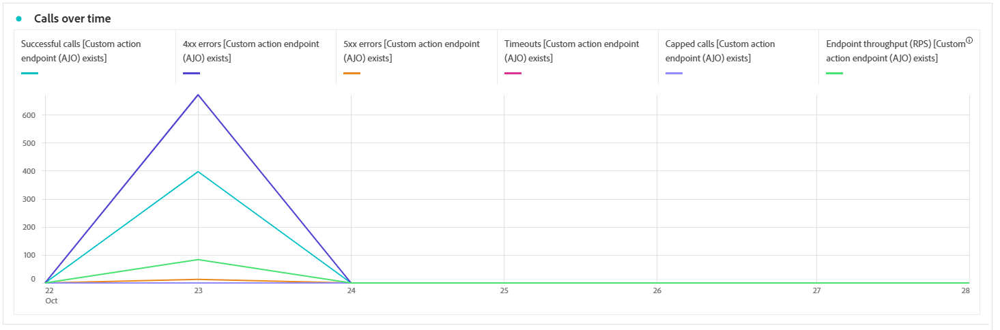
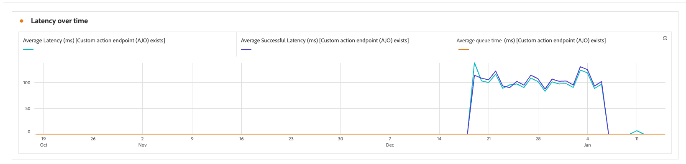
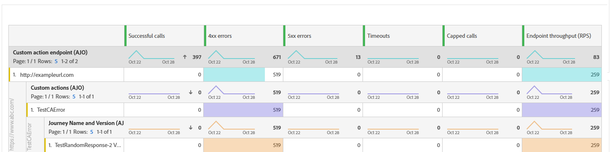
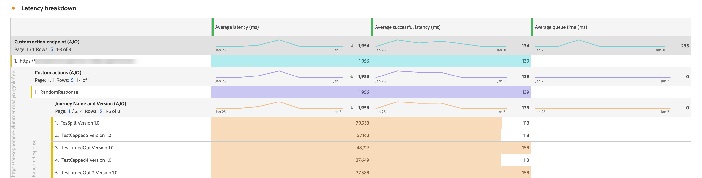

# 監視自訂動作 {#reporting}

>[!CONTEXTUALHELP]
>id="ajo_campaigns_custom_actions_monitor"
>title="監視自訂動作"
>abstract="**[!UICONTROL 自訂動作]**&#x200B;報告頁面可讓您追蹤歷程對協力廠商系統發出的API呼叫效能和可靠性。"

**[!UICONTROL 自訂動作]**&#x200B;報告頁面可讓您監視從歷程對第三方系統發出的API呼叫的可靠性和效能。 這些報告可協助您快速識別可能影響傳送的整合問題、延遲瓶頸或節流/上限限制。

「自訂動作」報表頁面的功能與Journey Optimizer中的其他所有時間報表相同。 如需儀表板功能的詳細資訊，請參閱[本檔案](../reports/report-cja-manage.md)。

若要存取&#x200B;**[!UICONTROL 自訂動作]**&#x200B;報告頁面，請從您的動作&#x200B;**[!UICONTROL 首頁中按一下]**。

➡️ [進一步瞭解自訂動作組態](../action/about-custom-action-configuration.md)

除了&#x200B;**[!UICONTROL 自訂動作]**&#x200B;報告頁面之外，您也可以使用&#x200B;**[!DNL Adobe Experience Platform Query Service]**&#x200B;來建置查詢，以報告自訂動作效能測量結果。 [此區段](../reports/query-examples.md)中有查詢範例。

## KPI {#kpis}

**[!UICONTROL 自訂動作]**&#x200B;關鍵績效指標(KPI)可作為集中式儀表板，提供自訂動作呼叫的運作狀況與可靠性的整合檢視。 這些量度可讓您評估效能、找出瓶頸，並確保與外部系統的穩定整合。

+++ 進一步瞭解自訂動作KPI

* **[!UICONTROL 成功的呼叫]**：傳回有效回應且沒有錯誤的HTTP呼叫總數。

* **[!UICONTROL 4xx/5xx錯誤]**：由於使用者端(4xx)或伺服器端(5xx)錯誤，強調設定問題或端點失敗而失敗的呼叫數目。

* **[!UICONTROL 逾時]**：因超過最大回應時間而失敗的呼叫數。 這有助於顯示外部端點的延遲或效能問題。

* **[!UICONTROL 已設定上限]**：由於上限限制而被封鎖的呼叫數目，可確保下游系統不會超載。

* **[!UICONTROL 平均RPS]**：在選取的時間範圍內，自訂動作每秒處理的要求數目。

* **[!UICONTROL 平均延遲]**：所有HTTP呼叫的平均端對端回應時間（以毫秒為單位），包括成功的呼叫、錯誤和逾時。

* **[!UICONTROL 平均成功延遲]**：僅成功呼叫的平均端對端回應時間（毫秒），不包括失敗的要求與逾時。

* **[!UICONTROL 平均佇列時間]**：呼叫在傳送之前在執行佇列中等待的平均時間（毫秒）。 這僅適用於節流端點，當達到輸送量限制時，Journey Optimizer會將呼叫排入佇列。

+++

## 一段時間內的通話 {#calls}

**[!UICONTROL 一段時間內的呼叫]**&#x200B;圖表顯示報告所選時段內的HTTP呼叫KPI趨勢。 時間序列的詳細程度取決於所選的時間範圍。 例如：

* 對於7天報表，每個資料點都會顯示一天的KPI。
* 如果您選取1天時間範圍，圖表會顯示每小時的KPI。
* 如果您選取1小時時間範圍，圖表將顯示每分鐘的KPI。

➡️[如需HTTP呼叫量度的說明，請參閱KPI區段](#kpis)

## 一段時間的延遲 {#latency-overtime}

**[!UICONTROL 一段時間內的延遲]**&#x200B;圖表可顯示所選時段內的延遲量度趨勢。 此時間序列檢視可讓您追蹤效能模式、識別尖峰延遲期間，以及監視最佳化或系統變更隨時間流逝的影響。

➡️[如需延遲量度的說明，請參閱KPI區段](#kpis)

## 呼叫劃分 {#breakdown}

**[!UICONTROL 呼叫劃分]**&#x200B;表格提供HTTP呼叫量度的階層式劃分，從最上層每個端點的整體量度，到使用每個端點的每個自訂動作的量度，再到最底層依賴這些量度的歷程。

➡️[如需HTTP呼叫量度的說明，請參閱KPI區段](#kpis)

## 延遲劃分 {#latency-breakdown}

**[!UICONTROL 延遲劃分]**&#x200B;表格提供自訂動作延遲量度的詳細劃分。 此檢視可協助您識別哪些特定端點或動作發生效能問題，讓您有效找出並解決延遲瓶頸。

➡️[如需延遲量度的說明，請參閱KPI區段](#kpis)

