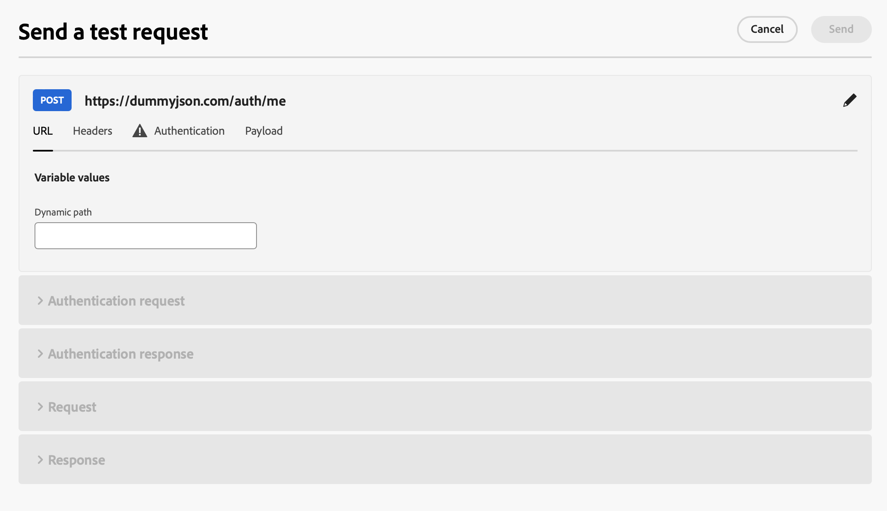
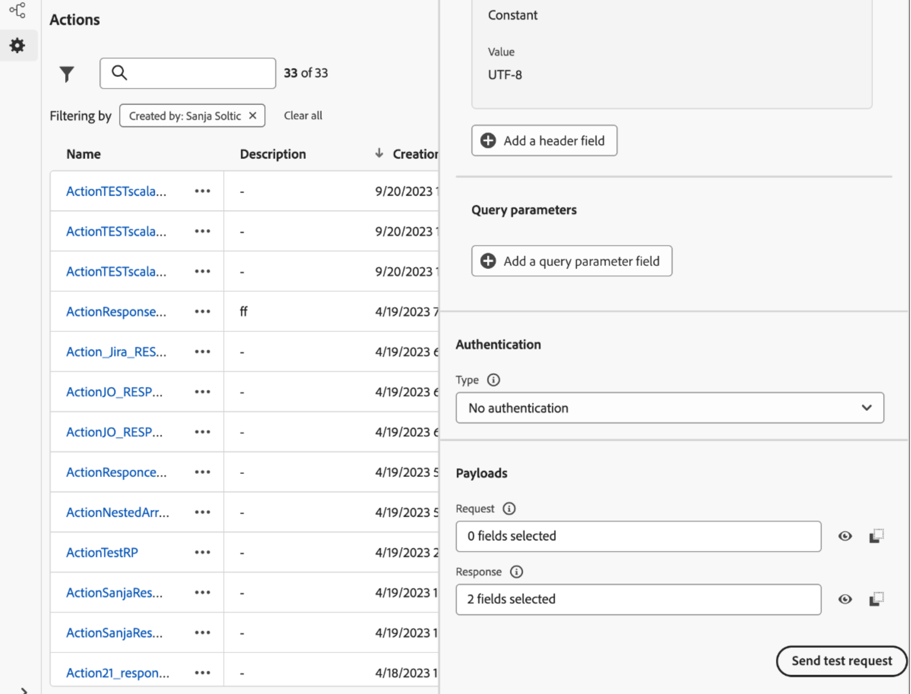

# 疑難排解自訂動作 {#troubleshoot-a-custom-action}

您可以從Journey Optimizer使用者介面的管理區段傳送API呼叫，以測試自訂動作。 此功能可協助您在歷程中使用自訂動作之前或之後，進行疑難排解。

作為管理員，使用&#x200B;**[!UICONTROL 傳送測試要求]**&#x200B;功能，直接從Adobe Journey Optimizer發出真正的API呼叫，以驗證您的自訂動作設定。 此功能可確保請求結構、標頭、驗證和裝載的格式正確，然後才會用於歷程中。

{width="70%" align="left"}

此功能可簡化測試和驗證程式，確保自訂動作在即時歷程中正常運作。

## 先決條件 {#troubleshoot-custom-action-prereq}

若要使用&#x200B;**[!UICONTROL 傳送測試要求]**&#x200B;功能，**自訂動作**&#x200B;必須預先設定URL、標頭和驗證設定。

管理員若要使用此功能，需要下列許可權：

* 使用者必須有&#x200B;**[!DNL Manage journeys events, data sources and actions]**&#x200B;許可權。
* 此許可權包含在&#x200B;*歷程管理員*&#x200B;角色中。
* 僅使用&#x200B;**[!DNL View journeys events]**&#x200B;許可權是不夠的。

在[本節](../administration/high-low-permissions.md#journey-capability)中進一步瞭解歷程許可權。

## 如何使用傳送測試請求功能 {#troubleshoot-custom-action-use}

若要測試自訂動作，請遵循下列步驟：

1. 導覽至&#x200B;**動作**&#x200B;設定畫面，然後選取自訂動作。
1. 按一下動作設定畫面底部的&#x200B;**[!UICONTROL 傳送測試要求]**&#x200B;按鈕。
   {width="70%" align="left"}
1. 在快顯視窗中，允許您指定請求引數：

   * 如果&#x200B;**自訂動作方法是GET**，則不需要裝載。
   * 如果&#x200B;**自訂動作方法是POST**，您必須提供JSON裝載。

     >[!NOTE]
     >
     >如果此JSON的結構不正確，Adobe Journey Optimizer會引發錯誤；但如果資料型別不相符，則不會引發。 例如，若將整數引數用於字串，則不會發生錯誤。

   * 如果已定義驗證，系統將提示您輸入驗證詳細資訊。

1. 按一下&#x200B;**傳送**&#x200B;以執行要求。
1. 來自API的回應（包括標題和狀態代碼）將顯示在介面中。

## 驗證處理 {#troubleshoot-custom-action-auth}

當自訂動作包含驗證時，Adobe Journey Optimizer會要求使用者為每個測試請求輸入驗證詳細資訊：

* **基本驗證：**&#x200B;使用者必須提供&#x200B;*密碼*。
* **API金鑰驗證：**&#x200B;使用者必須輸入API金鑰&#x200B;*值*。
* **自訂驗證：**&#x200B;使用者必須在要求&#x200B;*bodyParam*&#x200B;中提供驗證引數。 在此案例中新增了兩個區段： **驗證要求**&#x200B;和&#x200B;**驗證回應**。

## 主要優點 {#troubleshoot-custom-action-benefits}

身為Journey Optimizer管理員，您也可以使用外部工具(例如Postman)來測試自訂動作。 以下列出產品內故障診斷功能與外部測試相比的主要優點：

* 測試要求是由&#x200B;**AJO歷程**&#x200B;執行，表示：

   * 系統會使用確切的請求結構(包括Adobe Journey Optimizer專屬標頭)。
   * 來源IP和標題與即時歷程中使用的相符。

* **[!UICONTROL 傳送測試要求]**&#x200B;功能可用於疑難排解&#x200B;**即時歷程**，因為已部署自訂動作。

* 此產品內測試功能消除了在工具之間手動複製設定詳細資訊的需求，降低錯誤風險。

## 疑難排解 {#troubleshoot-custom-action-check}

如果請求失敗，您可以檢查：

* 在測試中輸入的驗證認證。
* 要求方法(GET與POST的比較)和對應的裝載。
* 自訂動作中定義的API端點和標題。
* 使用回應資料來識別可能的設定錯誤。
