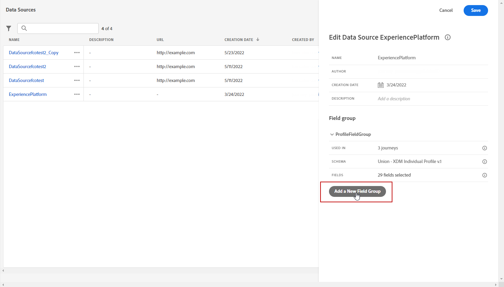
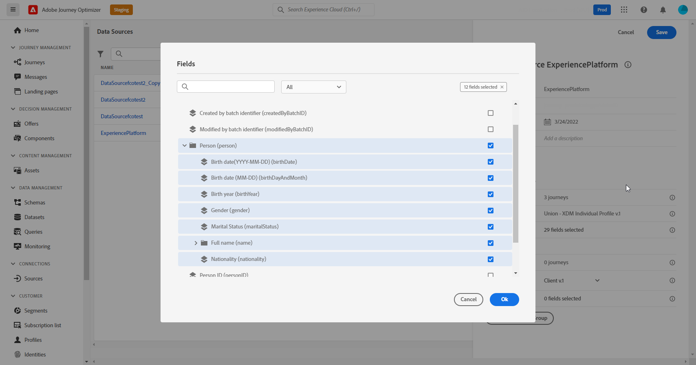
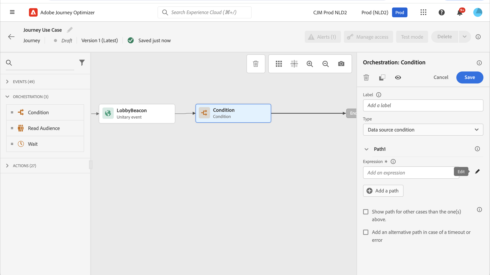
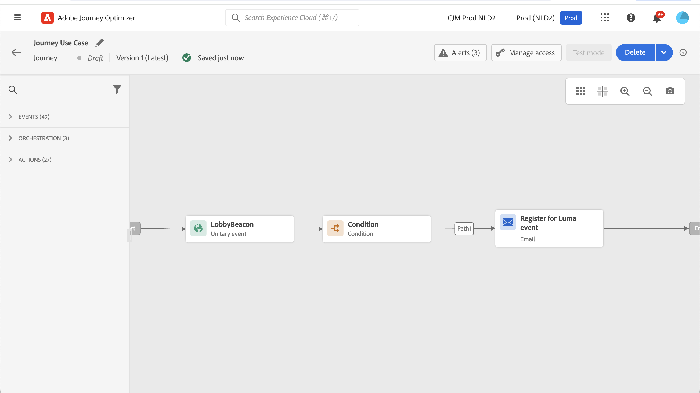

# 屬性型存取控制 {#attribute-based-access}

以屬性為基礎的存取控制功能可讓您定義授權，以管理特定團隊或使用者群組的資料存取。 其目的在於保護敏感數位資產免受未經授權使用者的攻擊，進一步保護個人資料。

在Adobe Journey Optimizer中使用以屬性為基礎的存取控制，以保護資料並授與特定欄位元素的特定存取權，包括體驗資料模型(XDM)結構描述、設定檔屬性和對象。

如需屬性式存取控制中所使用術語的詳細清單，請參閱[Adobe Experience Platform檔案](https://experienceleague.adobe.com/docs/experience-platform/access-control/abac/overview.html?lang=zh-Hant){target="_blank"}。

在此範例中，標籤已新增至&#x200B;**國籍**&#x200B;結構描述欄位，以限制未經授權的使用者使用它。 若要讓此功能發揮作用，請執行以下步驟：

1. 建立新的&#x200B;**[!UICONTROL 角色]**，並將它指派給對應的&#x200B;**[!UICONTROL 標籤]**，讓使用者能夠存取和使用結構描述欄位。

1. 將&#x200B;**[!UICONTROL 標籤]**&#x200B;指派給Adobe Experience Platform中的&#x200B;**國籍**&#x200B;結構描述欄位。

1. 使用Adobe Journey Optimizer中的&#x200B;**[!UICONTROL 結構描述欄位]**。

請注意，也可以使用屬性式存取控制API來存取&#x200B;**[!UICONTROL 角色]**、**[!UICONTROL 原則]**&#x200B;和&#x200B;**[!UICONTROL 產品]**。 如需詳細資訊，請參閱此[檔案](https://experienceleague.adobe.com/docs/experience-platform/access-control/abac/abac-api/overview.html?lang=zh-Hant){target="_blank"}。

## 建立角色並指派標籤 {#assign-role}

>[!IMPORTANT]
>
>&#x200B;>在管理角色的許可權之前，請先建立原則。 如需詳細資訊，請參閱 [Adobe Experience Platform 文件](https://experienceleague.adobe.com/docs/experience-platform/access-control/abac/permissions-ui/policies.html?lang=zh-Hant){target="_blank"}。

**[!UICONTROL 角色]**&#x200B;是一組使用者，在您的組織內共用相同的許可權、標籤和沙箱。 屬於&#x200B;**[!UICONTROL 角色]**&#x200B;的每個使用者都有權使用產品中包含的Adobe應用程式和服務。 您也可以建立自己的&#x200B;**[!UICONTROL 角色]**，以微調使用者對介面中特定功能或物件的存取權。

若要授與選取的使用者對標示為C2的&#x200B;**國籍**&#x200B;欄位的存取權，請建立具有特定使用者集的新&#x200B;**[!UICONTROL 角色]**，並授與他們標籤C2，以允許他們在&#x200B;**歷程**&#x200B;中使用&#x200B;**[!UICONTROL 國籍]**&#x200B;詳細資料。

1. 從[!DNL Permissions]產品中，從左窗格功能表選取&#x200B;**[!UICONTROL 角色]**，然後按一下&#x200B;**[!UICONTROL 建立角色]**。 請注意，您也可以將&#x200B;**[!UICONTROL 標籤]**&#x200B;新增至內建角色。

   

1. 新增&#x200B;**[!UICONTROL Name]**&#x200B;和&#x200B;**[!UICONTROL Description]**&#x200B;到您新的&#x200B;**[!UICONTROL 角色]**，此處：限制角色人口統計。

1. 從下拉式清單中，選取您的&#x200B;**[!UICONTROL 沙箱]**。

   

1. 從&#x200B;**[!UICONTROL 資源]**&#x200B;功能表，按一下&#x200B;**[!UICONTROL Adobe Experience Platform]**&#x200B;以開啟其他功能。 在此，我們選取&#x200B;**[!UICONTROL 歷程]**。

   

1. 從下拉式清單中，選取連結至所選功能的&#x200B;**[!UICONTROL 許可權]**，例如&#x200B;**[!UICONTROL 檢視歷程]**&#x200B;或&#x200B;**[!UICONTROL 發佈歷程]**。

   

1. 儲存您新建立的&#x200B;**[!UICONTROL 角色]**&#x200B;後，按一下&#x200B;**[!UICONTROL 屬性]**&#x200B;以進一步設定角色的存取權。

   

1. 從&#x200B;**[!UICONTROL 使用者]**&#x200B;索引標籤，按一下&#x200B;**[!UICONTROL 新增使用者]**。

   

1. 從&#x200B;**[!UICONTROL 標籤]**&#x200B;索引標籤中，選取&#x200B;**[!UICONTROL 新增標籤]**。

   

1. 選取您要新增至角色的&#x200B;**[!UICONTROL 標籤]**，然後按一下[儲存]。**&#x200B;** 在此範例中，授予標籤C2給使用者，以存取先前限制的結構描述欄位。

   

**受限制角色人口統計**&#x200B;角色中的使用者現在可以存取C2標籤的物件。

## 將標籤指派給Adobe Experience Platform中的物件 {#assign-label}

>[!WARNING]
>
>不正確的標籤使用方式可能會中斷人員的存取權並觸發原則違規。

**[!UICONTROL 標籤]**&#x200B;可用於使用屬性式存取控制來指派特定功能區域。 在此範例中，存取&#x200B;**國籍**&#x200B;欄位受到限制。 此欄位僅供擁有對應指派給其&#x200B;**[!UICONTROL 角色]**&#x200B;的&#x200B;**[!UICONTROL 標籤]**&#x200B;的使用者存取。

請注意，您也可以將&#x200B;**[!UICONTROL 標籤]**&#x200B;新增至&#x200B;**[!UICONTROL 結構描述]**、**[!UICONTROL 資料集]**&#x200B;和&#x200B;**[!UICONTROL 對象]**。

1. 建立您的&#x200B;**[!UICONTROL 結構描述]**。 如需詳細資訊，請參閱[此檔案](https://experienceleague.adobe.com/docs/experience-platform/xdm/schema/composition.html?lang=zh-Hant){target="_blank"}。

   

1. 在新建立的&#x200B;**[!UICONTROL 結構描述]**&#x200B;中，我們先新增包含&#x200B;**[!UICONTROL 國籍]**&#x200B;欄位的&#x200B;**人口統計詳細資料**&#x200B;欄位群組。

   

1. 從&#x200B;**[!UICONTROL 標籤]**&#x200B;索引標籤，在此處&#x200B;**國籍**&#x200B;檢查受限制的欄位名稱。 然後，從右窗格功能表中選取&#x200B;**[!UICONTROL 編輯治理標籤]**。

   

1. 選取對應的&#x200B;**[!UICONTROL 標籤]**，在此例中，C2 — 資料無法匯出至協力廠商。 如需可用標籤的詳細清單，請參閱[此頁面](https://experienceleague.adobe.com/docs/experience-platform/data-governance/labels/reference.html?lang=zh-Hant#contract-labels){target="_blank"}。

   

1. 視需要進一步個人化您的結構描述，然後啟用它。 如需如何啟用結構描述的詳細步驟，請參閱此[頁面](https://experienceleague.adobe.com/docs/experience-platform/xdm/ui/resources/schemas.html?lang=zh-Hant#profile){target="_blank"}。

現在，您結構描述的欄位將僅對屬於以C2標籤設定的角色的使用者可見及使用。 藉由將&#x200B;**[!UICONTROL 標籤]**&#x200B;套用至您的&#x200B;**[!UICONTROL 欄位名稱]**，**[!UICONTROL 標籤]**&#x200B;將自動套用至每個已建立結構描述中的&#x200B;**國籍**&#x200B;欄位。

## 存取Adobe Journey Optimizer中標籤的物件 {#attribute-access-ajo}

在新結構描述和角色中標示&#x200B;**國籍**&#x200B;欄位名稱后，可在Adobe Journey Optimizer中觀察到此限制的影響。 在此範例中：

* 使用者X可以存取標示為C2的物件，建立條件以受限制的&#x200B;**[!UICONTROL 欄位名稱]**&#x200B;為目標的歷程。
* 使用者Y沒有存取標示為C2的物件的許可權，會嘗試發佈歷程。

1. 從Adobe Journey Optimizer中，使用新結構描述設定&#x200B;**[!UICONTROL 資料來源]**。

   

1. 將您新建立的&#x200B;**[!UICONTROL 結構描述]**&#x200B;的新&#x200B;**[!UICONTROL 欄位群組]**&#x200B;新增至內建&#x200B;**[!UICONTROL 資料來源]**。 您也可以建立新的外部&#x200B;**[!UICONTROL 資料來源]**&#x200B;和相關聯的&#x200B;**[!UICONTROL 欄位群組]**。

   

1. 選取您先前建立的&#x200B;**[!UICONTROL 結構描述]**&#x200B;後，從&#x200B;**[!UICONTROL 欄位]**&#x200B;類別中按一下&#x200B;**[!UICONTROL 編輯]**。

   

1. 選取您要鎖定的&#x200B;**[!UICONTROL 欄位名稱]**。 我們在這裡選取限制的&#x200B;**國籍**&#x200B;欄位。

   

1. 建立歷程，以傳送電子郵件給具有特定國籍的使用者。 新增&#x200B;**[!UICONTROL 事件]**&#x200B;和&#x200B;**[!UICONTROL 條件]**。

   

1. 選取受限制的&#x200B;**國籍**&#x200B;欄位，以開始建立您的運算式。

   

1. 編輯您的&#x200B;**[!UICONTROL 條件]**，以使用受限制的&#x200B;**國籍**&#x200B;欄位鎖定特定母體。

   

1. 視需要個人化您的歷程，我們在這裡新增&#x200B;**[!UICONTROL 電子郵件]**&#x200B;動作。

   

如果使用者Y （沒有標籤C2物件的存取權）需要使用受限制的欄位存取此歷程：

* 使用者Y將無法使用受限制的欄位名稱，因為它將不可見。
* 使用者Y將無法以進階模式編輯具有受限制欄位名稱的運算式。 將會出現下列錯誤： `The expression is invalid. Field is no longer available or you do not have enough permission to see it`。
* 使用者Y可以刪除運算式。
* 使用者Y將無法測試歷程。
* 使用者Y將無法發佈歷程。