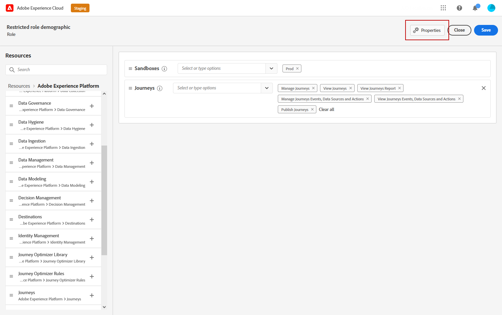
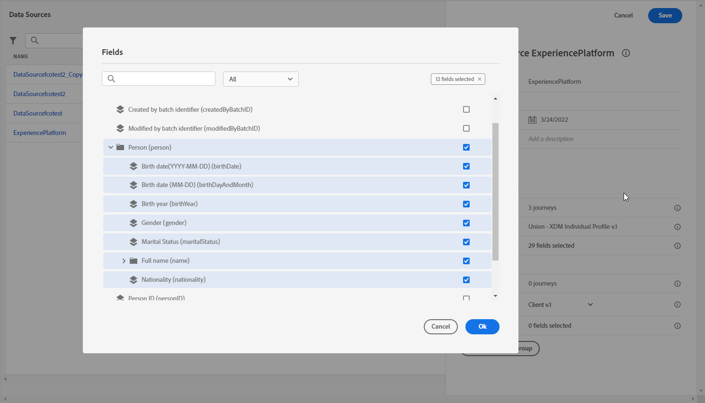

# 以屬性為基礎的存取控制 {#attribute-based-access}

屬性型存取控制(ABAC)可讓您定義管理特定團隊或使用者群組之資料存取的授權。 其目的在於保護敏感數位資產，使其免受未經授權使用者的侵害，進而進一步保護個人資料。

在Adobe Journey Optimizer中，ABAC可讓您保護資料並授予特定欄位元素的特定存取權，包括體驗資料模型(XDM)結構描述、設定檔屬性和區段。

如需ABAC所用術語的詳細清單，請參閱 [Adobe Experience Platform檔案](https://experienceleague.adobe.com/docs/experience-platform/access-control/abac/overview.html).

在此範例中，我們想要將標籤新增至 **國籍** 結構描述欄位，可限制未經授權的使用者使用該欄位。 為了讓此功能發揮作用，您需要執行下列步驟：

1. 建立新的  **[!UICONTROL 角色]** 並將其指派給對應的  **[!UICONTROL 標籤]** 讓使用者能夠存取和使用結構描述欄位。

1. 指派  **[!UICONTROL 標籤]** 至 **國籍** Adobe Experience Platform中的結構描述欄位。

1. 使用  **[!UICONTROL 結構描述欄位]** 在Adobe Journey Optimizer中。

請注意 **[!UICONTROL 角色]**， **[!UICONTROL 原則]** 和 **[!UICONTROL 產品]** 也可以使用屬性型存取控制API來存取。 如需詳細資訊，請參閱此 [檔案](https://experienceleague.adobe.com/docs/experience-platform/access-control/abac/abac-api/overview.html).

## 建立角色並指派標籤 {#assign-role}

>[!IMPORTANT]
>
>在管理角色的許可權之前，您將首先需要建立原則。 有關詳細資訊，請參閱 [Adobe Experience Platform檔案](https://experienceleague.adobe.com/docs/experience-platform/access-control/abac/permissions-ui/policies.html).

**[!UICONTROL 角色]** 是一組使用者，在您的組織內共用相同的許可權、標籤和沙箱。 每個使用者屬於一個 **[!UICONTROL 角色]** 有權使用產品中包含的Adobe應用程式和服務。
您也可以建立自己的 **[!UICONTROL 角色]** 如果您想要微調使用者對介面中特定功能或物件的存取權。

我們現在想要授與選取的使用者對的存取權 **國籍** 欄位，標示為C2。 為此，我們需要建立新的 **[!UICONTROL 角色]** ，並授予他們標籤C2，讓他們能夠使用 **國籍** 中的詳細資訊 **[!UICONTROL 歷程]**.

1. 從 [!DNL Permissions] 產品，選取 **[!UICONTROL 角色]** 從左窗格功能表並按一下 **[!UICONTROL 建立角色]**. 請注意，您也可以新增 **[!UICONTROL 標籤]** 至內建角色。

   

1. 新增 **[!UICONTROL 名稱]** 和 **[!UICONTROL 說明]** 至您的新增 **[!UICONTROL 角色]**，此處：限制角色人口統計。

1. 從下拉式清單中，選取 **[!UICONTROL Sandbox]**.

   

1. 從 **[!UICONTROL 資源]** 功能表，按一下 **[!UICONTROL Adobe Experience Platform]** 以開啟不同的功能。 在此，我們選取 **[!UICONTROL 歷程]**.

   

1. 從下拉式清單中選取 **[!UICONTROL 許可權]** 連結至選取的特徵，例如 **[!UICONTROL 檢視歷程]** 或 **[!UICONTROL 發佈歷程]**.

   

1. 儲存您新建立的檔案後 **[!UICONTROL 角色]**，按一下 **[!UICONTROL 屬性]** 以進一步設定對您角色的存取權。

   

1. 從 **[!UICONTROL 使用者]** 標籤，按一下 **[!UICONTROL 新增使用者]**.

   

1. 從 **[!UICONTROL 標籤]** 索引標籤，選取 **[!UICONTROL 新增標籤]**.

   

1. 選取 **[!UICONTROL 標籤]** 您想要新增至您的角色，然後按一下 **[!UICONTROL 儲存]**. 在此範例中，我們會授予標籤C2，讓使用者有權存取先前限制的結構描述欄位。

   

中的使用者 **受限角色人口統計** 角色現在可以存取C2標籤的物件。

## 將標籤指派給Adobe Experience Platform中的物件 {#assign-label}

>[!WARNING]
>
>不正確的標籤使用方式可能會中斷對人員的存取並觸發原則違規。

**[!UICONTROL 標籤]** 可使用以屬性為基礎的存取控制來指派特定特徵區域。
在此範例中，我們要限制對 **國籍** 欄位。 此欄位僅供具有相應 **[!UICONTROL 標籤]** 至其  **[!UICONTROL 角色]**.

請注意，您也可以新增  **[!UICONTROL 標籤]** 至  **[!UICONTROL 結構描述]**，  **[!UICONTROL 資料集]** 和  **[!UICONTROL 區段]**.

1. 建立您的 **[!UICONTROL 結構描述]**. 有關詳細資訊，請參閱 [本檔案](https://experienceleague.adobe.com/docs/experience-platform/xdm/schema/composition.html?lang=zh-Hant).

   

1. 在新建立的 **[!UICONTROL 結構描述]**，我們會先新增 **[!UICONTROL 人口統計細節]** 包含下列專案的欄位群組： **國籍** 欄位。

   

1. 從 **[!UICONTROL 標籤]** 索引標籤，在這裡檢查限制的欄位名稱 **國籍**. 然後，從右窗格選單中選取 **[!UICONTROL 編輯治理標籤]**.

   

1. 選取對應的 **[!UICONTROL 標籤]**&#x200B;在這種情況下，C2 — 資料無法匯出至協力廠商。 如需可用標籤的詳細清單，請參閱 [此頁面](https://experienceleague.adobe.com/docs/experience-platform/data-governance/labels/reference.html#contract-labels).

   

1. 視需要進一步個人化您的結構描述，然後啟用它。 有關如何啟用架構的詳細步驟，請參閱此 [頁面](https://experienceleague.adobe.com/docs/experience-platform/xdm/ui/resources/schemas.html#profile).

您結構描述的欄位現在只會顯示，而且只能由屬於以C2標籤設定的角色的使用者使用。
藉由套用 **[!UICONTROL 標籤]** 至您的 **[!UICONTROL 欄位名稱]**，請注意 **[!UICONTROL 標籤]** 將自動套用至 **國籍** 每個已建立結構描述中的欄位。

## 存取Adobe Journey Optimizer中標籤的物件 {#attribute-access-ajo}

標示我們的 **國籍** 新結構描述中的欄位名稱以及我們的新角色，我們現在可以在Adobe Journey Optimizer中看到此限制的影響。
例如，第一個具有物件存取權（標籤為C2）的使用者X將建立一個條件以受限製為目標的歷程 **[!UICONTROL 欄位名稱]**. 第二個使用者Y沒有許可權存取標示為C2的物件，則需要發佈歷程。

1. 從Adobe Journey Optimizer，您首先需要設定 **[!UICONTROL 資料來源]** 新結構描述時。

   

1. 新增 **[!UICONTROL 欄位群組]** 您新建立的 **[!UICONTROL 結構描述]** 至內建 **[!UICONTROL 資料來源]**. 您也可以建立新的外部 **[!UICONTROL 資料來源]** 和相關聯 **[!UICONTROL 欄位群組]**.

   

1. 選取您先前建立的 **[!UICONTROL 結構描述]**，按一下 **[!UICONTROL 編輯]** 從 **[!UICONTROL 欄位]** 類別。

   

1. 選取 **[!UICONTROL 欄位名稱]** 您想要鎖定目標。 在此處，我們選取受限制的 **國籍** 欄位。

   

1. 然後，建立歷程，將傳送電子郵件給具有特定國籍的使用者。 新增 **[!UICONTROL 事件]** 然後 **[!UICONTROL 條件]**.

   

1. 選取受限制的 **國籍** 欄位以開始建立運算式。

   

1. 編輯您的 **[!UICONTROL 條件]** 以受限制的特定母體為目標 **國籍** 欄位。

   

1. 視需要個人化您的歷程，這裡我們將新增 **[!UICONTROL 電子郵件]** 動作。

   

如果無權存取標籤C2物件的使用者Y需要使用此受限欄位存取此歷程：

* 使用者Y將無法使用受限制的欄位名稱，因為它將不可見。

* 使用者Y將無法在「進階」模式中編輯具有受限制欄位名稱的運算式。 下列錯誤將會出現 `The expression is invalid. Field is no longer available or you don't have enough permission to see it`.

* 使用者Y可以刪除運算式。

* 使用者Y將無法測試歷程。

* 使用者Y將無法發佈歷程。
