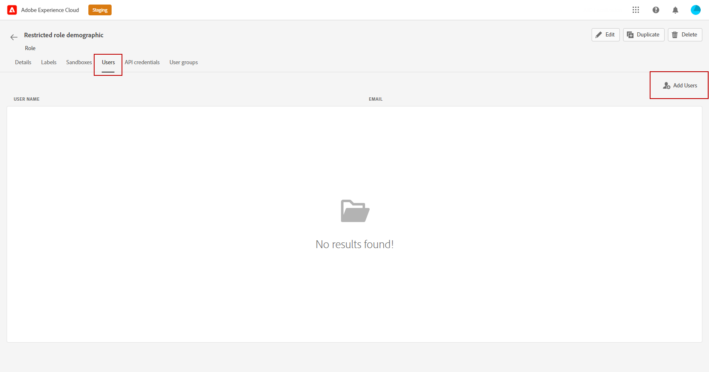

# 以屬性為基礎的存取控制 {#attribute-based-access}

>[!IMPORTANT]
>
>以屬性為基礎的存取控制目前僅限於選定客戶，將在未來的版本中同步到所有環境。

基於屬性的訪問控制(ABAC)允許您定義管理特定團隊或用戶組資料存取的授權。 其目的是保護敏感數字資產免受未經授權用戶的侵害，從而進一步保護個人資料。

在Adobe Journey Optimizer,ABAC允許您保護資料並授予對特定欄位元素的特定訪問權限，包括體驗資料模型(XDM)架構、配置檔案屬性和段。

有關ABAC使用的術語的更詳細清單，請參閱 [Adobe Experience Platform文檔](https://experienceleague.adobe.com/docs/experience-platform/access-control/abac/overview.html)。

在本示例中，我們要向 **國籍** 模式欄位，以限制未授權用戶使用它。 要使此操作正常，您需要執行以下步驟：

1. 新建  **[!UICONTROL 角色]** 並賦予相應的  **[!UICONTROL 標籤]** 供用戶能夠訪問和使用架構欄位。

1. 分配  **[!UICONTROL 標籤]** 到 **國籍** 模式欄位。

1. 使用  **[!UICONTROL 架構欄位]** 在Adobe Journey Optimizer。

請注意 **[!UICONTROL 角色]**。 **[!UICONTROL 策略]** 和 **[!UICONTROL 產品]** 也可以使用基於屬性的訪問控制API訪問。 有關此的詳細資訊，請參閱此 [文檔](https://experienceleague.adobe.com/docs/experience-platform/access-control/abac/abac-api/overview.html)。

## 建立角色並分配標籤 {#assign-role}

>[!IMPORTANT]
>
>在管理角色的權限之前，首先需要建立策略。 有關此內容的詳細資訊，請參閱 [Adobe Experience Platform文檔](https://experienceleague.adobe.com/docs/experience-platform/access-control/abac/permissions-ui/policies.html)。

**[!UICONTROL 角色]** 是您組織內共用相同權限、標籤和沙箱的一組用戶。 屬於 **[!UICONTROL 角色]** 享有該產品中的Adobe應用和服務。
您還可以建立自己的 **[!UICONTROL 角色]** 的子菜單。

現在，我們要授予選定用戶訪問 **國籍** 欄位，標籤為C2。 為此，我們需要建立 **[!UICONTROL 角色]** 為特定用戶集授予標籤C2 ，允許他們使用 **國籍** 詳細資訊 **[!UICONTROL 旅程]**。

1. 從 [!DNL Permissions] 產品，選擇 **[!UICONTROL 角色]** 按一下 **[!UICONTROL 建立角色]**。 請注意，您還可以 **[!UICONTROL 標籤]** 內置角色。

   

1. 添加 **[!UICONTROL 名稱]** 和 **[!UICONTROL 說明]** 到 **[!UICONTROL 角色]**，此處：受限角色人口。

1. 從下拉清單中，選擇 **[!UICONTROL 沙盒]**。

   

1. 從 **[!UICONTROL 資源]** 菜單，按一下 **[!UICONTROL Adobe Experience Platform]** 開啟不同的功能。 這裡，我們選擇 **[!UICONTROL 旅程]**。

   

1. 從下拉清單中，選擇 **[!UICONTROL 權限]** 連結到所選特徵，如 **[!UICONTROL 查看行程]** 或 **[!UICONTROL 發佈行程]**。

   

1. 保存新建立的 **[!UICONTROL 角色]**&#x200B;按一下 **[!UICONTROL 屬性]** 以進一步配置對角色的訪問權限。

   

1. 從 **[!UICONTROL 用戶]** 按鈕 **[!UICONTROL 添加用戶]**。

   

1. 從 **[!UICONTROL 標籤]** 頁籤 **[!UICONTROL 添加標籤]**。

   

1. 選擇 **[!UICONTROL 標籤]** 要添加到您的角色，然後按一下 **[!UICONTROL 保存]**。 對於本示例，我們將為用戶授予標籤C2以訪問以前受限制架構的欄位。

   

中的用戶 **受限角色人口** 角色現在可以訪問C2標籤的對象。

## 為Adobe Experience Platform中的對象分配標籤 {#assign-label}

>[!WARNING]
>
>錯誤的標籤使用可能會中斷對人員的訪問並觸發策略違規。

**[!UICONTROL 標籤]** 可用於使用基於屬性的訪問控制來指定特定的特徵區域。
在此示例中，我們要限制對 **國籍** 的子菜單。 只有具有相應欄位的用戶才能訪問此欄位 **[!UICONTROL 標籤]** 到  **[!UICONTROL 角色]**。

請注意，您還可以  **[!UICONTROL 標籤]** 至  **[!UICONTROL 架構]**。  **[!UICONTROL 資料集]** 和  **[!UICONTROL 段]**。

1. 建立 **[!UICONTROL 架構]**。 有關此內容的詳細資訊，請參閱 [本文檔](https://experienceleague.adobe.com/docs/experience-platform/xdm/schema/composition.html?lang=zh-Hant)。

   

1. 在新建立的 **[!UICONTROL 架構]**，我們首先 **[!UICONTROL 人口結構詳細資訊]** 包含 **國籍** 的子菜單。

   

1. 從 **[!UICONTROL 標籤]** 頁籤，檢查限制欄位名稱，此處 **國籍**。 然後，從右窗格菜單中，選擇 **[!UICONTROL 編輯治理標籤]**。

   

1. 選擇相應 **[!UICONTROL 標籤]**，在這種情況下， C2 — 資料不能導出到第三方。 有關可用標籤的詳細清單，請參閱 [此頁](https://experienceleague.adobe.com/docs/experience-platform/data-governance/labels/reference.html#contract-labels)。

   

1. 如果需要，請進一步個性化您的架構，然後啟用它。 有關如何啟用架構的詳細步驟，請參閱 [頁](https://experienceleague.adobe.com/docs/experience-platform/xdm/ui/resources/schemas.html#profile)。

您架構的欄位現在將只可見，現在只能由使用C2標籤的角色集的一部分的用戶使用。
通過應用 **[!UICONTROL 標籤]** 到 **[!UICONTROL 欄位名]**，請注意 **[!UICONTROL 標籤]** 將自動應用於 **國籍** 的子菜單。

## 訪問Adobe Journey Optimizer中標有標籤的對象 {#attribute-access-ajo}

在給我們的 **國籍** 新架構中的欄位名和我們的新角色，我們現在可以看到此限制在Adobe Journey Optimizer的影響。
例如，對標為C2的對象具有訪問權限的第一個用戶X將建立一個Journey，該Journey的條件針對受限制的 **[!UICONTROL 欄位名]**。 如果第二個用戶Y無法訪問標有C2的對象，則需要發佈「旅程」。

1. 從Adobe Journey Optimizer，首先需要配置 **[!UICONTROL 資料源]** 新架構。

   

1. 添加新 **[!UICONTROL 欄位組]** 新建立的 **[!UICONTROL 架構]** 內置 **[!UICONTROL 資料源]**。 也可以建立新外部 **[!UICONTROL 資料源]** 關聯 **[!UICONTROL 欄位組]**。

   

1. 選擇之前建立的 **[!UICONTROL 架構]**&#x200B;按一下 **[!UICONTROL 編輯]** 從 **[!UICONTROL 欄位]** 的子菜單。

   

1. 選擇 **[!UICONTROL 欄位名]** 你想瞄準。 在此，我們選擇受限 **國籍** 的子菜單。

   

1. 然後，建立一個Journey，該Journey將向具有特定國籍的用戶發送電子郵件。 添加 **[!UICONTROL 事件]** 然後 **[!UICONTROL 條件]**。

   

1. 選擇受限 **國籍** 欄位以開始生成表達式。

   

1. 編輯 **[!UICONTROL 條件]** 以特定人群為目標 **國籍** 的子菜單。

   

1. 根據需要個性化您的旅程，在此添加 **[!UICONTROL 電子郵件]** 操作。

   

如果User Y不具有對標籤C2對象的訪問權限，則需要使用此限制欄位訪問此行程：

* 用戶Y將無法使用受限欄位名稱，因為它將不可見。

* 用戶Y將無法在「高級」模式下編輯具有受限欄位名稱的表達式。 將出現以下錯誤 `The expression is invalid. Field is no longer available or you don't have enough permission to see it`。

* 用戶Y可以刪除表達式。

* Y用戶將無法testJourney。

* 用戶Y將無法發佈Journey。
