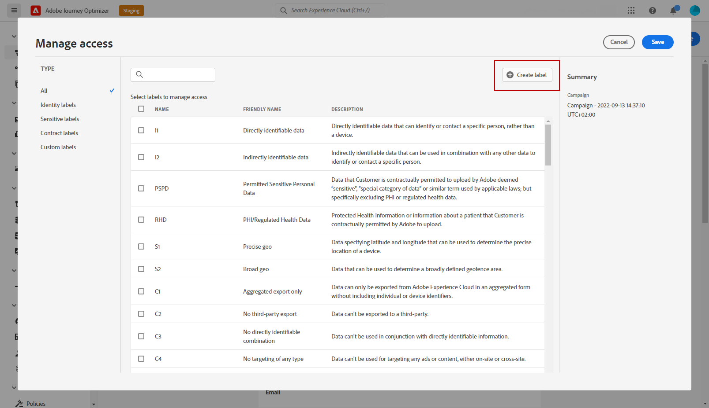

# 對象級訪問控制 {#object-level-access}

>[!CONTEXTUALHELP]
>id="ajo_olac_manage_access"
>title="對象級訪問控制"
>abstract="如果您套用您無權存取的任何標籤，則您對此物件的存取權將遭撤銷。"

對象級訪問控制(OLAC)允許您定義授權，以管理對選定對象的資料訪問：

* 歷程
* Campaign
* 登陸頁面
* 優惠
* 選件集合
* Offer decisioning

其目的是保護敏感數位資產，使其免受未經授權的使用者之害，以進一步保護個人資料。

在Adobe Journey Optimizer中，OLAC可讓您保護資料，並授予特定物件的特定存取權。

## 建立標籤 {#create-assign-labels}

>[!IMPORTANT]
>
>若要建立標籤，您必須是角色的一部分，且 **[!UICONTROL 管理使用量標籤]** 權限。

**[!UICONTROL 標籤]** 可讓您根據套用至該資料的使用原則，對資料集和欄位進行分類。 **[!UICONTROL 標籤]** 可隨時套用，提供您選擇控管資料的彈性。

您可以在 [!DNL Permissions] 產品。 如需詳細資訊，請參閱[此頁面](https://experienceleague.adobe.com/docs/experience-platform/access-control/abac/permissions-ui/labels.html)。

**[!UICONTROL 標籤]** 也可直接在Journey Optimizer中建立：

1. 從Adobe Journey Optimizer物件，此處是新建立的 **[!UICONTROL 行銷活動]**，按一下 **[!UICONTROL 管理存取]** 按鈕。

   

1. 從 **[!UICONTROL 管理存取]** 按一下 **[!UICONTROL 建立標籤]**.

   

1. 設定標籤時，您必須指定：
   * **[!UICONTROL 名稱]**
   * **[!UICONTROL 易記名稱]**
   * **[!UICONTROL 說明]**

   

1. 按一下 **[!UICONTROL 建立]** 儲存 **[!UICONTROL 標籤]**.

新建立的 **[!UICONTROL 標籤]** 清單中現已可用。 如有需要，您可以在 [!DNL Permissions] 產品。

## 指派標籤 {#assign-labels}

>[!IMPORTANT]
>
>若要指派標籤，您必須是具有「管理」權限之角色的一部分，即 [!DNL Manage journeys], [!DNL Manage Campaigns] 或 [!DNL Manage decisions]. 若沒有此權限， **[!UICONTROL 管理存取]** 按鈕會變灰。

若要將自訂或核心資料使用量標籤指派給您的Journey Optimizer物件：

1. 從Adobe Journey Optimizer物件，此處是新建立的 **[!UICONTROL 行銷活動]**，按一下 **[!UICONTROL 管理存取]** 按鈕。

   

1. 從 **[!UICONTROL 管理存取]** 視窗中，選取您的自訂或核心資料使用量標籤，以管理此物件的存取權。

   如需核心資料使用量標籤的詳細資訊，請參閱 [本頁](https://experienceleague.adobe.com/docs/experience-platform/data-governance/labels/reference.html).

   

1. 按一下 **[!UICONTROL 儲存]** 來應用此標籤限制。

若要存取此物件，使用者必須具備 **[!UICONTROL 標籤]** 包含在 **[!UICONTROL 角色]**.

如需如何指派的詳細資訊 **[!UICONTROL 標籤]** 到 **[!UICONTROL 角色]**，請參閱 [本頁](https://experienceleague.adobe.com/docs/experience-platform/access-control/abac/permissions-ui/permissions.html?lang=en#manage-labels-for-a-role).

