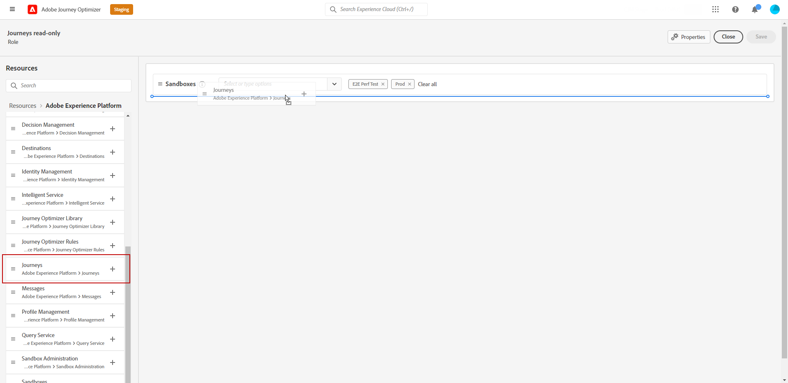

# 管理使用者和角色 {#manage-permissions}

**[!UICONTROL 角色]**&#x200B;是指共用相同許可權和沙箱的使用者集合。 這些角色可讓您輕鬆管理組織內不同使用者群組的存取和許可權。

透過[!DNL Journey Optimizer]產品，您可以從預先存在的&#x200B;**[!UICONTROL 角色]**&#x200B;範圍中進行選擇，每個角色都有不同的許可權層級，以便指派給您的使用者。 如需可用&#x200B;**[!UICONTROL 角色]**&#x200B;的詳細資訊，請參閱此[頁面](ootb-product-profiles.md)。

當使用者屬於&#x200B;**[!UICONTROL 角色]**&#x200B;時，他們將獲得產品內所包含Adobe應用程式和服務的存取權。

如果預先存在的角色不符合您組織的特定需求，您也可以建立自訂&#x200B;**[!UICONTROL 角色]**，以微調介面中特定功能或物件的存取許可權。 如此一來，您便可確保每位使用者僅能存取有效執行其工作所需的資源和工具。

>[!IMPORTANT]
>
>以下詳述的步驟和程式只能由&#x200B;**[!UICONTROL 產品]**&#x200B;或&#x200B;**[!UICONTROL 系統]**&#x200B;管理員執行。

## 指派角色 {#assigning-role}

您可以將現成可用的或自訂的&#x200B;**[!UICONTROL 角色]**&#x200B;指派給使用者。

[內建角色](ootb-product-profiles.md)區段提供具有指派許可權的所有現成角色清單。

若要指派&#x200B;**[!UICONTROL 角色]**：

1. 若要將角色指派給[!DNL Permissions]產品中的使用者，請瀏覽至&#x200B;**[!UICONTROL 角色]**&#x200B;索引標籤，然後選取所要的角色。

   

1. 在&#x200B;**[!UICONTROL 使用者]**&#x200B;標籤中，按一下&#x200B;**[!UICONTROL 新增使用者]**。

   

1. 輸入您的使用者名稱或電子郵件地址，或從清單中選取使用者，然後按一下[儲存]。**&#x200B;**

   如果使用者先前未在[!DNL Admin Console]中建立，請參閱[新增使用者檔案](https://experienceleague.adobe.com/docs/experience-platform/access-control/ui/users.html){target="_blank"}。

   

您的使用者會收到一封電子郵件，而會將他們重新導向至您的執行個體。

如需使用者管理的詳細資訊，請參閱[存取控制檔案](https://experienceleague.adobe.com/docs/experience-platform/access-control/home.html?lang=zh-Hant){target="_blank"}。

存取執行個體時，您的使用者會根據&#x200B;**[!UICONTROL 角色]**&#x200B;中的指派許可權看到特定檢視。 如果使用者沒有對功能的正確存取權，則會出現以下訊息：

`You do not have permission to access this feature. Permission needed: XX.`

## 編輯現有角色 {#edit-product-profile}

針對內建或自訂&#x200B;**[!UICONTROL 角色]**，您可以隨時決定新增或刪除許可權。

在下列範例中，我們要為指派給歷程檢視器&#x200B;**[!UICONTROL 角色]**&#x200B;的使用者，新增與&#x200B;**[!UICONTROL 歷程]**&#x200B;資源相關的&#x200B;**[!UICONTROL 許可權]**。 之後，使用者就可以發佈歷程。

>[!IMPORTANT]
>
>對內建或自訂角色進行的變更將會影響指派給該角色的所有使用者。

1. 若要編輯[!DNL Permissions]產品中的角色，請導覽至&#x200B;**[!UICONTROL 角色]**&#x200B;索引標籤並選取所需的角色，這裡是歷程檢視器&#x200B;**[!UICONTROL 角色]**。
   

1. 從您的&#x200B;**[!UICONTROL 角色]**&#x200B;儀表板，按一下&#x200B;**[!UICONTROL 編輯]**。

   

1. **[!UICONTROL 資源]**&#x200B;功能表會顯示套用至&#x200B;**[!UICONTROL Experience Cloud - Platform支援的應用程式]**&#x200B;產品的資源清單。 拖放資源以指派許可權。

   我們從&#x200B;**[!UICONTROL 歷程]**&#x200B;資源下拉式清單中選擇發佈歷程&#x200B;**[!UICONTROL 許可權]**。

   

1. 如有需要，請在&#x200B;**[!UICONTROL 包含的許可權專案]**&#x200B;下，按一下X圖示以移除角色中的許可權或資源。

1. 完成時，按一下&#x200B;**[!UICONTROL 儲存]**。

如有需要，您也可以建立具有特定許可權的新角色。

## 建立新角色 {#create-product-profile}

[!DNL Journey Optimizer]可讓您建立自己的&#x200B;**[!UICONTROL 角色]**，並將一組許可權和沙箱指派給您的使用者。 透過&#x200B;**[!UICONTROL 角色]**，您可以授權或拒絕存取介面中的特定功能或物件。

如需如何建立和管理沙箱的詳細資訊，請參閱 [Adobe Experience Platform 文件](https://experienceleague.adobe.com/docs/experience-platform/sandbox/ui/user-guide.html?lang=zh-Hant){target="_blank"}。

在此範例中，我們會建立名為&#x200B;**Journeys唯讀角色**，其中我們會將唯讀許可權授與歷程功能。 使用者將只能存取及檢視歷程，而且將無法存取&#x200B;**[!DNL Decision management]**&#x200B;中的其他功能，例如[!DNL Journey Optimizer]。

若要建立我們的&#x200B;**唯讀歷程** **[!UICONTROL 角色]**：

1. 若要將角色指派給[!DNL Permissions]產品中的使用者，請瀏覽至&#x200B;**[!UICONTROL 角色]**&#x200B;索引標籤，然後按一下&#x200B;**[!UICONTROL 建立角色]**。

   

1. 為您的新&#x200B;**[!UICONTROL 角色]**&#x200B;新增&#x200B;**[!UICONTROL 名稱]**&#x200B;和&#x200B;**[!UICONTROL 描述]**。 然後，按一下&#x200B;**[!UICONTROL 確認]**。

   

1. 從&#x200B;**[!UICONTROL 沙箱]**&#x200B;資源下拉式清單中，選擇要指派給您的&#x200B;**[!UICONTROL 角色]**&#x200B;的沙箱。 [進一步瞭解 sandbox](sandboxes.md)。

   

1. 從左側功能表中列出的&#x200B;**[!DNL Journeys]**&#x200B;中可用的不同資源（例如&#x200B;**[!DNL Segments]**、**[!DNL Decision management]**&#x200B;或[!DNL Journey Optimizer]）中選取。

   在此我們選取&#x200B;**[!UICONTROL Journeys]**&#x200B;資源。

   

1. 從&#x200B;**[!UICONTROL 歷程]**&#x200B;下拉式清單中，選取要指派給您&#x200B;**[!UICONTROL 角色]**&#x200B;的許可權。

   我們在這裡選取&#x200B;**[!DNL View journeys]**、**[!DNL View journeys report]**&#x200B;和&#x200B;**[!DNL View journeys event, data sources, actions]**。

   

1. 完成時，按一下&#x200B;**[!UICONTROL 儲存]**。

您的&#x200B;**[!UICONTROL 角色]**&#x200B;現已建立並設定。 您現在需要將其指派給使用者。

如需角色建立與管理的詳細資訊，請參閱[Adobe Admin Console檔案](https://experienceleague.adobe.com/docs/experience-platform/access-control/abac/permissions-ui/roles.html){target="_blank"}。
