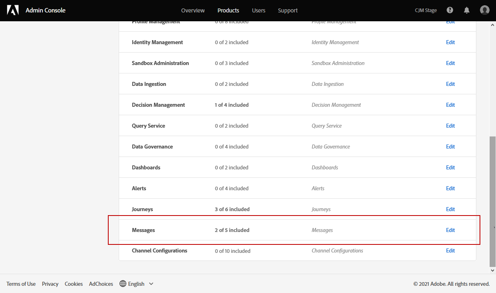

# 管理使用者和產品設定檔 {#manage-permissions}

>[!IMPORTANT]
>
> 下文詳述之各程式僅可由 **[!UICONTROL Product]** 或 **[!UICONTROL System]** 管理員。 有關此項的詳細資訊，請參閱 [管理控制台文檔](https://helpx.adobe.com/enterprise/admin-guide.html/enterprise/using/admin-roles.ug.html)。

**[!UICONTROL Product profiles]** 是您組織中共用相同權限和沙箱的一組用戶。

的 [!DNL Journey Optimizer] 產品允許您在不同的出廠設定之間進行選擇 **[!UICONTROL Product profiles]** 具有不同級別的權限來分配給用戶。 有關可用的 **[!UICONTROL Product profiles]**，請參閱 [頁](ootb-product-profiles.md)。

屬於 **[!UICONTROL Product profiles]** 享有該產品中的Adobe應用和服務。

您還可以建立自己的 **[!UICONTROL Product profiles]** 的子菜單。

## 指派產品設定檔 {#assigning-product-profile}

您可以選擇指定現成或自定義 **[!UICONTROL Product profile]** 到用戶。

在中，可找到具有指定權限的每個現成產品配置檔案的清單 [內置產品配置檔案](ootb-product-profiles.md) 的子菜單。

分配 **[!UICONTROL Product profile]**:

1. 在 [!DNL Admin Console]，也請參見Wiki頁。 **[!UICONTROL Products]** 頁籤 **[!UICONTROL Experience Cloud - Platform powered applications]** 產品。

1. 選取 **[!UICONTROL Product profile]**。

   

1. 在 **[!UICONTROL Users]** 索引標籤中，按一下 **[!UICONTROL Add user]**。

   

1. 鍵入用戶名或電子郵件地址並選擇用戶。

   如果用戶以前未在 [!DNL Admin Console]，請參閱 [添加用戶文檔](https://helpx.adobe.com/enterprise/admin-guide.html/enterprise/using/manage-users-individually.ug.html#add-users)。

   

1. 執行與上述步驟相同的步驟，將其他用戶添加到 **[!UICONTROL Product profile]**。 然後，按一下 **[!UICONTROL Save]**。

接著，您的使用者應會收到一封電子郵件，並重新導向至您的執行個體。

有關用戶管理的詳細資訊，請參閱 [Admin Console文檔](https://helpx.adobe.com/enterprise/admin-guide.html/enterprise/using/manage-users-individually.ug.html)。

訪問實例時，用戶將根據在 **[!UICONTROL Product profile]**。 如果用戶沒有權限訪問某個功能，將出現以下螢幕。

## 編輯現有產品配置檔案 {#edit-product-profile}

用於現成或定制 **[!UICONTROL Product profiles]**，您可以隨時決定添加或刪除權限。

在此示例中，我們要添加 **[!UICONTROL Permissions]** 與 **[!UICONTROL Message]** 分配給旅程查看器的用戶的功能 **[!UICONTROL Product profile]**。 然後用戶將能夠發佈消息。

請注意，如果修改現成或自定義 **[!UICONTROL Product profile]**，它會影響分配給此的每個用戶 **[!UICONTROL Product profile]**。

1. 在 [!DNL Admin Console]，也請參見Wiki頁。 **[!UICONTROL Products]** 頁籤 **[!UICONTROL Experience Cloud - Platform powered applications]** 產品。

1. 選擇行程查看器 **[!UICONTROL Product profile]**。

1. 選取 **[!UICONTROL Permissions]** 索引標籤。

   的 **[!UICONTROL Permissions]** 頁籤顯示應用於 **[!UICONTROL Experience Cloud - Platform powered applications]** 產品。

   

1. 選擇 **[!UICONTROL Messages]** 功能。

   

1. 從 **[!UICONTROL Available Permission Items]** 清單中，選擇要分配給您的權限 **[!UICONTROL Product profile]** 按鈕。

   這裡，我們將 **[!UICONTROL Publish messages]** 權限。

   

1. 如有需要，請在 **[!UICONTROL Included Permission Items]**&#x200B;下方，按一下旁邊的 X 圖示，以移除產品設定檔的權限。

1. 完成後，按一下 **[!UICONTROL Save]**。

   

如果需要，還可以建立具有特定權限的新產品配置檔案。 有關此內容的詳細資訊，請參閱 [建立產品配置檔案](#create-product-profile)。

## 建立產品設定檔 {#create-product-profile}

[!DNL Journey Optimizer] 允許您建立自己的 **[!UICONTROL Product profiles]** 並為用戶分配一組權限和沙箱。 與 **[!UICONTROL Product profiles]**，您可以授權或拒絕訪問介面中的某些功能或對象。

有關如何建立和管理沙箱的詳細資訊，請參閱 [Adobe Experience Platform文檔](https://experienceleague.adobe.com/docs/experience-platform/sandbox/ui/user-guide.html?lang=zh-Hant){target=&quot;_blank&quot;}。

在本示例中，我們將建立一個名為 **只讀遊程** 我們將授予「旅程」功能的只讀權限。 用戶將只能訪問和查看行程，並且將無法訪問其他功能，如 **[!DNL  Decision management]** 或 **[!DNL Messages]** 在 [!DNL Journey Optimizer]。

建立 **只讀遊程** **[!UICONTROL product profiles]**:

1. 訪問 [!DNL Admin Console]。

1. 從 **[!UICONTROL Products]** 頁籤 **[!UICONTROL Experience Cloud - Platform powered applications]** 產品。

1. 按一下「**[!UICONTROL New Profile]**」。

   

1. 添加 **[!UICONTROL Product Profile Name]**。 **[!UICONTROL Display Name]** 和 **[!UICONTROL Description]** 為新 **[!UICONTROL product profiles]**。

   

1. 在 **[!UICONTROL Notifications]** 類別中，選擇從此產品設定檔新增或移除使用者時，使用者是否會收到電子郵件通知。

1. 完成後，按一下 **[!UICONTROL Save]** 選擇新建立的 **[!UICONTROL product profiles]**。

1. 要添加用戶訪問不同功能的權限，請選擇 **[!UICONTROL Permissions]** 頁籤。

1. 在不同的功能之間進行選擇，如 **[!DNL Messages]**。 **[!DNL Segments]** 或 **[!DNL Decision management]** 可用 [!DNL Journey Optimizer] 清單。

   在此，我們選擇 **[!UICONTROL Journeys]** 功能。

   

1. 從 **[!UICONTROL Available Permission Items]** 清單中，選擇要分配給您的權限 **[!UICONTROL Product profile]** 按鈕。

   在此，我們選擇 **[!DNL View journeys]** 和 **[!DNL View journeys event, data sources, actions]**。

   

1. 選擇 **[!UICONTROL Sandbox access]** 選擇要分配給您的沙盒的功能 **[!UICONTROL Product profile]**。

   

1. 在 **[!UICONTROL Available Permissions Items]** 下方，按一下加號 (+) 圖示，將沙箱指派給您的設定檔。[進一步瞭解 sandbox](sandboxes.md)。

1. 完成後，按一下 **[!UICONTROL Save]**。

您 **[!UICONTROL Product profile]** 建立並配置。 您現在需要將其分配給用戶。

有關產品配置檔案建立和管理的詳細資訊，請參閱 [Admin Console文檔](https://helpx.adobe.com/enterprise/admin-guide.html/enterprise/using/manage-product-profiles.ug.html)。
