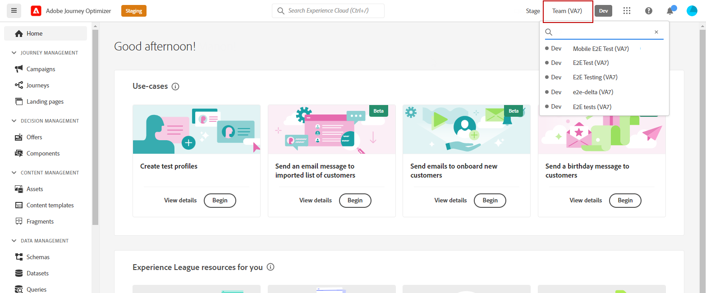
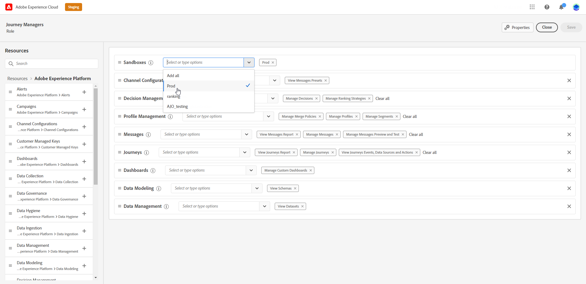

# 使用並指派沙箱 {#sandboxes}

## 使用沙箱 {#using-sandbox}

[!DNL Journey Optimizer]可讓您將執行個體分割到稱為沙箱的個別虛擬環境中。 沙箱是透過許可權中的角色指派。 [瞭解如何指派 sandbox](permissions.md#create-product-profile)。

[!DNL Journey Optimizer]反映針對指定組織建立的Adobe Experience Platform沙箱。 可從 Adobe Experience Platform 執行個體建立或重設 Adobe Experience Platform sandbox。[進一步瞭解 sandbox 使用手冊](https://experienceleague.adobe.com/docs/experience-platform/sandbox/ui/user-guide.html?lang=zh-Hant){target="_blank"}。

您可以在熒幕右上角、組織名稱旁找到沙箱切換器控制項。 若要從一個沙箱切換至另一個沙箱，請按一下切換器中目前作用中的沙箱，然後從下拉式清單中選取另一個沙箱。

➡️ [在此影片中進一步瞭解沙箱](#video)

## 指派沙箱 {#assign-sandboxes}

>[!IMPORTANT]
>
> 沙箱管理只能由&#x200B;**[!UICONTROL 產品]**&#x200B;或&#x200B;**[!UICONTROL 系統]**&#x200B;管理員執行。

您可以選擇將不同的沙箱指派給現成或自訂&#x200B;**[!UICONTROL 角色]**。

若要指派沙箱：

1. 在[!DNL Permissions]中，從&#x200B;**[!UICONTROL 角色]**&#x200B;索引標籤中，選取&#x200B;**[!UICONTROL 角色]**。

   

1. 按一下&#x200B;**[!UICONTROL 編輯]**。

1. 從&#x200B;**[!UICONTROL 沙箱]**&#x200B;資源下拉式清單中，選取將指派給您角色的沙箱。

   

1. 如有需要，請按一下它旁邊的X圖示，從您的&#x200B;**[!UICONTROL 角色]**&#x200B;移除沙箱存取權。

   

1. 按一下&#x200B;**[!UICONTROL 儲存]**。

## 存取內容 {#content-access}

若要設定內容協助工具，請將內容共用資料夾指派給每個沙箱。 您可以在&#x200B;**[!UICONTROL 中顯示的]**&#x200B;儲存體[!DNL Admin Console]索引標籤中為管理員建立和設定共用資料夾。 如果您以系統管理員的身份可以存取[!DNL Admin Console]，則可以建立共用資料夾，並將具有不同存取等級的指派新增到共用資料夾。

請注意，若要讓內容與正確的沙箱同步，您必須遵循與沙箱相同的語法。 例如，如果您的沙箱稱為「開發」，則共用資料夾應具有相同的名稱。

[瞭解如何管理共用資料夾](https://helpx.adobe.com/tw/enterprise/admin-guide.html/enterprise/using/manage-adobe-storage.ug.html){target="_blank"}。

## 作法影片{#video}

瞭解何謂沙箱，以及如何區分開發沙箱和生產沙箱。 瞭解如何建立、重設和刪除沙箱。

>[!VIDEO](https://video.tv.adobe.com/v/334355?quality=12)