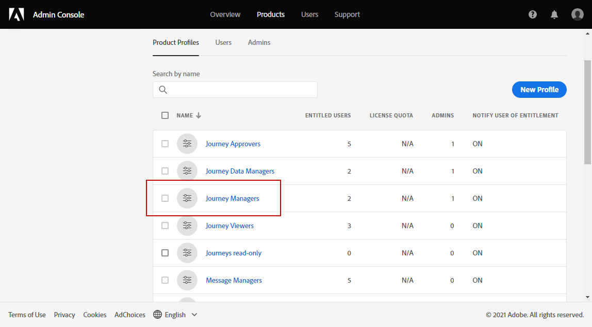

# 使用並指派沙箱 {#sandboxes}

>[!BEGINSHADEBOX]

**在此頁面上：**&#x200B;使用並指派沙箱，將您的Adobe Journey Optimizer執行個體分割成隔離的環境，以便您可以開發、測試和在生產環境中執行，而不會影響其他工作。

>[!ENDSHADEBOX]

**沙箱**&#x200B;是將您的Adobe Journey Optimizer執行個體分割成個別、獨立的工作區的虛擬環境，以用於開發、測試或生產。 您會在&#x200B;**管理** > **管道** > **連線您的系統和環境** （或透過介面右上角的沙箱切換器）下找到沙箱管理。 沙箱可協助您安全地實驗、為每個角色指派不同的存取權，並讓內容保持井然有序。 本頁涵蓋如何使用及指派沙箱、設定內容存取權，以及在[將物件匯出至另一個沙箱](../configuration/copy-objects-to-sandbox.md)文章中，如何複製沙箱之間的歷程及範本。

## 使用沙箱 {#using-sandbox}

[!DNL Journey Optimizer]可讓您將執行個體分割到稱為沙箱的個別虛擬環境中。 沙箱是透過許可權中的角色指派。 [瞭解如何指派 sandbox](permissions.md#create-product-profile)。

[!DNL Journey Optimizer]反映針對指定組織建立的Adobe Experience Platform沙箱。 可從 Adobe Experience Platform 執行個體建立或重設 Adobe Experience Platform sandbox。 [進一步瞭解 sandbox 使用手冊](https://experienceleague.adobe.com/docs/experience-platform/sandbox/ui/user-guide.html?lang=zh-Hant){target="_blank"}。

您可以在熒幕右上角、組織名稱旁找到沙箱切換器控制項。 若要從一個沙箱切換至另一個沙箱，請按一下切換器中目前作用中的沙箱，然後從下拉式清單中選取另一個沙箱。

➡️ [在此影片中進一步瞭解沙箱](#video)

## 指派沙箱 {#assign-sandboxes}

>[!IMPORTANT]
>
> 沙箱管理只能由&#x200B;**[!UICONTROL 產品]**&#x200B;或&#x200B;**[!UICONTROL 系統]**&#x200B;管理員執行。

您可以選擇將不同的沙箱指派給現成或自訂&#x200B;**[!UICONTROL 角色]**。

若要指派沙箱：

1. 在[!DNL Permissions]中，從&#x200B;**[!UICONTROL 角色]**&#x200B;索引標籤中，選取&#x200B;**[!UICONTROL 角色]**。

   

1. 按一下&#x200B;**[!UICONTROL 編輯]**。

1. 從&#x200B;**[!UICONTROL 沙箱]**&#x200B;資源下拉式清單中，選取將指派給您角色的沙箱。

   

1. 如有需要，請按一下它旁邊的X圖示，從您的&#x200B;**[!UICONTROL 角色]**&#x200B;移除沙箱存取權。

   

1. 按一下&#x200B;**[!UICONTROL 儲存]**。

## 存取內容 {#content-access}

若要設定內容協助工具，請將內容共用資料夾指派給每個沙箱。 您可以在[!DNL Admin Console]中顯示的&#x200B;**[!UICONTROL 儲存體]**&#x200B;索引標籤中為管理員建立和設定共用資料夾。 如果您以系統管理員的身份可以存取[!DNL Admin Console]，則可以建立共用資料夾，並將具有不同存取等級的指派新增到共用資料夾。

請注意，若要讓內容與正確的沙箱同步，您必須遵循與沙箱相同的語法。 例如，如果您的沙箱稱為「開發」，則共用資料夾應具有相同的名稱。

[瞭解如何管理共用資料夾](https://helpx.adobe.com/tw/enterprise/admin-guide.html/enterprise/using/manage-adobe-storage.ug.html){target="_blank"}。

## 作法影片{#video}

瞭解何謂沙箱，以及如何區分開發沙箱和生產沙箱。 瞭解如何建立、重設和刪除沙箱。

>[!VIDEO](https://video.tv.adobe.com/v/334355?quality=12)

+++ AI知識參考

本節包含結構化知識，用於支援與本主題相關的解譯、擷取和問答。

如需完整瞭解，此資訊應結合本頁的檔案。 兩者皆非獨立來源；頁面說明功能，本節提供額外內容，以協助去除術語、意圖、適用性和限制條件的歧義。

- **TL；DR：**&#x200B;沙箱會將您的Journey Optimizer執行個體分割成獨立的虛擬工作區，以供開發、測試和生產使用；沙箱會透過「許可權」產品中的角色指派給使用者，而內容存取則會透過Admin Console中的共用資料夾進行設定。

**意圖：**

- 使用沙箱切換器，在Journey Optimizer介面中的沙箱之間切換
- 將一個或多個沙箱指派給許可權產品中的角色
- 從角色中移除沙箱存取權
- 設定沙箱的內容存取（共用資料夾）
- 瞭解沙箱與角色和許可權的關係

**字彙表：**

- **沙箱**：虛擬環境將Journey Optimizer執行個體分割成個別、隔離的工作區，以供開發、測試或生產使用&#x200B;*（產品專用）*
- **沙箱切換器**： Journey Optimizer介面右上角組織名稱旁的控制項，用來在沙箱&#x200B;*（產品特定）*&#x200B;之間切換
- **共用資料夾**：在Admin Console中為允許內容存取的沙箱設定的儲存資料夾；其名稱必須符合內容的沙箱名稱，才能正確同步&#x200B;*（產品特定）*

**護欄：**

- 沙箱管理只能由產品或系統管理員執行（硬性先決條件，如頁面上重要注意事項所述）
- 共用資料夾名稱必須符合與沙箱名稱相同的語法，內容才能同步至正確的沙箱（如頁面上所述）

**術語：**

- 請勿混淆：「使用沙箱」（在UI中使用沙箱切換器切換至沙箱）≠「指派沙箱」（將沙箱新增至許可權產品中的角色）≠「建立沙箱」（在Adobe Experience Platform中完成，而不是在Journey Optimizer中）
- 同義字：此頁面內容中的「沙箱」=「虛擬環境」
- 請勿混淆：「指派沙箱」（在許可權中為角色新增沙箱）≠「管理沙箱」（建立、重設或刪除沙箱 — 在Adobe Experience Platform中完成）

**常見問題集：**

- **問：如何在Journey Optimizer的沙箱之間切換？**  — 使用畫面右上角、組織名稱旁邊的沙箱切換器；按一下使用中的沙箱，然後從下拉式清單中選取另一個沙箱。
- **問：誰可以將沙箱指派給角色？**  — 僅限產品或系統管理員。
- **問：沙箱如何可供使用者使用？**  — 透過許可權產品中的角色指派沙箱。
- **問：共用資料夾必須遵循什麼命名慣例？**  — 共用資料夾必須與相關聯的沙箱同名（例如，如果沙箱稱為「開發」，則共用資料夾也必須稱為「開發」）。

+++
<!-- ai-accordion-version: 1 | source-hash: 0a5ada9b -->