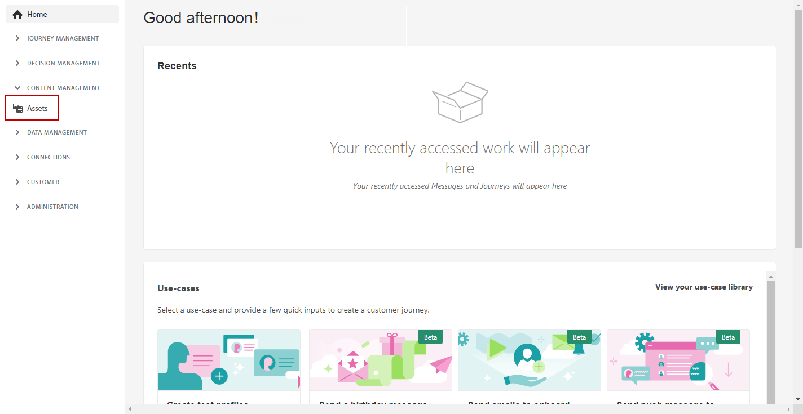
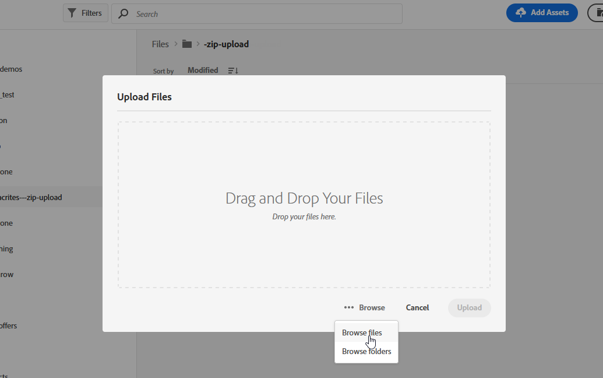

# 使用[!DNL Adobe Experience Manager Assets Essentials] {#experience-manager-assets}

## 開始使用 [!DNL Assets Essentials] {#get-started-assets-essentials}

[!DNL Adobe Experience Manager Assets Essentials] 提供單一的集中資產存放庫，供您用來填入訊息。您可以透過&#x200B;**[!UICONTROL Assets]**&#x200B;區段直接從[!DNL Adobe Journey Optimizer]存取。 設計電子郵件內容時，您也可以存取資產和資料夾。 [深入了解電子郵件設計](design-emails.md)。

有關[!DNL Assets Essentials]的更詳細過程，請參閱[Adobe Experience Manager Assets Essentials文檔](https://experienceleague.adobe.com/docs/experience-manager-assets-essentials/help/introduction.html)。

## 上傳並插入資產{#add-asset}

若要上傳[!DNL Assets Essentials]中的檔案，您首先需要瀏覽或建立要儲存該檔案的資料夾。 然後，您就能將它們插入您的電子郵件內容。

如需上傳資產的詳細資訊，請參閱[Adobe Experience Manager Assets Essentials檔案](https://experienceleague.adobe.com/docs/experience-manager-assets-essentials/help/add-delete-assets.html)。

1. 從[!DNL Adobe Journey Optimizer]首頁，選擇&#x200B;**[!UICONTROL Content management]**&#x200B;菜單下的&#x200B;**[!UICONTROL Assets]**&#x200B;頁簽以訪問[!DNL Assets Essentials]。

   

1. 按兩下中央部分或樹視圖中的資料夾以開啟它。

   您也可以按一下&#x200B;**[!UICONTROL Create folder]**&#x200B;以建立新資料夾。

   

1. 進入選取或建立的資料夾後，按一下&#x200B;**[!UICONTROL Add Assets]**&#x200B;將新資產上傳至您的資料夾。

   

1. 從&#x200B;**[!UICONTROL Upload files]**&#x200B;中，按一下&#x200B;**[!UICONTROL Browse]**&#x200B;並選擇是&#x200B;**[!UICONTROL Browse files]**&#x200B;還是&#x200B;**[!UICONTROL Browse folders]**。

   

1. 選取要上傳的檔案。 完成後，按一下&#x200B;**[!UICONTROL Upload]**。

   若要進一步了解如何管理您的資產，請參閱此[page](https://experienceleague.adobe.com/docs/experience-manager-assets-essentials/help/manage-organize.html?lang=en)。

1. 上傳資產後，您現在可以透過電子郵件設計工具，將資產插入其中一則訊息中。

   您也可以使用[!DNL Assets Essentials]的&#x200B;**Edit**&#x200B;模式進一步編輯資產。 [了解更多](https://experienceleague.adobe.com/docs/experience-manager-assets-essentials/help/edit-images.html)。

   

1. 從[!DNL Adobe Journey Optimizer]中，從電子郵件設計器的左窗格中選擇&#x200B;**[!UICONTROL Asset picker]**。

   

1. 選取您的「資產」資料夾。 您也可以在搜尋列中搜尋資產或資料夾。

1. 將資產拖放至電子郵件內容中。

   

1. 您可以進一步自訂資產，例如新增外部連結或包含&#x200B;**[!UICONTROL Components settings]**&#x200B;的文字。 [進一步了解元件設定](content-components.md)

   
