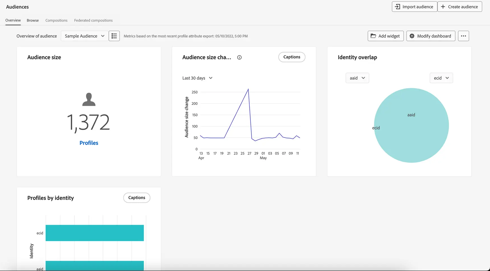

# 開始使用 Audiences {#about-segments}

>[!CONTEXTUALHELP]
>id="ajo_campaigns_content_experiment_segment"
>title="客群"
>abstract="透過使用即時客戶輪廓資料，Adobe Experience Platform 能讓您輕鬆建置區段定義，以建立能夠擷取客戶獨特行為與偏好的目標的客群。"

>[!CONTEXTUALHELP]
>id="ajo_campaigns_audience"
>title="選取行銷活動的對象"
>abstract="此清單顯示所有可用的 Adobe Experience Platform 對象。為你的行銷活動選取目標對象。在行銷活動中設定的訊息將傳送給屬於所選對象的所有個人。[了解更多關於客群](../audience/about-audiences.md)"

對象是具有相同類似行為和/或特徵的人集合。 透過Adobe Experience Platform Segmentation Service，這些功能可在Adobe Experience Platform上集中設定和維護，並可在Journey Optimizer中輕鬆存取，以便在您的歷程和行銷活動中啟用。

Adobe Journey Optimizer提供強大的工具，用於建立、管理和豐富受眾，以強化行銷工作。 在與Adobe Real-Time Customer Data Platform結合時，Journey Optimizer可讓您針對更複雜的細分細分細分細分細分細分對象，並與其他Adobe Experience Cloud解決方案雙向共用對象。

發生即時資料串流或批次上傳時，資料集會更新，而Journey Optimizer會即時以動態方式將個人移入和移出對象和歷程。

>[!BEGINSHADEBOX]

本檔案提供如何在[!DNL Adobe Journey Optimizer]內使用對象的資訊。 有關對象入口網站和對象的詳細資訊，請參閱Adobe Experience Platform細分服務檔案。 如需詳細資訊，請參閱以下章節：

* [Segmentation Service UI指南](https://experienceleague.adobe.com/zh-hant/docs/experience-platform/segmentation/ui/overview){target="_blank"}

* [分段服務 — 常見問題](https://experienceleague.adobe.com/zh-hant/docs/experience-platform/segmentation/faq){target="_blank"}

>[!ENDSHADEBOX]

## 瀏覽客群 {#browse}

可從&#x200B;**[!UICONTROL 客戶]** > **[!UICONTROL 對象]**&#x200B;功能表取得對象。

控制面板以視覺化方式顯示重要受眾之間的重疊，並支援探索有價值的受眾趨勢。 例如，指定時段內的對象人數變化或對象突然激增，可能會醒目顯示導致對象縮小或增大的事件或動作，例如成功的選件。

從受眾入口網站，您可以透過標準標籤、治理控制、可搜尋資料夾和標籤輕鬆管理、尋找和探索受眾。

如需如何在Audience Portal中使用對象的詳細資訊，請參閱[Adobe Experience Platform Segmentation Service檔案](https://experienceleague.adobe.com/docs/experience-platform/segmentation/home.html?lang=zh-Hant){target="_blank"}。

## 對象型別 {#types}

您可以使用不同方法來產生對象：

* **區段定義**：使用Adobe Experience Platform Segmentation Service建立新的對象定義。 對象是從區段定義產生，並會根據其評估型別在不同時間重新整理。

   * 串流區段：隨著新資料流入，對象會即時更新，以確保根據使用者活動保持持續相關性。
   * 批次細分：對象每24小時重新整理一次，以固定間隔擷取設定檔快照。
   * Edge區段：對象會在邊緣即時評估，以便即時個人化。

[瞭解如何建立區段定義](creating-a-segment-definition.md)

* **自訂上傳**：使用CSV檔案匯入對象。 [瞭解如何建立自訂上傳對象](custom-upload.md)

* **對象構成**：建立構成工作流程，將現有對象結合到視覺畫布中，並套用動作，例如排名、分割、加入以建立新對象。 [瞭解如何使用對象組合](get-started-audience-orchestration.md)

* **同盟對象構成**：直接從您現有的資料倉儲同盟資料集，以在一個系統中建立並擴充Adobe Experience Platform對象和屬性。 [瞭解如何使用同盟對象組合](federated-audience-composition.md)。

## 作法影片 {#video}

了解 Journey Optimizer 的統一客戶輪廓及客群。

>[!VIDEO](https://video.tv.adobe.com/v/3432671?quality=12)
