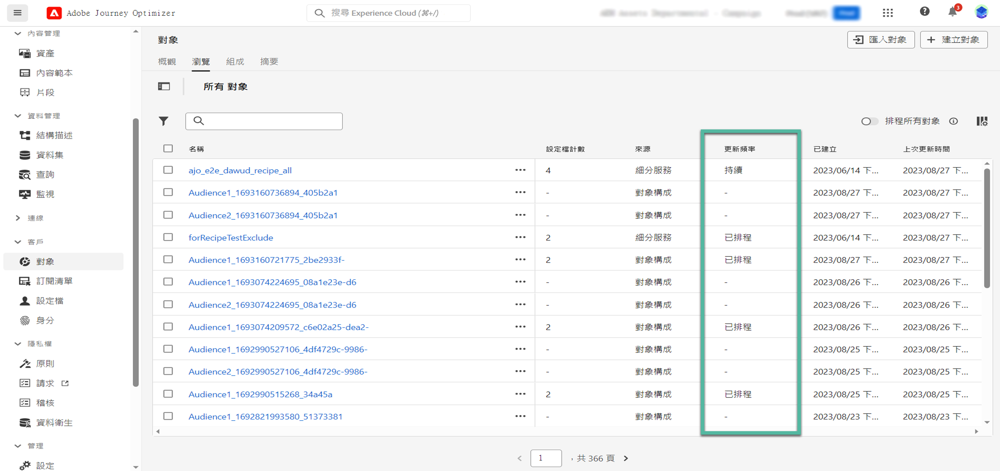

# 開始使用 Adobe Experience Platform 對象 {#about-segments}

>[!CONTEXTUALHELP]
>id="ajo_campaigns_content_experiment_segment"
>title="對象"
>abstract="透過使用即時客戶設定檔資料，Adobe Experience Platform 能讓您輕鬆建置區段定義，以建立能夠擷取客戶獨特行為與偏好的目標的對象。"

>[!CONTEXTUALHELP]
>id="ajo_campaigns_audience"
>title="選取行銷活動的對象"
>abstract="此清單顯示所有可用的 Adobe Experience Platform 對象。為你的行銷活動選取目標對象。在行銷活動中設定的訊息將傳送給屬於所選對象的所有個人。[進一步了解對象](../audience/about-audiences.md)"

受眾是指一組具有類似行為和/或特徵的人。 進一步瞭解 [Adobe Experience Platform Segmentation Service檔案](https://experienceleague.adobe.com/docs/experience-platform/segmentation/home.html?lang=zh-Hant){target="_blank"}.

[!DNL Journey Optimizer] 可讓您直接從建置Adobe Experience Platform對象 **[!UICONTROL 受眾]** 選單，並將其運用在您的歷程或行銷活動中。

您可以使用不同方法來產生對象：

* **區段定義**：使用Adobe Experience Platform Segmentation Service建立新的對象定義。 [瞭解如何建立區段定義](creating-a-segment-definition.md)
* **自訂上傳**：使用CSV檔案匯入對象。 瞭解如何在Adobe Experience Platform中匯入對象 [分段服務檔案](https://experienceleague.adobe.com/docs/experience-platform/segmentation/ui/overview.html#import-audience){target="_blank"}.
* **對象構成**：建立構成工作流程，將現有Adobe Experience Platform對象合併到視覺畫布中，並利用各種活動（分割、排除……）來建立新對象。 [開始使用對象組合](get-started-audience-orchestration.md)

## 定位對象於 [!DNL Journey Optimizer] {#segments-in-journey-optimizer}

您可以在行銷活動和歷程中選取使用區段定義、自訂上傳或組合工作流程產生的任何對象。

>[!AVAILABILITY]
>
>受眾構成和自訂上傳（CSV檔案）受眾中的受眾和屬性目前無法與Healthcare Shield或Privacy and Security Shield搭配使用。 [瞭解如何在Journey Optimizer中使用對象擴充屬性](../audience/about-audiences.md#enrichment)

您可以在 **[!DNL Journey Optimizer]** 中以不同方式善用對象：

* 選擇&#x200B;**行銷活動**&#x200B;的對象，將訊息傳送給屬於所選對象的所有個人。 [了解如何定義行銷活動的對象](../campaigns/create-campaign.md#define-the-audience-audience)。

* 使用 **讀取對象** 歷程中的協調活動，讓對象中的所有個人進入歷程並接收歷程中包含的訊息。 假設您有「銀級客戶」對象。 透過此活動，您可以讓所有銀級客戶進入歷程，並向其傳送一系列個人化訊息。 [了解如何設定讀取對象活動](../building-journeys/read-audience.md#configuring-segment-trigger-activity)。

* 在歷程中使用&#x200B;**條件**&#x200B;活動，以根據對象成員資格建置條件。 [了解如何在條件中使用對象](../building-journeys/condition-activity.md#using-a-segment)。

* 使用 **對象資格** 歷程中的事件活動，用於根據Adobe Experience Platform受眾進入和退出，讓個人進入歷程或是在歷程中前進。 例如，您可以讓所有新的銀級客戶進入歷程，並向其傳送訊息。 如需有關如何使用此活動的詳細資訊，請參閱[了解如何設定對象資格活動](../building-journeys/audience-qualification-events.md)。

  >[!NOTE]
  >
  >由於使用構成工作流程和自訂上傳建立的對象批次性質，您無法在「對象資格」活動中鎖定這些對象。 此活動中只能運用使用區段定義建立的對象。

## 使用對象擴充屬性 {#enrichment}

使用構成工作流程產生目標對象時，您可以善用來自這些對象的擴充屬性來建立您的歷程並個人化您的訊息。

若要在歷程中使用擴充屬性，請確定這些屬性已新增至「ExperiencePlatform」資料來源中的「欄位群組」。

+++ 瞭解如何將擴充屬性新增至欄位群組

1. 導覽至「管理」>「設定」>「資料來源」。
1. 選取「Experience Platform」並建立或編輯欄位群組。
1. 開啟欄位選擇器，尋找您要新增的擴充屬性，然後選取這些屬性旁邊的核取方塊。
1. 儲存您的變更。

有關資料來源的詳細資訊，請參閱以下章節：

* [使用Adobe Experience Platform資料來源](../datasource/adobe-experience-platform-data-source.md)
* [設定資料來源](../datasource/configure-data-sources.md)

+++

將擴充屬性新增至欄位群組後，您可以在Journey Optimizer中的不同位置運用這些屬性：

* **在歷程中建立多個路徑** 根據可運用目標對象擴充屬性的規則。 若要這麼做，請使用 [讀取對象](../building-journeys/read-audience.md) 活動接著在中建立規則 [條件](../building-journeys/condition-activity.md) 活動根據對象的擴充屬性。

  {width="70%" zoomable="yes"}

* **個人化您的訊息** 在歷程或行銷活動中，透過在運算式編輯器中新增目標對象的擴充屬性。 [瞭解如何使用運算式編輯器](../personalization/personalization-build-expressions.md)

  {width="70%" zoomable="yes"}

>[!AVAILABILITY]
>
>自訂上傳擴充屬性尚未可在Journey Optimizer中使用。

## 對象評估方法 {#evaluation-method-in-journey-optimizer}

在Adobe Journey Optimizer中，使用下列三種評估方法之一，從區段定義產生對象。

+++ 串流區段

當新資料流入系統時，對象的設定檔清單會即時保持最新。

串流細分是持續進行的資料選擇流程，其會根據使用者活動來更新對象。 在建置區段定義並儲存產生的對象後，區段定義會套用至傳入 Journey Optimizer 的資料。 這表示當個人設定檔資料變更時，將會在對象中新增或移除該個人，以確保您的目標對象永遠相關。 [了解更多](https://experienceleague.adobe.com/docs/experience-platform/segmentation/ui/streaming-segmentation.html){target="_blank"}

>[!NOTE]
>
>請務必使用正確事件作為串流細分條件。 [了解更多](#streaming-segmentation-events-guardrails)

+++

+++ 批次分段

每24小時評估對象的設定檔清單。

批次細分是串流細分的替代方法，其可透過區段定義一次處理所有設定檔資料。 這會建立對象的快照，可儲存和匯出以供使用。 不過，和串流區段不同，批次區段不會持續即時更新對象清單，而且批次程式之後傳入的新資料不會反映在對象中，直到下一個批次程式為止。 [了解更多](https://experienceleague.adobe.com/docs/experience-platform/segmentation/home.html#batch){target="_blank"}

+++

+++ 邊緣分段

邊緣區段是即時評估Adobe Experience Platform中區段的能力 [在邊緣](https://experienceleague.adobe.com/docs/experience-platform/edge/home.html?lang=zh-Hant){target="_blank"}, enabling same-page and next-page personalization use cases. Currently only select query types can be evaluated with edge segmentation. [Learn more](https://experienceleague.adobe.com/docs/experience-platform/segmentation/ui/edge-segmentation.html#query-types){target="_blank"}

+++

如果您知道要使用的評估方法，請使用下拉式清單選取它。 您也可以按一下帶有放大鏡的瀏覽圖示資料夾圖示，以檢視可用區段定義評估方法的清單。 [了解更多](https://experienceleague.adobe.com/docs/experience-platform/segmentation/ui/segment-builder.html#segment-properties){target="_blank"}

<!--The determination between batch segmentation and streaming segmentation is made by the system for each audience, based on the complexity and the cost of evaluating the segment definition rule. You can view the evaluation method for each audience in the **[!UICONTROL Evaluation method]** column of the audience list.
    

>[!NOTE]
>
>If the **[!UICONTROL Evaluation method]** column does not display, you  need to add it using configuration button on the top right of the list.-->

在您首次定義對象後，設定檔會在符合資格時新增至對象中。

最多可能需要 24 小時才能從先前的資料回填對象。 回填對象之後，該對象會持續保持在最新狀態，並隨時準備好進行目標定位。

### 串流區段的事件使用情形 {#streaming-segmentation-events-guardrails}

串流區段對於具有高價值使用案例的即時個人化相當實用。 不過，請務必選擇正確的 [事件](https://experienceleague.adobe.com/docs/experience-platform/segmentation/ui/segment-builder.html#events){target="_blank"} 以用作分段條件。

因此，為了串流區段最佳效能，請避免使用以下事件：

* **訊息已開啟** 互動型別事件

  在建立受眾時，請使用 **訊息已開啟** 互動事件變得不可靠，因為它們不是使用者活動的實際指標，可能會對細分效能產生負面影響。 瞭解本課程內容 [Adobe部落格](https://blog.adobe.com/en/publish/2021/06/24/what-apples-mail-privacy-protection-means-for-email-marketers){target="_blank"}. 因此，Adobe建議不要使用 **訊息已開啟** 串流區段的互動事件。 請改用真正的使用者活動訊號，例如點選、購買或信標資料。

* **已傳送訊息** 意見反應狀態事件

  此 **已傳送訊息** 回饋事件通常用於在傳送電子郵件之前進行頻率或隱藏檢查。 Adobe建議避免使用這項功能，因為它會對效能造成壓力，並可能導致系統效能降低。 因此，對於頻率或隱藏邏輯，請使用商業規則，而不是 **已傳送訊息** 意見反應事件。 請注意，個別設定檔的每日頻率上限即將推出，以補充商業規則的現有每月頻率。

>[!NOTE]
>
>您可以使用 **訊息已開啟** 和 **已傳送訊息** 批次分段中的事件沒有任何效能問題。

## 對象構成和自訂上傳常見問題集 {#faq}

下節列出有關在Journey Optimizer中使用透過構成工作流程和自訂上傳（CSV檔案）建立的對象時的常見問題。

+++ 我可以在哪裡使用Journey Optimizer中受眾構成和自訂上傳的受眾？

可以從行銷活動和歷程中鎖定對象構成和自訂上傳的對象。 [瞭解如何在中鎖定對象 [!DNL Journey Optimizer]](#segments-in-journey-optimizer)

* 在 **行銷活動**，這些對象會在按一下「選取對象」按鈕後出現在對象選擇器中。

* 在 **歷程**，您可以在對象選取期間的「讀取對象」活動中，以及對象成員資格檢查的「條件」活動中使用這些對象。 但由於其批次性質，這些對象不會出現在「對象資格」活動中。

  >[!NOTE]
  >
  >對於自訂上傳對象，如果循環歷程中啟用了「增量讀取」，則設定檔僅在第一次循環時擷取，因為這些對象已修正。

此外，這些對象可在運算式編輯器中使用，以個人化歷程和行銷活動中的訊息。 [瞭解如何使用運算式編輯器](../personalization/personalization-build-expressions.md)

+++

+++ 什麼是擴充屬性？

擴充屬性是內容相關且特定於對象的其他屬性。 它們與設定檔無關，通常用於個人化目的。

擴充屬性會透過 [擴充](composition-canvas.md#enrich) 對象構成中或透過自訂上傳程式的活動。

+++

+++ 我可以在哪裡使用Journey Optimizer中的擴充屬性？

可在下列區域運用對象組合中的擴充屬性。 [瞭解如何使用受眾擴充屬性](#enrichment)

* 條件活動（歷程）
* 自訂動作屬性（歷程）
* 訊息個人化（歷程與行銷活動）

>[!AVAILABILITY]
>
>自訂上傳擴充屬性尚未可在Journey Optimizer中使用。

+++

+++ 如何在歷程中啟用擴充屬性？

若要在歷程中使用擴充屬性，請確定這些屬性已新增至「ExperiencePlatform」資料來源中的「欄位群組」。 有關如何將擴充屬性新增至欄位群組的資訊，請參閱 [本節](#enrichment)

+++

+++ 從受眾構成或自訂上傳發佈受眾多久後才能在Journey Optimizer中使用？

* 來自的對象 **對象構成** 每日執行，因此您可能需要等候最多24小時，才能在Journey Optimizer中使用它們。
* 來自的對象 **自訂上傳** 在發佈後約2小時可在Journey Optimizer中使用。

+++

+++ 擴充屬性值是否在歷程開始後更新？

目前否。 即使在等待或事件節點之後，擴充屬性值仍會維持與歷程開始時的相同。

+++

+++ 自訂上傳對象如何與設定檔聯結？

在自訂上傳程式期間，指定要用作身分的CSV屬性，以及它對應到的設定檔身分。 這會在對象資料和設定檔之間建立連結。 如果CSV檔案包含在設定檔中找不到的身分值，則會建立具有該身分值的新設定檔。

Adobe Experience Platform中提供自訂上傳程式的詳細資訊 [分段服務檔案](https://experienceleague.adobe.com/docs/experience-platform/segmentation/ui/overview.html#import-audience){target="_blank"}.

+++

+++ 我的資料在Journey Optimizer中最新狀態為何？

對象中的資料來自對象構成和自訂上傳，會由Audience Export Service (AES)填入。 AES會讀取設定檔屬性和對象成員資格，並透過下列時間表提供給這些對象：

* **對象構成**：每日匯出（~24小時）
* **自訂上傳**：專用的匯出工作（約2小時）

任何在「讀取對象」活動中利用對象構成或自訂上傳的對象歷程，其設定檔屬性與上次批次評估一樣新。 這包括歷程中的同意/隱藏。

此外，對象構成對象中的豐富屬性與上次執行構成一樣新，過去最長可達24小時。

+++

