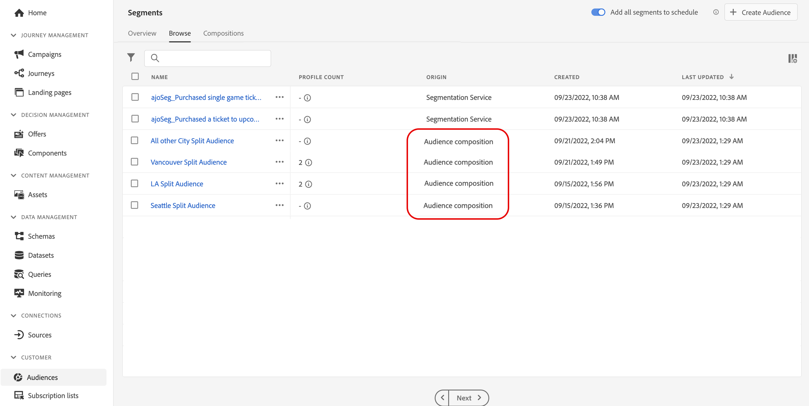

# 存取及管理對象 {#access-manage-audiences}

>[!BEGINSHADEBOX]

此文件提供如何在 Adobe Journey Optimizer 中使用對象構成的詳細資訊。 如果您未使用 Adobe Journey Optimizer， [請按一下這裡](https://experienceleague.adobe.com/docs/experience-platform/segmentation/ui/audience-composition.html?lang=zh-Hant)

>[!ENDSHADEBOX]

從以下位置可存取由對象構成產生的對象： **[!UICONTROL 瀏覽]** 索引標籤中的 **[!UICONTROL 受眾]** 功能表。

此索引標籤會列出儲存至Adobe Experience Platform的所有對象。 使用對象組合建立的對象可由 **[!UICONTROL 對象構成]** 來源。

>[!NOTE]
>
>如需Adobe Experience Platform中其他型別對象的詳細資訊，請參閱 [分段服務檔案](https://experienceleague.adobe.com/docs/experience-platform/segmentation/ui/overview.html?lang=zh-Hant).

此 **[!UICONTROL 設定檔計數]** 欄提供有關對象中包含的設定檔數量的資訊。 按一下「i」按鈕，以取得有關計算此資訊日期的詳細資訊。

若要指派自訂或核心資料使用標籤給對象，請按一下省略符號按鈕，然後選取 **[!UICONTROL 管理存取權]**. [深入瞭解物件層級存取控制(OLA)](../administration/object-based-access.md)

<!--
-edit an audience?
-->
