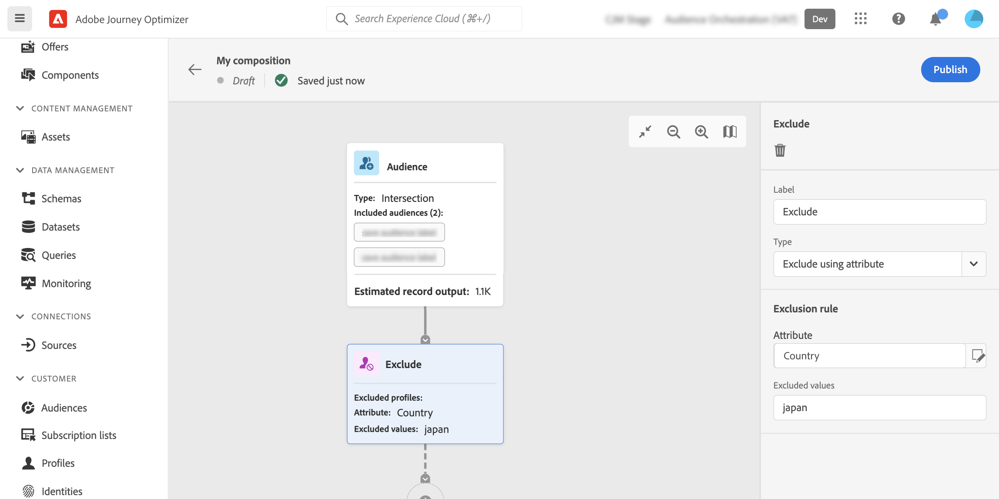

# 使用組合畫布 {#composition-canvas}

>[!BEGINSHADEBOX]

此文件提供如何在 Adobe Journey Optimizer 中使用對象構成的詳細資訊。 如果您沒有使用Adobe Journey Optimizer， [按一下這裡](https://experienceleague.adobe.com/docs/experience-platform/segmentation/ui/audience-composition.html?lang=zh-Hant){target="_blank"}.

>[!ENDSHADEBOX]

對象構成提供視覺畫布，可讓您建立對象並使用各種活動（分割、擴充等）。

在畫布中組成對象的步驟如下：

1. [定義您的開始對象](#starting-audience)
1. [新增一或多個活動](#action-activities)
1. [將結果儲存至新受眾](#save)

## 選取起始對象 {#starting-audience}

建立構成的第一步是選取一或多個現有對象作為構成的基礎。

1. 選取 **[!UICONTROL 對象]** 活動，然後為活動提供標籤。

1. 選擇要鎖定的對象：

   * 按一下 **[!UICONTROL 新增對象]** 按鈕以選取一或多個現有對象，
   * 按一下 **[!UICONTROL 建置規則]** 按鈕以使用建立新的對象定義 [分段服務](https://experienceleague.adobe.com/docs/experience-platform/segmentation/ui/overview.html?lang=zh-Hant).

   

1. 如果選取多個對象，請指定合併這些對象之設定檔的方式：

* **[!UICONTROL 聯集]**：包含所選對象的所有設定檔，
* **[!UICONTROL 交集]**：包含所有選定對象通用的設定檔，
* **[!UICONTROL 排除重疊]**：僅包含屬於其中一個對象的設定檔。 屬於多個對象的設定檔將不會包括在內。

在此範例中，我們要將目標鎖定於屬於金級和銀級受眾的所有設定檔。

選取對象後，預估的個人資料數量會顯示在活動底部。

## 新增活動 {#action-activities}

在選取您的開始對象後新增活動，以精簡您的選取範圍。

若要這麼做，請按一下構成路徑上的+按鈕，然後選取所需活動。 右側窗格隨即開啟，可讓您設定新新增的活動。

可用的活動包括：

* [對象](#audience)：包含屬於一個或多個現有受眾的其他設定檔，
* [排除](#exclude)：排除屬於現有對象的設定檔，或根據特定屬性排除設定檔，
* [擴充](#enrich)：使用來自Adobe Experience Platform資料集的其他屬性來豐富您的受眾，
* [排名](#rank)：根據特定屬性來排名設定檔，指定要保留的設定檔數量，並將其包含在您的構成中，
* [Split](#split)：根據隨機百分比或屬性，將構成分割為多個路徑。

您可以新增最多 **[!UICONTROL 對象]** 和 **[!UICONTROL 排除]** 構成中所需的活動。 不過，之後無法新增其他活動 **[!UICONTROL 排名]** 和 **[!UICONTROL Split]** 活動。

您可以隨時按一下右窗格中的刪除按鈕，從畫布中移除活動。  如果要刪除的活動是構成中其他活動的父項，則會顯示一則訊息，允許您指定是隻刪除所選活動，還是刪除其所有子活動。

### 對象活動 {#audience}

>[!CONTEXTUALHELP]
>id="ajo_ao_audience"
>title="對象活動"
>abstract="對象活動可讓您在組合中包含屬於現有對象的其他設定檔。"

>[!CONTEXTUALHELP]
>id="ajo_ao_merge_types"
>title="合併類型"
>abstract="指定應如何合併選取對象的設定檔。"

此 **[!UICONTROL 對象]** 活動可讓您在構成中包含屬於現有對象的其他設定檔。

此活動的設定與起始的相同 [對象活動](#starting-audience).

### 排除活動 {#exclude}

>[!CONTEXTUALHELP]
>id="ajo_ao_exclude_type"
>title="排除類型"
>abstract="使用排除對象類型以排除屬於現有對象的設定檔。使用屬性類型的排除可讓您根據特定屬性排除設定檔。"

>[!CONTEXTUALHELP]
>id="ajo_ao_exclude"
>title="排除活動"
>abstract="排除活動可讓您透過選取現有對象或使用規則從您的組合中排除設定檔。"

此 **[!UICONTROL 排除]** 活動可讓您從構成中排除設定檔。 有兩種排除型別可用：

* **[!UICONTROL 排除對象]**：排除屬於現有對象的設定檔。

  按一下 **[!UICONTROL 新增對象]** 按鈕，然後選取要排除的對象。

  

* **[!UICONTROL 使用屬性排除]**：根據特定屬性排除設定檔。

  選取要查詢的屬性，然後指定要排除的值。 在此範例中，我們將從首頁地址位於日本的構成設定檔中排除。

  >[!NOTE]
  >
  >只能指定一個排除值。

  

### 擴充活動 {#enrich}

>[!CONTEXTUALHELP]
>id="ajo_ao_enrich"
>title="擴充活動"
>abstract="使用擴充活動透過來自 Adobe Experience Platform 資料集的其他屬性來擴充您的對象。例如，您可以新增與所購買產品相關的資訊 (例如名稱、價格或製造商 ID)，並利用這些資訊來個人化傳遞給對象的內容。"

>[!CONTEXTUALHELP]
>id="ajo_ao_enrich_dataset"
>title="擴充資料集"
>abstract="選取擴充資料集，其中會包含要和對象建立關聯的資料。"

>[!CONTEXTUALHELP]
>id="ajo_ao_enrich_criteria"
>title="擴充條件"
>abstract="選取欄位以用作來源資料集 (即對象) 和擴充資料集之間的調和金鑰。"

>[!CONTEXTUALHELP]
>id="ajo_ao_enrich_attributes"
>title="擴充屬性"
>abstract="從擴充資料集中選取要和對象相關聯的一或多個屬性。一旦發佈組合，這些屬性就會和對象相關聯，並且可以在 Journey Optimizer 行銷活動中加以利用以將傳遞個人化。"

此 **[!UICONTROL 擴充]** 活動可讓您利用來自Adobe Experience Platform資料集的其他屬性來豐富您的對象。 例如，您可以新增與所購買產品相關的資訊 (例如名稱、價格或製造商 ID)，並利用這些資訊來個人化傳遞給對象的內容。

使用時，請注意下列限制 **[!UICONTROL 擴充]** 活動：

* **資料集** 針對擴充必須有記錄型別（相對於事件型別），且不能是系統資料集，也不能標籤為設定檔。 它們必須小於1GB。
* **擴充支援1:1聯結**. 也就是說，如果結合索引鍵在擴充資料集上具有多個相符專案，系統會挑選其中一個相符專案，並將其用於1:1結合。
* **可以在RTCDP目的地中啟用對象**，但其擴充屬性（如果有的話）無法進行。

若要設定活動，請遵循下列步驟：

1. 選取 **[!UICONTROL 擴充資料集]** 包含您要與對象建立關聯的資料。

1. 在 **[!UICONTROL 擴充條件]** 區段，選取要作為來源資料集（即對象）與擴充資料集之間調解金鑰的欄位。 在此範例中，我們使用購買產品的ID作為調解金鑰。

1. 按一下 **[!UICONTROL 新增屬性]** 按鈕，然後從擴充資料集中選取一或多個屬性，以關聯至對象。

   

構成發佈後，選取的屬性會與對象建立關聯，並可在行銷活動中運用以個人化傳送。

### 排名活動 {#rank}

>[!CONTEXTUALHELP]
>id="ajo_ao_ranking"
>title="排名活動"
>abstract="排名可讓您根據特定屬性對設定檔進行排名，並將它們包含在您的組合中。例如，包含忠誠度點數最多的 50 個設定檔。"

>[!CONTEXTUALHELP]
>id="ajo_ao_rank_profilelimit_text"
>title="新增設定檔限制"
>abstract="開啟此選項以指定要包含在組合中的設定檔的最大數量。"

此 **[!UICONTROL 排名]** 活動可讓您根據特定屬性來排名設定檔，並將其包含在您的構成中。 例如，您可以包含忠誠度點數最高的50個設定檔。

1. 選取您要查閱的屬性，並指定排名順序（升序或降序）。

   >[!NOTE]
   >
   >您可以選取具有以下資料型別的屬性：整數、數字、短整數 <!--(other?)-->

1. 切換 **[!UICONTROL 新增設定檔限制]** 選項開啟，並指定構成中要包含的設定檔數目上限。

   

### 分割活動 {#split}

<!-- [!CONTEXTUALHELP]
>id="ajo_ao_control_group_text"
>title="Control Group"
>abstract="Use control groups to isolate a portion of the profiles. This allows you to measure the impact of a marketing activity and make a comparison with the behavior of the rest of the population."-->

>[!CONTEXTUALHELP]
>id="ajo_ao_split"
>title="分割活動"
>abstract="分割活動可讓您將組合分成多個路徑。發佈組合時，會針對每個路徑儲存一個對象到 Adobe Experience Platform 中。"

>[!CONTEXTUALHELP]
>id="ajo_ao_split_type"
>title="分割類型"
>abstract="使用百分比分割類型將設定檔隨機分割為多個路徑。屬性分割類型可讓您根據特定屬性分割設定檔。"

>[!CONTEXTUALHELP]
>id="ajo_ao_split_otherprofiles_text"
>title="其他設定檔"
>abstract="開啟此選項以建立額外路徑，其中剩餘的設定檔和其他路徑中指定的任何條件都不相符。"

此 **[!UICONTROL Split]** 活動可讓您將撰寫分割為多個路徑。

此操作會自動新增 **[!UICONTROL 儲存]** 活動來進行標籤。 發佈組合時，會針對每個路徑儲存一個對象到 Adobe Experience Platform 中。

有兩種分割操作可供使用：

* **[!UICONTROL 百分比分割]**：將設定檔隨機分割成兩個或多個路徑。 例如，您可以將設定檔分割為2個各自為50%的相異路徑。 <!--and add an additional path for control group.-->

  

* **[!UICONTROL 屬性分割]**：根據特定屬性分割設定檔。 在此範例中，我們根據它們的空間型別偏好來分割輪廓。

  

  若要設定以屬性為基礎的分割活動，請遵循下列步驟：

   1. 按一下位於旁的按鈕 **[!UICONTROL 屬性]** 欄位以選取要作為分割條件的屬性。
   1. 視需要新增多個路徑。 針對每個路徑，提供標籤並指定用來決定應包含在該特定路徑中的設定檔的值。

      >[!NOTE]
      >
      >每個路徑只能指定一個值。

   1. 切換至 **[!UICONTROL 其他設定檔]** 選項來建立其他路徑，其中剩餘的設定檔與其他路徑中指定的任何條件都不相符。

## 儲存您的對象 {#save}

設定將儲存至Adobe Experience Platform中的結果對象。

若要這麼做，請選取 **[!UICONTROL 儲存對象]** 每個路徑末尾的活動，然後指定要建立的新對象名稱。

當構成準備就緒後，即可發佈。 [瞭解如何建立組合](create-compositions.md)
