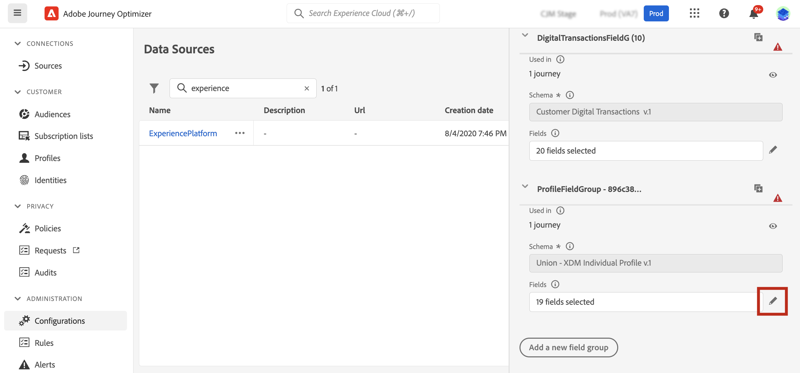
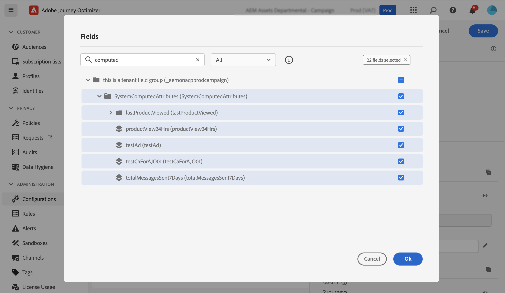
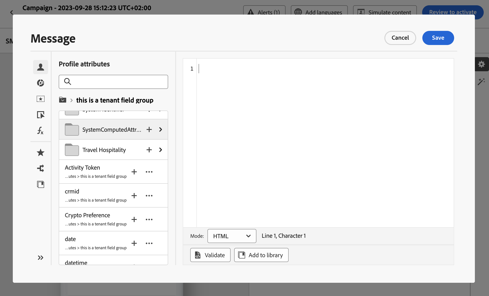

# 使用計算屬性 {#computed-attributes}

計算屬性可讓您將個別行為事件摘要為Adobe Experience Platform上可用的計算設定檔屬性。 這些計算屬性以擷取到Adobe Experience Platform中的設定檔已啟用體驗事件資料集為基礎，並當做儲存在客戶設定檔中的彙總資料點。

每個運算屬性都是設定檔屬性，可運用於歷程及行銷活動中的細分、個人化和啟動。 這項簡化能增強您為客戶提供及時且有意義的個人化體驗的能力。

>[!NOTE]
>
>若要存取計算屬性，您必須具備適當的許可權(**檢視計算屬性** 和 **管理計算屬性**)。

## 建立計算屬性 {#manage}

若要建立計算屬性，請導覽至 **[!UICONTROL 計算的屬性]** 索引標籤中的 **[!UICONTROL 設定檔]** 功能表位於左側。

在此畫面中，您可以建置規則來建構計算屬性，這些規則會在指定的回顧期間內，結合事件屬性、彙總函式。 例如，您可以計算過去三個月中進行的購買總數、識別上週未購買的設定檔所檢視的最新專案，或統計每個設定檔累積的總獎勵點。

規則準備就緒後，請發佈計算屬性以供其他下游服務(包括Journey Optimizer)使用。

有關如何建立和管理計算屬性的詳細資訊，請參閱 [計算屬性檔案](https://experienceleague.adobe.com/docs/experience-platform/profile/computed-attributes/overview.html?lang=zh-Hant)

## 將計算屬性新增至Adobe Experience Platform資料來源 {#source}

為了能夠利用Journey Optimizer中的計算屬性，您必須先將屬性新增至Journey Optimizer **Experience Platform** 資料來源。

Adobe Experience Platform 資料來源會定義和 Adobe 即時客戶設定檔的連線。此資料來源旨在從即時客戶個人檔案服務中擷取個人檔案資料和Experience Events資料。

若要將計算屬性新增至資料來源，請遵循下列步驟：

1. 導覽至 **[!UICONTROL 設定]** 左側功能表，然後按一下 **[!UICONTROL 資料來源]** 卡片。

1. 選取 **[!UICONTROL Experience Platform]** 資料來源。

   

1. 新增 **[!UICONTROL SystemComputedAttribute]** 包含所有已建立計算屬性的欄位群組。

   

計算屬性現在可以在Journey Optimizer中使用。 [瞭解如何在Journey Optimizer中使用計算屬性](#use)

有關如何將欄位群組新增至Adobe Experience Platform資料來源的詳細資訊，請參閱 [本節](../datasource/adobe-experience-platform-data-source.md).

## 在Journey Optimizer中使用計算屬性 {#use}

>[!NOTE]
>
>開始之前，請確定您已將計算屬性新增至Adobe Experience Platform資料來源。 [在本節中進一步瞭解](#source).

計算屬性在Journey Optimizer中提供了一組多樣化的功能。 您可以將它們用於各種用途，例如個人化訊息內容、建立新對象或根據特定計算屬性分割歷程。 例如，您可以在「條件」活動中新增單一計算屬性，根據設定檔過去三週內的總購買量分割歷程路徑。 您也可以顯示每個設定檔最近檢視的專案，以個人化電子郵件。

由於計算屬性是在您的設定檔聯合結構描述中建立的設定檔屬性欄位，因此您可以從 **SystemComputedAttribute** 欄位群組。 從那裡，您可以將計算屬性新增到運算式中，將其視為任何其他設定檔屬性來執行所需的作業。

