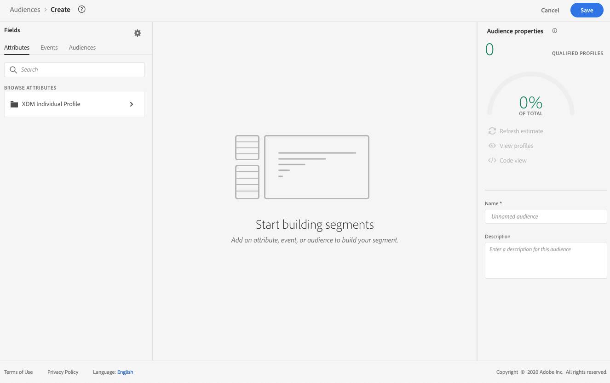
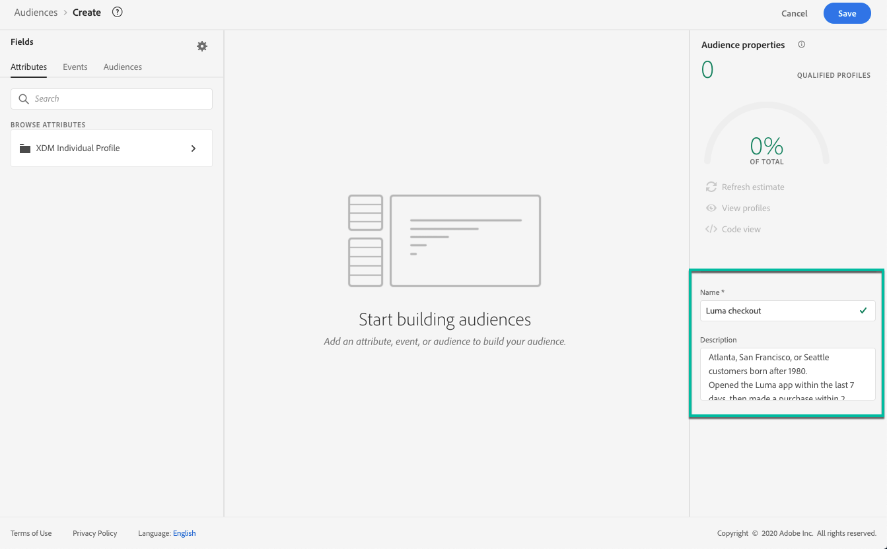
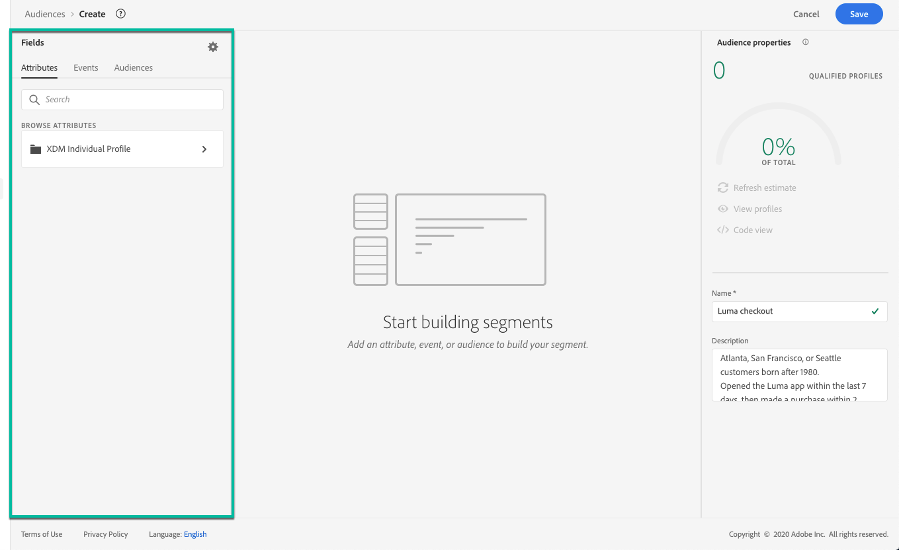
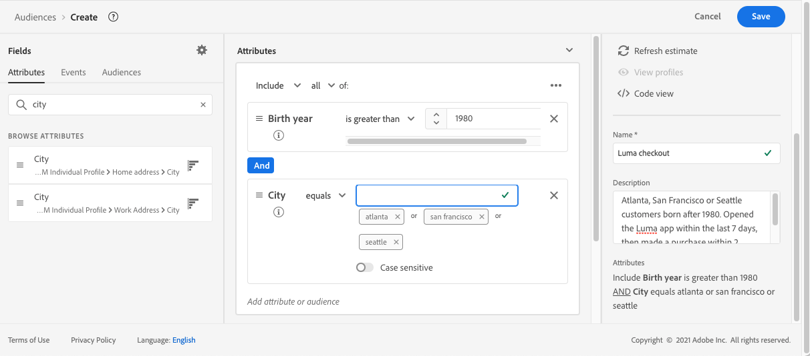
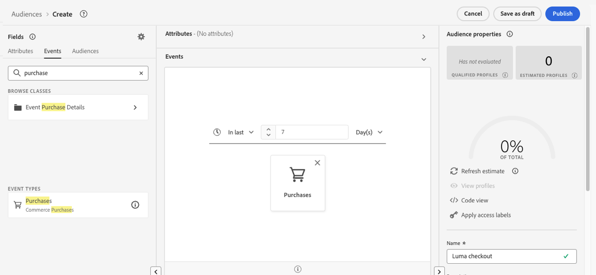
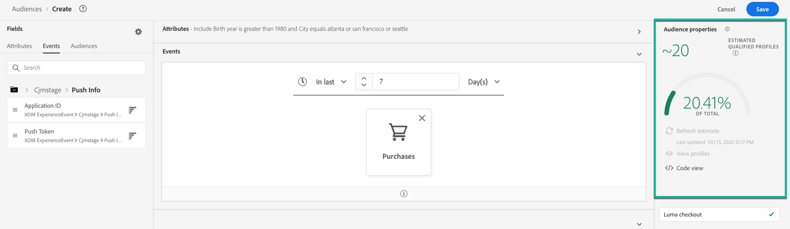
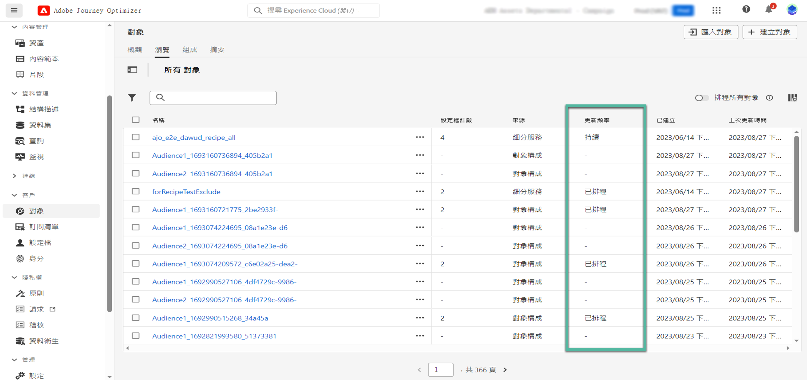

# 建置區段定義 {#build-segments}

>[!CONTEXTUALHELP]
>id="ajo_ao_create_rule"
>title="建立規則"
>abstract="建置規則建立方法讓您可以使用 Adobe Experience Platform Segmentation Service 建立新的對象定義。"

## 建立區段定義 {#create}

在此範例中，您建置對象來鎖定生活在亞特蘭大、舊金山或西雅圖且出生於1980年之後的所有客戶。 所有這些客戶必須在過去7天內購買過。

➡️ [在此影片中瞭解如何建立對象](#video-segment)

1. 從&#x200B;**[!UICONTROL 對象]**&#x200B;功能表，按一下&#x200B;**[!UICONTROL 建立對象]**&#x200B;按鈕並選取&#x200B;**[!UICONTROL 建置規則]**。

   

   區段定義畫面可讓您設定定義對象的所有必要欄位。 在[Segmentation Service檔案](https://experienceleague.adobe.com/en/docs/experience-platform/segmentation/methods/overview){target="_blank"}中瞭解如何設定對象。

   

1. 在&#x200B;**[!UICONTROL 對象屬性]**&#x200B;窗格中，提供對象的名稱和說明（選擇性）。

   

1. 將所需欄位從左窗格拖放至中央工作區，然後視需要加以設定。

   區段定義的基本建置區塊是&#x200B;**屬性**&#x200B;和&#x200B;**事件**。 此外，現有對象中包含的屬性和事件可作為新定義的元件。 [進一步瞭解Segmentation服務檔案](https://experienceleague.adobe.com/en/docs/experience-platform/segmentation/ui/segment-builder#building-blocks){target="_blank"}

   >[!NOTE]
   >
   >請注意，左窗格中可用的欄位會依貴組織已設定的&#x200B;**XDM Individual Profile**&#x200B;和&#x200B;**XDM ExperienceEvent**&#x200B;結構描述而有所不同。  在[Experience Data Model (XDM)檔案](https://experienceleague.adobe.com/docs/experience-platform/xdm/home.html?lang=zh-Hant){target="_blank"}中進一步瞭解。

   

   在此範例中，我們需要依賴&#x200B;**屬性**&#x200B;和&#x200B;**事件**&#x200B;欄位來建置對象：

   * **屬性**：在1980年後出生的亞特蘭大、舊金山或西雅圖的設定檔。

     

   * **事件**：過去7天內購買過的設定檔。

     

1. 當您在工作區中新增及設定新欄位時，**[!UICONTROL 對象屬性]**&#x200B;窗格會自動更新，內含屬於該對象的預估設定檔資訊。

   

1. 對象準備就緒後，按一下&#x200B;**[!UICONTROL 儲存]**。 它會顯示在Adobe Experience Platform對象清單中。 請注意，搜尋列可協助您搜尋清單中的特定對象。

對象現在已準備好用於您的歷程。 如需詳細資訊，請參閱[本區段](../audience/about-audiences.md)。

## 客群評估方法 {#evaluation-method-in-journey-optimizer}

在Adobe Journey Optimizer中，使用下列三種評估方法之一，從區段定義產生對象。

+++ 串流區段

當新資料流入系統時，對象的設定檔清單會即時保持最新。

串流細分是持續進行的資料選擇流程，其會根據使用者活動來更新客群。 在建置區段定義並儲存產生的客群後，區段定義會套用至傳入 Journey Optimizer 的資料。 這表示當個人設定檔資料變更時，將會在對象中新增或移除該個人，以確保您的目標對象永遠相關。 [在Adobe Experience Platform檔案中進一步瞭解](https://experienceleague.adobe.com/docs/experience-platform/segmentation/ui/streaming-segmentation.html){target="_blank"}。

>[!IMPORTANT]
>
>自2024年11月1日起，串流區段不再支援使用來自Journey Optimizer追蹤和意見回應資料集的&#x200B;**傳送**&#x200B;和&#x200B;**開啟**&#x200B;事件。
>
>* 此變更適用於所有客戶沙箱和組織。
>* 只有傳送和開啟的事件會受到影響：點按次數和其他追蹤事件仍可用於串流細分。
>* 這項變更僅適用於串流區段。 傳送和開啟事件仍可用於批次區段，但如果包含在串流區段中，則會以批次方式評估它們。 此外，此變更也會影響排除事件以及傳送事件產生的退回/延遲事件。
>* 追蹤資料收集不受影響。 系統仍會照常收集傳送和開啟的事件。
>* 歷程中的反應事件不受此變更的影響。

+++

+++ 批次分段

每24小時評估對象的設定檔清單。

批次細分透過區段定義一次處理所有設定檔資料，建立對象的快照，可儲存和匯出以供使用。 與串流細分不同，批次細分不會持續即時更新對象清單。 在批次程式後傳入的新資料，在下一個批次程式前不會反映在對象中。 嘗試強制立即更新不會覆寫每日週期。 如需立即的增量更新，請考慮使用串流或隨選細分選項。

如需詳細資訊，請參閱[Adobe Experience Platform劃分服務檔案](https://experienceleague.adobe.com/docs/experience-platform/segmentation/home.html#batch){target="_blank"}

+++

+++ 邊緣分段

Edge區段能在Adobe Experience Platform中即時評估[邊緣](https://experienceleague.adobe.com/docs/experience-platform/edge/home.html){target="_blank"}的區段，啟用相同頁面和下一頁個人化使用案例。 目前只有選取的查詢型別可使用邊緣分段進行評估。 如需詳細資訊，請參閱[Adobe Experience Platform劃分服務檔案](https://experienceleague.adobe.com/docs/experience-platform/segmentation/ui/edge-segmentation.html#query-types){target="_blank"}

+++

如果您知道要使用的評估方法，請使用下拉式清單選取它。 您也可以按一下帶有放大鏡的瀏覽圖示資料夾圖示，以檢視可用區段定義評估方法的清單。 如需詳細資訊，請參閱[Adobe Experience Platform Segmentation Service檔案](https://experienceleague.adobe.com/docs/experience-platform/segmentation/ui/segment-builder.html#segment-properties){target="_blank"}。

<!--The determination between batch segmentation and streaming segmentation is made by the system for each audience, based on the complexity and the cost of evaluating the segment definition rule. You can view the evaluation method for each audience in the **[!UICONTROL Evaluation method]** column of the audience list.
    

>[!NOTE]
>
>If the **[!UICONTROL Evaluation method]** column does not display, you  need to add it using configuration button on the top right of the list.-->

在您首次定義對象後，設定檔將在其符合資格時新增到對象。 最多可能需要 24 小時才能從先前的資料回填客群。 回填客群之後，該客群會持續保持在最新狀態，並隨時準備好進行目標定位。

## 彈性的受眾評估 {#flexible}

Adobe Experience Platform受眾入口網站可讓您依需求針對選取的受眾執行細分工作，以確保在Journey Optimizer歷程和行銷活動中定位受眾之前，您始終擁有最新的受眾資料。

透過彈性的對象評估，您可以：

1. 根據您的最新資料建立全新的區段。
1. 即時評估對象以確保準確性。 若要這麼做，請選擇您要評估的對象，然後選取「評估對象」，前提是這些對象符合特定條件（例如以人物為基礎、分段服務來源）。
1. 在Adobe Journey Optimizer行銷活動或歷程中使用評估過的對象來精確鎖定目標。

您可以一次評估最多20個對象，不符合資格的對象會自動排除。 如需詳細資訊，請參閱[Adobe Experience Platform Segmentation Service檔案](https://experienceleague.adobe.com/en/docs/experience-platform/segmentation/ui/audience-portal#flexible-audience-evaluation)。

## 作法影片{#video-segment}

瞭解Journey Optimizer如何使用規則產生閱聽眾，並瞭解如何使用屬性、事件和現有閱聽眾來建立閱聽眾。

>[!VIDEO](https://video.tv.adobe.com/v/3425020?quality=12)
