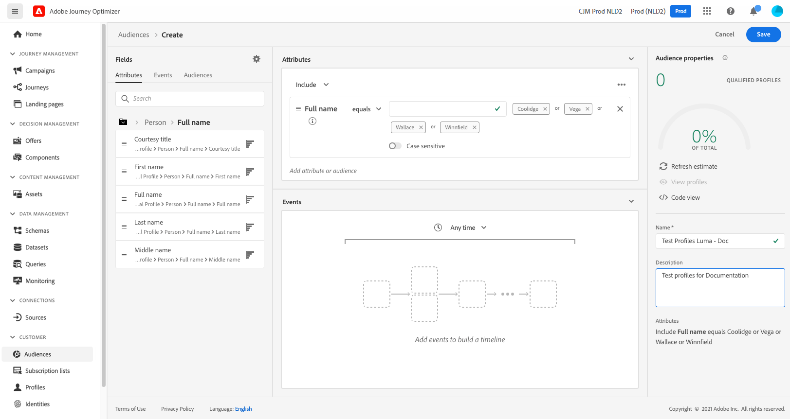

# 建立測試設定檔 {#create-test-profiles}

使用時，需要測試設定檔 [測試模式](../building-journeys/testing-the-journey.md) 在歷程中，以及 [預覽和測試您的內容](../email/preview.md).

有數種方式可建立測試設定檔。 您可以在此頁面中找到下列詳細資訊：

* 開啟 [現有設定檔](#turning-profile-into-test) 放入測試設定檔

* 上傳以建立測試設定檔 [csv檔案](#create-test-profiles-csv) 或使用 [API呼叫](#create-test-profiles-api).

  除了這兩種方法外，Adobe Journey Optimizer也隨附特定的 [產品內使用案例](#use-case-1) 以利建立測試設定檔。

您也可以在現有資料集中上傳json檔案。 如需詳細資訊，請參閱 [資料擷取檔案](https://experienceleague.adobe.com/docs/experience-platform/ingestion/tutorials/ingest-batch-data.html#add-data-to-dataset){target="_blank"}.

請注意，建立測試設定檔類似於在Adobe Experience Platform中建立一般設定檔。 如需詳細資訊，請參閱 [即時客戶個人檔案檔案](https://experienceleague.adobe.com/docs/experience-platform/profile/home.html?lang=zh-Hant){target="_blank"}.

➡️ [在本影片中瞭解如何建立測試設定檔](#video)

## 先決條件 {#test-profile-prerequisites}

為了能夠建立設定檔，您首先需要在Adobe中建立結構描述和資料集 [!DNL Journey Optimizer].

至 **建立結構描述**，請遵循下列步驟：

1. 在「資料管理」功能表區段中，按一下 **[!UICONTROL 結構描述]**.
   
1. 按一下 **[!UICONTROL 建立結構描述]**，然後選取結構描述型別，例如 **XDM個別設定檔**.
   
1. 選取適當的欄位群組。 請務必新增 **設定檔測試詳細資料** 欄位群組。
   
完成後，按一下 **[!UICONTROL 新增欄位群組]**：欄位群組清單會顯示在結構描述概觀畫面上。
   

   >[!NOTE]
   >
   >* 按一下結構描述名稱以變更它並更新其屬性。
   >
   >* 按一下 **[!UICONTROL 新增]** 欄位群組區段中的按鈕，以選取要新增到結構描述中的其他欄位群組

1. 在欄位清單中，按一下要定義為主要身分的欄位。
   
1. 在 **[!UICONTROL 欄位屬性]** 右窗格，核取 **[!UICONTROL 身分]** 和 **[!UICONTROL 主要身分]** 選項並選取名稱空間。 如果您希望主要身分識別是電子郵件地址，請選擇 **[!UICONTROL 電子郵件]** 名稱空間。 按一下&#x200B;**[!UICONTROL 套用]**。
   
1. 選取結構描述並啟用 **[!UICONTROL 設定檔]** 中的選項 **[!UICONTROL 結構描述屬性]** 窗格。
   
1. 按一下&#x200B;**儲存**。

>[!NOTE]
>
>如需建立結構的詳細資訊，請參閱 [XDM檔案](https://experienceleague.adobe.com/docs/experience-platform/xdm/ui/resources/schemas.html#prerequisites){target="_blank"}.

然後您需要 **建立資料集** 將匯入設定檔的位置。 請按照以下步驟操作：

1. 瀏覽至 **[!UICONTROL 資料集]**，然後按一下 **[!UICONTROL 建立資料集]**.
   
1. 選擇 **[!UICONTROL 從結構描述建立資料集]**.
   
1. 選取先前建立的結構描述，然後按一下 **[!UICONTROL 下一個]**.
   
1. 選擇名稱，然後按一下 **[!UICONTROL 完成]**.
   
1. 啟用 **[!UICONTROL 設定檔]** 選項。
   

>[!NOTE]
>
> 如需建立資料集的詳細資訊，請參閱 [目錄服務檔案](https://experienceleague.adobe.com/docs/experience-platform/catalog/datasets/user-guide.html#getting-started){target="_blank"}.

## 產品內使用案例{#use-case-1}

從Adobe Journey Optimizer首頁，您可以運用產品使用案例中的測試設定檔。 此使用案例有助於建立測試設定檔，用於在發佈前測試歷程。


按一下&#x200B;**[!UICONTROL 開始]**&#x200B;按鈕以開始使用案例。

需要下列資訊：

1. **身分名稱空間**：此 [身分名稱空間](../audience/get-started-identity.md) 用於唯一識別測試設定檔。 例如，如果電子郵件用於識別測試設定檔，則身分名稱空間 **電子郵件** 應選取。 如果唯一識別碼是電話號碼，則為身分名稱空間 **電話** 應選取。

2. **CSV檔案**：包含要建立的測試設定檔清單的逗號分隔檔案。 使用案例需要預先定義的CSV檔案格式，其中包含要建立的測試設定檔清單。 檔案中的每一列都應以下列正確順序包含以下欄位：

   1. **人員Id**：測試設定檔的唯一識別碼。 此欄位的值應該反映已選取的身分名稱空間。 (例如，如果 **電話** 為身分名稱空間選取，則此欄位的值應為電話號碼。 同樣地，如果 **電子郵件** ，則此欄位的值應為電子郵件)
   1. **電子郵件地址**：測試設定檔電子郵件地址。 (此 **人員Id** 欄位和 **電子郵件地址** 如果符合以下條件，欄位可能包含相同的值 **電子郵件** 被選取為身分名稱空間)
   1. **名字**：測試設定檔名字。
   1. **姓氏**：測試設定檔姓氏。
   1. **城市**：測試設定檔居住城市
   1. **國家**：測試設定檔居住國家/地區
   1. **性別**：測試設定檔性別。 可用的值包括 **男性**， **女性** 和 **non_speciled**

選取身分名稱空間並根據上述格式提供CSV檔案後，請按一下 **[!UICONTROL 執行]** 按鈕。 使用案例可能需要幾分鐘才能完成。 一旦使用案例完成處理和建立測試設定檔後，將傳送通知以通知使用者。

>[!NOTE]
>
>測試設定檔可能會覆寫現有設定檔。 在執行使用案例之前，請確定CSV僅包含測試設定檔，並且是針對正確的沙箱執行。

## 將設定檔轉換為測試設定檔{#turning-profile-into-test}

您可以將現有的設定檔轉換為測試設定檔：您可以使用建立設定檔時所用的相同方式來更新設定檔屬性。

一個簡單的方法是使用 **[!UICONTROL 更新設定檔]** 歷程中的動作活動並變更 **testProfile** 從false到true的布林值欄位。

您的歷程將由 **[!UICONTROL 讀取對象]** 和 **[!UICONTROL 更新設定檔]** 活動。 您首先需要建立受眾，將目標定位為您要轉換為測試設定檔的設定檔。

>[!NOTE]
>
> 因為您將更新 **testProfile** 欄位，選擇的設定檔必須包含此欄位。 相關結構描述必須具有 **設定檔測試詳細資料** 欄位群組。 請參閱[本節](../audience/creating-test-profiles.md#test-profiles-prerequisites)。

1. 瀏覽至 **受眾**，則 **建立對象**，位於右上方。
   
1. 定義對象名稱並建置對象：選擇欄位和值以目標定位您想要的設定檔。
   
1. 按一下 **儲存** 並檢查對象是否正確鎖定設定檔。
   

   >[!NOTE]
   >
   > 對象計算可能需要一些時間。 進一步瞭解中的對象 [本節](../audience/about-audiences.md).

1. 現在建立新歷程，並從開始 **[!UICONTROL 讀取對象]** 協調活動。
1. 選擇先前建立的對象和設定檔使用的名稱空間。
   
1. 新增 **[!UICONTROL 更新設定檔]** 動作活動。
1. 選取結構描述，然後 **testProfile** 欄位、資料集並將值設為 **True**. 若要執行此動作，請在 **[!UICONTROL 值]** 欄位，按一下 **畫筆** 圖示選取 **[!UICONTROL 進階模式]** 並輸入 **true**.
   
1. 點擊&#x200B;**[!UICONTROL 發佈]**。
1. 在 **[!UICONTROL 受眾]** 區段，檢查設定檔是否已正確更新。
   

   >[!NOTE]
   >
   > 如需詳細資訊，請參閱 **[!UICONTROL 更新設定檔]** 活動，請參閱 [本節](../building-journeys/update-profiles.md).

## 使用csv檔案建立測試設定檔{#create-test-profiles-csv}

在Adobe Experience Platform中，您可以上傳包含不同設定檔欄位的csv檔案來建立設定檔。 這是最簡單的方法。

1. 使用試算表軟體建立簡單的csv檔案。
1. 為每個所需欄位新增一欄。 請務必新增主要身分欄位（以上範例中為「personID」），並將「testProfile」欄位設為「true」。
   
1. 為每個設定檔新增一行，並填入每個欄位的值。
   
1. 將試算表儲存為csv檔案。 請務必使用逗號做為分隔符號。
1. 瀏覽至Adobe Experience Platform **工作流程**.
   
1. 選擇 **將CSV對應至XDM結構描述**，然後按一下 **Launch**.
   
1. 選取您要將設定檔匯入的資料集。 按&#x200B;**「下一步」**。
   
1. 按一下 **選擇檔案** 並選取您的csv檔案。 上傳檔案時，按一下 **下一個**.
   
1. 將來源csv欄位對應到結構描述欄位，然後按一下 **完成**.
   
1. 資料匯入隨即開始。 狀態將移自 **處理中** 至 **成功**. 按一下 **預覽資料集**，位於右上方。
   
1. 檢查測試設定檔是否已正確新增。
   

您的測試設定檔已新增，現在可用於測試歷程。 請參閱[本節](../building-journeys/testing-the-journey.md)。
>[!NOTE]
>
> 如需csv匯入的詳細資訊，請參閱 [資料擷取檔案](https://experienceleague.adobe.com/docs/experience-platform/ingestion/tutorials/map-a-csv-file.html#tutorials){target="_blank"}.

## 使用API呼叫建立測試設定檔{#create-test-profiles-api}

您也可以透過API呼叫建立測試設定檔。 進一步瞭解 [Adobe Experience Platform檔案](https://experienceleague.adobe.com/docs/experience-platform/profile/home.html?lang=zh-Hant){target="_blank"}.

您必須使用包含「設定檔測試詳細資訊」欄位群組的設定檔結構描述。 testProfile旗標是此欄位群組的一部分。
建立設定檔時，請務必傳遞值： testProfile = true。

請注意，您也可以更新現有的設定檔，將其testProfile標幟變更為「true」。

以下是為建立測試設定檔而進行API呼叫的範例：

```
curl -X POST \
'https://dcs.adobedc.net/collection/xxxxxxxxxxxxxx' \
-H 'Cache-Control: no-cache' \
-H 'Content-Type: application/json' \
-H 'Postman-Token: xxxxx' \
-H 'cache-control: no-cache' \
-H 'x-api-key: xxxxx' \
-H 'x-gw-ims-org-id: xxxxx' \
-d '{
"header": {
"msgType": "xdmEntityCreate",
"msgId": "xxxxx",
"msgVersion": "xxxxx",
"xactionid":"xxxxx",
"datasetId": "xxxxx",
"imsOrgId": "xxxxx",
"source": {
"name": "Postman"
},
"schemaRef": {
"id": "https://example.adobe.com/mobile/schemas/xxxxx",
"contentType": "application/vnd.adobe.xed-full+json;version=1"
}
},
"body": {
"xdmMeta": {
"schemaRef": {
"contentType": "application/vnd.adobe.xed-full+json;version=1"
}
},
"xdmEntity": {
"_id": "xxxxx",
"_mobile":{
"ECID": "xxxxx"
},
"testProfile":true
}
}
}'
```

## 操作說明影片 {#video}

瞭解如何建立測試設定檔。

>[!VIDEO](https://video.tv.adobe.com/v/334236?quality=12)
