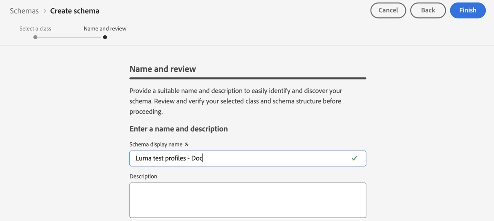
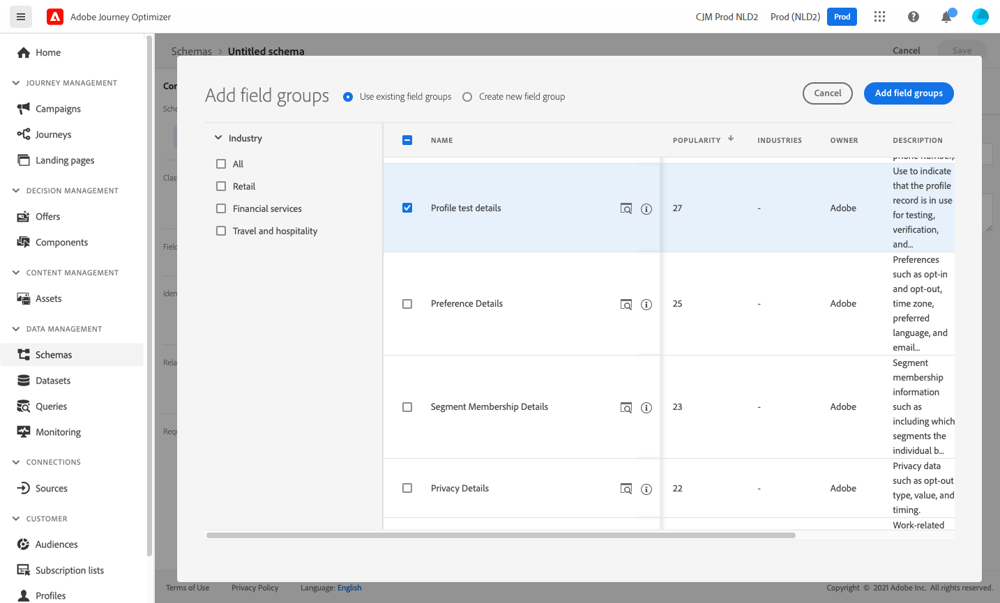
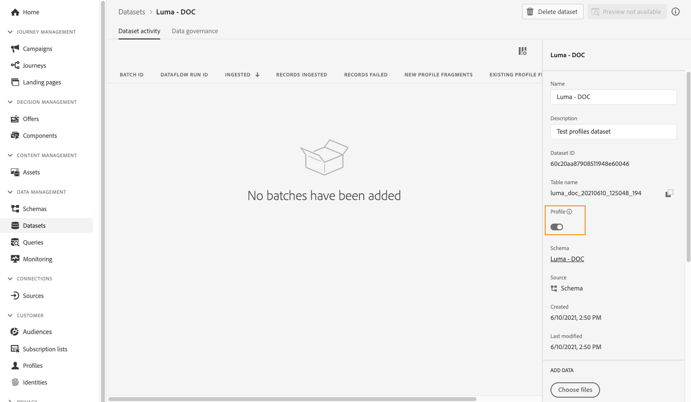

# 建立測試輪廓 {#create-test-profiles}

在歷程中使用[測試模式](../building-journeys/testing-the-journey.md)時需要測試設定檔，以及[預覽和測試您的內容](../content-management/preview-test.md)。

>[!NOTE]
>
>[!DNL Journey optimizer]允許測試您內容的不同變體，方法是預覽內容並使用從CSV或JSON檔案上傳或手動新增的範例輸入資料傳送校樣。 [瞭解如何使用範例輸入資料測試您的內容](../test-approve/simulate-sample-input.md)

建立測試設定檔有數種方式。 您可以在此頁面找到下列詳細資訊：

* 將[現有的設定檔](#turning-profile-into-test)轉換為測試設定檔

* 藉由上傳[CSV檔案](#create-test-profiles-csv)或使用[API呼叫](#create-test-profiles-api)來建立測試設定檔。

  Adobe Journey Optimizer也提供特定的[產品內使用案例](#use-case-1)，以協助建立測試設定檔。

您可以將JSON檔案上傳至現有資料集。 如需詳細資訊，請參閱[資料擷取檔案](https://experienceleague.adobe.com/docs/experience-platform/ingestion/tutorials/ingest-batch-data.html#add-data-to-dataset){target="_blank"}。

請注意，建立測試設定檔與在Adobe Experience Platform中建立一般設定檔類似。 如需詳細資訊，請參閱[即時客戶個人檔案檔案](https://experienceleague.adobe.com/docs/experience-platform/profile/home.html?lang=zh-Hant){target="_blank"}。

➡️ [在此影片中瞭解如何建立測試設定檔](#video)

## 先決條件 {#test-profile-prerequisites}

若要建立設定檔，您必須先在Adobe [!DNL Journey Optimizer]中建立結構描述和資料集。

### 建立結構描述

若要&#x200B;**建立結構描述**，請執行下列步驟：

1. 在「資料管理」功能表區段中，按一下&#x200B;**[!UICONTROL 結構描述]**。
   
1. 按一下&#x200B;**[!UICONTROL 建立結構描述]**，在右上角選取結構描述型別，例如&#x200B;**個別設定檔**，然後按一下&#x200B;**下一步**。
   
1. 輸入結構描述的名稱，然後按一下&#x200B;**完成**。
   
1. 在&#x200B;**欄位群組**&#x200B;區段中，按一下左側的&#x200B;**新增**&#x200B;並選取適當的欄位群組。 請確定您已新增&#x200B;**設定檔測試詳細資料**欄位群組。
   
完成後，按一下**[!UICONTROL 新增欄位群組]**：欄位群組清單會顯示在結構描述概觀畫面上。
   

   >[!NOTE]
   >
   >按一下結構描述的名稱以更新其屬性。

1. 在欄位清單中，按一下要定義為主要身分的欄位。
   
1. 在&#x200B;**[!UICONTROL 欄位屬性]**&#x200B;右側窗格中，檢查&#x200B;**[!UICONTROL 身分]**&#x200B;和&#x200B;**[!UICONTROL 主要身分]**&#x200B;選項，並選取名稱空間。 如果您希望主要身分識別是電子郵件地址，請選擇&#x200B;**[!UICONTROL 電子郵件]**&#x200B;名稱空間。 按一下&#x200B;**[!UICONTROL 套用]**。
   
1. 選取結構描述並啟用&#x200B;**[!UICONTROL 結構描述屬性]**&#x200B;窗格中的&#x200B;**[!UICONTROL 設定檔]**選項。
   
1. 按一下&#x200B;**儲存**。

>[!NOTE]
>
>如需建立結構描述的詳細資訊，請參閱[XDM檔案](https://experienceleague.adobe.com/docs/experience-platform/xdm/ui/resources/schemas.html#prerequisites){target="_blank"}。

### 建立資料集

然後，您需要&#x200B;**建立將匯入設定檔的資料集**。 請依照下列步驟操作：

1. 瀏覽至&#x200B;**[!UICONTROL 資料集]**，然後按一下&#x200B;**[!UICONTROL 建立資料集]**。
   
1. 選擇&#x200B;**[!UICONTROL 從結構描述建立資料集]**。
   
1. 選取先前建立的結構描述，然後按一下&#x200B;**[!UICONTROL 下一步]**。
   
1. 選擇名稱，然後按一下&#x200B;**[!UICONTROL 完成]**。
   
1. 啟用&#x200B;**[!UICONTROL 設定檔]**選項。
   

>[!NOTE]
>
> 如需建立資料集的詳細資訊，請參閱[目錄服務檔案](https://experienceleague.adobe.com/docs/experience-platform/catalog/datasets/user-guide.html#getting-started){target="_blank"}。

## 產品內使用案例{#use-case-1}

從Adobe Journey Optimizer首頁，您可以利用產品使用案例中的測試設定檔。 此使用案例有助於建立測試設定檔，用於在發佈前測試歷程。


按一下&#x200B;**[!UICONTROL 開始]**&#x200B;按鈕以開始使用案例。

需要下列資訊：

1. **身分名稱空間**：用來唯一識別測試設定檔的[身分名稱空間](../audience/get-started-identity.md)。 例如，如果使用電子郵件來識別測試設定檔，則應選取身分名稱空間&#x200B;**電子郵件**。 如果唯一識別碼是電話號碼，則應該選取識別名稱空間&#x200B;**電話**。

2. **CSV檔案**：包含要建立之測試設定檔清單的逗號分隔檔案。 使用案例需要預先定義的CSV檔案格式，其中包含要建立的測試設定檔清單。 檔案中的每一列應包括下列正確順序的欄位：

   1. **人員ID**：測試設定檔的唯一識別碼。 此欄位的值應該反映選取的身分名稱空間。 (例如，如果為身分名稱空間選取&#x200B;**電話**，則此欄位的值應為電話號碼。 同樣地，如果選取&#x200B;**電子郵件**，則此欄位的值應為電子郵件)
   1. **電子郵件地址**：測試設定檔電子郵件地址。 （**人員ID**&#x200B;欄位和&#x200B;**電子郵件地址**&#x200B;欄位可能包含相同的值，如果選取&#x200B;**電子郵件**&#x200B;做為身分名稱空間）
   1. **名字**：測試設定檔名字。
   1. **姓氏**：測試設定檔姓氏。
   1. **城市**：測試設定檔居住城市
   1. **國家/地區**：測試設定檔居住國家/地區
   1. **性別**：測試設定檔性別。 可用的值為&#x200B;**男性**、**女性**&#x200B;和&#x200B;**非指定**

選取身分名稱空間並根據上述格式提供CSV檔案後，請選取右上方的&#x200B;**[!UICONTROL 執行]**&#x200B;按鈕。 使用案例可能需要幾分鐘才能完成。 一旦使用案例完成處理和建立測試設定檔，就會傳送通知以通知使用者。

>[!NOTE]
>
>測試設定檔可能會覆寫現有設定檔。 在執行使用案例之前，請確定CSV僅包含測試設定檔，並且是對正確的沙箱執行。

<!-- Removed as asked in DOCAC-13605 AJO Test Profiles Using a Journey should be removed
## Turn a profile into a test profile{#turning-profile-into-test}

You can turn an existing profile into a test profile: you can update profiles attributes in the same way as when you create a profile. 

A simple way to do this is by using an **[!UICONTROL Update Profile]** action activity in a journey and change the **testProfile** boolean field from false to true.

Your journey will be composed of a **[!UICONTROL Read Audience]** and an **[!UICONTROL Update Profile]** activity. You first need to create an audience targeting the profiles you want to turn into test profiles. 

>[!NOTE]
>
> Since you will be updating the **testProfile** field, the chosen profiles must include this field. The related schema must have the **Profile test details** field group. See [this section](../audience/creating-test-profiles.md#create-test-profiles).

1. Browse to **Audiences**, then **Create audience**, in the top right.
     
1. Define a name for your audience and build the audience: choose the field(s) and value(s) to target the profiles you want.
     
1. Click **Save** and check that the profiles are correctly targeted by the audience.
     

    >[!NOTE]
    >
    > Audience calculation can take some time. Learn more about audiences in [this section](../audience/about-audiences.md).

1. Now create a new journey and start with a **[!UICONTROL Read Audience]** orchestration activity.
1. Choose the previously created audience and the namespace that your profiles use.
    
1. Add an **[!UICONTROL Update Profile]** action activity. 
1. Select the schema, the **testProfiles** field, the dataset and set the value to **True**. To perform this, in the **[!UICONTROL VALUE]** field, click the **Pen** icon on the right, select **[!UICONTROL Advanced mode]** and enter **true**.
    
1. Click **[!UICONTROL Publish]**.
1. In the **[!UICONTROL Audiences]** section, check that the profiles have been correctly updated.
    

    >[!NOTE]
    >
    > For more information on the **[!UICONTROL Update Profile]** activity, refer to [this section](../building-journeys/update-profiles.md).
-->

## 使用csv檔案建立測試設定檔{#create-test-profiles-csv}

在Adobe Experience Platform中，您可以上傳包含不同設定檔欄位的csv檔案來建立設定檔至您的資料集。 這是最簡單的方法。

1. 使用試算表軟體建立簡單的csv檔案。
1. 為每個所需欄位新增一欄。 請務必新增主要身分欄位（以上範例中為「personID」），並將「testProfile」欄位設為「true」。
   
1. 為每個設定檔新增一行，並填寫每個欄位的值。
   
1. 將試算表儲存為csv檔案。 請務必使用逗號做為分隔符號。
1. 瀏覽至Adobe Experience Platform **工作流程**。
   
1. 選擇&#x200B;**將CSV對應到XDM結構描述**，然後按一下&#x200B;**啟動**。
   
1. 選取您要將設定檔匯入的資料集。 按一下&#x200B;**下一步**。
   
1. 按一下&#x200B;**選擇檔案**&#x200B;並選取您的csv檔案。 上傳檔案時，按一下&#x200B;**下一步**。
   
1. 將來源csv欄位對應到結構描述欄位，然後按一下&#x200B;**完成**。
   
1. 資料匯入隨即開始。 狀態將從&#x200B;**處理**&#x200B;移至&#x200B;**成功**。 按一下右上角的&#x200B;**預覽資料集**。
   
1. 檢查測試設定檔是否已正確新增。
   

您的測試設定檔已新增，現在可用於測試歷程。 請參閱[本節](../building-journeys/testing-the-journey.md)。


>[!NOTE]
>
>如需csv匯入的詳細資訊，請參閱[資料擷取檔案](https://experienceleague.adobe.com/docs/experience-platform/ingestion/tutorials/map-a-csv-file.html#tutorials){target="_blank"}。
>


## 使用API呼叫建立測試設定檔{#create-test-profiles-api}

您也可以透過API呼叫建立測試設定檔。 若要了解更多資訊，請參閱 [Adobe Experience Platform 文件](https://experienceleague.adobe.com/docs/experience-platform/profile/home.html?lang=zh-Hant){target="_blank"}。

您必須使用包含「設定檔測試詳細資料」欄位群組的設定檔結構描述。 testProfile旗標是此欄位群組的一部分。
建立設定檔時，請務必傳遞值： testProfile = true。

請注意，您也可以更新現有的設定檔，將其testProfile標幟變更為「true」。

以下為建立測試設定檔的API呼叫範例：

```
curl -X POST \
'https://dcs.adobedc.net/collection/xxxxxxxxxxxxxx' \
-H 'Cache-Control: no-cache' \
-H 'Content-Type: application/json' \
-H 'Postman-Token: xxxxx' \
-H 'cache-control: no-cache' \
-H 'x-api-key: xxxxx' \
-H 'x-gw-ims-org-id: xxxxx' \
-d '{
"header": {
"msgType": "xdmEntityCreate",
"msgId": "xxxxx",
"msgVersion": "xxxxx",
"xactionid":"xxxxx",
"datasetId": "xxxxx",
"imsOrgId": "xxxxx",
"source": {
"name": "Postman"
},
"schemaRef": {
"id": "https://example.adobe.com/mobile/schemas/xxxxx",
"contentType": "application/vnd.adobe.xed-full+json;version=1"
}
},
"body": {
"xdmMeta": {
"schemaRef": {
"contentType": "application/vnd.adobe.xed-full+json;version=1"
}
},
"xdmEntity": {
"_id": "xxxxx",
"_mobile":{
"ECID": "xxxxx"
},
"testProfile":true
}
}
}'
```

## 作法影片 {#video}

瞭解如何建立測試設定檔。

>[!VIDEO](https://video.tv.adobe.com/v/334236?quality=12)
