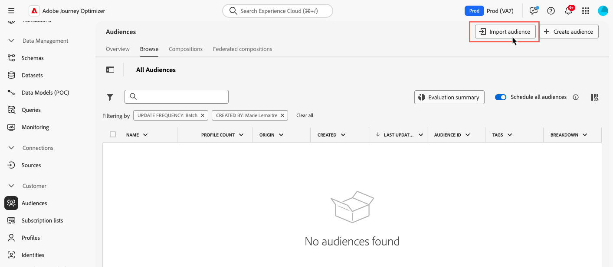

# 自訂上傳 {#custom-upload}

Adobe Experience Platform對象入口網站可讓您使用CSV檔案匯入對象。

在自訂上傳程式期間，指定要用作身分的CSV屬性，以及它對應到的設定檔身分。 這會在對象資料和設定檔之間建立連結。 如果CSV檔案包含在設定檔中找不到的身分值，則會建立具有該身分值的新設定檔。

>[!NOTE]
>
>對於自訂上傳對象，如果循環歷程中啟用了「增量讀取」，則設定檔僅在第一次循環時擷取，因為這些對象已修正。

Adobe Experience Platform [Segmentation Service檔案](https://experienceleague.adobe.com/zh-hant/docs/experience-platform/segmentation/ui/audience-portal#import-audience){target="_blank"}提供了有關如何匯入對象的詳細資訊。

瞭解如何在影片中以CSV格式上傳對象：

>[!VIDEO](https://video.tv.adobe.com/v/3423355?quality=12&captions=chi_hant)
