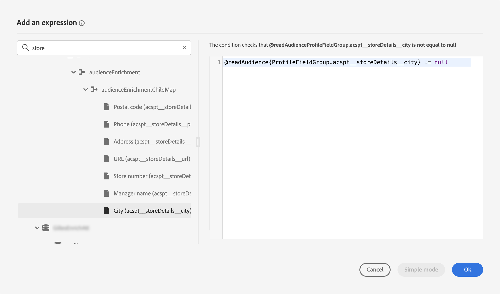
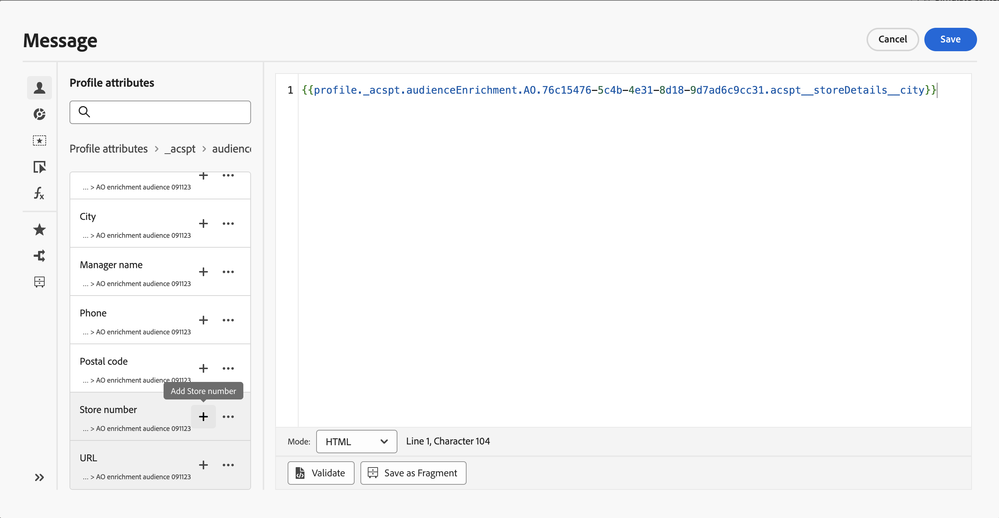

# 使用對象擴充屬性 {#enrichment}

使用構成工作流程、自訂（CSV檔案）對象或同盟對象構成產生的對象為目標時，您可以使用來自這些對象的擴充屬性來建立您的歷程並個人化您的訊息。

>[!NOTE]
>
>在2024年10月1日之前透過CSV檔案自訂上傳建立的對象不符合個人化資格。 若要使用這些對象的屬性並充分利用此功能，請重新建立並重新上傳在此日期之前匯入的任何外部CSV對象。
>
>同意原則不支援擴充屬性。 因此，任何同意原則規則都應該僅以設定檔中找到的屬性為基礎。

您可以使用對象的擴充屬性來執行下列動作：

* **根據運用目標對象擴充屬性的規則，在歷程**&#x200B;中建立多個路徑。 若要這麼做，請使用[讀取對象](../building-journeys/read-audience.md)活動來鎖定對象，然後根據對象的擴充屬性，在[條件](../building-journeys/condition-activity.md)活動中建立規則。

  {width="70%" zoomable="yes"}

* **在個人化編輯器中新增目標對象的擴充屬性，以在歷程或行銷活動中個人化您的訊息**。 [瞭解如何使用個人化編輯器](../personalization/personalization-build-expressions.md)

  {width="70%" zoomable="yes"}

>[!IMPORTANT]
>
>若要從使用構成工作流程建立的對象中使用擴充屬性，請確保將其新增到「ExperiencePlatform」資料Source中的欄位群組。
>
>+++ 瞭解如何將擴充屬性新增至欄位群組
>
>1. 導覽至「管理」>「設定」>「資料來源」。
>1. 選取「Experience Platform」並建立或編輯欄位群組。
>1. 在架構選取器中，選取適當的架構。 結構描述的名稱將遵循以下格式：「audienceId的結構描述：」+對象的ID。 您可以在對象詳細資訊畫面（在對象詳細資訊畫面中）上找到對象ID。
>1. 開啟欄位選擇器，尋找您要新增的擴充屬性，然後選取這些屬性旁邊的核取方塊。
>1. 儲存您的變更。
>1. 將擴充屬性新增至「欄位群組」後，您就可以在Journey Optimizer中於上述位置使用擴充屬性。
>
>有關資料來源的詳細資訊，請參閱以下章節：
>
>* [使用Adobe Experience Platform資料來源](../datasource/adobe-experience-platform-data-source.md)
>* [設定資料來源](../datasource/configure-data-sources.md)
>
>+++

+++ 什麼是擴充屬性？

擴充屬性是內容相關且特定於對象的其他屬性。 它們與設定檔無關，通常用於個人化目的。

擴充屬性會透過對象構成或自訂上傳程式中的擴充活動，連結至對象。

+++

+++ 我可以在哪裡使用Journey Optimizer中的擴充屬性？

可在下列區域運用對象組合中的擴充屬性。 [瞭解如何使用對象擴充屬性](#enrichment)

* 條件活動（歷程）
* 自訂動作屬性（歷程）
* 訊息個人化（歷程與行銷活動）

+++

+++ 如何在歷程中啟用擴充屬性？

若要使用使用使用構成工作流程建立之對象的擴充屬性，請確保將其新增至「ExperiencePlatform」資料Source中的欄位群組。 有關如何將擴充屬性新增至欄位群組的資訊，請參閱[此區段](#enrichment)

+++

+++ 擴充屬性值是否在歷程開始後更新？

目前不支援。 即使在等待或事件節點之後，擴充屬性值仍會維持與歷程開始時的相同。

+++
