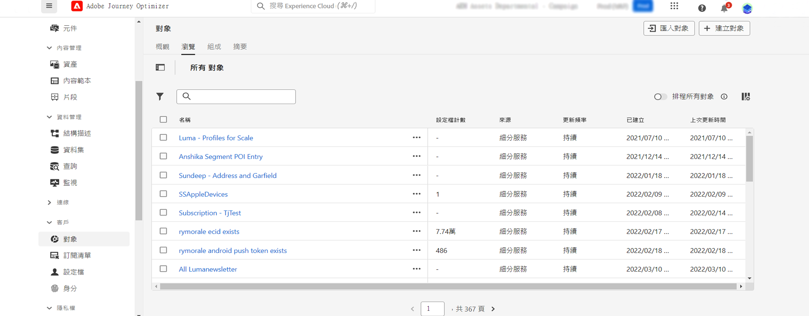
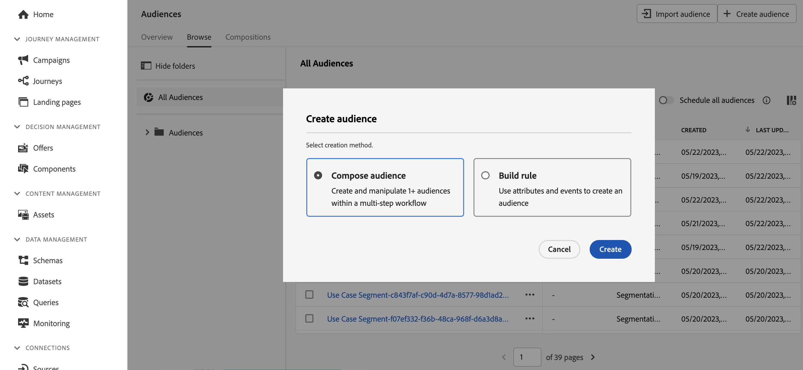
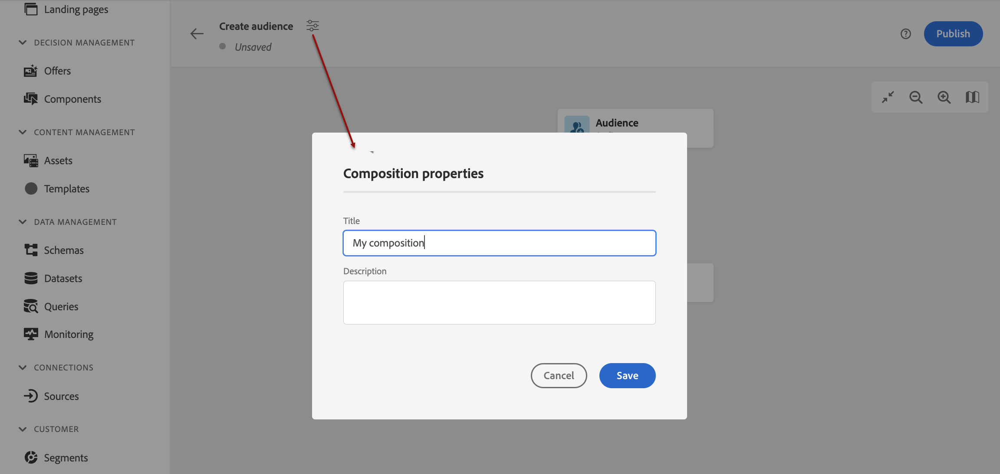
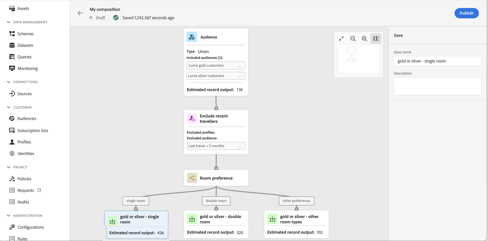
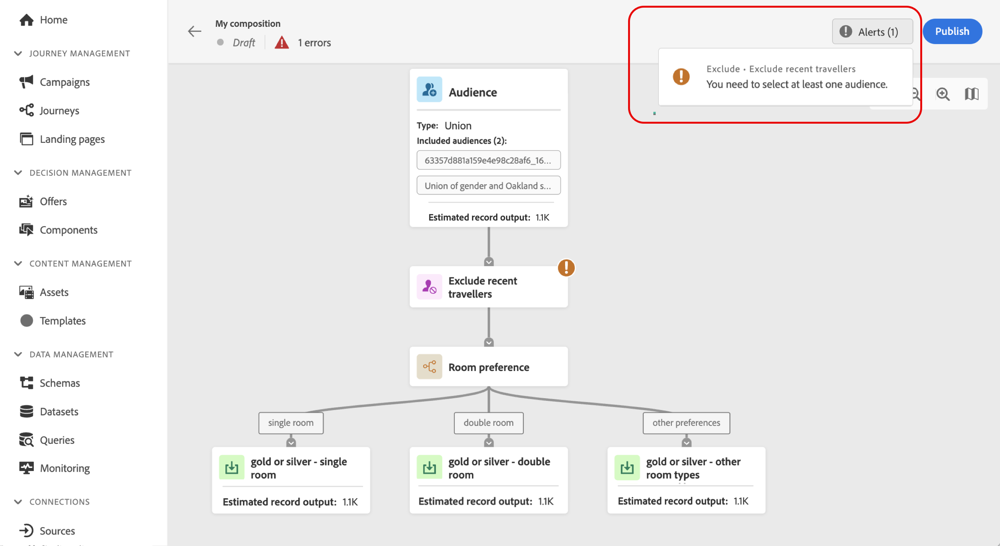
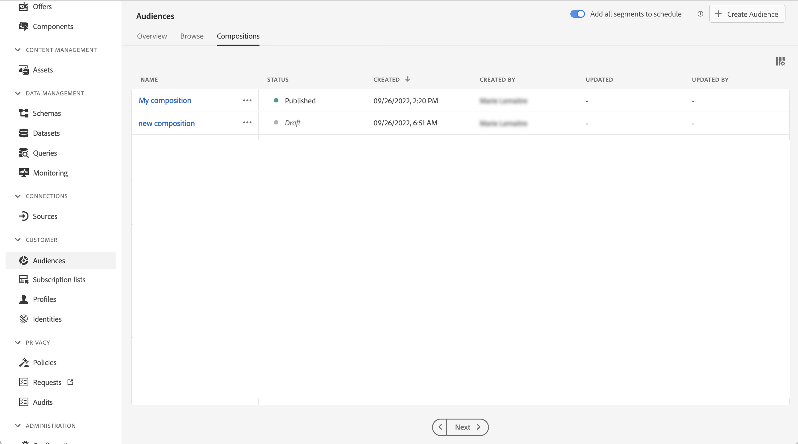

# 開始使用客群構成 {#get-start-audience-composition}

>[!CONTEXTUALHELP]
>id="ajo_ao_create_composition"
>title="建立構成"
>abstract="建立構成工作流程，以將現有的 Adobe Experience Platform 對象合併到視覺化畫布中，並利用各種活動 (分割、排除…) 建立新的對象。"

>[!CONTEXTUALHELP]
>id="ajo_ao_publish"
>title="發佈您的對象"
>abstract="發佈您的構成以將產生的客群儲存到 Adobe Experience Platform 中。"

>[!CONTEXTUALHELP]
>id="ajo_ao_audience"
>title="客群活動"
>abstract="客群活動可讓您在構成中包含屬於現有客群的其他輪廓。"

>[!CONTEXTUALHELP]
>id="ajo_ao_merge_types"
>title="合併類型"
>abstract="指定應如何合併選取客群的設定檔。"

>[!CONTEXTUALHELP]
>id="ajo_ao_exclude_type"
>title="排除類型"
>abstract="使用排除客群類型以排除屬於現有客群的設定檔。使用屬性類型的排除可讓您根據特定屬性排除設定檔。"

>[!CONTEXTUALHELP]
>id="ajo_ao_exclude"
>title="排除活動"
>abstract="排除活動可讓您透過選取現有客群或使用規則從您的構成中排除輪廓。"

>[!CONTEXTUALHELP]
>id="ajo_ao_enrich"
>title="擴充活動"
>abstract="使用擴充活動透過來自 Adobe Experience Platform 資料集的其他屬性來擴充您的客群。例如，您可以新增與所購買產品相關的資訊 (例如名稱、價格或製造商 ID)，並利用這些資訊來個人化傳遞給客群的內容。"

>[!CONTEXTUALHELP]
>id="ajo_ao_enrich_dataset"
>title="擴充資料集"
>abstract="選取擴充資料集，其中會包含要和客群建立關聯的資料。"

>[!CONTEXTUALHELP]
>id="ajo_ao_enrich_criteria"
>title="擴充條件"
>abstract="選取欄位以用作來源資料集 (即客群) 和擴充資料集之間的調和金鑰。"

>[!CONTEXTUALHELP]
>id="ajo_ao_enrich_attributes"
>title="擴充屬性"
>abstract="從擴充資料集中選取要和客群相關聯的一或多個屬性。一旦發佈構成，這些屬性就會和客群相關聯，並且可以在 Journey Optimizer 行銷活動中加以利用以將傳遞個人化。"

>[!CONTEXTUALHELP]
>id="ajo_ao_ranking"
>title="排名活動"
>abstract="排名可讓您根據特定屬性對輪廓進行排名，並將它們包含在您的構成中。例如，包含忠誠度點數最多的 50 個設定檔。"

>[!CONTEXTUALHELP]
>id="ajo_ao_rank_profilelimit_text"
>title="新增設定檔限制"
>abstract="開啟此選項以指定要包含在構成中的輪廓的最大數量。"

<!-- [!CONTEXTUALHELP]
>id="ajo_ao_control_group_text"
>title="Control Group"
>abstract="Use control groups to isolate a portion of the profiles. This allows you to measure the impact of a marketing activity and make a comparison with the behavior of the rest of the population."-->

>[!CONTEXTUALHELP]
>id="ajo_ao_split"
>title="分割活動"
>abstract="分割活動可讓您將構成分成多個路徑。發佈構成時，會針對每個路徑儲存一個客群到 Adobe Experience Platform 中。"

>[!CONTEXTUALHELP]
>id="ajo_ao_split_type"
>title="分割類型"
>abstract="使用百分比分割類型將設定檔隨機分割為多個路徑。屬性分割類型可讓您根據特定屬性分割設定檔。"

>[!CONTEXTUALHELP]
>id="ajo_ao_split_otherprofiles_text"
>title="其他設定檔"
>abstract="若剩餘的設定檔和其他路徑中指定的任何條件都不相符，開啟此選項為剩餘設定檔建立額外路徑。"

>[!BEGINSHADEBOX]

此文件提供如何在 Adobe Journey Optimizer 中使用客群構成的詳細資訊。 如果您是只使用即時客戶輪廓的客戶，且不使用 Adobe Journey Optimizer， 請[按一下這裡](https://experienceleague.adobe.com/docs/experience-platform/segmentation/ui/audience-composition.html?lang=zh-Hant){target="_blank"}。

>[!ENDSHADEBOX]

對象構成可讓您建立&#x200B;**構成工作流程**，您可以在其中將現有Adobe Experience Platform對象結合到視覺畫布中，並利用各種活動（分割、排除……）來建立新對象。

完成後，**產生的對象**&#x200B;會連同現有對象一起儲存到Adobe Experience Platform中，並可在Journey Optimizer行銷活動和歷程中運用於鎖定客戶。 瞭解如何在Journey Optimizer中鎖定對象

>[!IMPORTANT]
>
>* 受眾構成中的受眾和屬性目前無法用於Healthcare Shield或Privacy and Security Shield。
>
>* 擴充屬性尚未與原則執行服務整合。 因此，您套用至擴充屬性的任何資料使用標籤，都不會在Journey Optimizer行銷活動或歷程中強制執行。

可從 Adobe Journey Optimizer **[!UICONTROL 客群]**&#x200B;選單存取客群構成：

* 此&#x200B;**[!UICONTROL 概觀]**&#x200B;標籤提供與貴組織的客群資料相關的關鍵量度專用儀表板。 若要深入了解，請參閱 [Adobe Experience Platform 儀表板指南](https://experienceleague.adobe.com/docs/experience-platform/dashboards/guides/segments.html?lang=zh-Hant)。

* 此&#x200B;**[!UICONTROL 瀏覽]**&#x200B;索引標籤會列出儲存至 Adobe Experience Platform 的所有現有客群。

* 此&#x200B;**[!UICONTROL 構成]**&#x200B;索引標籤可讓您建立構成工作流程，在其中構成並排列客群以建立新客群。

## 建立構成工作流程 {#create}

若要建立構成工作流程，請遵循下列步驟：

1. 存取&#x200B;**[!UICONTROL 對象]**&#x200B;功能表並選取&#x200B;**[!UICONTROL 建立對象]**。

1. 選取&#x200B;**[!UICONTROL 撰寫對象]**。

   

1. 構成畫布會顯示兩個預設活動：

   * **[!UICONTROL 對象]**：構成起點。 此活動可讓您選取一或多個對象作為工作流程的基礎。

   * **[!UICONTROL 儲存]**：構成的最後一個步驟。 此活動可讓您將工作流程的結果儲存至新受眾。

1. 開啟構成屬性以指定標題和說明。

   如果屬性中未定義標題，構成標籤會設為「構成」，接著是建立日期和時間。

   

1. 在&#x200B;**[!UICONTROL 對象]**&#x200B;和&#x200B;**[!UICONTROL 儲存]**&#x200B;活動之間新增所需數量的活動，以設定您的組合。 如需如何建立組合的詳細資訊，請參閱[對象組合檔案](https://experienceleague.adobe.com/zh-hant/docs/experience-platform/segmentation/ui/audience-composition)。

   

1. 一旦您的構成準備就緒，請按一下&#x200B;**[!UICONTROL 發佈]**&#x200B;按鈕以發佈構成並將產生的對象儲存到Adobe Experience Platform。

   >[!IMPORTANT]
   >
   >您可以在指定的沙箱中發佈最多10個組合。 如果您達到此臨界值，則需要刪除構成以釋放空間，才能發佈新的構成。

   如果在發佈期間發生任何錯誤，將顯示警報，其中包含如何解決問題的資訊。

   

1. 組合已發佈。 產生的對象會儲存至Adobe Experience Platform，並準備好在Journey Optimizer中鎖定目標。 [瞭解如何在Journey Optimizer中鎖定對象](../audience/about-audiences.md#segments-in-journey-optimizer)

>[!NOTE]
>
>來自&#x200B;**對象構成**&#x200B;的對象會每天執行，因此您可能需要等候最多24小時，才能在Journey Optimizer中使用它們。 對象構成對象中的豐富屬性與上次執行構成一樣新，過去最多可達24小時。

## 存取構成 {#access}

所有建立的構成都可以從&#x200B;**[!UICONTROL 構成]**&#x200B;索引標籤存取。 您可以使用清單中的省略符號按鈕，隨時複製或刪除現有的構成。

構成可以有多種狀態：

* **[!UICONTROL 草稿]**：構成正在進行中，尚未發佈。
* **[!UICONTROL 已發佈]**：構成已發佈，產生的對象已儲存並可使用。

>[!NOTE]
>
>對象構成目前未與沙箱重設功能整合。 在起始沙箱重設之前，您需要手動刪除您的構圖，以確保適當的清理關聯的對象資料。 Adobe Experience Platform [沙箱檔案](https://experienceleague.adobe.com/docs/experience-platform/sandbox/ui/user-guide.html?lang=zh-Hant#delete-audience-compositions)中有提供詳細資訊
