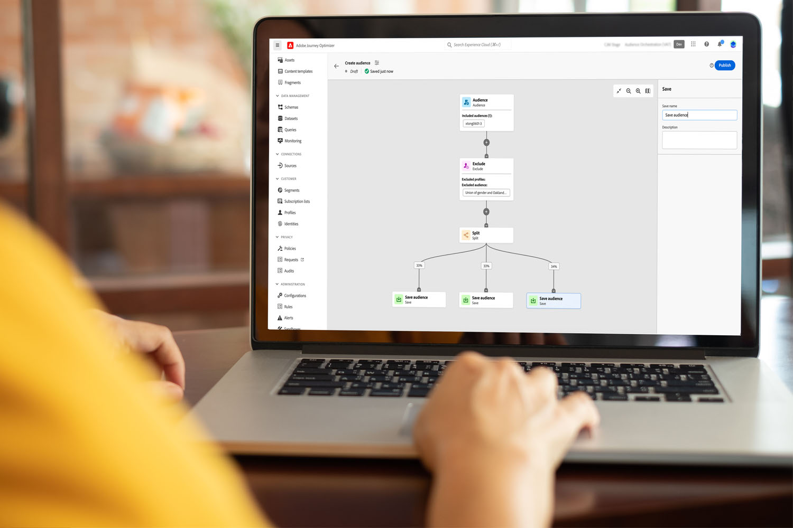

# 開始使用對象組合 {#get-start-audience-composition}

>[!CONTEXTUALHELP]
>id="ajo_ao_create_composition"
>title="建立組合"
>abstract="建立組合工作流程，以將現有的 Adobe Experience Platform 對象合併到視覺化畫布中，並利用各種活動 (分割、排除...) 建立新的對象。"

>[!BEGINSHADEBOX]

此文件提供如何在 Adobe Journey Optimizer 中使用對象構成的詳細資訊。 如果您是只使用即時客戶設定檔的客戶，且不使用 Adobe Journey Optimizer， 請[按一下這裡](https://experienceleague.adobe.com/docs/experience-platform/segmentation/ui/audience-composition.html?lang=zh-Hant){target="_blank"}。

>[!ENDSHADEBOX]

對象組合可讓您建立&#x200B;**組合工作流程**，您可以將現有的 Adobe Experience Platform 對象結合至視覺畫布，並善用各種活動 (分割、排除……) 來建立新對象。

完成後， **產生的對象** 連同現有受眾一起儲存至Adobe Experience Platform中，並可在Journey Optimizer行銷活動和歷程中運用於鎖定客戶。 [瞭解如何在Journey Optimizer中鎖定對象](../audience/about-audiences.md#segments-in-journey-optimizer)

>[!IMPORTANT]
>
>目前，Healthcare Shield或Privacy and Security Shield無法使用來自受眾構成和自訂上傳受眾的受眾和屬性。
>
>擴充屬性尚未與原則執行服務整合。 因此，您套用至擴充屬性的任何資料使用標籤，都不會在Journey Optimizer行銷活動或歷程中強制執行。

可從 Adobe Journey Optimizer **[!UICONTROL 對象]**&#x200B;選單存取對象構成：

* 此&#x200B;**[!UICONTROL 概觀]**&#x200B;標籤提供與貴組織的對象資料相關的關鍵量度專用儀表板。 若要深入了解，請參閱 [Adobe Experience Platform 儀表板指南](https://experienceleague.adobe.com/docs/experience-platform/dashboards/guides/segments.html?lang=zh-Hant)。

* 此&#x200B;**[!UICONTROL 瀏覽]**&#x200B;索引標籤會列出儲存至 Adobe Experience Platform 的所有現有對象。

* 此&#x200B;**[!UICONTROL 組合]**&#x200B;索引標籤可讓您建立組合工作流程，在其中結合並排列對象以建立新對象。

按一下每張卡片，了解如何使用對象組合：

<table style="table-layout:fixed"><tr style="border: 0;">
<td>

<a href="create-compositions.md"><strong>建立您的第一個組合工作流程</strong></a>
</td>
<td>

<a href="composition-canvas.md"><strong>使用組合畫布</strong></a>
</td>
<td>

<a href="access-audiences.md"><strong>存取及管理對象</strong></a>
</td>
</tr></table>
