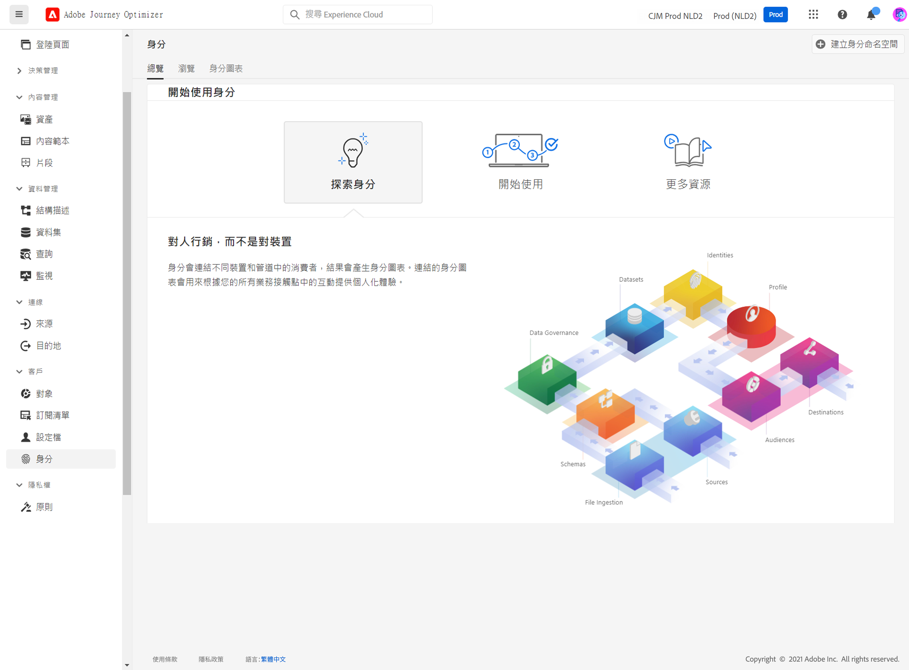

# 開始使用身分識別 {#identities-gs}

身分是實體所獨有的資料，通常是真實世界的物件，例如個人、硬體裝置或網頁瀏覽器。 完全合格的身分包含兩個元素：

* **身分名稱空間**&#x200B;是身分相關內容的指標。
* **身分值**&#x200B;是代表實體的字串。

例如，假設電話號碼是555-555-1234。 在此案例中，字串「555-555-1234」是&#x200B;**身分值**，它可以歸類到「電話」**身分名稱空間**&#x200B;中。

**中的**&#x200B;身分[!DNL Adobe Journey Optimizer]功能表可讓使用者有效率地瀏覽組成其資料庫中客戶的各種識別碼。

它提供&#x200B;**身分圖表**，這是特定客戶不同身分之間關係的對應。 此圖表提供客戶如何跨不同管道與品牌互動的視覺化表示。 所有客戶身分圖表會由Adobe Experience Platform Identity Service集體管理及更新，以回應客戶活動。

有關使用身分的詳細資訊，請參閱[身分識別服務檔案](https://experienceleague.adobe.com/docs/experience-platform/identity/home.html?lang=zh-Hant){target="_blank"}。