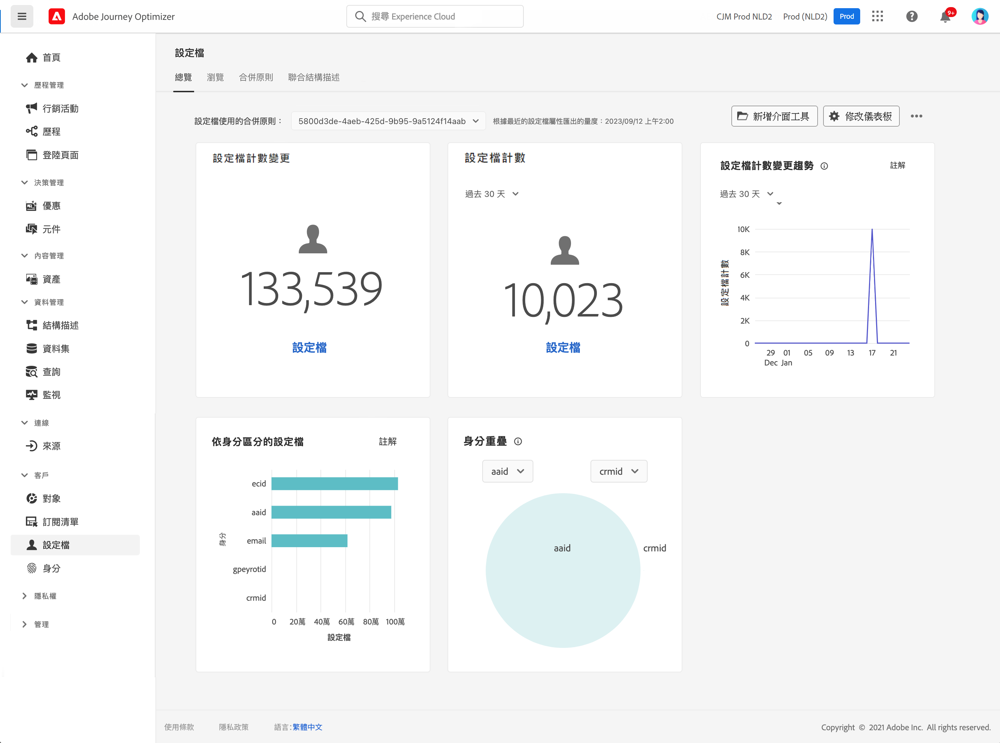

# 開始使用輪廓 {#profiles-gs}

## 關於輪廓

善用 [!DNL Adobe Journey Optimizer] 的即時客戶輪廓，透過合併來自多個管道 (包括線上、離線、CRM 和協力廠商) 的資料，全面瞭解每個客戶。**輪廓**&#x200B;可讓您將客戶資料合併成統一的檢視畫面，針對每個客戶互動提供可採取行動且附有時間戳記的說明。

➡️ [在影片中探索此功能](#video)

**即時客戶設定檔{&#x200B;1} — 將來自線上、離線和假名的客戶屬性和事件整合到單一整合的設定檔中。&#x200B;URL**&#x200B;使用設定檔以跨多個接觸點提供個人化即時體驗來吸引客戶。&#x200B;URL

**資料擷取** — 連線至各種資料來源，以擷取行為、異動、財務和營運資料。 即時或透過批次上傳擷取資料，以持續更新設定檔。

**身分圖表** — 使用客戶身分結合來自不同來源的資料，例如忠誠度識別碼或CRM系統ID。&#x200B;URL透過對應品牌資料集中不同身分之間的關係來建立客戶的完整檢視。&#x200B;URL

**客戶參與度** — 使用即時客戶設定檔來提供情境式個人化體驗，例如鎖定目標的選件和訊息。&#x200B;URL跨各種管道與客戶互動，包括行銷活動、客戶支援和交易更新。&#x200B;URL

**資料共用** — 與Amazon Web Services、Microsoft Azure和Google Cloud等頂級雲端儲存提供者共用客戶設定檔。 使用共用的設定檔，透過商業智慧工具進行報告、資料封存或更深入的分析。

>[!MORELIKETHIS]
>
>* [即時客戶輪廓文件](https://experienceleague.adobe.com/docs/experience-platform/query/home.html?lang=zh-Hant){target="_blank"}
>* [即時客戶個人檔案資料和細分的預設護欄](https://experienceleague.adobe.com/zh-hant/docs/experience-platform/profile/guardrails){target="_blank"}
>* {&#x200B;0}資料擷取檔案[&#128279;](https://experienceleague.adobe.com/en/docs/experience-platform/ingestion/home){target="_blank"}

## 設定檔儀表板

若要存取設定檔，請導覽至左側導覽窗格中的&#x200B;**[!UICONTROL 客戶]** / **[!UICONTROL 設定檔]**&#x200B;功能表。

>[!NOTE]
>
>如果貴組織是初次使用 [!DNL Adobe Journey Optimizer]，且尚未建立作用中的輪廓資料集或合併原則，則&#x200B;**輪廓**&#x200B;儀表板不可見。**總覽**&#x200B;標籤會顯示Adobe Experience Platform檔案的連結，以協助您開始使用即時客戶個人檔案。 若要瞭解如何使用&#x200B;**設定檔儀表板**，以及有關儀表板中顯示之量度的詳細資訊，請參閱[本節](https://experienceleague.adobe.com/docs/experience-platform/profile/ui/user-guide.html?lang=zh-Hant){target="_blank"}。

您可以將多個來源的資料片段放在一起，然後組合這些片段，即可檢視每個個別客戶的完整檢視。 彙總此資料時，合併原則是用來判斷資料優先順序的方式以及合併哪些資料以建立統一檢視的規則。 在此&#x200B;**檔案**&#x200B;中進一步瞭解[合併原則](https://experienceleague.adobe.com/docs/experience-platform/profile/merge-policies/ui-guide.html?lang=zh-Hant){target="_blank"}。

## 作法影片 {#video}

瞭解Adobe Experience Platform如何組合和更新即時客戶設定檔，以及如何存取和使用這些設定檔。

>[!VIDEO](https://video.tv.adobe.com/v/27251?quality=12)
