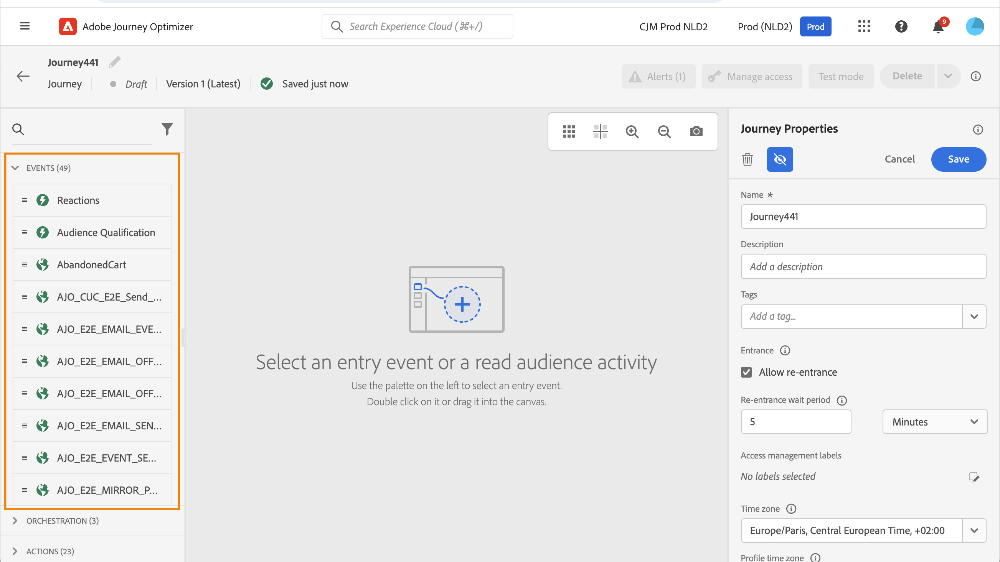
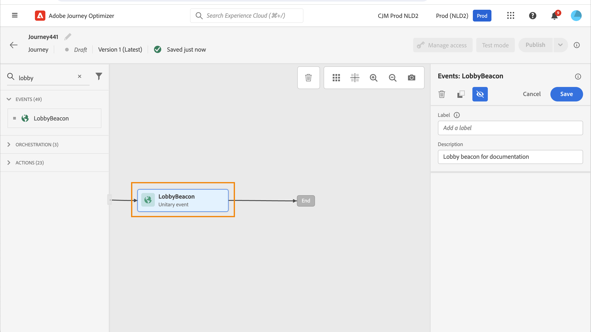
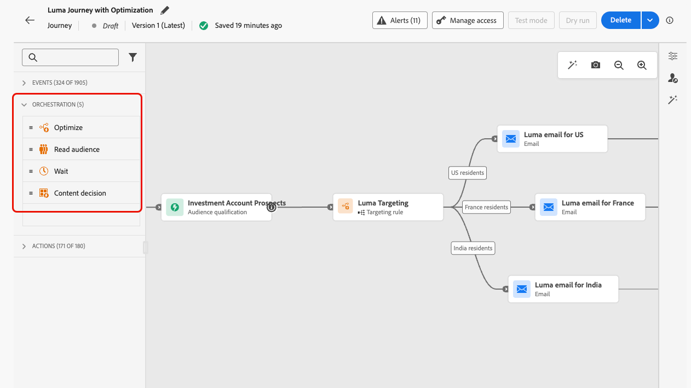
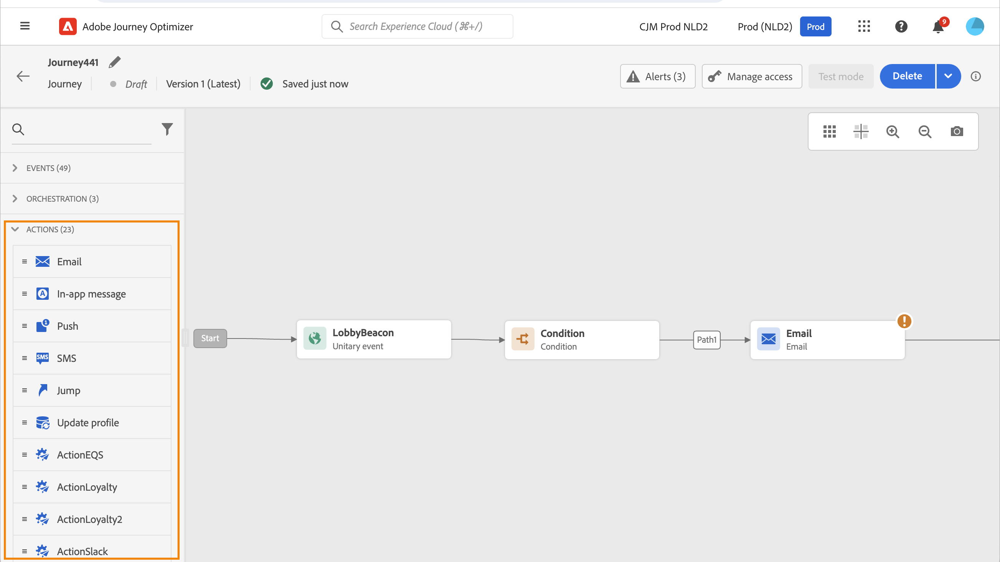
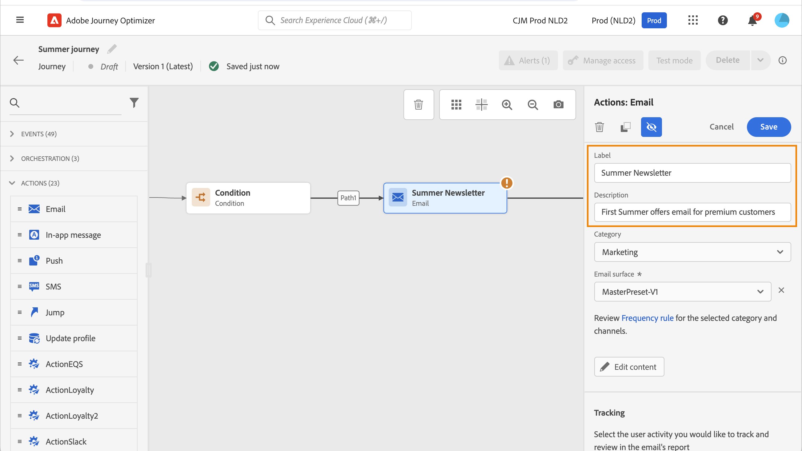
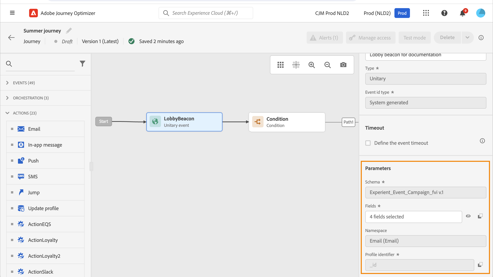
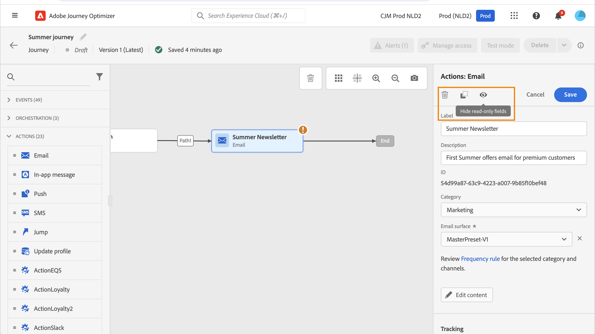
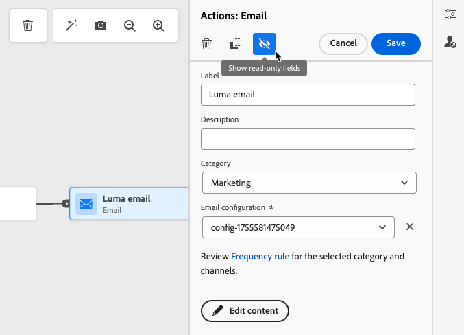
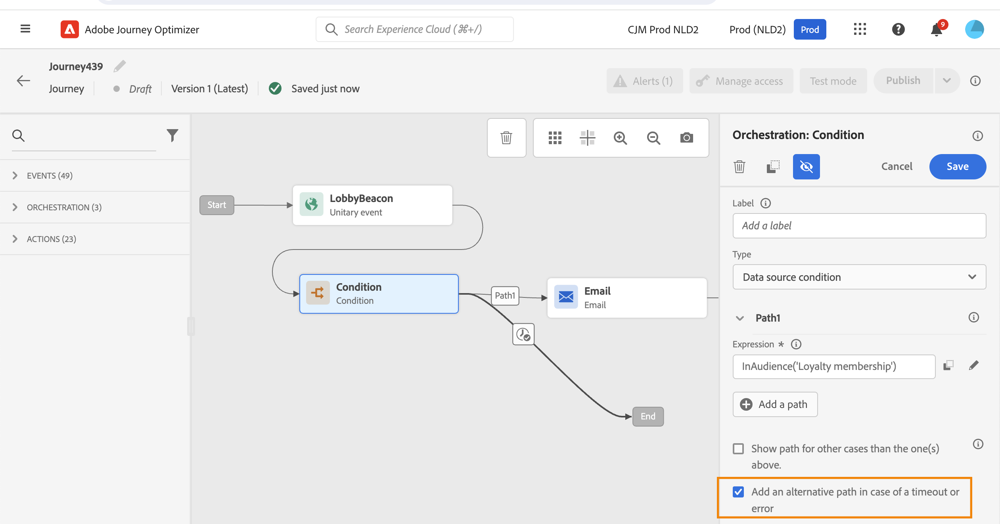

# 開始使用歷程活動 {#about-journey-activities}

結合不同的事件、協調和動作活動，以建置您的多步驟跨管道情境。

## 事件活動 {#event-activities}

個人化歷程由事件觸發，例如線上購買。 設定檔進入歷程後，就會以個人身分移過，而且不會有兩個人以相同速度或沿著相同路徑移動。 當您以事件開始您的歷程時，歷程會在收到事件時觸發。 接著，歷程中的每個人都個別遵循歷程中定義的後續步驟。

技術使用者設定的事件（請參閱[此頁面](../event/about-events.md)）都會顯示在畫面左側的浮動視窗的第一個類別中。 可使用下列事件活動：

* [一般事件](../building-journeys/general-events.md)
* [反應](../building-journeys/reaction-events.md)
* [客群鑑定](../building-journeys/audience-qualification-events.md)

若要開始您的歷程，請拖放事件活動。 您也可以連按兩下它。

## 協調活動 {#orchestration-activities}

協調活動是不同的條件，可協助判斷歷程的下一步。 這些條件包括此人是否有未解決的支援案例、目前所在位置的天氣預報、他們是否完成購買，或他們是否達到10,000點忠誠點數。

從浮動視窗的畫面左側，有下列協調活動：

<!--* [Optimize](optimize.md)-->
* [讀取對象](read-audience.md)
* [等待](wait-activity.md)
* [內容決策](content-decision.md)

## 動作活動 {#action-activities}

動作是您因某種觸發因素而想要發生的動作，例如傳送訊息。 這是客戶體驗的歷程片段。

從浮動視窗的畫面左側，**[!UICONTROL 事件]**&#x200B;和&#x200B;**[!UICONTROL 協調流程]**&#x200B;下方，可以找到&#x200B;**[!UICONTROL 動作]**&#x200B;類別。 可使用下列動作活動：

* [內建管道動作](../building-journeys/journeys-message.md)
* [自訂動作](../building-journeys/using-custom-actions.md)
* [跳轉](../building-journeys/jump.md)

歷程設計程式中的

這些活動代表不同的可用通訊通道。您可以將其合併，以建立跨管道情境。

您也可以設定傳送訊息的特定動作：

* 如果您使用協力廠商系統來傳送訊息，則可建立特定的自訂動作。 [了解更多](../action/action.md)

* 如果您正在使用Campaign和Journey Optimizer，請參閱下列區段：

   * [[!DNL Journey Optimizer]和Campaign v7/v8](../action/acc-action.md)
   * [[!DNL Journey Optimizer]與Campaign Standard](../action/acs-action.md)
   * [[!DNL Journey Optimizer]與Marketo Engage](../action/marketo-engage.md)

## 最佳做法 {#best-practices}

### 新增標籤

大部分活動可讓您定義&#x200B;**[!UICONTROL 標籤]**。 這會將尾碼新增至畫布中顯示在活動下方的名稱中。 如果您在歷程中多次使用相同的活動，且想要更輕鬆地識別它們，這會很有用。 這樣還可以更輕鬆地在發生錯誤時進行偵錯，並讓報表更易於閱讀。 您也可以新增選用的&#x200B;**[!UICONTROL 描述]**。

>[!NOTE]
>
>對於某些活動，其ID也會顯示在窗格中。 此ID可作為較標籤穩定的索引鍵用於報表，但標籤可能會變更。

### 管理進階引數 {#advanced-parameters}

大多數活動會顯示許多您無法修改的進階及/或技術引數。

為了更好的可讀性，請使用右窗格上方的&#x200B;**[!UICONTROL 隱藏唯讀欄位]**&#x200B;按鈕來隱藏這些引數。

在某些特定內容中，您可以覆寫這些引數的值以供特定用途。 若要強制執行值，請按一下欄位右側的&#x200B;**[!UICONTROL 啟用參數覆寫]**&#x200B;圖示。[了解更多](../configuration/primary-email-addresses.md#journey-parameters)

>[!NOTE]
>
>如果進階引數已隱藏，請按一下&#x200B;**[!UICONTROL 顯示唯讀欄位]**&#x200B;按鈕
>
>{width=60%}

### 新增替代路徑

當動作或條件發生錯誤時，個人的歷程就會停止。唯一能讓它繼續的方法是核取方塊&#x200B;**[!UICONTROL 在逾時或錯誤的情況下新增替代路徑]**。 請參閱[本節](../building-journeys/using-the-journey-designer.md#paths)。

## 疑難排解 {#troubleshooting}

在測試和發佈您的歷程之前，請先確認所有活動皆已正確設定。如果系統仍偵測到錯誤，則無法進行測試或發佈。

在此頁面[上瞭解如何疑難排解活動及歷程](troubleshooting.md)中的錯誤。
