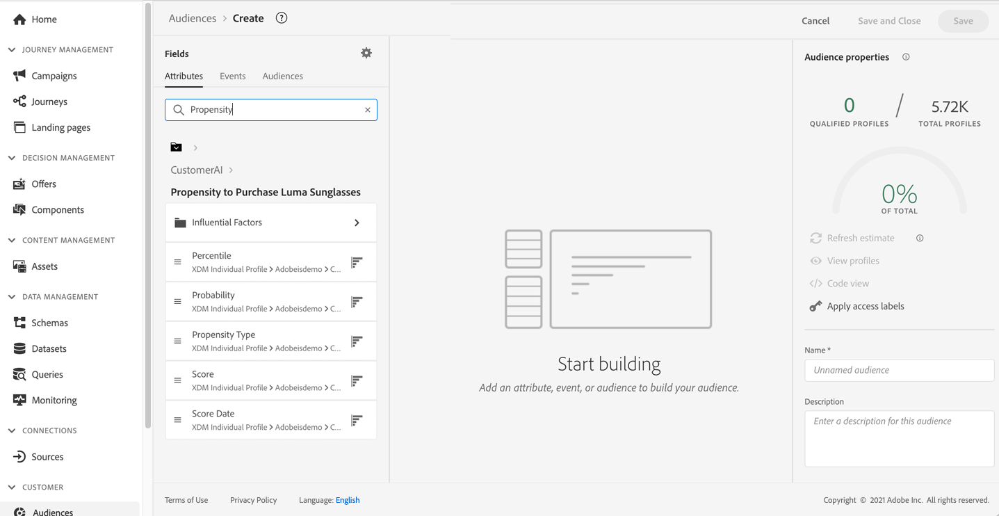

# 與 Intelligent Services 整合 {#ai-overview}

與&#x200B;**[!DNL Adobe Intelligent Services]**&#x200B;的整合可讓您針對客戶體驗使用案例運用人工智慧和機器學習。 這可讓行銷分析人員使用商業層級設定，針對公司需求設定量身打造的預測，而不需要資料科學的專業知識。

[!DNL Intelligent Services]以Adobe Experience Platform為基礎，為負責客戶體驗的行銷人員提供存取AI-as-a-service的許可權。 這可讓您輕鬆預測客戶行為、衡量行銷活動的影響，或確保每項投資都能獲得更好的回報。 如需[!DNL Adobe Intelligent Services]的其他詳細資料，請參閱[Adobe Experience Platform檔案](https://experienceleague.adobe.com/docs/experience-platform/intelligent-services/home.html?lang=zh-Hant){target="_blank"}。

[!DNL Journey Optimizer]與[!DNL Intelligent Services]之間的整合可讓您運用客戶預測。

[!DNL Adobe Intelligent Services]的元件Customer AI會預測可能的客戶動作。 請參閱[Adobe Experience Platform檔案](https://experienceleague.adobe.com/docs/experience-platform/intelligent-services/customer-ai/overview.html?lang=zh-Hant){target="_blank"}。

Customer AI可讓品牌建立流失率或轉換機器學習型分數。 這些分數可作為Adobe Experience Platform設定檔（即時客戶設定檔）中的設定檔屬性使用。

因此，這些屬性可以像在Journey Optimizer條件（以做出最佳決策）、動作或區段建立中的任何其他設定檔屬性一樣使用。

