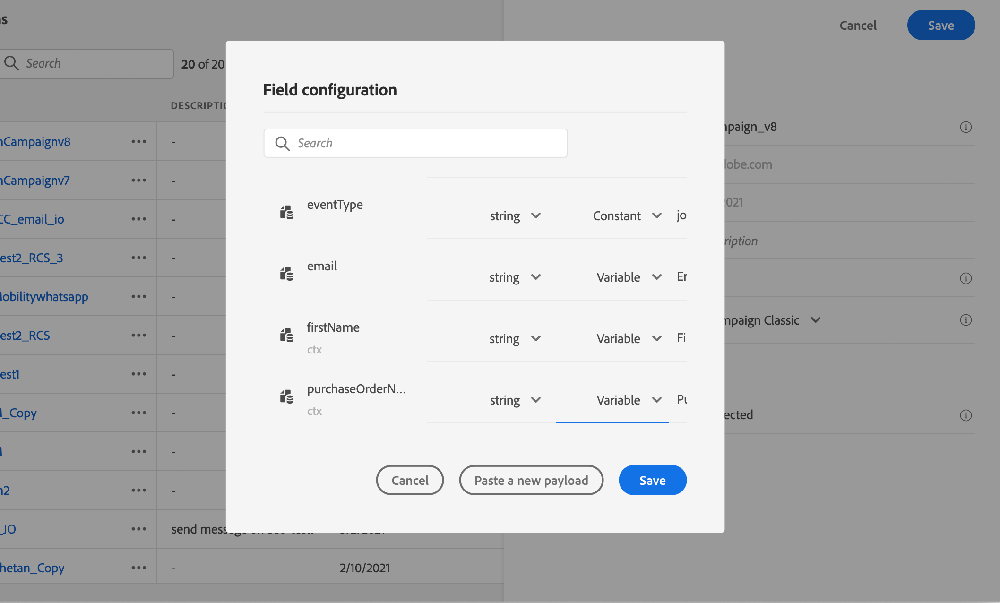

# 使用Campaign v7/v8傳送訊息 {#campaign-v7-v8-use-case}

此使用案例說明使用與[!DNL Adobe Campaign] v7和[!DNL Adobe Campaign] v8的整合來傳送電子郵件所需的所有步驟。

>[!NOTE]
>
>若要使用此整合，您必須有Campaign v7/v8版本編號9125或更高版本。

首先，在Campaign中建立交易式電子郵件範本。 然後，在Journey Optimizer中建立事件、動作並設計歷程。

若要進一步瞭解Campaign整合，請參閱以下頁面：

* [建立行銷活動動作](../action/acc-action.md)
* [在歷程中使用動作](../building-journeys/using-adobe-campaign-v7-v8.md)。

**[!DNL Adobe Campaign]**

必須布建您的Campaign執行個體才能進行此整合。 必須設定異動訊息傳送功能。

1. 登入您的Campaign控制例項。

1. 在&#x200B;**管理** > **平台** > **列舉**&#x200B;下，選取&#x200B;**事件型別** (eventType)列舉。 建立新的事件型別（範例中為「journey-event」）。 稍後寫入JSON檔案時，請使用事件型別的內部名稱。

   ![使用結構描述和欄位選取來設定[!DNL Adobe Journey Optimizer]中的事件](assets/accintegration-uc-1.png)

1. 中斷連線並重新連線至執行個體，建立作業才會生效。

1. 在&#x200B;**訊息中心** > **異動訊息範本**&#x200B;下，根據先前建立的事件型別建立新的電子郵件範本。

   

1. 設計您的範本。 在此範例中，個人化會套用至設定檔的名字和訂單編號。 名字在[!DNL Adobe Experience Platform]資料來源中，而訂單編號是來自Journey Optimizer事件的欄位。 請確定您在Campaign中使用正確的欄位名稱。

   

1. 發佈您的交易式範本。

   

1. 撰寫與範本相對應的JSON裝載。

```
{
     "channel": "email",
     "eventType": "journey-event",
     "email": "Email address",
     "ctx": {
          "firstName": "First name", "purchaseOrderNumber": "Purchase order number"
     }
}
```

* 對於頻道，您需要輸入「電子郵件」。
* 對於eventType，請使用先前建立之事件型別的內部名稱。
* 電子郵件地址將是變數，因此您可以鍵入任何標籤。
* 在ctx底下，個人化欄位也是變數。

**Journey Optimizer**

1. 建立事件。 包含「purchaseOrderNumber」欄位。

   ![傳統整合的[!DNL Adobe Campaign]自訂動作設定畫面](assets/accintegration-uc-5.png)

1. 在Journey Optimizer中建立與行銷活動範本對應的動作。 在&#x200B;**動作型別**&#x200B;下拉式清單中，選取&#x200B;**[!DNL Adobe Campaign]Classic**。

   ![動作型別選取專案顯示[!DNL Adobe Campaign]傳統選項](assets/accintegration-uc-6.png)

1. 按一下&#x200B;**裝載欄位**&#x200B;並貼上先前建立的JSON。

   

1. 針對電子郵件地址和兩個個人化欄位，將&#x200B;**常數**&#x200B;變更為&#x200B;**變數**。

   

1. 現在建立新歷程，並從先前建立的事件開始。

   

1. 新增動作，並將每個欄位對應至Journey Optimizer中的正確欄位。

   

1. 測試您的歷程。

   

1. 您現在可以發佈您的歷程。
