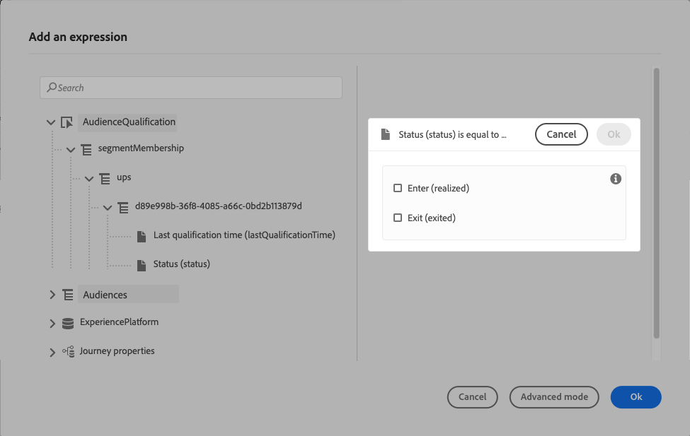

# 客群資格鑑定事件 {#segment-qualification}

>[!CONTEXTUALHELP]
>id="ajo_journey_event_segment_qualification"
>title="對象資格鑑定事件"
>abstract="本活動可讓您的歷程監聽設定檔是否符合 Adobe Experience Platform 對象資格，讓個人進入歷程或在歷程中前進。"

## 關於對象資格鑑定事件{#about-segment-qualification}

此活動可讓您的歷程聆聽Adobe Experience Platform對象中設定檔的入口和出口，以便讓個人進入歷程或是在歷程中前進。 如需建立對象的詳細資訊，請參閱此[區段](../audience/about-audiences.md)。

假設您有「銀級客戶」客群。 透過此活動，您可以讓所有新的銀級客戶進入歷程，並向他們傳送一系列個人化訊息。

此類事件可定位為歷程的第一步或後續步驟。

➡️ [在影片中探索此功能](#video)

>[!CAUTION]
>
>開始設定對象資格之前，[請先閱讀護欄和限制](#audience-qualification-guardrails)。

## 設定活動 {#configure-segment-qualification}

若要設定&#x200B;**[!UICONTROL 對象資格]**&#x200B;活動，請遵循下列步驟：

1. 展開&#x200B;**[!UICONTROL 事件]**&#x200B;類別，並將&#x200B;**[!UICONTROL 對象資格]**&#x200B;活動放入您的畫布中。

   

1. 將&#x200B;**[!UICONTROL 標籤]**&#x200B;新增至活動。 此步驟為選填。

1. 按一下&#x200B;**[!UICONTROL 對象]**&#x200B;欄位，然後選取您要利用的對象。

   >[!NOTE]
   >
   >您可以自訂清單中顯示的欄並加以排序。

   

   新增對象後，**[!UICONTROL 複製]**&#x200B;按鈕可讓您複製其名稱和ID：

   `{"name":"Loyalty membership","id":"8597c5dc-70e3-4b05-8fb9-7e938f5c07a3"}`

   

1. 在&#x200B;**[!UICONTROL 行為]**&#x200B;欄位中，選擇您是要聆聽對象入口、出口或兩者。

   >[!NOTE]
   >
   >**[!UICONTROL Enter]**&#x200B;和&#x200B;**[!UICONTROL Exit]**&#x200B;對應至Adobe Experience Platform中的&#x200B;**Realized**&#x200B;和&#x200B;**Exited**&#x200B;對象參與狀態。 如需如何評估對象的詳細資訊，請參閱[Segmentation Service檔案](https://experienceleague.adobe.com/docs/experience-platform/segmentation/tutorials/evaluate-a-segment.html?lang=zh-Hant#interpret-segment-results){target="_blank"}。

1. 選取名稱空間。 只有在將事件定位為歷程的第一步時，才需要此專案。 依預設，此欄位會預先填入最後使用的名稱空間。

   >[!NOTE]
   >
   >您只能選取以人物為基礎的身分名稱空間。 如果您已定義查閱表格的名稱空間（例如：產品查閱的ProductID名稱空間），它將無法在&#x200B;**名稱空間**&#x200B;下拉式清單中使用。

   

裝載包含以下內容資訊，您可在條件和動作中使用：

* 行為（入口、出口）
* 資格的時間戳記
* 對象id

在&#x200B;**[!UICONTROL 對象資格]**&#x200B;活動之後的條件或動作中使用運算式編輯器時，您有權存取&#x200B;**[!UICONTROL AudienceQualification]**&#x200B;節點。 您可以選擇&#x200B;**[!UICONTROL 上次資格取得時間]**&#x200B;與&#x200B;**[!UICONTROL 狀態]** （進入或退出）。

檢視[條件活動](../building-journeys/condition-activity.md#about_condition)。

包含&#x200B;**對象資格**&#x200B;事件的新歷程在您發佈10分鐘後即可開始運作。 此時間間隔對應到專用服務的快取重新整理間隔。 因此，您必須等待10分鐘才能使用此歷程。

## 最佳做法 {#best-practices-segments}

**[!UICONTROL 對象資格]**&#x200B;活動可讓符合Adobe Experience Platform對象資格或被取消資格的個人立即進入歷程。

此資訊的接收速度很快。 測量顯示每秒接收10,000個事件的速度。 因此，請確定您瞭解入口尖峰可能如何發生、如何避免，以及如何讓您的歷程準備好迎接它們。 在[本節](entry-management.md#journey-processing-rate)中進一步瞭解歷程處理速率和輸送量限制。

### 批次對象 {#batch-speed-segment-qualification}

針對批次對象使用「對象資格」時，請注意，入口尖峰會在每日計算時發生。 尖峰的大小取決於每天進入（或退出）對象的個人數量。

此外，如果在歷程中新建立並立即使用批次對象，則第一批計算可能會導致大量個人進入歷程。

### 串流對象 {#streamed-speed-segment-qualification}

針對串流對象使用「對象資格」時，由於持續評估對象，入口/出口出現大型峰值的風險較低。 但是，如果受眾定義導致大量客戶同時符合資格，則峰值可能仍會發生。

避免使用具有串流細分的開啟和傳送事件。 請改用真正的使用者活動訊號，例如點選、購買或信標資料。 針對頻率或隱藏邏輯，請使用商業規則而非傳送事件。 [了解更多](../audience/about-audiences.md#open-and-send-event-guardrails)

如需串流區段的詳細資訊，請參閱[Adobe Experience Platform檔案](https://experienceleague.adobe.com/zh-hant/docs/experience-platform/segmentation/methods/streaming-segmentation){target="_blank"}。

### 如何避免多載 {#overloads-speed-segment-qualification}

以下是一些避免讓歷程中所運用的系統過載的最佳實務（資料來源、自訂動作、管道動作活動）：

* 在&#x200B;**[!UICONTROL 對象資格]**&#x200B;活動中建立批次對象後，請勿立即使用批次對象。 這會避免第一個計算尖峰。 如果您即將使用從未計算的對象，歷程畫布中會顯示黃色警告。

  

* 為歷程中使用的資料來源和動作設定上限規則，以避免其過載。 進一步瞭解[Journey Orchestration檔案](https://experienceleague.adobe.com/docs/journeys/using/working-with-apis/capping.html?lang=zh-Hant){target="_blank"}。 請注意，上限規則沒有重試。 如果您需要重試，請核取方塊&#x200B;**[!UICONTROL 在逾時或在條件或動作中發生錯誤]**&#x200B;時新增替代路徑，以在歷程中使用替代路徑。

* 在生產歷程中使用對象之前，請每天評估符合此對象資格的個人數量。 若要這麼做，請檢查&#x200B;**[!UICONTROL 對象]**&#x200B;功能表、開啟對象，然後檢視&#x200B;**[!UICONTROL 隨著時間變化的設定檔]**&#x200B;圖表。

  

在[本節](entry-management.md#profile-entrance-rate)中進一步瞭解進入率限制和輸送量。

## 護欄與限制 {#audience-qualification-guardrails}

請遵循以下護欄和建議，以建置對象資格歷程。 另請參閱[對象資格最佳做法](#best-practices-segments)。

* 對象資格歷程主要設計用於串流對象。 此組合可確保提供更出色的即時體驗。 強烈建議在對象資格活動中使用&#x200B;**串流對象**。

  不過，如果您想要在串流對象或批次對象中使用批次擷取型屬性以進行「對象資格」歷程，請考慮對象評估/啟用的時間範圍。 使用批次擷取屬性的批次對象或串流對象在細分工作完成約&#x200B;**2小時**&#x200B;後，即可在&#x200B;**對象資格**&#x200B;活動中使用。 此工作每天會在Adobe組織管理員定義的時間執行一次。

* Adobe Experience Platform對象可每天計算一次（**批次**&#x200B;對象），或使用Adobe Experience Platform的「高頻對象」選項即時計算&#x200B;**串流**&#x200B;對象。

   * 如果對選取的對象進行串流，屬於此對象的個人可能會即時進入歷程。
   * 如果對象是批次，則新符合此對象資格的人員可能會在Adobe Experience Platform上執行對象計算時進入歷程。

  最佳做法是在&#x200B;**對象資格**&#x200B;活動中使用串流對象。 若是批次使用案例，請使用&#x200B;**[讀取對象](read-audience.md)**&#x200B;活動。

  >[!NOTE]
  >
  >由於使用構成工作流程和自訂上傳建立的對象批次性質，無法在「對象資格」活動中鎖定這些對象。 此活動中只能運用使用區段定義建立的對象。

* 體驗事件欄位群組不能用於以&#x200B;**讀取對象**、**對象資格**&#x200B;或&#x200B;**商業事件**&#x200B;活動開始的歷程。

* 在歷程中使用&#x200B;**對象資格**&#x200B;活動時，該活動最多可能需要10分鐘才會生效，並聆聽進入或退出對象的設定檔。

>[!CAUTION]
>
>[即時客戶輪廓資料、分段的護欄](https://experienceleague.adobe.com/docs/experience-platform/profile/guardrails.html?lang=zh-Hant){target="_blank"}也適用於 Adobe Journey Optimizer。

## 作法影片 {#video}

透過此影片瞭解對象資格歷程的適用使用案例。 瞭解如何使用對象資格建立歷程，以及套用哪些最佳實務。

>[!VIDEO](https://video.tv.adobe.com/v/3425028?quality=12)
