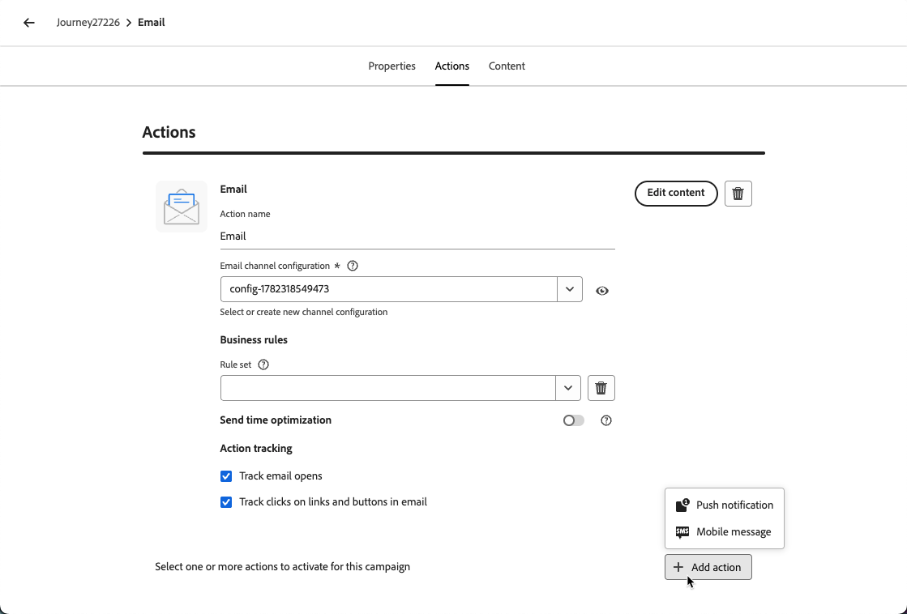

# 頻道最佳化 {#channel-optimization}

>[!BEGINSHADEBOX]

**在此頁面上：**&#x200B;瞭解如何使用手動排名、設定檔偏好設定或AI支援的傾向分數，設定歷程或行銷活動動作，以透過最佳傳出頻道傳送訊息給每位客戶。

>[!ENDSHADEBOX]

>[!AVAILABILITY]
>
>頻道最佳化目前適用於有限的組織（可用性限制）。 若想取得存取權，請聯絡您的 Adobe 代表。

管道最佳化可讓您將多個傳出管道（電子郵件、推播、行動訊息）新增至單一歷程或行銷活動動作，並讓Journey Optimizer在傳送時為每個客戶自動選取最佳管道。

系統不會一次跨所有管道選擇一個預先通道或傳送訊息給客戶，而是挑選每位客戶選擇的最高等級管道，並在該管道無法使用時順暢地後退。

➡️ [在此影片中進一步瞭解頻道最佳化](#video)

## 護欄與限制 {#limitations}

* **支援的頻道**：僅支援原生電子郵件、推播和行動訊息頻道。 不支援其他傳出頻道，例如WhatsApp。 通道最佳化需要使用Journey Optimizer的原生電子郵件、推播和行動訊息傳送功能；不支援透過自訂動作執行。

* **AI最佳化量度**： AI模型只會針對參與（點選）進行最佳化。 它不會針對訂單、收入或其他業務量度進行最佳化。 如果需要最佳化訂單或收入，您的資料科學團隊可以離線訓練自訂模型，並透過客戶設定檔屬性功能加以套用。

* **AI排名所需的點選追蹤**：使用AI模型型排名時，必須為所有已設定的管道啟用點選追蹤。 該模型仰賴點選資料來計算傾向分數；如果追蹤停用，AI排名模式就無法正常運作。 [瞭解如何在電子郵件中啟用點選追蹤](../email/message-tracking.md)

* **無訊息時數**：將多個管道合併為單一動作時，會根據管道優先順序套用無訊息時數：行動訊息優先，然後是推播，再是電子郵件。 若要為每個頻道使用不同的無訊息時數設定，請建立個別歷程動作，而不是在單一動作中組合頻道。

  >[!NOTE]
  >
  >已規劃在「一般可用性」版本支援每個管道的靜音時數設定。

* **傳送時間最佳化不相容性**：目前[傳送時間最佳化](send-time-optimization.md)和通道最佳化不能同時使用 — 請選擇其中一個。 UI可防止在同一個動作中同時啟用兩個功能。

* **反應事件**：歷程畫布上的反應事件目前僅參考多頻道動作中的第一個頻道。

  >[!NOTE]
  >
  >針對「一般可用性」版本，計畫在多個管道存在時支援選取任何有效的反應事件。

## 在歷程或行銷活動中使用管道最佳化 {#configure}

若要將具有管道最佳化的多個傳出管道新增至歷程或行銷活動，請遵循以下步驟。

>[!BEGINTABS]

>[!TAB 在歷程中]

1. 以[事件](general-events.md)或[讀取對象](read-audience.md)活動來開始您的歷程。

1. 從浮動視窗的&#x200B;**[!UICONTROL 動作]**&#x200B;區段，將&#x200B;**[!UICONTROL 動作]**&#x200B;活動拖放到畫布中。

1. 選取傳出頻道（電子郵件、推播或行動訊息）並按一下&#x200B;**[!UICONTROL 新增]**。

   {width="60%"}

1. 輸入動作的標籤，然後按一下&#x200B;**[!UICONTROL 設定動作]**。

>[!TAB 在行銷活動中]

1. [建立動作行銷活動](../campaigns/create-campaign.md)並導覽至&#x200B;**[!UICONTROL 動作]**&#x200B;標籤。

1. 按一下&#x200B;**[!UICONTROL 新增動作]**&#x200B;按鈕並選取傳出頻道（電子郵件、推播或行動裝置訊息）。

>[!ENDTABS]

在&#x200B;**[!UICONTROL 動作]**&#x200B;索引標籤中選取出站動作後，請繼續下列步驟。

1. 選取頻道設定，然後按一下&#x200B;**[!UICONTROL 新增動作]**&#x200B;以選取其他傳出頻道。

   {width="1000%"}

   >[!NOTE]
   >
   >在單一多頻道動作中，每種頻道型別僅支援一個動作。 例如，您無法新增具有不同設定的兩個個別電子郵件動作。

   您最多可以將三個傳出頻道（**[!UICONTROL 電子郵件]**、**[!UICONTROL 推播]**、**[!UICONTROL 行動訊息]**）新增至單一歷程動作或行銷活動。

1. 在&#x200B;**[!UICONTROL 管道最佳化]**&#x200B;區段中，設定方法以決定系統如何為每個客戶選取最佳管道。 [了解更多](#optimization-modes)

   {width="100%"}

1. 將管道拖放至所需順序，以設定遞補管道順序（針對手動排名和客戶偏好設定方法）。 [了解更多](#fallback)

   {width="90%"}

1. [儲存並發佈](publish-journey.md)您的歷程，或[檢閱並啟用](../campaigns/review-activate-campaign.md)您的行銷活動。

## 設定頻道最佳化方法 {#optimization-modes}

>[!CONTEXTUALHELP]
>id="ajo_channel_optimization_method"
>title="定義管道選取的運作方式"
>abstract="選擇Journey Optimizer如何為每個客戶選取最佳管道： **手動優先順序** — 管道會以您定義的順序嘗試；可用性是透過套用與所選管道設定關聯的訂閱偏好設定和行銷同意規則，以及與行銷活動或歷程關聯的所有商業規則（例如管道頻率限定）來決定。 **客戶設定檔屬性** — 首先選取符合客戶在其設定檔中宣告偏好設定的管道。 如果找不到偏好設定，則會套用手動優先順序。 **AI最佳化** — 機器學習模型會根據客戶的歷史參與為每個管道評分，並選取最高評分的可用管道。"

<!--
Previous content for contextual help: "The customer's first available channel, based on the selected prioritization method, is used for this action. Availability is determined by the customer's subscription preferences and marketing consent rules for the selected channel configurations, as well as any business rules — such as frequency capping — configured for the campaign or journey." TBC which to keep.

Additional content for contextual help: For **Manual priority** and **Customer profile attribute** modes, Journey Optimizer falls back through your configured channel order when the top-ranked channel cannot be used. For **AI optimized**, it falls back to a random available channel."
-->

管道最佳化支援三種模式，每種模式使用不同方法，在傳送時為每個客戶選取最佳管道。

### 手動排名 {#manual-ranking}

**[!UICONTROL 手動優先順序]**&#x200B;為預設模式。 您可以直接在動作中定義偏好的管道順序。 Journey Optimizer會透過您清單中客戶選擇加入的第一個管道傳遞，且不會設定頻率上限，然後[視需要退回](#fallback)至下一個管道。

{width="90%"}

當您有清晰、一致的管道偏好設定且不需要每個設定檔個人化時，請使用此模式。

### 客戶喜好設定 {#customer-preference}

選取&#x200B;**[!UICONTROL 客戶設定檔屬性]**&#x200B;後，Journey Optimizer會使用[同意和偏好設定XDM欄位群組](https://experienceleague.adobe.com/zh-hant/docs/experience-platform/xdm/field-groups/profile/consents)中的`preferred`屬性，從客戶的設定檔中讀取客戶宣告的偏好管道。 支援的值為`email`、`push`和`sms`。

{width="90%"}

如果偏好的頻道無法使用（未設定、未選擇加入或頻率限制），Journey Optimizer會退回至您設定的[遞補](#fallback)清單中的下一個頻道。

當客戶明確表示他們偏好的通訊通道時，請使用此模式。

### AI模型型排名 {#ai-ranking}

如果您選取&#x200B;**[!UICONTROL AI最佳化]**，Journey Optimizer會使用機器學習模型，根據每位客戶的歷史參與度（開啟、點按）計算每個管道的傾向分數。 分數會儲存在客戶的設定檔中，而預測傾向性最高的頻道會在傳送時選取。

{width="70%"}

當客戶的參與歷史記錄不足時，系統會退回隨機可用的管道。

使用此模式，讓AI推斷出每位客戶最有效的管道，無需任何手動設定。

## 遞補行為 {#fallback}

無論最佳化模式為何，當無法使用排名最前的頻道時，Journey Optimizer都會退回下一個可用頻道。 若符合下列任何條件，便視為無法使用管道：

* 客戶未選擇加入管道。
* 動作中未設定頻道。
* 該管道已達到其頻率上限。
* 未填入該管道的客戶設定檔偏好設定或AI模型分數。

在&#x200B;**[!UICONTROL 手動優先順序]**&#x200B;和&#x200B;**[!UICONTROL 客戶設定檔屬性]**&#x200B;模式下，遞補會依循行銷人員設定的管道優先順序清單。 在&#x200B;**[!UICONTROL AI最佳化]**&#x200B;下，遞補會選取隨機可用的頻道。

## 作法影片 {#video}

瞭解Adobe Journey Optimizer的管道最佳化功能如何協助您使用手動優先順序、設定檔屬性或Adobe的AI模型，透過最有效的管道觸及客戶。

>[!VIDEO](https://video.tv.adobe.com/v/3492132?quality=12)

<!--
**Related topics**

* [Use the Action activity](journey-action.md)
* [Send-Time optimization](send-time-optimization.md)
* [Content optimization](../content-management/gs-message-optimization.md)
-->
