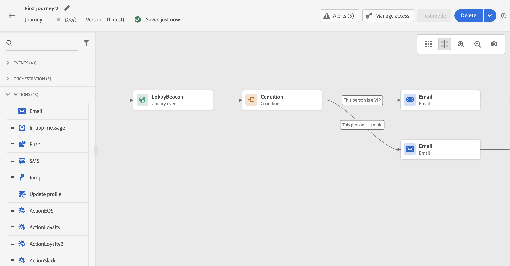

# 條件活動{#condition-activity}

>[!CONTEXTUALHELP]
>id="ajo_journey_condition"
>title="條件活動"
>abstract="此活動可讓您定義個人在歷程中的流程。 系統會根據各種條件建立數個路徑。 您也可以建立替代路徑，以防逾時或發生錯誤。"

可使用下列類型的條件：

* [資料來源條件](#data_source_condition)
* [時間條件](#time_condition)
* [百分比分割](#percentage_split)
* [日期條件](#date_condition)
* [設定檔上限](#profile_cap)

## 關於條件活動 {#about_condition}

>[!CONTEXTUALHELP]
>id="ajo_journey_expression_simple"
>title="關於簡單運算式編輯器"
>abstract="簡單運算式編輯器模式允許您根據欄位組合執行簡單查詢。 所有可用欄位都會顯示在畫面左側。 將欄位拖放至主區域。 要組合不同的元素，請將它們互相聯鎖以建立不同的組和/或組級別。 然後，您可以選取邏輯運算子來組合相同層級的元素。"

在歷程中使用數個條件時，您可以為每個條件定義標籤，以便更輕鬆地識別。

按一下 **[!UICONTROL 新增路徑]** 若要定義數個條件。 對於每個條件，在活動之後的畫布中會新增路徑。

請注意，歷程的設計會對功能造成影響。 在條件之後定義多個路徑時，只會執行第一個符合條件的路徑。 這表示您可以將路徑置於彼此上方或下方，以改變路徑的優先順序。

例如，我們以第一個路徑的條件「人是VIP」和第二個路徑的條件「人是男性」為例。 如果符合兩個條件的人員(男性為VIP)通過此步驟，則即使此人也符合第二個條件，也會選擇第一個路徑，因為第一個路徑「高於」。 若要變更此優先順序，請以另一個垂直順序移動活動。

您可以透過勾選 **[!UICONTROL 顯示上述案例以外其他案例的路徑]**. 請注意，此選項不適用於分割條件。 請參閱 [百分比分割](#percentage_split).

簡單模式允許您根據欄位組合執行簡單查詢。 所有可用欄位都會顯示在畫面左側。 將欄位拖放至主區域。 要組合不同的元素，請將它們互相聯鎖以建立不同的組和/或組級別。 然後，您可以選取邏輯運算子來組合同一層級的元素：

* 和：兩個條件的交集。 只會考慮符合所有條件的元素。
* 或：兩個標準的聯合。 考慮匹配兩個條件中至少一個的元素。

如果您使用 [Adobe Experience Platform區段服務](https://experienceleague.adobe.com/docs/experience-platform/segmentation/home.html){target=&quot;_blank&quot;}若要建立區段，您可以在歷程條件中運用這些區段。 請參閱 [在條件中使用區段](../building-journeys/condition-activity.md#using-a-segment).

>[!NOTE]
>
>您無法使用簡單編輯器對時間序列（例如購買清單、訊息的點按次數）執行查詢。 為此，您將需要使用進階編輯器。 請參閱[此頁面](expression/expressionadvanced.md)。

當動作或條件發生錯誤時，個人的歷程就會停止。唯一能讓它繼續的方法就是勾選方塊 **[!UICONTROL 新增替代路徑以防逾時或發生錯誤]**. 請參閱[本節](../building-journeys/using-the-journey-designer.md#paths)。

在簡單編輯器中，您也會在事件和資料來源類別下方找到歷程屬性類別。 此類別包含指定設定檔之歷程的相關技術欄位。 這是系統從即時歷程擷取的資訊，例如歷程 ID 或遇到的特定錯誤。 [了解更多](expression/journey-properties.md)

## 資料來源條件 {#data_source_condition}

這可讓您根據資料來源的欄位或先前位於歷程中的事件，來定義條件。 了解如何在 [本節](expression/expressionadvanced.md).

使用進階運算式編輯器，您可以設定更進階的條件來處理集合，或使用需要傳遞參數的資料來源。 [了解更多](../datasource/external-data-sources.md)。

## 時間條件{#time_condition}

這可讓您根據一天中的某小時和/或一週中的某天執行不同的動作。 例如，您可以決定在白天傳送推播通知，在工作日則在晚上傳送電子郵件。

>[!NOTE]
>
>時區不是條件專屬，且會在歷程屬性的歷程層級中定義。 請參見[此頁面](../building-journeys/timezone-management.md)。

有三個時間篩選選項可用：

* 小時：可讓您根據一天中的時間來設定條件。 然後定義開始和結束時間。 只有在定義的小時範圍內，個人才會進入路徑。
* 星期：可讓您根據一週中的某天來設定條件。 然後，您可以選取要讓個人進入路徑的天數。
* 一週中的某天和一小時：此選項會結合前兩個選項。

## 百分比分割 {#percentage_split}

此選項可讓您隨機分割對象，以定義每個群組的不同動作。 定義每個路徑的分割數和重新分割。 分割計算是統計的，因為系統無法預測歷程的此活動中會有多少人流量。 因此，分割的誤差範圍非常小。 此函式以Java隨機機制為基礎(請參閱 [頁面](https://docs.oracle.com/javase/7/docs/api/java/util/Random.html))。

在測試模式中，達到分割時，一律會選取頂端分支。 如果希望測試選擇不同的路徑，則可以重新組織拆分分支的位置。 請參見[此頁面](../building-journeys/testing-the-journey.md)。

>[!NOTE]
>
>請注意，在百分比分割條件中沒有可新增路徑的按鈕。 路徑數取決於分割數。 在分割條件中，無法為其他情況新增路徑，因為路徑無法發生。 人們總是走在一條分道路上。

## 日期條件 {#date_condition}

這可讓您根據日期定義不同的流程。 例如，如果人員在「銷售」期間進入步驟，您將向他們發送特定消息。 今年剩餘時間，您會傳送另一則訊息。

>[!NOTE]
>
>時區不再是條件的特定時區，現在會在歷程屬性的歷程層級中定義。 請參閱[此頁面](../building-journeys/timezone-management.md)。

## 設定檔上限 {#profile_cap}

使用此條件類型來設定歷程路徑的設定檔數目上限。 當達到此限制後，輸入的個人資料將採用替代路徑。 這可確保您的歷程不會超過所定義的限制。

>[!NOTE]
>
>建議您定義高值描述檔上限。 母體達到確切上限數目的精確度和可能性，只會隨著上限的增加而增加。 對於小數字（例如上限50），數字不一定符合，因為設定檔採取替代路徑之前可能未達到限制。

您可以使用此條件類型來增加傳送量。 看這個 [使用案例](ramp-up-deliveries-uc.md).

預設上限為1000。

計數器僅會套用至選取的歷程版本。 計數器會在一個月後重設為零。 重設後，進入的設定檔會再次取用公稱路徑，直到達到計數器限制為止。

即使您將替代路徑移至歷程畫布上標稱路徑上方，標稱路徑一律具有優先順序高於替代路徑。

若為即時歷程，以下是需考慮的臨界值，以確保達到上限：

* 對於大於10000的帽，要插入的不同輪廓的數量必須至少是帽的1.3倍。
* 對於低於10000的帽，要插入的不同輪廓數必須加上帽1000。

在測試模式中不會考慮設定檔上限。

## 在條件中使用區段 {#using-a-segment}

本節說明如何在歷程條件中使用區段。 如需區段及如何建立區段的詳細資訊，請參閱 [本節](../segment/about-segments.md).

若要在歷程條件中使用區段，請遵循下列步驟：

1. 開啟歷程，放置 **[!UICONTROL 條件]** 活動，然後選擇 **資料來源條件**.
   

1. 按一下 **[!UICONTROL 新增路徑]** 需要的每條額外路徑。 對於每個路徑，按一下 **[!UICONTROL 運算式]** 欄位。

   

1. 在左側展開 **[!UICONTROL 區段]** 節點。 拖放您要用於條件的區段。 依預設，區段上的條件為true。

   

   >[!NOTE]
   >
   >請注意，只有 **已實現** 和 **現有** 區段參與狀態會視為區段的成員。 如需如何評估區段的詳細資訊，請參閱 [區段服務檔案](https://experienceleague.adobe.com/docs/experience-platform/segmentation/tutorials/evaluate-a-segment.html#interpret-segment-results){target=&quot;_blank&quot;}。
