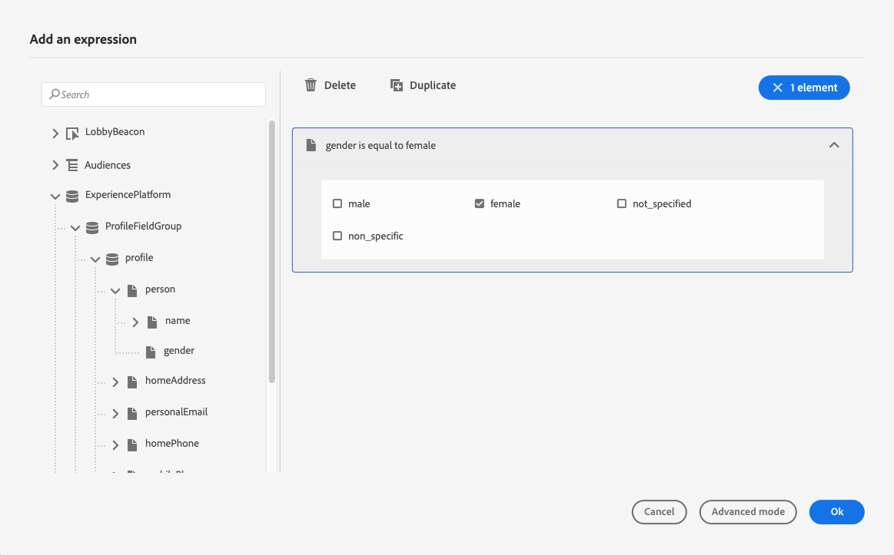

# 條件 {#conditions}

>[!CONTEXTUALHELP]
>id="ajo_journey_conditions"
>title="條件"
>abstract="條件可讓您根據特定條件建立多個路徑，以定義個人如何進行您的歷程。 您也可以設定處理逾時或錯誤的替代路徑，確保提供順暢的體驗。"

透過&#x200B;**條件**，您可以根據特定條件建立多個路徑，以定義個人在您的歷程中如何前進。 您也可以設定處理逾時或錯誤的替代路徑，確保提供順暢的體驗。

>[!AVAILABILITY]
>
>這些條件可透過&#x200B;**最佳化**&#x200B;活動取得，可在「有限可用性」中依需求存取。 請聯絡您的 Adobe 代表以取得存取權。
>
>如果您沒有此容量的存取權，您仍可使用舊版[條件活動](condition-activity.md)。

## 新增條件。 {#add-condition-activity}

若要將條件新增至您的歷程，請遵循下列步驟。

1. 將&#x200B;**[!UICONTROL 最佳化]**&#x200B;活動拖放至歷程畫布。 [了解更多](optimize.md)

1. 新增選用標籤，以便在報告和測試模式記錄中識別活動。

1. 從&#x200B;**[!UICONTROL 方法]**&#x200B;下拉式清單中選取條件。

   {width=80%}

   可使用下列型別的條件：

   * [資料來源條件](#data_source_condition)
   * [時間條件](#time_condition)
   * [百分比分割](#percentage_split)
   * [日期條件](#date_condition)
   * [設定檔上限](#profile_cap)
   * 您也可以在歷程條件中使用對象。 [了解更多](#using-a-segment)

## 管理條件路徑 {#condition_paths}

>[!CONTEXTUALHELP]
>id="ajo_journey_expression_simple2"
>title="關於簡單運算式編輯器"
>abstract="簡單運算式編輯器模式可讓您根據欄位組合執行簡單查詢。所有可用的欄位都會顯示在螢幕的左側。將欄位拖放到主要區域中。若要合併不同的元素，請將它們互相聯鎖以建立不同的群組和/或群組層級。然後，您可以選取邏輯運算子來合併同一層級的元素。"

在歷程中使用數個條件時，您可以為每個條件定義標籤，以更輕鬆地識別它們。

如果要定義多個條件，請按一下&#x200B;**[!UICONTROL 新增路徑]**。 對於每個條件，活動後都會在畫布中新增新路徑。

{width=80%}

請注意，歷程的設計具有功能影響。 在條件之後定義數個路徑時，只會執行第一個符合資格的路徑。 這表示您可以透過將路徑置於彼此上方或下方來改變路徑的優先順序。

讓我們以第一個路徑的條件「個人是VIP」以及第二個路徑的條件「個人是男性」為例。 如果同時符合兩個條件的人(身為VIP的男性)通過此步驟，即使此人也有資格進入第二個路徑，仍會選擇第一個路徑，因為第一個路徑為「以上」。 若要變更此優先順序，請以另一個垂直順序移動您的活動。

您可以針對不符合定義條件的對象，建立其他路徑，方法是勾選&#x200B;**[!UICONTROL 針對上述情況以外的其他情況顯示路徑]**。

>[!NOTE]
>
>此選項不適用於分割條件。 [了解更多](#percentage_split)

簡單模式可讓您根據欄位組合執行簡單查詢。 所有可用的欄位都會顯示在螢幕的左側。將欄位拖放到主要區域中。若要合併不同的元素，請將它們互相聯鎖以建立不同的群組和/或群組層級。然後，您可以選取邏輯運算子來組合同一層級的元素：

* **AND** — 兩個條件的交集。 只考慮符合所有條件的元素。
* **OR** — 兩個條件的聯合。 考慮匹配兩個條件中至少一個的元素。

{width=80%}

如果您使用[Adobe Experience Platform Segmentation Service](https://experienceleague.adobe.com/docs/experience-platform/segmentation/home.html?lang=zh-Hant){target="_blank"}建立您的對象，您可以在歷程條件中運用這些對象。 請參閱[在條件](../building-journeys/condition-activity.md#using-a-segment)中使用對象。

>[!NOTE]
>
>使用簡單編輯器無法對時間序列執行查詢（例如購買清單、過去對訊息的點按）。 為此，您需要使用進階編輯器。 請參閱[此頁面](expression/expressionadvanced.md)。

當動作或條件發生錯誤時，個人的歷程就會停止。唯一能讓它繼續的方法是核取方塊&#x200B;**[!UICONTROL 在逾時或錯誤的情況下新增替代路徑]**。 [了解更多](../building-journeys/using-the-journey-designer.md#paths)

在簡單編輯器中，您也會在事件和資料來源類別下方找到歷程屬性類別。 此類別包含與特定設定檔的歷程相關的技術欄位。 這是系統從即時歷程擷取的資訊，例如歷程 ID 或遇到的特定錯誤。 [了解更多](expression/journey-properties.md)

## 資料來源條件 {#data_source_condition}

使用&#x200B;**[!UICONTROL 資料來源條件]**，根據資料來源或先前位於歷程中之事件的欄位來定義條件。 此型別的條件是使用運算式編輯器定義。 [瞭解如何使用運算式編輯器](expression/expressionadvanced.md)

例如，如果您使用使用構成工作流程或自訂上傳（CSV檔案）產生的擴充屬性來鎖定對象，則可運用這些擴充屬性來建置條件。

使用進階運算式編輯器，您可以設定更進階的條件，以操控集合或使用需要傳遞引數的資料來源。 [了解更多](../datasource/external-data-sources.md)

{width=80%}

## 日期條件 {#date_condition}

這可讓您根據日期定義不同的流程。 例如，如果人員在「銷售」期間進入步驟，您會將特定訊息傳送給他們。 在年餘下時間，您將傳送另一則訊息。

>[!NOTE]
>
>時區不再為條件所特有，現在會在歷程屬性中的歷程層級定義。 [了解更多](../building-journeys/timezone-management.md)

## 百分比分割 {#percentage_split}

此選項可讓您隨機分割對象，以針對每個群組定義不同的動作。 定義每個路徑的分割數與重新分割區。 分割計算是統計性的，因為系統無法預測有多少人會在此歷程的活動中流動。 因此，分割的錯誤邊界非常低。 此函式是以[Java隨機機制](https://docs.oracle.com/javase/7/docs/api/java/util/Random.html){target="_blank"}為基礎。

在測試模式中，達到分割時，一律選擇頂端分支。 如果您希望測試選擇不同的路徑，可以重新組織分割分支的位置。 [了解更多](../building-journeys/testing-the-journey.md)

>[!NOTE]
>
>請注意，在百分比分割條件中沒有按鈕可新增路徑。 路徑的數量將取決於分割的次數。 在分割條件中，您無法針對其他情況新增路徑，因為它不會發生。 人們總是會進入其中一個分割路徑。

## 時間條件 {#time_condition}

使用&#x200B;**[!UICONTROL 時間條件]**，根據一天中的小時和/或星期執行不同的動作。 例如，您可以決定在白天傳送推播通知，在工作日於夜間傳送電子郵件。

>[!NOTE]
>
>* 時區不是條件所特有，而是在歷程屬性中的歷程層級定義。 [了解更多](../building-journeys/timezone-management.md)
>
>* 根據預設，**[!UICONTROL 時間條件]**&#x200B;是以小時設定，從00:00到12:00。

有三個可用的篩選選項：

* **小時** — 可讓您根據當天的時間設定條件。 然後定義開始和結束時間。 個人僅會在定義的小時範圍內輸入路徑。
* **星期** — 可讓您根據星期設定條件。 然後，選取您希望個人輸入路徑的日期。
* **一週的某天和小時** — 此選項會結合前兩個選項。

## 設定檔上限 {#profile_cap}

使用此條件型別可設定歷程路徑的設定檔數目上限。 當達到此限制後，輸入的輪廓將採用替代路徑。 這可確保您的歷程不會超過定義的限制。

>[!NOTE]
>
>我們建議您定義高值設定檔上限。 母體達到確切上限數字的精確度和可能性只會隨著上限的增加而增加。 對於小數字（例如50的上限），數字將不能始終相符，因為設定檔採取替代路徑之前可能無法達到限制。

<!--You can use this condition type to ramp up the volume of your deliveries. See this [use case](ramp-up-deliveries-uc.md).-->

預設上限為1,000。

計數器僅套用至選取的歷程版本。 重複歷程或建立新版本時，計數器會重設為零。 重設後，輸入的設定檔會再次採用公稱路徑，直到達到計數器限製為止。

當設定檔上限定義於循環歷程時，計數器不會在每次循環後重設。

即使您將替代路徑移動到歷程畫布上的名義路徑上方，名義路徑始終優先於替代路徑。

對於即時歷程，需要考量以下臨界值以確保達到限制：

* 對於大於10,000的上限，要插入的相異設定檔數量必須至少為上限的1.3倍。
* 對於低於10,000的上限，要插入的相異設定檔數量必須為1000加上上限。

測試模式中未考慮設定檔上限。

## 在條件中使用對象 {#using-a-segment}

本節說明如何在歷程條件中使用對象。 如需對象以及如何建立對象的詳細資訊，請參閱[本節](../audience/about-audiences.md)。

若要在歷程條件中使用對象，請遵循下列步驟：

1. 開啟歷程，卸除&#x200B;**[!UICONTROL 最佳化]**&#x200B;活動並選擇&#x200B;**[!UICONTROL 資料來源條件]**。

   

1. 按一下&#x200B;**[!UICONTROL 新增路徑]**&#x200B;以取得每個所需的額外路徑。 針對每個路徑，按一下&#x200B;**[!UICONTROL 運算式]**&#x200B;欄位。

1. 在左側，展開&#x200B;**[!UICONTROL 對象]**&#x200B;節點。 拖放您要用於條件的對象。 依預設，對象的條件為true。

   {width=80%}

   >[!NOTE]
   >
   >請注意，只有具有&#x200B;**已實現**&#x200B;對象參與狀態的個人才會被視為對象的成員。 如需如何評估對象的詳細資訊，請參閱[Segmentation Service檔案](https://experienceleague.adobe.com/docs/experience-platform/segmentation/tutorials/evaluate-a-segment.html?lang=zh-Hant#interpret-segment-results){target="_blank"}。
