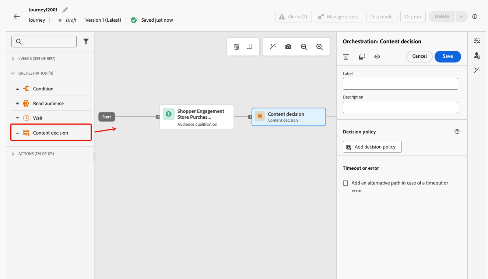
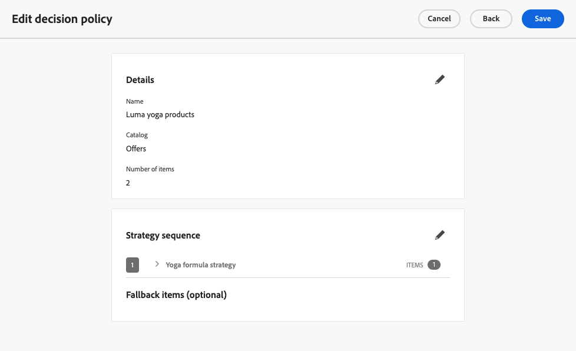
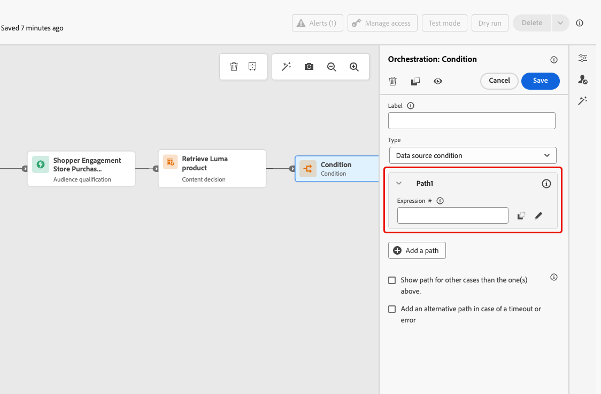
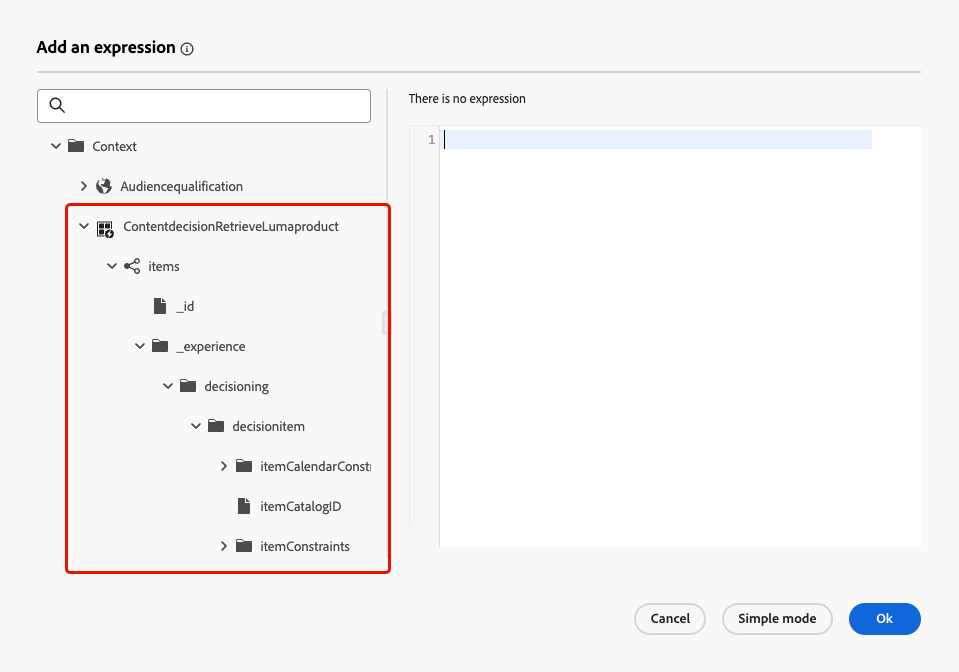
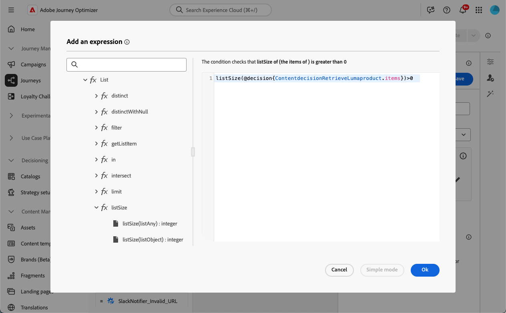
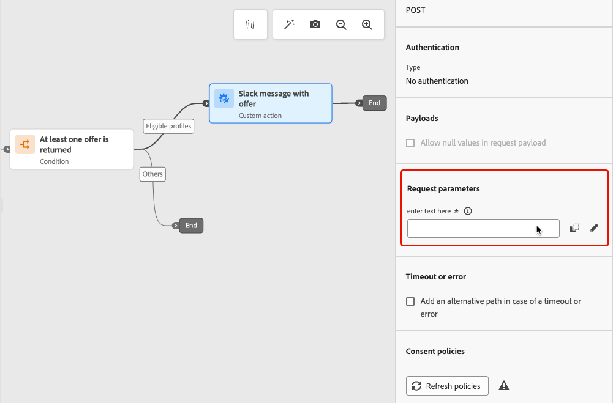
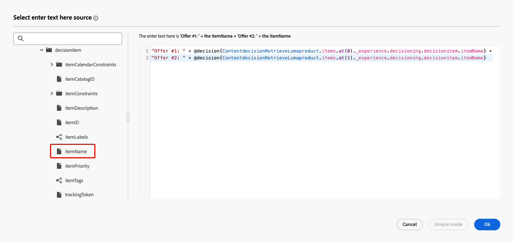
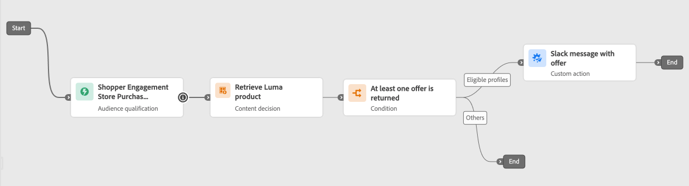

# 內容決定活動 {#content-decision}

>[!AVAILABILITY]
>
>此功能僅適用於一組組織 (有限可用性)，將透過未來版本在全球推出。

[!DNL Journey Optimizer]可讓您透過歷程畫布中的專用&#x200B;**內容決定**&#x200B;活動，將優惠方案納入您的歷程。 然後，您可以新增其他活動（例如[自訂動作](../action/about-custom-action-configuration.md)）至您的歷程，以使用這些個人化優惠鎖定您的對象。

>[!NOTE]
>
>內容決定活動的輸出不能用於原生管道活動。

若要運用此功能，請建立您新增[內容決定活動](#add-content-decision-activity)的歷程，以定義您要提供給合格設定檔的優惠。

然後，您就可以在以下中使用內容決定活動的輸出：

* [條件活動](#add-condition-activity)，可根據擷取的優惠方案將設定檔移至特定路徑；

* [自訂動作](#add-custom-action)，您可以在此傳送這些選件給外部系統。

## 設定內容決定活動 {#add-content-decision-activity}

使用內容決定活動，您可以定義決定原則，允許您從[!DNL Journey Optimizer]決定中挑選最佳專案，並將其傳遞給正確的對象。

<!--Their goal is to select the best offers for each profile, while the campaign/journey authoring allows you to indicate how the selected decision items should be presented, including which item attributes to be included in the message.-->

若要設定&#x200B;**[!UICONTROL 內容決定]**&#x200B;活動，請遵循下列步驟。

1. 展開&#x200B;**[!UICONTROL 協調流程]**&#x200B;類別並將&#x200B;**[!UICONTROL 內容決定]**&#x200B;活動拖放到畫布中。

   {width=100%}

1. 選擇性地新增標籤和說明至活動。

1. 按一下&#x200B;**[!UICONTROL 新增決定原則]**。 [進一步了解決定原則](../experience-decisioning/create-decision.md)

   >[!NOTE]
   >
   >需要決策許可權才能編寫決策原則。 [了解更多](../experience-decisioning/gs-experience-decisioning.md#steps)

1. 選取要傳回的專案數。 例如，如果您選取2，則會顯示最佳的2個合格優惠方案。 按一下&#x200B;**[!UICONTROL 下一步]**。

1. 在&#x200B;**[!UICONTROL 策略順序]**&#x200B;區段中，選取要與決策原則一起呈現的決定專案及/或選取策略。 [了解更多](../experience-decisioning/create-decision.md#select)

1. 視需要安排評估順序。

   新增多個決定專案和/或策略時，會依序評估，並以每個物件或物件群組左側的數字表示。 若要變更預設順序，您可以拖放物件和/或群組以視需要重新排序。 [了解更多](../experience-decisioning/create-decision.md#evaluation-order)

1. （選用）新增遞補優惠。 [了解更多](../experience-decisioning/create-decision.md#fallback)

1. 檢閱並儲存您的決定原則。

   {width=70%}<!--reshoot or change screen-->

您現在已準備好在歷程中運用此內容決定活動的輸出。

## 護欄和限制 {#guardrails}

**同意原則**

同意政策的更新最多需要48小時才會生效。 如果決定原則參考與最近更新的同意原則關聯的屬性，變更將不會立即套用。

同樣地，如果受同意原則約束的新設定檔屬性新增到決定原則中，這些設定檔屬性將可供使用，但關聯的同意原則在延遲過去後才會執行。

同意原則僅適用於具有Adobe Healthcare Shield或Privacy and Security Shield附加元件的組織。

## 使用內容決定活動的輸出 {#use-content-decision-output}

內容決定的輸出可用於多個歷程活動。 例如，您可以使用[條件活動](#add-condition-activity)，根據為設定檔擷取的選件數目，將設定檔移至歷程的特定分支。

您也可以新增[自訂動作](#add-custom-action)至您的歷程，以便從內容決定活動將優惠方案共用至外部系統。

### 在條件活動中 {#add-condition-activity}

若要利用內容決定活動的輸出，您可以新增條件至您的歷程，其中您可使用這些選件的資料，定義運算式以將設定檔移至特定路徑。 請遵循下列步驟。

1. 從&#x200B;**[!UICONTROL 協調流程]**&#x200B;類別，將&#x200B;**[!UICONTROL 條件]**&#x200B;活動拖放到您的畫布中。 [了解更多](condition-activity.md#add-condition-activity)

1. （選擇性）將對應您定義之第一個運算式的&#x200B;**[!UICONTROL Path1]**&#x200B;重新命名為更相關的標籤。

1. 對於第一個路徑，按一下&#x200B;**[!UICONTROL 運算式]**&#x200B;欄位內部，或使用[編輯]圖示新增運算式。

   {width=80%}

1. 在開啟的快顯視窗中，切換至&#x200B;**[!UICONTROL 進階模式]**&#x200B;以使用[進階運算式編輯器](expression/expressionadvanced.md)。

   >[!CAUTION]
   >
   >內容決定節點的輸出只能在&#x200B;**[!UICONTROL 進階模式]**&#x200B;中使用。

1. 展開&#x200B;**[!UICONTROL Context]**&#x200B;節點並導覽至您的決定原則，以顯示[優惠方案目錄結構描述](../experience-decisioning/catalogs.md#access-catalog-schema)中的所有可用屬性。

   

   >[!NOTE]
   >
   >在決定規則（作為內容資料）中使用的歷程體驗事件中，或在[選件結構描述](../experience-decisioning/catalogs.md#access-catalog-schema)中，在屬性上定義的任何受限制標籤都會導致DULE或同意的原則違規。 在[本節](../action/action-privacy.md)中進一步瞭解資料治理原則

1. 若要檢查是否已針對進入歷程的設定檔傳回任何選件，請使用具有以下語法的[listSize](functions/functionlistsize.md)函式： `listSize(@decision{ContentdecisionName.items})>0`

   >[!NOTE]
   >
   >在此範例中，`Name`是您新增至歷程的內容決定的標籤。

   的條件

1. 按一下&#x200B;**[!UICONTROL 確定]**。

1. 視需要新增更多路徑以定義其他條件。

   您也可以針對不符合第一個條件的設定檔建立另一個路徑，方法是勾選&#x200B;**[!UICONTROL 針對上述情況以外的其他情況顯示路徑]**。<!--These profiles will then exit the journey if no other activity is added in that path.-->

1. 儲存條件活動。

### 在自訂動作中 {#add-custom-action}

若要利用內容決定活動的輸出，您可以新增自訂動作至您的歷程，其中您將共用您定義的優惠方案至外部系統。 請遵循下列步驟。

1. 新增自訂動作至您的歷程。 [了解更多](../action/about-custom-action-configuration.md)

1. 輸入動作的標籤。

1. 在&#x200B;**[!UICONTROL 要求引數]**&#x200B;區段中，選取您要對應至已擷取之選件之屬性的引數。

   按一下可編輯文字欄位，然後選取您要對應至已擷取選件之屬性的任何引數。

   

1. 在開啟的快顯視窗中切換至&#x200B;**[!UICONTROL 進階模式]**。 在[進階運算式編輯器](expression/expressionadvanced.md)中，展開&#x200B;**[!UICONTROL Context]**&#x200B;節點以顯示所有決定原則專案。

   >[!CAUTION]
   >
   >內容決定節點的輸出只能在&#x200B;**[!UICONTROL 進階模式]**&#x200B;中使用。

1. 使用[陣列瀏覽](../experience-decisioning/catalogs.md#access-catalog-schema)優惠方案目錄結構描述`items`。 例如，使用擷取到的第一個選件的`itemName`和擷取到的第二個選件的`itemName`。

   

1. 按一下&#x200B;**[!UICONTROL 確定]**&#x200B;以儲存運算式。

1. **[!UICONTROL 儲存]**&#x200B;您的自訂動作組態。

### 端對端範例 {#use-case}

以下為使用內容決定活動結合至條件活動和自訂動作的歷程完整範例，如上所述。

<!--When all activities are properly configured and saved, [publish](publishing-the-journey.md) your journey.-->

一旦歷程[啟動](publishing-the-journey.md)：

<!--* Profiles who enter the journey and are eligible for at least one offer are targeted by the custom action.

* If no offer is returned for a profile, they are excluded from the custom action.-->

1. 每次設定檔符合該對象資格時，就會進入歷程。

1. 透過內容決定活動，[!DNL Journey Optimizer]會擷取與每個設定檔相關的優惠。

1. 只有已擷取至少一個選件的設定檔才能繼續歷程（透過「合格的設定檔」路徑）。

1. 如果符合條件，則會透過自訂動作將對應的選件傳送至外部系統。
