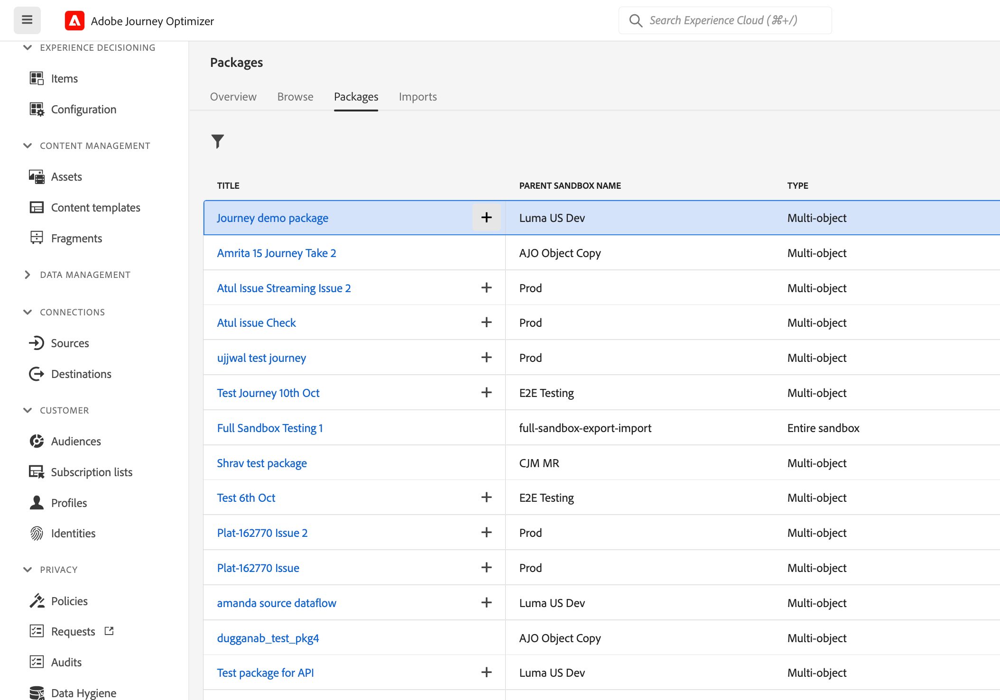

# 將歷程複製到另一個沙箱 {#copy-to-sandbox}

<!--
>[!CONTEXTUALHELP]
>id="ajo_journey_copy_main"
>title="Copy a journey to another sandbox"
>abstract="Journey Optimizer allows you to copy an entire journey from one sandbox to another. For example, you can copy a journey from the Stage sandbox environment to your Production sandbox. In addition to the Journey itself, Journey Optimizer also copies most of the objects the journey depends on."

>[!CONTEXTUALHELP]
>id="ajo_journey_copy_sandbox_details"
>title="Sandbox details"
>abstract="Select the destination sandbox you want to copy the journey to. Only sandboxes within your organization are available."

>[!CONTEXTUALHELP]
>id="ajo_journey_copy_object_details"
>title="Object details"
>abstract="This is the journey you are going to copy."

>[!CONTEXTUALHELP]
>id="ajo_journey_copy_dependent_objects"
>title="Dependent objects"
>abstract="This is the list of associated objects used in the journey. This list displays the name, the object type, as well as the internal Journey Optimizer ID."
-->

沙箱工具可讓您運用套件匯出和匯入，跨多個沙箱複製物件。 封裝可以包含單一物件或多個物件。 套件中包含的任何物件都必須來自相同沙箱。

本頁說明Journey Optimizer內容中的沙箱工具使用案例。 有關功能本身的詳細資訊，請參閱 [Experience Platform檔案](https://experienceleague.corp.adobe.com/docs/experience-platform/sandbox/ui/sandbox-tooling.html).

## 開始使用沙箱工具{#sandbox-gs}

Journey Optimizer 可讓您將整個歷程從一個沙箱複製到另一個沙箱。例如，您可以將歷程從您的中繼沙箱環境複製到生產沙箱。 除了歷程本身，Journey Optimizer也會複製歷程所依賴的大部分物件：受眾、結構描述、事件和動作。 有關已複製物件的詳細資訊，請參閱此處 [區段](https://experienceleague.adobe.com/docs/experience-platform/sandbox/ui/sandbox-tooling.html#abobe-journey-optimizer-objects).

>[!CAUTION]
>
>我們不保證所有連結的元素都會複製到目的地沙箱。 我們強烈建議您在發佈歷程之前執行徹底檢查。 這可讓您識別任何可能遺失的物件。

目標沙箱中的複製物件是唯一的，沒有覆寫現有元素的風險。 歷程及歷程內的任何訊息都會以草稿模式帶入。 這可讓您在目標沙箱上發佈之前執行徹底驗證。 復製程式只會複製歷程的中繼資料以及該歷程中的物件。 此程式不會複製任何設定檔或資料集資料。

## 匯出歷程 {#export}

若要將歷程複製到另一個沙箱，請執行以下步驟：

1. 在歷程管理功能表區段中，按一下 **[!UICONTROL 歷程]**. 隨即顯示歷程清單。

1. 搜尋您要複製的歷程，按一下 **更多動作** 圖示（歷程名稱旁的三個點）並按一下 **新增到封裝**.

此 **新增到封裝** 視窗隨即顯示。

1. 選擇您要將歷程新增到現有封裝或建立新封裝：

   * **現有封裝**：從下拉式選單中選取套件。
   * **建立新封裝**：輸入套件名稱。 您也可以新增說明。

1. 在「管理」選單區段中，按一下 **[!UICONTROL 沙箱]**，選取 **封裝** 標籤，然後按一下您要匯出的套件。

   

1. 選取要匯出的物件，然後按一下 **發佈**

   

   如果發佈失敗，您可以檢查日誌以識別失敗原因。 開啟套件，按一下 **檢視失敗的工作**，選取匯入工作並按一下 **檢視匯入詳細資料**.

   

## 匯入歷程 {#export}

1. 從封裝清單中，按一下封裝名稱旁的+圖示。

   

1. 選取 **Target沙箱** 從下拉式欄位中，然後按一下 **下一個**. 只能使用您的組織內的沙箱。

   

1. 檢閱套裝程式物件與相依性。 這是歷程中使用的關聯物件清單。此清單會顯示名稱和物件型別。 對於每個物件，您可以選擇建立新物件或使用目標沙箱中的現有物件。

   

1. 按一下 **完成** 按鈕，以開始將套件複製到目標沙箱。 復製程式會因歷程的複雜度及需要複製多少物件而有所不同。

1. 按一下匯入工作以複查複製結果：

   * 按一下 **檢視匯入的物件** 顯示每個複製的個別物件。
   * 按一下 **檢視匯入詳細資料** 檢查每個物件的匯入結果。

   

1. 存取您的目標沙箱，並對所有複製的物件執行徹底檢查。
