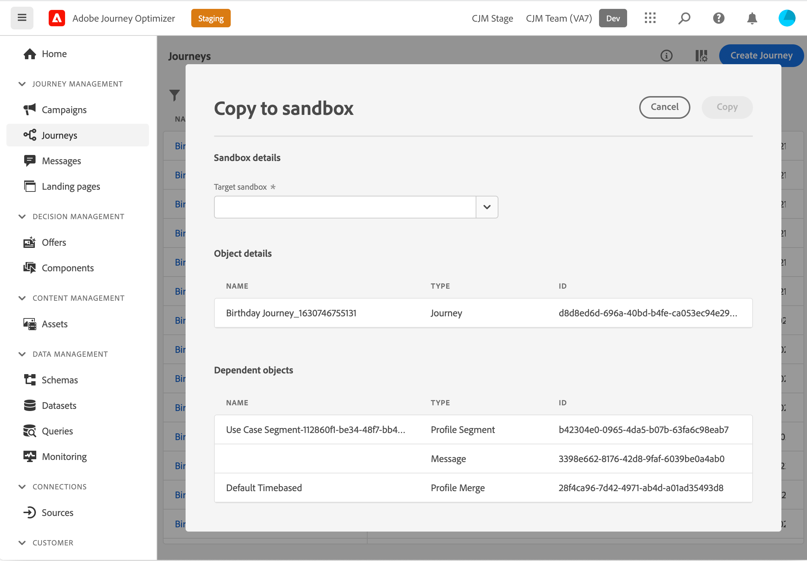

# 將行程複製到其他沙箱 {#copy-to-sandbox}

>[!CONTEXTUALHELP]
>id="ajo_journey_copy_main"
>title="將行程複製到其他沙箱"
>abstract="Journey Optimizer允許您將整個行程從一個沙箱複製到另一個沙箱。 例如，您可以將行程從階段沙盒環境複製到生產沙盒。 除了&quot;旅程&quot;本身，Journey Optimizer還複製了旅程所依賴的大部分物品。"

>[!CONTEXTUALHELP]
>id="ajo_journey_copy_sandbox_details"
>title="沙盒詳細資訊"
>abstract="選擇要將行程複製到的目標沙盒。 您的IMS組織內只有沙箱可用。"

>[!CONTEXTUALHELP]
>id="ajo_journey_copy_object_details"
>title="對象詳細資訊"
>abstract="這是你要複製的旅程。"

>[!CONTEXTUALHELP]
>id="ajo_journey_copy_dependent_objects"
>title="從屬對象"
>abstract="這是行程中使用的關聯對象的清單。 此清單顯示名稱、對象類型以及內部Journey OptimizerID。"

Journey Optimizer允許您將整個行程從一個沙箱複製到另一個沙箱。 例如，您可以將行程從階段沙盒環境複製到生產沙盒。 除了旅程本身，Journey Optimizer還複製了旅程所依賴的大部分物品：消息、段、預設、模式、事件和操作。 請參閱 [限制](../building-journeys/copy-to-sandbox.md#limitations)

>[!CAUTION]
>
>我們不保證所有連結的元素都會複製到目標沙箱。 我們強烈建議您在發佈旅程之前進行徹底檢查。 這將允許您識別任何可能丟失的對象。

目標沙箱中複製的對象是唯一的，不存在覆蓋現有元素的風險。 行程和行程中的任何消息都以草稿模式傳遞。 這允許您在目標沙箱上發佈之前執行徹底驗證。 複製過程僅在有關行程和該行程中的對象的元資料上複製。 沒有將配置檔案或資料集資料複製為此過程的一部分。

要將行程複製到另一個沙箱，請執行以下步驟：

1. 在「行程管理」(JOURNEY MANAGEMENT)菜單部分，按一下 **[!UICONTROL Journeys]**。 將顯示行程清單。

2. 搜索要複製的行程，按一下 **更多操作** 表徵圖（旅程名稱旁的三個點），然後按一下 **複製到沙盒**。

   

   的 **複製到沙盒** 的下界。

   

3. 選擇 **目標沙盒** 的下界。 您的IMS組織內只有沙箱可用。

4. 查看 **從屬對象** 的子菜單。 這是行程中使用的關聯對象的清單。 此清單顯示名稱、對象類型以及內部Journey OptimizerID。

5. 按一下 **複製** 按鈕，開始將行程複製到目標沙箱。

   

   複製過程開始，並顯示每個對象的進度。 複製過程會根據行程的複雜性以及需要複製的對象的數量而有所不同。 如果遇到錯誤，將顯示相關對象的消息。

   

6. 複製完成後，按一下 **關閉**。

7. 訪問目標沙盒並對所有複製的對象執行徹底檢查。

## 複製過程和限制 {#limitations}

我們不保證所有連結的元素都會複製到目標沙箱。 強烈建議您進行徹底檢查。 在發佈行程之前，確定任何可能丟失的對象並手動建立它們。

複製以下對象：

* 區段

   一個段只能從一個沙箱複製到另一個沙箱。 複製段後，該段在目標沙盒上不可編輯。

* 方案

   將複製此行程中使用的架構。

* 訊息

   旅途中使用的物理消息（電子郵件或推送消息）。 消息中用於個性化的欄位未檢查是否完整。 不複製內容塊。

* 行程 — 畫布詳細資訊

   在畫布上表示行程，包括行程中的對象，如條件、操作、事件、讀取段等。 「跳轉」(Jump)活動從副本中排除。

* 活動

   將複製行程中使用的事件和事件詳細資訊。

* 動作

   系統將複製行程中使用的活動和活動詳細資訊。

預設不會複製。 系統根據消息類型和預設名稱自動選擇目標沙箱上最接近的匹配項。 如果在目標沙盒上找不到預設，則預設副本將失敗。 這將意味著消息副本也將失敗，因為消息需要預設才能進行設定。 在這種情況下，至少需要為消息的正確通道建立一個預設，以便副本工作。

對於方案、合併策略和段，當這些對象第二次嘗試複製時，將只引用它們。 它們將被視為已存在的對象，並將再次複製。 這意味著這些對象只能複製一次。

在Adobe Journey Optimizer引用架構、合併策略和段之前有五分鐘的延遲，但在畫布中未看到錯誤。 等待5分鐘，這些參考資料將可用。

