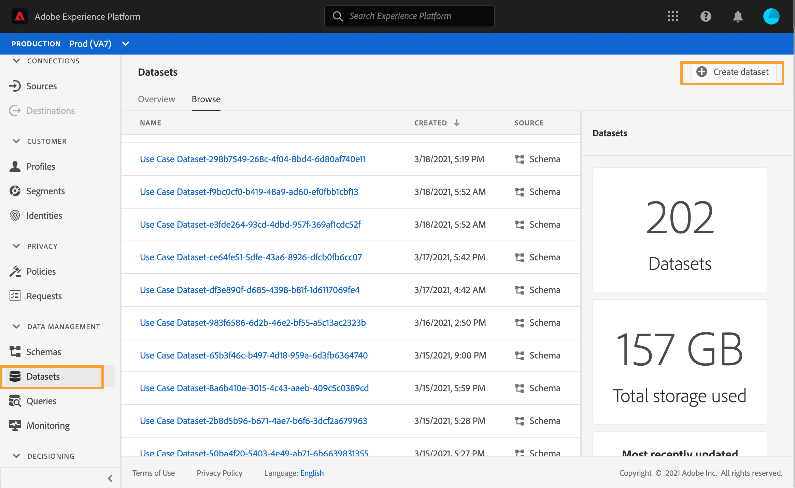
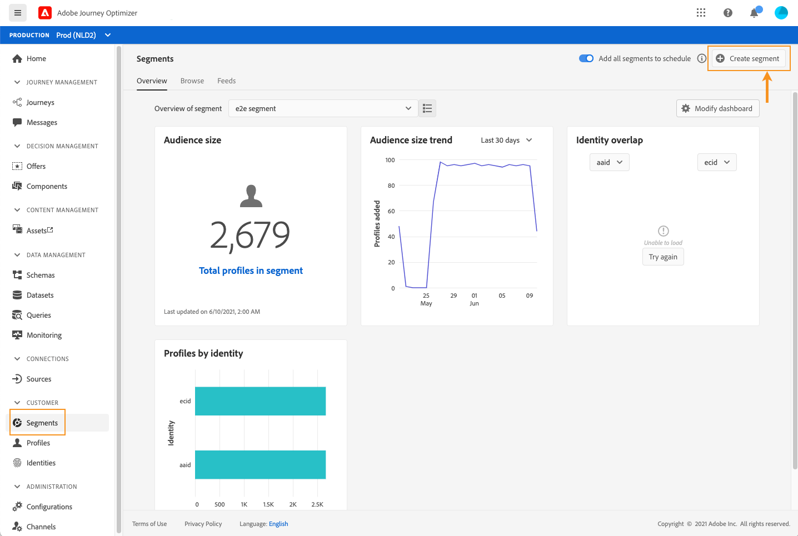

# 建立測試設定檔 {#create-test-profiles}

使用test模式時需要test配置檔案要瞭解如何使用 [test模式](../building-journeys/testing-the-journey.md) 在旅途中， [預覽和test您的郵件](../messages/preview.md)。

以下詳細介紹了建立test配置檔案的可用方法：

* 你可以 [現有配置檔案](#turning-profile-into-test) 進入test檔案

* 您可以通過上載test配置檔案 [csv檔案](#create-test-profiles-csv) 或 [API調用](#create-test-profiles-api)。 除了這兩種方法，Adobe Journey Optimizer還有一種 [產品中使用案例](#use-case-1) 以便建立test配置檔案。

* 您還可以在資料集中上載一個json檔案。 有關詳細資訊，請參閱 [資料接收文檔](https://experienceleague.adobe.com/docs/experience-platform/ingestion/tutorials/ingest-batch-data.html#add-data-to-dataset){target=&quot;_blank&quot;}。

請注意，建立test配置檔案與在Adobe Experience Platform建立常規配置檔案類似。 有關詳細資訊，請參閱 [即時客戶概要檔案文檔](https://experienceleague.adobe.com/docs/experience-platform/profile/home.html?lang=zh-Hant){target=&quot;_blank&quot;}。

## 先決條件 {#test-profile-prerequisites}

為了能夠建立配置檔案，您首先需要在Adobe中建立模式和資料集 [!DNL Journey Optimizer]。

首先，你需要 **建立架構**。 執行以下步驟：

1. 在「資料管理」(DATA MANAGEMENT)菜單部分，按一下 **[!UICONTROL Schemas]**。
   
1. 按一下 **[!UICONTROL Create schema]**，在右上角，然後選擇一個架構類型，例如 **XDM個人配置檔案**。
   
1. 選擇相應的欄位組。 確保添加 **配置檔案test詳細資訊** 欄位組。
   
完成後，按一下 **[!UICONTROL Add field groups]**:欄位組的清單顯示在架構概述螢幕上。
   

   >[!NOTE]
   >
   >* 按一下架構的名稱以更改它並更新其屬性。
   >
   >* 按一下 **[!UICONTROL Add]** 按鈕，選擇要在架構中添加的其他欄位組


1. 在欄位清單中，按一下要定義為主標識的欄位。
   
1. 在 **[!UICONTROL Field properties]** 右窗格，檢查 **[!UICONTROL Identity]** 和 **[!UICONTROL Primary Identity]** 選項並選擇命名空間。 如果希望主標識是電子郵件地址，請選擇 **[!UICONTROL Email]** 命名空間。 按一下「**[!UICONTROL Apply]**」。
   
1. 選擇方案並啟用 **[!UICONTROL Profile]** 的上界 **[!UICONTROL Schema properties]** 的子菜單。
   
1. 按一下「**儲存**」。

>[!NOTE]
>
>有關建立架構的詳細資訊，請參閱 [XDM文檔](https://experienceleague.adobe.com/docs/experience-platform/xdm/ui/resources/schemas.html#prerequisites){target=&quot;_blank&quot;}。

那你需要 **建立資料集** 將在其中導入配置檔案。 執行以下步驟：

1. 瀏覽到 **[!UICONTROL Datasets]**，然後按一下 **[!UICONTROL Create dataset]**。
   
1. 選擇 **[!UICONTROL Create dataset from schema]**。
   
1. 選擇以前建立的架構，然後按一下 **[!UICONTROL Next]**。
   
1. 選擇一個名稱，然後按一下 **[!UICONTROL Finish]**。
   
1. 啟用 **[!UICONTROL Profile]** 的雙曲餘切值。
   

>[!NOTE]
>
> 有關建立資料集的詳細資訊，請參閱 [目錄服務文檔](https://experienceleague.adobe.com/docs/experience-platform/catalog/datasets/user-guide.html#getting-started){target=&quot;_blank&quot;}。

## 產品中使用案例{#use-case-1}

在Adobe Journey Optimizer首頁上，您可以利用test配置檔案在產品中的使用案例。 此使用案例便於建立test配置檔案，用於在發佈前測試行程。


按一下 **[!UICONTROL Begin]** 按鈕以開始使用案例。

需要以下資訊：

1. **標識命名空間**:的 [標識命名空間](../start/get-started-identity.md) 用於唯一標識test配置檔案。 例如，如果使用電子郵件來標識test配置檔案，則標識命名空間 **電子郵件** 頁籤 如果唯一標識符是電話號碼，則標識名稱空間 **電話** 頁籤

2. **CSV檔案**:包含要建立的test配置檔案清單的逗號分隔檔案。 使用例要求CSV檔案的預定義格式，該格式包含要建立的test配置檔案清單。 檔案中的每一行應按正確順序包含以下欄位：

   1. **人員ID**:test配置檔案的唯一標識符。 此欄位的值應反映所選的標識命名空間。 (例如， **電話** 為標識名稱空間選擇，則此欄位的值應為電話號碼。 同樣，如果 **電子郵件** ，則此欄位的值應為電子郵件)
   1. **電子郵件地址**:Test配置檔案電子郵件地址。 ( **人員ID** 的 **電子郵件地址** 如果 **電子郵件** 被選作標識命名空間)
   1. **名字**:Test配置檔案名。
   1. **姓氏**:Test配置檔案姓氏。
   1. **城市**:Test概況居住城市
   1. **國家/地區**:Test概況居住國
   1. **性別**:Test性別簡介。 可用值為 **男**。 **女** 和 **未指定**

選擇標識命名空間並根據上述格式提供CSV檔案後，按一下 **[!UICONTROL Run]** 按鈕。 用例可能需要幾分鐘才能完成。 一旦用例完成處理和建立test配置檔案，將發送通知通知給用戶。

>[!NOTE]
>
>Test配置式可能覆蓋現有配置式。 在執行使用案例之前，請確保CSV僅包含test配置檔案，並針對正確的沙箱執行。

## 將配置檔案轉換為test配置檔案{#turning-profile-into-test}

可以將現有配置檔案轉換為test配置檔案：可以以與建立配置檔案時相同的方式更新配置檔案屬性。

一個簡單的方法是使用 **[!UICONTROL Update Profile]** journey中的action活動，並將testProfile布爾欄位從false更改為true。

你的旅程將由 **[!UICONTROL Read Segment]** 和 **[!UICONTROL Update Profile]** 的子菜單。 您首先需要建立一個段，以要轉換為test配置式的配置式為目標。

>[!NOTE]
>
> 因為您將更新 **測試配置檔案** 欄位中，所選配置檔案必須包括此欄位。 相關架構必須具有 **配置檔案test詳細資訊** 欄位組。 請參閱[本節](../building-journeys/creating-test-profiles.md#test-profiles-prerequisites)。

1. 瀏覽到 **段**，則 **建立段**的上界。
   
1. 定義段的名稱並生成段：選擇欄位和值，以針對所需的配置檔案。
   
1. 按一下 **保存** 並檢查該段是否正確定位了配置檔案。
   

   >[!NOTE]
   >
   > 段計算可能需要一些時間。 瞭解有關 [此部分](../segment/about-segments.md)。

1. 現在建立新的旅程，並從 **[!UICONTROL Read Segment]** 業務流程活動。
1. 選擇以前建立的段和配置檔案使用的命名空間。
   
1. 添加 **[!UICONTROL Update Profile]** 操作活動。
1. 選擇方案， **測試配置檔案** 欄位，資料集，並將值設定為 **真**。 要執行此操作，請在 **[!UICONTROL VALUE]** ，按一下 **筆** 表徵圖，選擇 **[!UICONTROL Advanced mode]** 輸入 **真**。
   
1. 添加 **結束** 活動，按一下 **[!UICONTROL Publish]**。
1. 在 **[!UICONTROL Segments]** 部分，檢查配置式是否已正確更新。
   

   >[!NOTE]
   >
   > 有關 **[!UICONTROL Update Profile]** 活動，請參閱 [此部分](../building-journeys/update-profiles.md)。

## 使用csv檔案建立test配置檔案{#create-test-profiles-csv}

在Adobe Experience Platform，可以通過將包含不同配置檔案欄位的csv檔案上載到資料集中來建立配置檔案。 這是最簡單的方法。

1. 使用電子錶格軟體建立簡單的csv檔案。
1. 為每個所需欄位添加一列。 確保添加主標識欄位（上例中的「personID」）和「testProfile」欄位設定為「true」。
   
1. 每個配置檔案添加一行並填入每個欄位的值。
   
1. 將電子錶格另存為csv檔案。 確保逗號用作分隔符。
1. 瀏覽到Adobe Experience Platform **工作流**。
   
1. 選擇 **將CSV映射到XDM架構**，然後按一下 **啟動**。
   
1. 選擇要將配置檔案導入的資料集。 按&#x200B;**「下一步」**。
   
1. 按一下 **選擇檔案** ，然後選擇csv檔案。 上載檔案時，按一下 **下一個**。
   
1. 將源csv欄位映射到架構欄位，然後按一下 **完成**。
   
1. 資料導入開始。 狀態將從 **處理** 至 **成功**。 按一下 **預覽資料集**的上界。
   
1. 檢查test配置檔案是否已正確添加。
   

您的test配置檔案已添加，現在可在測試行程時使用。 請參閱[本節](../building-journeys/testing-the-journey.md)。
>[!NOTE]
>
> 有關csv導入的詳細資訊，請參閱 [資料接收文檔](https://experienceleague.adobe.com/docs/experience-platform/ingestion/tutorials/map-a-csv-file.html#tutorials){target=&quot;_blank&quot;}。

## 使用API調用建立test配置檔案{#create-test-profiles-api}

您還可以通過API調用建立test配置檔案。 瞭解詳情 [Adobe Experience Platform文檔](https://experienceleague.adobe.com/docs/experience-platform/profile/home.html){target=&quot;_blank&quot;}。

必須使用包含「配置式test詳細資訊」欄位組的配置式架構。 testProfile標誌是此欄位組的一部分。
建立配置檔案時，確保傳遞值：testProfile = true。

請注意，您還可以更新現有配置檔案，以將其testProfile標誌更改為「true」。

下面是建立test配置檔案的API調用示例：

```
curl -X POST \
'https://dcs.adobedc.net/collection/xxxxxxxxxxxxxx' \
-H 'Cache-Control: no-cache' \
-H 'Content-Type: application/json' \
-H 'Postman-Token: xxxxx' \
-H 'cache-control: no-cache' \
-H 'x-api-key: xxxxx' \
-H 'x-gw-ims-org-id: xxxxx' \
-d '{
"header": {
"msgType": "xdmEntityCreate",
"msgId": "xxxxx",
"msgVersion": "xxxxx",
"xactionid":"xxxxx",
"datasetId": "xxxxx",
"imsOrgId": "xxxxx",
"source": {
"name": "Postman"
},
"schemaRef": {
"id": "https://example.adobe.com/mobile/schemas/xxxxx",
"contentType": "application/vnd.adobe.xed-full+json;version=1"
}
},
"body": {
"xdmMeta": {
"schemaRef": {
"contentType": "application/vnd.adobe.xed-full+json;version=1"
}
},
"xdmEntity": {
"_id": "xxxxx",
"_mobile":{
"ECID": "xxxxx"
},
"testProfile":true
}
}
}'
```
